# Reference

> **학습 목표**  
> C의 포인터 지식을 바탕으로 C++의 참조(reference)를 이해한다. 특히 **별칭 → 값 범주 → 참조 매개변수 → `const` 참조 → 수명 → 이동 의미론의 기초**를 연결한다.
>
> 문서 위치: `C_Cpp_Study/02_CPP/Reference.md`  
> 구성 원칙: **개념 정리만 제공하며 실습·퀴즈·문제는 포함하지 않는다.**

---

## 1. 한 문장 정의

**참조(reference)는 기존 객체나 함수에 붙이는 다른 이름(alias)**이다. C++에서 가장 먼저 배우는 형태는 **lvalue reference**인 `T&`이다.

```cpp
int value = 10;
int& ref = value;

ref = 20; // value도 20
```

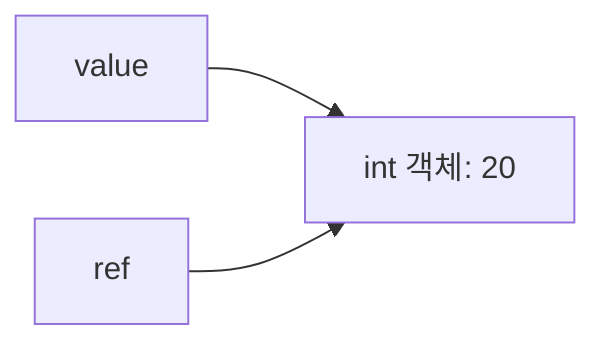

`value`와 `ref`는 별도의 `int` 두 개가 아니라 **같은 객체를 가리키는 두 이름**이다.

## 2. 선언과 초기화

```cpp
int number = 10;
int& alias = number;
```

| 표현 | 의미 |
|---|---|
| `int number` | `int` 객체 선언 |
| `int& alias` | `int`에 대한 lvalue reference 선언 |
| `alias = 30` | 참조 대상인 `number`에 30 대입 |
| `&number` | `number`의 주소를 구하는 표현 |

**선언의 `&`와 표현식의 `&`는 문맥에 따라 뜻이 다르다.** 선언의 `&`는 참조 타입을 나타내고, 표현식의 단항 `&`는 주소 연산자다.

참조는 선언할 때 대상을 정해야 한다.

```cpp
int& invalid; // 오류: 초기화되지 않은 참조
```

## 3. 포인터와 참조 비교

```cpp
int value = 10;
int* ptr = &value;
int& ref = value;

*ptr = 20;
ref = 30;
```

| 관점 | 포인터 `T*` | lvalue reference `T&` |
|---|---|---|
| 개념 | 주소를 값으로 보유하는 포인터 객체 | 기존 객체의 별칭 |
| 선언 시 대상 | 널 포인터 등으로 초기화 가능 | 유효한 대상에 바인딩해야 함 |
| 다른 대상으로 변경 | 포인터 값 재대입 가능 | 한 번 바인딩한 대상을 바꿀 수 없음 |
| 접근 | `*ptr`, `ptr->member` | `ref`, `ref.member` |
| 널 상태 | `nullptr`로 표현 가능 | 정상적인 참조에 널 상태를 표현하지 않음 |
| 메모리 구현 | 포인터 객체가 존재 | 구현상 주소를 사용할 수 있으나 별도 포인터 객체와 동일시하지 않음 |

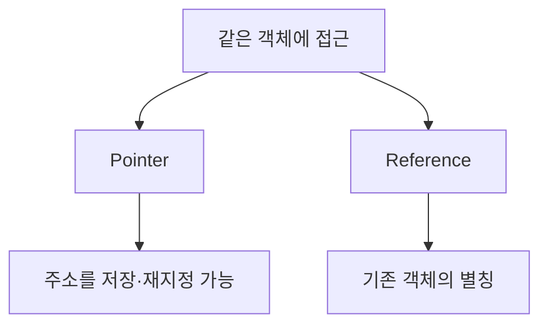

> **중요:** 참조를 “항상 내부적으로 포인터 하나로 구현된다”고 단정하지 않는다. 참조의 언어적 의미와 컴파일러의 구현 방식은 구분해야 한다.

## 4. 참조는 재바인딩되지 않는다

```cpp
int a = 1;
int b = 2;
int& ref = a;

ref = b;
```

마지막 줄은 `ref`를 `b`로 다시 연결하지 않는다. **`b`의 값 2를 `a`에 대입한다.** 이후에도 `ref`는 `a`의 별칭이다.

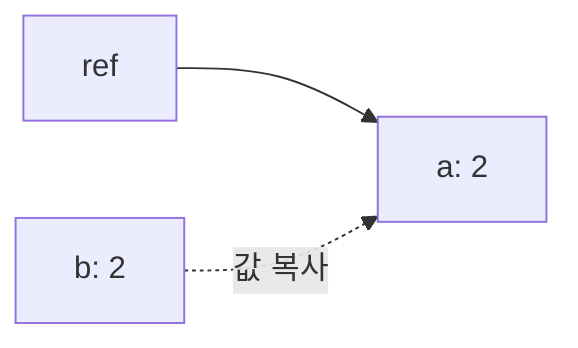

## 5. 함수 매개변수: 값 전달과 참조 전달

### 값 전달(pass by value)

```cpp
void increment(int value)
{
    ++value;
}
```

호출자의 `int` 값이 매개변수에 복사되므로 매개변수 변경은 원본을 바꾸지 않는다.

### 참조 전달(pass by reference)

```cpp
void increment(int& value)
{
    ++value;
}
```

매개변수 `value`는 호출자가 전달한 객체의 별칭이므로 변경이 원본에 반영된다.

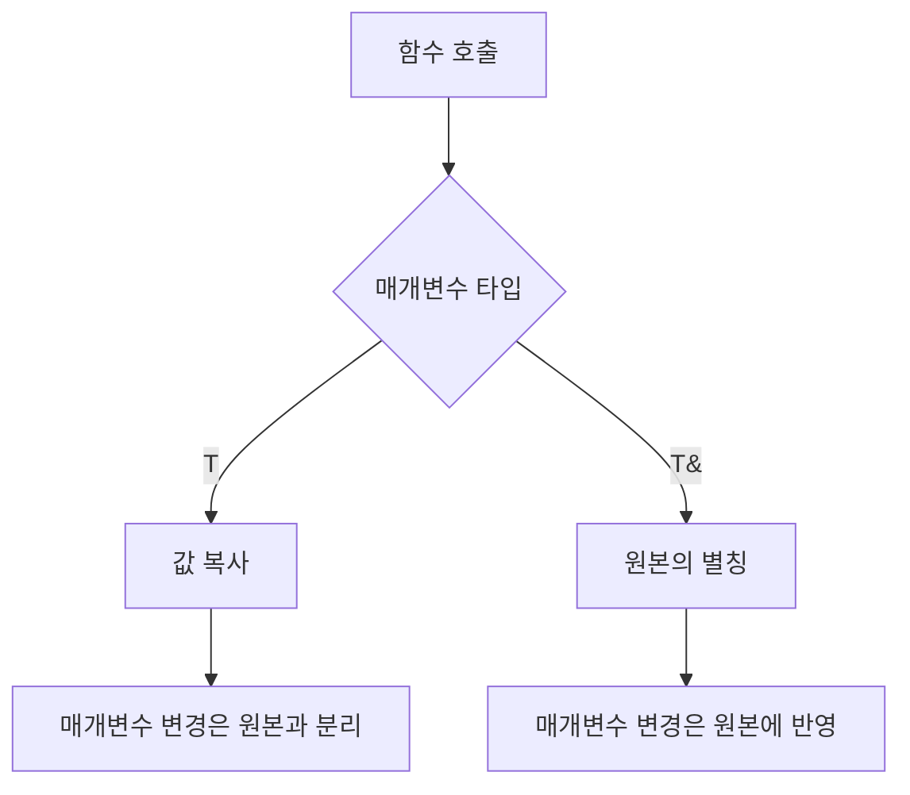

## 6. C 포인터 매개변수와 비교

C에서는 원본 객체를 변경하기 위해 주소를 전달하는 방식이 흔하다.

```c
void increment(int *value)
{
    ++(*value);
}

/* increment(&number); */
```

C++에서는 참조를 사용할 수 있다.

```cpp
void increment(int& value)
{
    ++value;
}

// increment(number);
```

두 방식 모두 원본을 변경할 수 있지만 **C에서도 포인터 자체는 값으로 전달**된다. C++ 참조 매개변수는 호출자 객체의 별칭으로 동작한다.

## 7. `const T&`: 읽기 전용 참조 인터페이스

```cpp
void print_value(const int& value)
{
    // value = 5; // 오류
}
```

`const T&`는 해당 참조를 통해 대상을 수정하지 않겠다는 인터페이스를 표현한다.

주요 목적:

- 큰 객체를 불필요하게 복사하지 않고 읽는다.
- 함수가 전달받은 객체를 변경하지 않음을 타입에 드러낸다.
- 조건을 만족하는 임시 객체나 값에도 바인딩할 수 있다.

```cpp
#include <string>

void print_name(const std::string& name);
```

`const`는 **다른 경로를 통한 모든 변경까지 금지한다는 뜻은 아니다.** 원래 객체가 `const`가 아니라면 다른 비-`const` 접근 경로를 통해 변경될 수 있다.

## 8. `T&`와 `const T&`의 바인딩 차이

```cpp
int number = 10;

int& a = number;           // 가능
const int& b = number;     // 가능
const int& c = 42;         // 가능
// int& d = 42;            // 오류
```

일반적인 `T&`는 수정 가능한 lvalue 객체에 바인딩한다. `const T&`는 임시 객체를 포함해 더 넓은 종류의 표현식에 바인딩할 수 있다.

## 9. 값 범주(Value Category): lvalue와 rvalue

초기 학습에서는 다음처럼 이해한다.

| 범주 | 직관 | 예 |
|---|---|---|
| lvalue | 식별 가능한 객체를 나타내는 표현식 | `number`, `*ptr` |
| rvalue | 임시 값·계산 결과 등 | `42`, `a + b` |

```cpp
int number = 10;
int& a = number;        // lvalue reference
const int& b = 10;     // 임시 값에 바인딩 가능
```

> C++의 정식 값 범주는 `lvalue`, `xvalue`, `prvalue`로 더 세분화된다. 여기서는 참조 이해에 필요한 첫 단계만 다룬다.

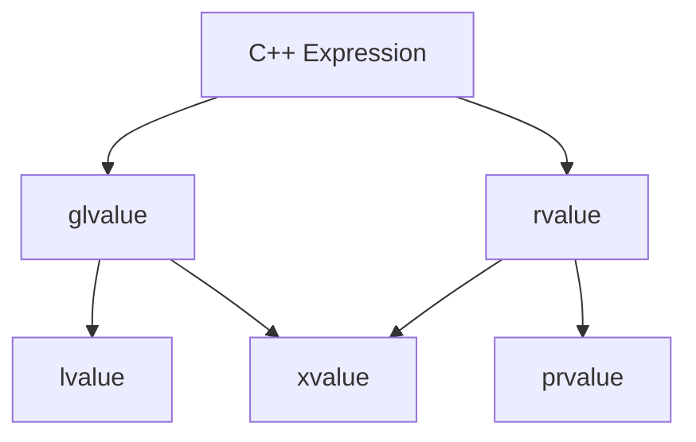

## 10. rvalue reference `T&&` 미리보기

```cpp
int&& ref = 42;
```

`T&&`는 rvalue reference를 선언한다. 이후 이동 생성자, 이동 대입, 완벽 전달을 이해할 때 중요하다.

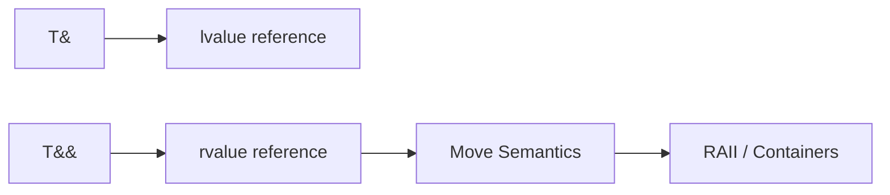

**주의:** 이름이 붙은 rvalue reference 변수는 표현식으로 사용하면 lvalue다.

```cpp
int&& ref = 42;
// 표현식 ref 자체는 lvalue
```

## 11. 참조와 객체 수명(Lifetime)

참조가 있다고 해서 대상 객체가 영원히 살아 있는 것은 아니다.

```cpp
int& invalid_reference()
{
    int local = 10;
    return local; // 잘못된 설계: 지역 객체 수명 종료
}
```

함수 종료 후 지역 객체의 수명이 끝나므로 반환된 참조를 사용하면 정의되지 않은 동작을 일으킬 수 있다.

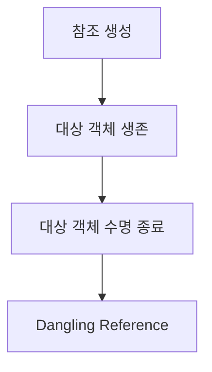

`const T&`가 임시 객체의 수명을 연장하는 경우도 있지만 **모든 상황에서 수명이 연장되는 것은 아니다.** 특히 함수에서 반환하는 참조의 대상 수명은 별도로 확인해야 한다.

## 12. 임시 객체의 수명 연장

```cpp
const std::string& name = std::string("MCU");
```

이와 같이 지역 참조를 직접 초기화하는 특정 상황에서는 임시 객체의 수명이 참조의 수명에 맞춰 연장된다.

반면 다음처럼 함수가 임시 객체를 `const T&` 매개변수로 받는 경우, 그 임시 객체는 일반적으로 해당 전체 표현식(full-expression)이 끝날 때 소멸한다. 함수가 그 참조를 장기 보관하면 위험하다.

```cpp
void store_reference(const std::string& text);
// 내부에서 text에 대한 참조를 저장한다면 수명 설계를 검토해야 함
```

## 13. 참조 멤버와 클래스

```cpp
struct SensorView
{
    int& reading;
};
```

참조 멤버는 객체 생성 시 바인딩해야 하며 이후 다른 대상으로 재바인딩할 수 없다. 참조 멤버를 가진 객체의 대입·수명 설계에는 제약이 생길 수 있다.

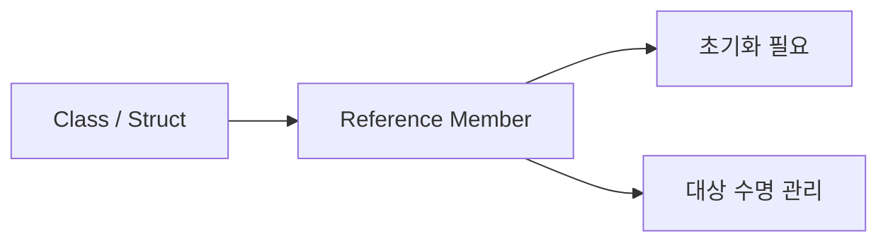

## 14. 반환 타입으로서의 참조

```cpp
int& select(int& a, int& b, bool first)
{
    return first ? a : b;
}
```

참조를 반환하면 호출자는 원본 객체에 접근할 수 있다. 이 방식은 복사를 피하거나 수정 가능한 인터페이스를 제공할 때 사용된다.

반환된 참조의 대상이 **함수 종료 후에도 살아 있는지**가 핵심 조건이다.

## 15. `auto`와 참조

```cpp
int number = 10;
int& ref = number;

auto copy = ref;  // int: 값 복사
auto& alias = ref; // int&: 참조 유지
```

기본 `auto` 타입 추론은 참조 성질을 그대로 보존하지 않을 수 있다. 참조를 유지하려면 `auto&`, 읽기 전용 접근이면 `const auto&`를 사용할 수 있다.

```cpp
const auto& view = number;
```

## 16. Range-based for와 참조

```cpp
#include <vector>

std::vector<int> values{1, 2, 3};

for (int value : values)       // 각 원소 복사
{
}

for (int& value : values)      // 각 원소에 대한 참조
{
}

for (const int& value : values) // 복사 없이 읽기
{
}
```

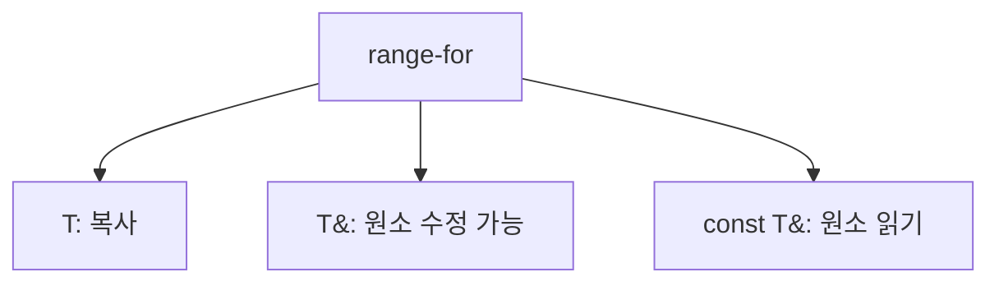

## 17. `std::vector`와 참조 무효화

컨테이너의 원소에 대한 참조를 얻었다고 해서 그 참조가 영원히 유효한 것은 아니다.

```cpp
std::vector<int> values{1, 2};
int& first = values[0];

// 이후 vector 재할당이 발생하면 first가 무효화될 수 있음
```

`std::vector`가 저장 공간을 재할당하면 기존 원소를 가리키는 참조·포인터·반복자가 무효화될 수 있다. **참조의 유효성은 대상 객체와 컨테이너의 수명·무효화 규칙에 의존한다.**

## 18. 함수 매개변수 선택 기준

| 목적 | 흔히 사용하는 형태 | 의미 |
|---|---|---|
| 작은 값 읽기 | `T` | 복사해 사용 |
| 원본 수정 | `T&` | 수정 가능한 별칭 |
| 큰 객체 읽기 | `const T&` | 복사 없이 읽기 |
| 선택적 대상·널 상태 | `T*` 또는 `const T*` | 대상 부재 표현 가능 |
| 소유권 이전 | `T` 또는 소유권 타입 | 값/소유권 설계에 따라 선택 |

이 표는 출발점이다. 실제 API에서는 복사 비용, 수명, 소유권, 호출 빈도, ABI 등을 함께 고려한다.

## 19. C와 C++ 비교

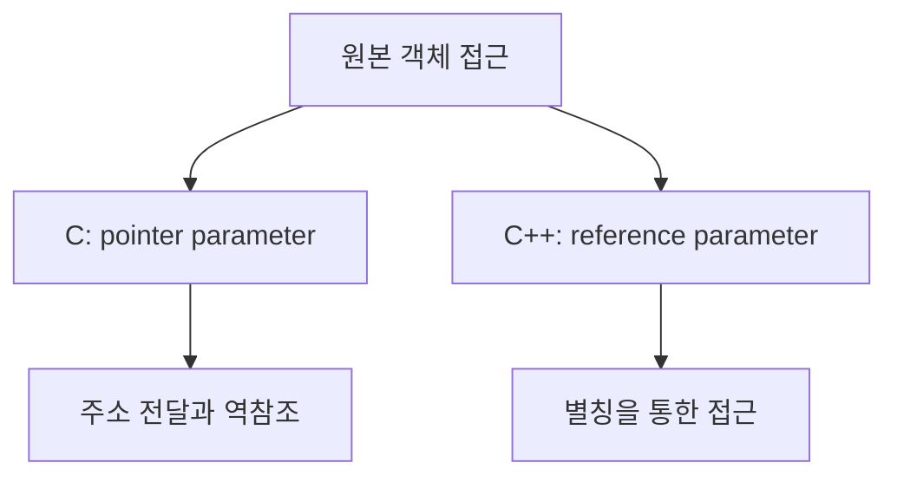

C의 포인터 개념은 C++에서도 그대로 중요하다. 참조는 포인터를 대체하는 만능 기능이 아니라 **널 상태·재지정이 필요 없는 별칭 관계를 명확하게 표현하는 추가 수단**이다.

## 20. 임베디드 연결

참조는 임베디드 C++의 드라이버 인터페이스와 설정 객체 전달에 사용할 수 있다.

```cpp
struct UartConfig
{
    unsigned int baudrate;
};

void configure_uart(const UartConfig& config);
```

또한 변경 가능한 상태를 명시적으로 전달할 수 있다.

```cpp
void update_state(DeviceState& state);
```

주의할 점:

- 참조 자체는 객체의 수명을 관리하지 않는다.
- `const T&`는 하드웨어 Register의 `volatile` 의미를 대체하지 않는다.
- `volatile`은 atomicity나 thread synchronization을 보장하지 않는다.
- 인터럽트·DMA·RTOS와 공유되는 상태는 별도의 동시성·메모리 규칙을 검토한다.

## 21. 핵심 오해 정리

| 오해 | 정확한 이해 |
|---|---|
| 참조는 복사된 객체다 | 기존 객체의 별칭이다 |
| `ref = other`는 재바인딩이다 | 기존 대상에 값을 대입한다 |
| 참조는 항상 포인터 변수로 구현된다 | 언어적 의미와 구현 방식은 다르다 |
| `const T&`는 원본이 절대 변하지 않는다는 뜻이다 | 해당 참조를 통한 수정을 제한한다 |
| 참조가 있으면 대상 수명도 유지된다 | 수명은 별도로 관리해야 한다 |
| `T&&` 변수는 사용할 때도 항상 rvalue다 | 이름이 있는 변수 표현식은 lvalue다 |
| `auto`는 참조를 언제나 보존한다 | 필요하면 `auto&` 등을 명시한다 |

## 22. 개념 체크리스트

- [ ] 참조를 별칭으로 설명할 수 있다.
- [ ] 선언의 `&`와 주소 연산자 `&`를 구분한다.
- [ ] 포인터와 참조의 차이를 설명할 수 있다.
- [ ] 참조가 재바인딩되지 않는다는 의미를 이해한다.
- [ ] 값 전달과 참조 전달을 구분한다.
- [ ] C 포인터 매개변수와 C++ 참조 매개변수를 비교한다.
- [ ] `const T&`의 용도를 설명할 수 있다.
- [ ] lvalue와 rvalue의 기초를 이해한다.
- [ ] `T&&`와 이동 의미론의 연결을 이해한다.
- [ ] Dangling Reference의 원인을 이해한다.
- [ ] 임시 객체 수명 연장이 모든 상황에 적용되지 않음을 이해한다.
- [ ] `auto`, range-for, STL 컨테이너에서 참조가 어떻게 사용되는지 이해한다.

## 23. 핵심 요약

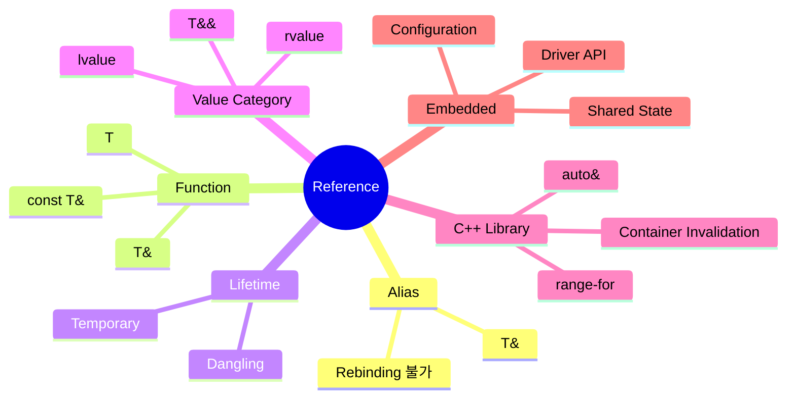

> **참조는 기존 객체의 별칭이다.**
>
> **`T&`는 수정 가능한 원본 접근, `const T&`는 읽기 중심 인터페이스에 자주 사용된다.**
>
> **참조는 소유권이나 대상 수명을 자동으로 보장하지 않는다.**
>
> **C 포인터와 C++ 참조는 목적이 겹치지만 표현하는 계약이 다르다.**

---

## 24. 다음 학습


**다음 문서:** `02_CPP/Class.md`

클래스에서는 멤버 변수와 멤버 함수, 접근 제어, 생성자·소멸자, `this`, 복사와 객체 수명을 연결한다.
