# Class

> **학습 목표**
>
> C의 `struct`에서 출발해 C++의 **객체, 클래스, 캡슐화, 생성자·소멸자, 접근 제어, 객체 수명**을 이해한다.
>
> **Struct → Class → Object → Invariant → Constructor / Destructor → RAII**
>
> 위치: `C_Cpp_Study/02_CPP/Class.md`  
> 구성: **개념 정리만 포함**하며 실습·퀴즈·코드 추적 문제는 포함하지 않는다.

---

## 1. Class란?

**Class는 데이터와 그 데이터를 다루는 동작을 하나의 사용자 정의 타입으로 묶는 C++ 기능**이다. Class로 정의한 타입의 개별 인스턴스를 **Object(객체)**라고 한다.

```cpp
class Counter {
public:
    void increment() { ++value_; }
    int value() const { return value_; }

private:
    int value_ = 0;
};

Counter counter;
counter.increment();
```

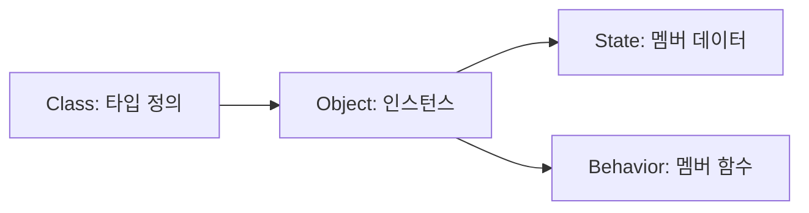

`Counter`는 타입이고 `counter`는 그 타입의 객체다. `value_`는 객체의 상태이며 `increment()`는 상태를 변경하는 동작이다.

---

## 2. C의 `struct`에서 C++ `class`로

C에서는 구조체로 관련 데이터를 묶고 별도의 함수로 처리하는 설계가 일반적이다.

```c
struct Counter {
    int value;
};

void counter_increment(struct Counter *counter)
{
    ++counter->value;
}
```

C++에서는 데이터와 관련 함수를 같은 타입에 선언할 수 있다.

```cpp
class Counter {
public:
    void increment() { ++value_; }

private:
    int value_ = 0;
};
```

| 구분 | C의 `struct` | C++의 `class` |
|---|---|---|
| 주요 역할 | 데이터 집합 정의 | 데이터와 동작을 가진 타입 정의 |
| 멤버 함수 | C 구조체 내부에 선언 불가 | 선언 가능 |
| 접근 제어 | 언어 차원의 `private` 없음 | `public`, `private`, `protected` |
| 생성자·소멸자 | 없음 | 있음 |
| 객체 불변식 관리 | 별도 함수·규약에 의존 | 접근 제어와 멤버 함수로 관리 가능 |

> C++의 `struct`도 멤버 함수·생성자·소멸자·접근 제어를 가질 수 있다. **C++에서 `struct`와 `class`는 대부분 같은 클래스 기능을 제공하며 기본 접근 수준과 기본 상속 접근 수준이 다르다.**

---

## 3. C++ `struct`와 `class`의 정확한 차이

```cpp
struct A {
    int x;  // 기본 public
};

class B {
    int x;  // 기본 private
};
```

| 선언 | 멤버 기본 접근 | 상속 기본 접근 |
|---|---|---|
| `struct` | `public` | `public` |
| `class` | `private` | `private` |

일반적인 스타일에서는 단순 데이터 묶음에 `struct`, 상태와 동작의 경계를 관리하는 타입에 `class`를 사용하기도 한다. 이는 **관례이지 언어의 강제 규칙은 아니다.**

---

## 4. 접근 제어와 캡슐화

```cpp
class Temperature {
public:
    explicit Temperature(int celsius) : celsius_(celsius) {}

    int celsius() const { return celsius_; }
    void set_celsius(int value) { celsius_ = value; }

private:
    int celsius_;
};
```

| 접근 지정자 | 접근 가능 범위의 핵심 |
|---|---|
| `public` | 타입 외부에 공개하는 인터페이스 |
| `private` | 해당 클래스의 멤버·friend 등에서 접근 |
| `protected` | 클래스의 멤버·friend 및 파생 클래스의 허용된 맥락에서 접근 |

**Encapsulation(캡슐화)**은 객체의 내부 표현과 외부 사용 방식을 분리하는 설계다. `private`을 붙이는 행위 자체가 목적이 아니라 **상태가 어떤 경로로 변경되는지 통제하는 것**이 목적이다.

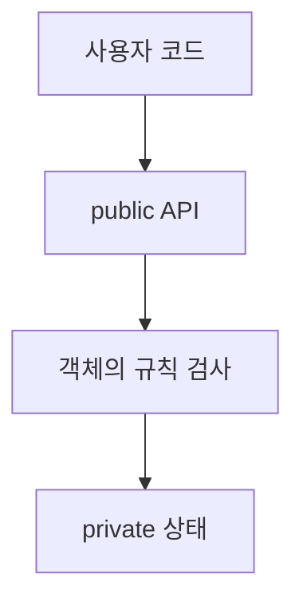

---

## 5. 객체 불변식(Invariant)

**Invariant**는 객체가 정상적인 상태일 때 항상 유지해야 하는 조건이다.

예를 들어 UART 송신 버퍼의 현재 길이는 용량을 초과하지 않아야 한다.

```text
0 ≤ size ≤ capacity
```

```cpp
class BufferState {
public:
    explicit BufferState(std::size_t capacity)
        : capacity_(capacity) {}

    bool set_size(std::size_t new_size) {
        if (new_size > capacity_) return false;
        size_ = new_size;
        return true;
    }

private:
    std::size_t size_ = 0;
    std::size_t capacity_;
};
```

외부 코드가 `size_`를 무제한 변경할 수 없도록 하는 것은 불변식 유지에 도움이 된다. 단, `private`만으로 모든 논리 오류가 자동으로 사라지는 것은 아니다.

---

## 6. 멤버 함수와 `this`

일반적인 비정적 멤버 함수는 호출 대상 객체를 기준으로 동작한다.

```cpp
class Counter {
public:
    void add(int amount) {
        this->value_ += amount;
    }

private:
    int value_ = 0;
};
```

`this`는 비정적 멤버 함수 안에서 현재 객체를 가리키는 포인터다. `this->value_`와 단순한 `value_`는 이 문맥에서 같은 멤버를 가리킨다.

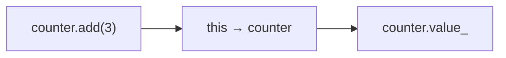

`this`는 일반적인 비정적 멤버 함수에서 사용할 수 있지만 **정적 멤버 함수에는 현재 객체가 없으므로 `this`가 없다.**

---

## 7. 생성자(Constructor)

생성자는 객체가 만들어질 때 초기화에 참여하는 특별한 멤버 함수다. 클래스 이름과 같고 반환 타입을 쓰지 않는다.

```cpp
class Sensor {
public:
    explicit Sensor(int channel) : channel_(channel) {}

private:
    int channel_;
};
```


생성자는 객체의 유효한 초기 상태를 확립하는 데 중요한 역할을 한다.

---

## 8. 멤버 초기화 리스트

```cpp
class Device {
public:
    Device(int id, int& counter)
        : id_(id), counter_(counter) {}

private:
    const int id_;
    int& counter_;
};
```

`const` 멤버와 참조 멤버는 생성자 본문에서 나중에 대입하는 방식이 아니라 **초기화**해야 한다. 멤버 초기화 리스트가 이를 표현한다.

> **주의:** 멤버는 초기화 리스트에 적힌 순서가 아니라 **클래스에 선언된 순서**대로 초기화된다. 기반 클래스가 있다면 기반 클래스의 초기화가 멤버보다 먼저 진행된다.

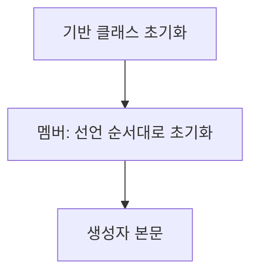

---

## 9. 기본 멤버 초기화와 기본 생성자

```cpp
class Counter {
public:
    Counter() = default;

private:
    int value_ = 0;
};
```

`int value_ = 0;`은 **기본 멤버 초기화(default member initializer)**다. 생성자가 해당 멤버에 다른 초기화를 지정하지 않으면 사용될 수 있다.

`Counter() = default;`는 기본 생성자를 명시적으로 기본화한다. 클래스에 생성자를 직접 선언하면 암시적 기본 생성자의 생성 여부가 달라질 수 있으므로, 기본 생성이 필요한지 설계 시 결정해야 한다.

---

## 10. `explicit`과 암시적 변환

인자 하나로 호출할 수 있는 생성자는 특정 상황에서 암시적 변환에 사용될 수 있다.

```cpp
class Port {
public:
    explicit Port(int number) : number_(number) {}

private:
    int number_;
};
```

```cpp
Port a{3};     // 직접 초기화
// Port b = 3; // explicit 생성자를 통한 암시적 변환은 허용되지 않음
```

`explicit`은 의도하지 않은 타입 변환을 제한한다. 하드웨어 채널 번호, 핀 번호, 타이머 식별자처럼 **숫자와 의미상 다른 타입**을 설계할 때 유용하다.

---

## 11. 생성자 오버로딩과 위임 생성자

```cpp
class Config {
public:
    Config() : Config(115200) {}
    explicit Config(int baud_rate) : baud_rate_(baud_rate) {}

private:
    int baud_rate_;
};
```

하나의 클래스는 서로 다른 매개변수를 가진 여러 생성자를 가질 수 있다. 위임 생성자는 같은 클래스의 다른 생성자를 통해 초기화 로직을 재사용한다.

---

## 12. 소멸자(Destructor)

소멸자는 객체 수명이 끝날 때 정리 작업을 수행하는 특별한 멤버 함수다.

```cpp
class Device {
public:
    ~Device() {
        // 객체가 소유한 자원의 정리
    }
};
```


소멸자 본문이 실행된 뒤 멤버와 기반 클래스 부분의 소멸이 이어진다. 정리 순서는 생성 순서의 역방향이라는 큰 원칙과 연결된다.

---

## 13. 객체 수명과 저장 기간

객체의 **수명(lifetime)**과 저장 공간의 **저장 기간(storage duration)**은 구별해야 한다.

```cpp
void process() {
    Device local;
} // local의 수명 종료
```

```cpp
static Device shared;
```

```cpp
Device* device = new Device{};
delete device;
```

| 형태 | 개념 |
|---|---|
| 지역 객체 | 보통 블록을 벗어날 때 수명 종료 |
| 정적 저장 기간 객체 | 프로그램 실행 기간과 연관된 수명 |
| 동적 생성 객체 | 적절한 삭제 또는 소유 자원 정리까지 유지 |
| 멤버 객체 | 포함하는 객체의 생성·소멸 순서에 따라 관리 |

정확한 수명 규칙에는 임시 객체, 예외, 배치 생성 등 추가 조건이 있다. 이 문서에서는 **생성과 정리가 하나의 설계 문제**라는 점을 우선 이해한다.

---

## 14. 구성(Composition)

객체가 다른 객체를 멤버로 직접 포함할 수 있다.

```cpp
class UartDriver {
public:
    void write_byte(unsigned char byte);
};

class Console {
private:
    UartDriver uart_;
};
```

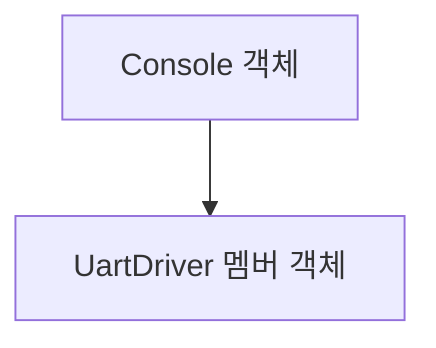

이 관계는 흔히 **has-a** 관계로 설명한다. 포함된 멤버 객체는 바깥 객체의 수명과 연결되므로 소유 관계를 명확하게 표현할 수 있다.

---

## 15. 복사 생성과 복사 대입

```cpp
class Point {
public:
    Point(int x, int y) : x_(x), y_(y) {}

private:
    int x_;
    int y_;
};

Point a{1, 2};
Point b = a; // 복사 초기화
b = a;       // 복사 대입
```

복사 생성과 복사 대입은 서로 다른 연산이다.

| 연산 | 객체 상태 |
|---|---|
| 복사 생성 | 새 객체를 만들면서 초기화 |
| 복사 대입 | 이미 존재하는 객체의 상태를 대입 |

클래스가 포인터를 멤버로 가지고 있을 때 기본 복사는 **포인터가 가리키는 동적 메모리까지 자동으로 깊은 복사하지 않는다.**

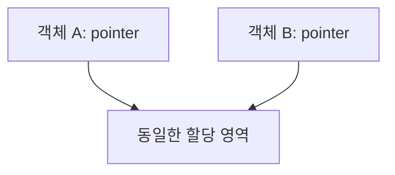

이것이 소유권과 Rule of Three/Five/Zero로 이어지는 핵심 이유다.

---

## 16. 이동 생성과 이동 대입

C++11 이후에는 **Move Semantics**를 통해 자원의 소유를 다른 객체로 넘기는 설계를 표현할 수 있다.

```cpp
class Buffer {
public:
    Buffer(Buffer&& other) noexcept;
    Buffer& operator=(Buffer&& other) noexcept;
};
```

이동은 단순히 모든 데이터를 무조건 복사하지 않는다는 보장이 아니라, **타입이 정의한 이동 동작을 사용한다**는 의미다. 자원 소유형 클래스에서는 내부 포인터나 핸들을 이전하는 방식으로 구현할 수 있다.


이동 후 원본 객체는 해당 타입이 정한 유효한 상태를 유지해야 한다. 구체적 상태는 타입의 계약에 따른다.

---

## 17. Rule of Three / Five / Zero

| 원칙 | 핵심 |
|---|---|
| Rule of Three | 소멸자·복사 생성자·복사 대입 중 하나를 직접 관리한다면 나머지도 검토 |
| Rule of Five | 이동 생성자·이동 대입까지 함께 검토 |
| Rule of Zero | 자원 관리를 적절한 멤버 타입에 위임하여 직접 특수 멤버 함수를 작성하지 않는 방향 |

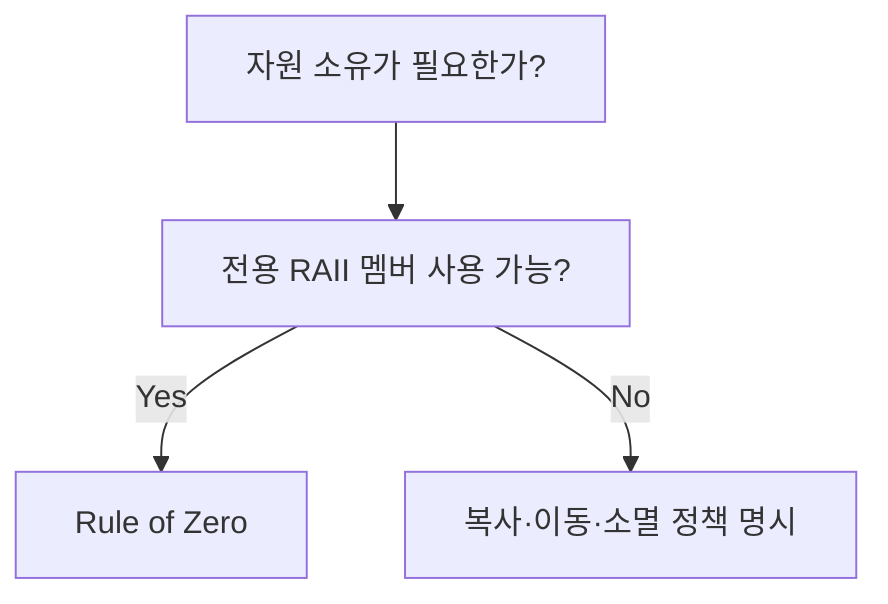

임베디드 C++에서는 특히 하드웨어 핸들, DMA Buffer, 동적 메모리 등의 **소유권을 누가 가지는지** 명확히 해야 한다.

---

## 18. 복사 금지

복사하면 안 되는 자원 소유형 타입은 복사를 금지할 수 있다.

```cpp
class DeviceHandle {
public:
    DeviceHandle(const DeviceHandle&) = delete;
    DeviceHandle& operator=(const DeviceHandle&) = delete;
};
```

예를 들어 한 하드웨어 자원에 대해 두 객체가 모두 독점 소유자인 것처럼 동작하면 해제·종료 순서가 꼬일 수 있다.

---

## 19. `const` 멤버 함수

```cpp
class Counter {
public:
    int value() const { return value_; }

private:
    int value_ = 0;
};
```

끝의 `const`는 해당 멤버 함수에서 현재 객체를 `const`로 취급하도록 하는 선언이다. 일반적으로 그 객체의 비정적 데이터 멤버를 수정할 수 없다(`mutable` 등 예외적인 설계는 별도 주제).

```cpp
const Counter counter{};
int current = counter.value();
```

`const` 객체에서는 호출 가능한 멤버 함수가 제한되므로 **읽기 전용 동작을 `const`로 선언하는 것**이 중요하다.

---

## 20. 참조 반환과 캡슐화

```cpp
class Counter {
public:
    int value() const { return value_; }

private:
    int value_ = 0;
};
```

반환 타입을 `int&`로 바꾸어 내부 멤버를 그대로 외부에 노출하면 외부에서 상태를 직접 수정할 수 있다. `const int&`는 그 참조를 통한 수정을 제한하지만 객체 수명 문제는 여전히 고려해야 한다.

| 반환 방식 | 주요 고려사항 |
|---|---|
| `T` | 값 반환, 독립적인 결과 |
| `T&` | 원본 수정 가능, 수명·불변식 주의 |
| `const T&` | 원본 참조, 수명 주의 |
| `T*` / `const T*` | null 가능성과 소유권 계약을 명확히 해야 함 |

작은 정수형 같은 값은 단순히 값으로 반환하는 것이 자연스러운 경우가 많다.

---

## 21. 정적 데이터 멤버와 정적 멤버 함수

```cpp
class Device {
public:
    static int device_count() { return count_; }

private:
    inline static int count_ = 0; // C++17 이상
};
```

`static` 데이터 멤버는 개별 객체마다 별도 값을 갖는 일반 멤버와 달리 클래스 차원에서 공유된다. 정적 멤버 함수는 특정 객체의 `this` 없이 호출된다.

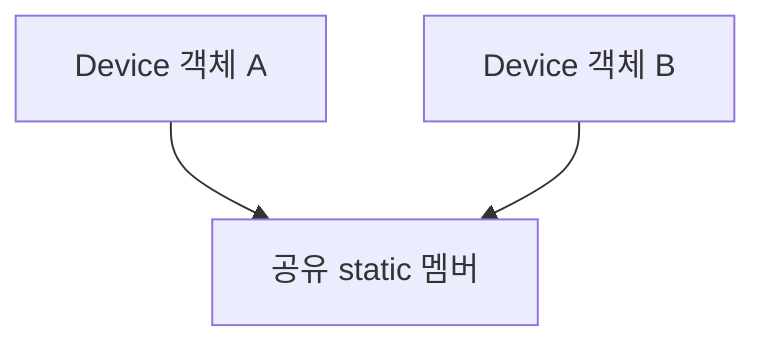

`inline static` 데이터 멤버 문법은 C++17 이상이다. C++20 학습 기준에서는 사용할 수 있다.

---

## 22. `friend`와 인터페이스 경계

`friend`로 지정한 함수나 클래스에는 접근 권한을 부여할 수 있다.

```cpp
class Device {
    friend class DeviceInspector;

private:
    int state_ = 0;
};
```

`friend`는 상속 관계가 아니며, 자동으로 상호적이거나 전이되는 관계도 아니다. 필요한 경우에만 접근 경계를 제한적으로 확장하는 도구다.

---

## 23. 상속과 다형성은 다음 확장 주제

```cpp
class Device {
public:
    virtual ~Device() = default;
    virtual void start() = 0;
};
```

상속은 타입 간 관계를 표현하고, 가상 함수는 런타임 다형성을 제공할 수 있다. 다만 **모든 클래스 설계에 상속이 필요한 것은 아니다.**

임베디드 C++에서는 가상 함수, 동적 할당, RTTI, 예외의 사용 여부를 시스템의 코드 크기·성능·안전 요구사항에 따라 결정한다. 가상 함수의 비용과 구현 방식은 대상 ABI 및 컴파일러에 따라 달라질 수 있다.

---

## 24. Embedded C++에서 Class의 역할

하드웨어 제어 코드에서 Class는 Register를 무조건 감추는 장치라기보다 **상태·책임·수명을 명확히 표현하는 도구**다.

```cpp
class Led {
public:
    explicit Led(unsigned pin) : pin_(pin) {}

    void on();
    void off();

private:
    unsigned pin_;
};
```

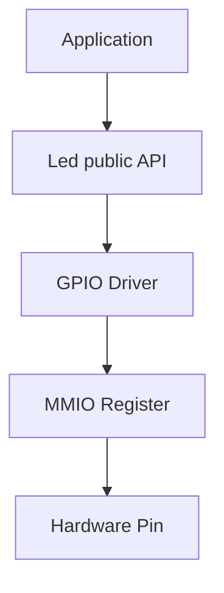

대표적인 설계 대상:

- Peripheral Driver의 설정과 상태
- 고정 크기 Buffer와 Index
- 통신 Protocol Parser의 FSM 상태
- 하드웨어 핸들 또는 Lock의 수명
- 오류 상태와 복구 정책의 인터페이스

---

## 25. 생성자에서 하드웨어 초기화할 때의 고려사항

생성자가 하드웨어를 바로 초기화하도록 설계할 수도 있지만, **객체 생성 시점에 Clock·Memory·Interrupt·Peripheral이 사용 가능한지** 확인해야 한다.

특히 전역/정적 객체의 생성 시점은 시스템 Startup과 연결되므로 초기화 순서가 중요한 문제다.

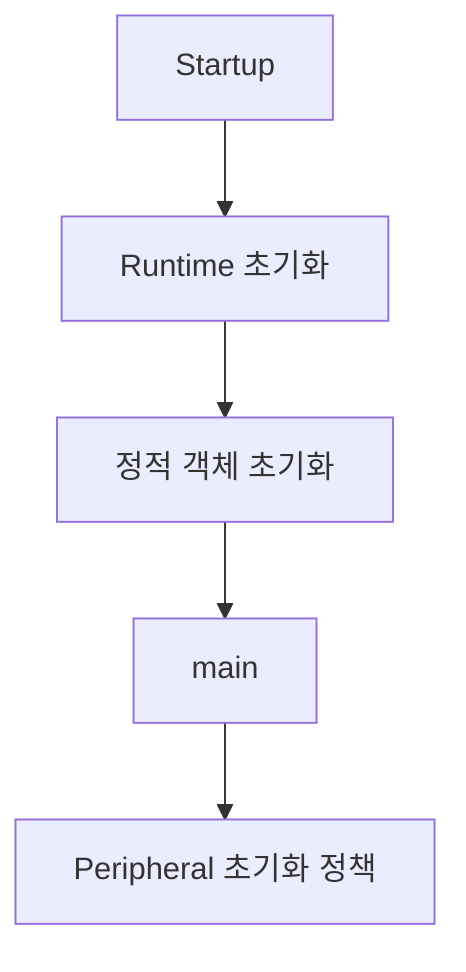

전역 객체 생성자에서 하드웨어 접근을 무조건 수행하기보다, 시스템 요구에 따라 명시적 `init()`을 제공하거나 생성 시점이 통제되는 객체를 사용할 수 있다.

---

## 26. 소멸자에서 하드웨어 정리할 때의 고려사항

소멸자에 다음 작업을 연결할 수 있다.

```text
Peripheral 사용 종료
Lock 해제
Buffer 자원 반환
Handle 반납
```

그러나 임베디드에서는 다음을 구분해야 한다.

- **소유하는 자원:** 객체가 해제 책임을 가짐
- **빌려 쓰는 자원:** 객체가 임의로 해제하면 안 됨
- **프로그램 수명 전체에 걸친 자원:** 종료 시점 정책이 별도로 필요할 수 있음

정적 객체의 소멸과 실제 전원 차단·Reset은 같은 사건이 아니다. Bare-metal에서는 일반적인 프로그램 종료 경로가 존재하지 않을 수도 있다.

---

## 27. C의 Driver Context와 C++ Class 비교

C 방식:

```c
struct UartContext {
    unsigned baud_rate;
    int initialized;
};

void uart_init(struct UartContext *ctx);
```

C++ 방식:

```cpp
class Uart {
public:
    explicit Uart(unsigned baud_rate)
        : baud_rate_(baud_rate) {}

    void init();

private:
    unsigned baud_rate_;
    bool initialized_ = false;
};
```

| 관점 | C Context + Function | C++ Class |
|---|---|---|
| 상태 | `struct` | 데이터 멤버 |
| 동작 | 별도 함수 | 멤버 함수 |
| 초기 상태 | 초기화 함수·규약 | 생성자·기본 멤버 초기화 |
| 접근 제한 | API 설계·불완전 타입 등으로 구현 | `private` 등 언어 기능 |
| 자원 수명 | 명시적 init/deinit | 생성자·소멸자 및 RAII 설계 가능 |

둘 중 어느 쪽이 항상 우월한 것은 아니며 프로젝트의 언어·ABI·도구·제약에 따라 선택한다.

---

## 28. 흔한 개념 오해

| 오해 | 정확한 이해 |
|---|---|
| Class는 단순히 `struct`보다 고급 문법이다 | 타입의 상태·동작·규칙·수명을 설계하는 도구다 |
| C++ `struct`에는 함수가 없다 | C++ `struct`에도 멤버 함수와 생성자 등이 있다 |
| `private`이면 객체는 무조건 안전하다 | 멤버 함수의 구현도 불변식을 지켜야 한다 |
| 생성자 본문에서 모든 멤버를 초기화하면 된다 | 멤버는 본문 실행 전에 초기화된다 |
| 초기화 리스트 순서대로 멤버가 초기화된다 | 멤버 선언 순서가 기준이다 |
| 기본 복사는 동적 자원까지 복제한다 | 포인터 멤버는 포인터 값이 복사될 수 있다 |
| 소멸자가 있으면 자원 관리가 자동으로 완벽해진다 | 소유권·복사·이동·실패 경로를 함께 설계해야 한다 |
| `const` 멤버 함수는 프로그램의 모든 변경을 금지한다 | 현재 객체를 통한 수정에 제약을 주는 개념이다 |
| 임베디드에서는 Class를 쓰면 반드시 Heap을 쓴다 | Class 객체는 자동·정적·동적 저장 기간 등 다양한 방식으로 존재할 수 있다 |

---

## 29. 개념 연결 지도

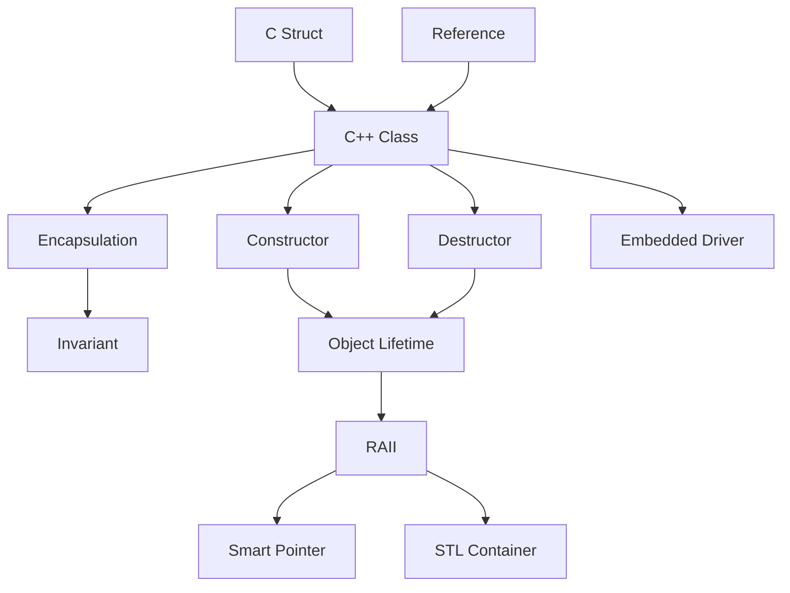

---

## 30. 핵심 요약

> **Class는 상태와 동작을 하나의 사용자 정의 타입으로 묶는다.**
>
> **C++ `struct`와 `class`의 핵심 언어적 차이는 기본 접근 수준과 기본 상속 접근 수준이다.**
>
> **캡슐화는 내부 상태의 변경 경로를 관리하고 객체의 불변식을 유지하기 위한 설계다.**
>
> **생성자는 객체의 초기 상태를 만들고 소멸자는 객체 수명 종료 시 정리 작업을 수행한다.**
>
> **멤버 초기화는 생성자 본문보다 먼저, 멤버 선언 순서대로 진행된다.**
>
> **복사·이동·소멸 정책은 자원 소유권과 함께 설계해야 한다.**
>
> **임베디드 C++에서 Class는 Hardware 상태, Driver API, 자원 수명을 표현하는 데 사용할 수 있다.**

---

## 31. 현재 학습 위치와 다음 문서

```text
C_Cpp_Study/
└── 02_CPP/
    ├── Reference.md      ✓
    ├── Class.md          ← 현재
    ├── RAII.md
    ├── Template.md
    ├── STL.md
    └── Smart_Pointer.md
```

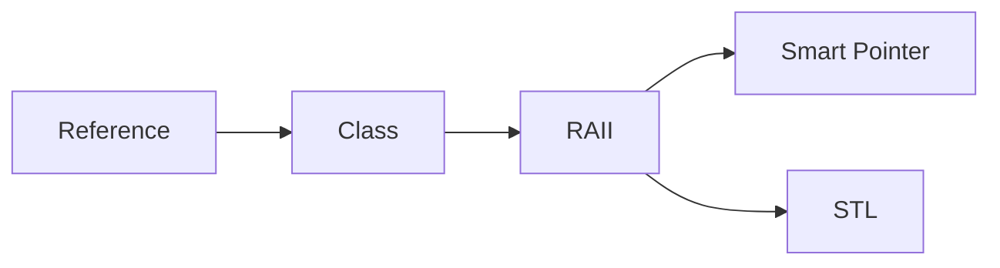

**다음 문서: `02_CPP/RAII.md`**

다음에는 자원 획득과 객체 수명, 생성자·소멸자, 예외/조기 반환 시 정리, 소유권, Rule of Zero, 임베디드 하드웨어 핸들 관리의 연결을 개념 중심으로 정리한다.
