# RAII

> **학습 목표:** C++에서 자원의 획득과 해제를 객체 수명에 연결하는 RAII(Resource Acquisition Is Initialization)를 이해하고, 생성자·소멸자·소유권·복사/이동·스마트 포인터 및 임베디드 자원 관리로 연결한다.
>
> 위치: `C_Cpp_Study/02_CPP/RAII.md`  
> **구성 원칙:** 실습·퀴즈 없이 개념과 설계 원칙만 정리한다.

---

## 1. 한 문장 정의

**RAII는 자원의 소유권을 객체에 묶고, 객체의 초기화 과정에서 자원을 확보하며 객체의 수명이 끝날 때 소멸자를 통해 자원을 정리하는 C++ 설계 관용구다.**

자원은 동적 메모리에만 한정되지 않는다.

- Heap 메모리, 파일, 소켓
- Mutex 잠금, 스레드 핸들
- DMA 채널, Peripheral 사용권, 임계 구역
- 그 밖의 명시적인 반환·해제가 필요한 자원


> 이름에 *Initialization*이 들어가지만, 핵심은 **초기화·소유권·정리의 결합**이다. 생성자가 실패할 수 있는 자원은 예외나 명시적 팩터리/상태 설계로 다룰 수 있다.

## 2. RAII가 해결하려는 문제

C에서 자원을 직접 관리할 때는 모든 종료 경로에서 해제를 빠뜨리지 않아야 한다.

```c
void process(void)
{
    char *buffer = malloc(256);
    if (buffer == NULL) return;

    if (some_error()) {
        free(buffer);
        return;
    }

    free(buffer);
}
```

분기가 늘어나면 Memory Leak, Double Free, Use-After-Free가 생기기 쉽다. C++ RAII에서는 **해제를 담당하는 객체**를 지역 변수로 두어 정상 종료와 조기 반환에서 같은 정리 경로를 사용한다.

```cpp
#include <memory>

void process()
{
    auto buffer = std::make_unique<char[]>(256);
    if (some_error()) return;
    // buffer는 스코프 종료 시 자동 정리
}
```

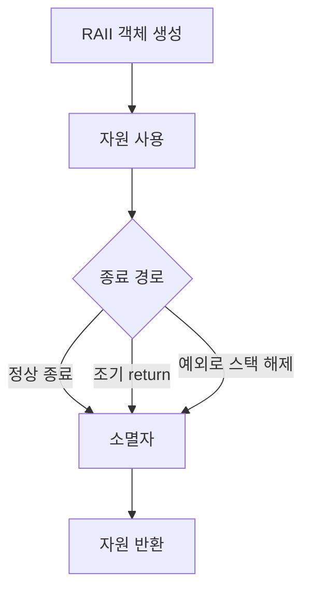

단, `std::terminate`, 강제 프로세스 종료, 전원 차단 등에서는 일반적인 스택 해제와 소멸자 실행을 기대할 수 없다.

## 3. 객체 수명과 스코프

```cpp
class Resource {
public:
    Resource()  { /* 자원 확보 */ }
    ~Resource() { /* 자원 반환 */ }
};

void run()
{
    Resource resource;
    // 사용
} // resource의 소멸자 호출
```

자동 저장 기간을 갖는 지역 객체는 일반적으로 스코프를 떠날 때 파괴된다. 동적으로 생성한 객체는 **소유자가 파괴하거나 `delete`하는 시점**에 수명이 끝난다. RAII가 자동으로 작동하는 이유는 “모든 객체가 스코프 종료 시 파괴된다”가 아니라 **소유자 자신의 수명이 자원 정리를 결정하기 때문**이다.

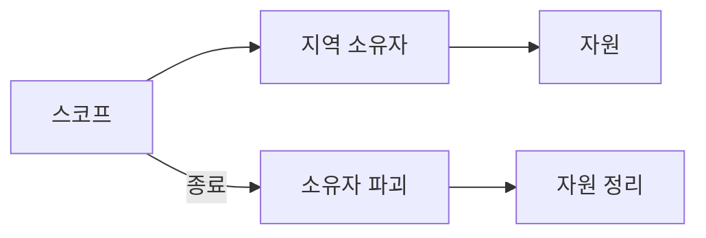

## 4. 생성자와 소멸자의 역할

| 구성 요소 | 대표 책임 |
|---|---|
| 생성자 | 유효한 객체 상태 형성, 필요한 자원 획득 |
| 일반 멤버 함수 | 자원 사용 및 상태 변경 |
| 소멸자 | 보유한 자원 반환 |
| 복사/이동 연산 | 소유권을 복제할지, 공유할지, 이전할지 정의 |

```cpp
class Buffer {
public:
    explicit Buffer(std::size_t size)
        : data_(new std::byte[size]), size_(size) {}

    ~Buffer() { delete[] data_; }

private:
    std::byte* data_;
    std::size_t size_;
};
```

위 코드는 **RAII의 최소 형태를 보여 주는 개념 예시**이며, 그대로 복사 가능하게 두면 위험하다. 다음 절의 소유권 규칙이 반드시 필요하다. 실제 코드에서는 `std::vector<std::byte>`나 `std::unique_ptr<std::byte[]>`가 더 적합한 경우가 많다.

## 5. 자원과 소유권(Ownership)

소유권은 “누가 최종적으로 정리할 책임을 갖는가?”라는 설계 계약이다.

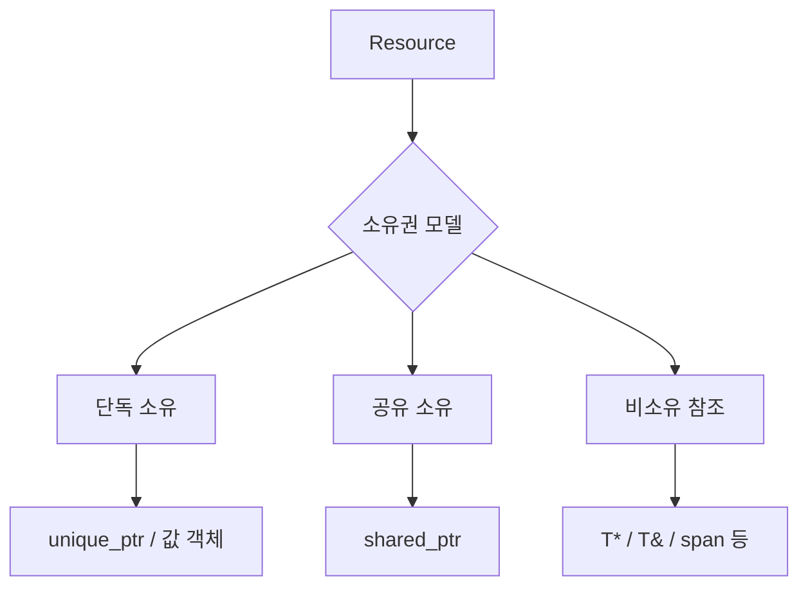

- **단독 소유:** 하나의 소유자가 정리 책임을 가진다.
- **공유 소유:** 여러 소유자가 마지막 소유자가 사라질 때 정리하도록 협력한다.
- **비소유 접근:** 자원을 사용하지만 수명 연장·해제 책임은 갖지 않는다.

포인터와 참조라는 문법만으로 소유권이 자동 결정되지는 않는다. API 계약과 타입 설계가 함께 필요하다.

## 6. 얕은 복사 문제

원시 포인터를 소유한 객체를 기본 복사하면 주소만 복제될 수 있다.

```cpp
class Buffer {
public:
    explicit Buffer(std::size_t n) : data_(new int[n]) {}
    ~Buffer() { delete[] data_; }
private:
    int* data_;
};

// Buffer a(8);
// Buffer b = a; // 기본 복사: 같은 주소를 소유하는 것처럼 됨
```

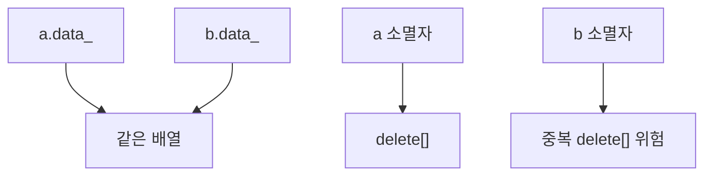

자원 소유 객체는 복사·이동 의미를 명시해야 한다.

## 7. Rule of Three / Five / Zero

| 규칙 | 요지 |
|---|---|
| Rule of Three | 소멸자·복사 생성자·복사 대입 중 하나를 직접 정의해야 한다면 나머지도 검토 |
| Rule of Five | 여기에 이동 생성자·이동 대입까지 함께 검토 |
| Rule of Zero | 가능하면 자원 소유를 표준 RAII 멤버에 맡겨 다섯 특수 멤버를 직접 구현하지 않음 |

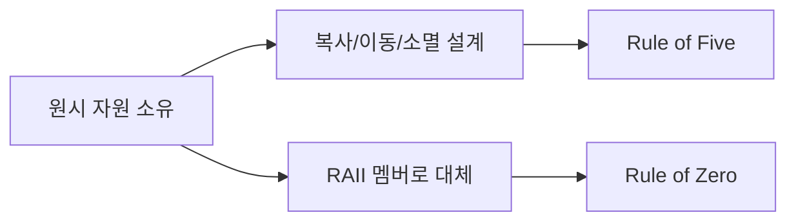

```cpp
#include <vector>

class Buffer {
    std::vector<int> data_;
public:
    explicit Buffer(std::size_t n) : data_(n) {}
};
```

이 예시는 자원 관리 책임을 `std::vector`에 위임한다. `std::vector`의 복사는 요소를 복사하며, 이동은 해당 타입과 allocator 조건에 따라 효율적인 자원 이전을 지원한다.

## 8. 복사와 이동의 의미

```text
복사(Copy)  → 두 객체가 각자 유효한 값을 갖도록 생성
이동(Move)  → 기존 객체의 자원을 새 객체에 이전할 수 있음
```

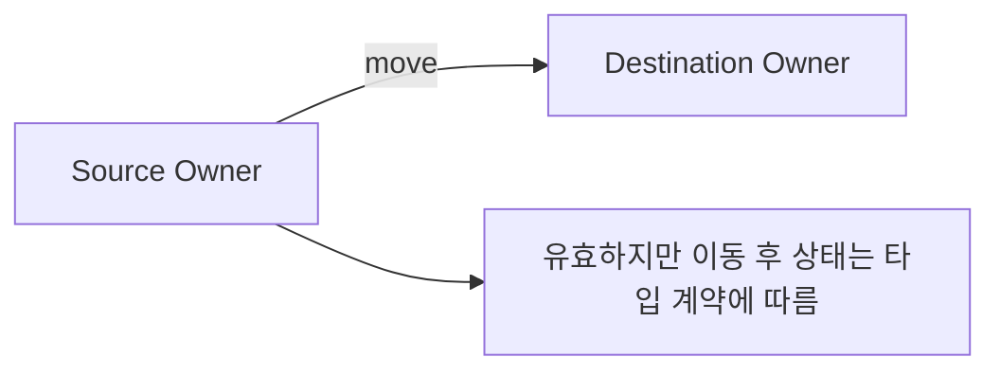

`std::move`는 **그 자체로 데이터를 이동시키는 함수가 아니라**, 이동을 허용하는 값 범주로 변환한다. 실제 이동 여부는 선택된 생성자/대입 연산이 결정한다.

## 9. 단독 소유: `std::unique_ptr`

```cpp
#include <memory>

auto item = std::make_unique<int>(42);
```

`std::unique_ptr<T>`는 단독 소유권을 표현하는 대표적인 RAII 타입이다.

```cpp
auto first = std::make_unique<int>(42);
auto second = std::move(first);
```

이동 후 `first`는 소유하던 포인터를 더 이상 보유하지 않는다. `unique_ptr` 자체는 복사할 수 없다.


`unique_ptr`는 **동적 메모리 사용을 필수로 하는 문법이 아니라 소유권을 표현하는 타입**이다. 다만 `make_unique`는 통상 동적 할당을 수행하므로 Heap 정책이 엄격한 펌웨어에서는 사용 여부를 별도로 판단한다.

## 10. 공유 소유: `std::shared_ptr`

```cpp
#include <memory>

auto first = std::make_shared<int>(42);
auto second = first;
```

`shared_ptr`는 참조 계수 기반 공유 소유를 제공한다. 마지막 소유자가 사라지면 관리 대상이 정리된다.

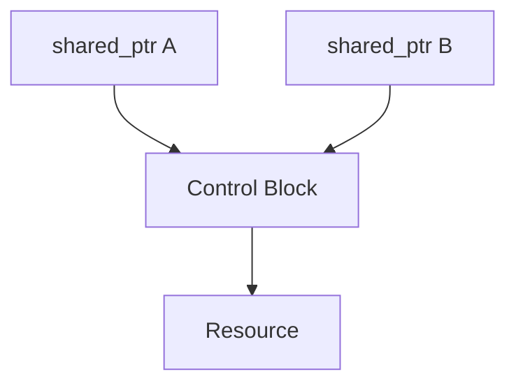

주의 사항:

- 공유 소유가 필요한 경우에만 사용한다.
- 순환 참조는 자원이 정리되지 않는 원인이 될 수 있다.
- 참조 계수 조작과 **관리 대상 객체의 모든 접근이 thread-safe하다는 것**은 다른 문제다.
- Control Block, 할당, 참조 계수 비용이 있으므로 임베디드의 메모리·실시간 요구사항과 함께 검토한다.

## 11. `std::weak_ptr`

`weak_ptr`는 `shared_ptr`가 관리하는 객체를 **소유하지 않고 관찰**한다.

```cpp
std::weak_ptr<int> observer = first;
if (auto owner = observer.lock()) {
    // 이 범위에서는 shared_ptr로 수명 확보
}
```

대표 목적은 공유 소유 그래프에서 순환 참조를 피하는 것이다.

## 12. `std::vector`, `std::string`도 RAII

RAII는 스마트 포인터만의 개념이 아니다.

```cpp
std::vector<std::uint8_t> packet;
std::string name;
```

이 타입들은 내부 자원을 객체 수명에 맞춰 관리한다. 따라서 “RAII = `unique_ptr`”로 좁게 이해하지 않는다.

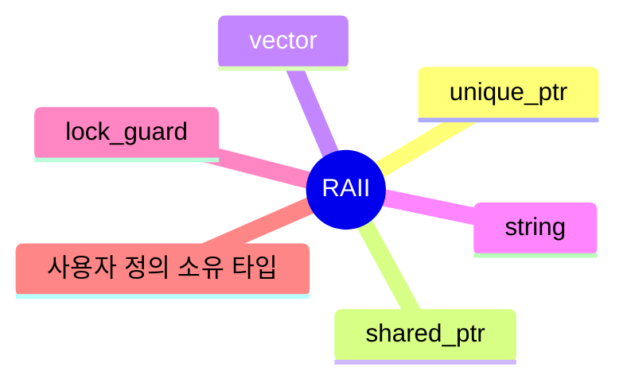

## 13. 메모리 이외의 자원: Mutex

```cpp
#include <mutex>

std::mutex m;

void update()
{
    std::lock_guard<std::mutex> lock(m);
    // 보호된 영역
} // lock 소멸 시 unlock
```

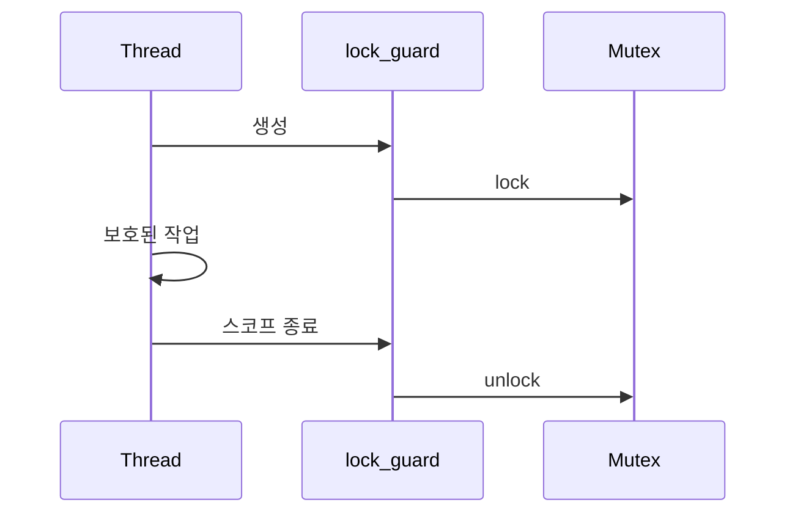

이것은 **잠금의 획득·해제를 객체 수명에 결합**한 예다. `volatile`과 달리 Mutex는 동기화를 위한 도구다.

## 14. 소멸자와 예외

예외를 사용하는 C++ 환경에서는 스택 해제(stack unwinding) 중 생성이 완료된 지역 객체들의 소멸자가 호출된다.

```cpp
void work()
{
    std::lock_guard<std::mutex> lock(m);
    do_something(); // 예외가 발생해도 lock 정리
}
```

일반적인 소멸자는 예외를 밖으로 전파하지 않도록 설계한다. 특히 다른 예외가 전파되는 중 소멸자에서 예외가 빠져나오면 `std::terminate`로 이어질 수 있다.

> 생성자가 예외를 던져 **객체 생성이 완료되지 않은 경우**, 그 객체 자신의 소멸자는 호출되지 않는다. 다만 이미 생성된 멤버·기반 클래스 객체는 정리된다. 자원을 RAII 멤버에 즉시 맡기는 이유 중 하나다.

## 15. 예외를 사용하지 않는 임베디드 C++

임베디드 프로젝트에서는 코드 크기, ABI, 팀 정책 등의 이유로 예외를 비활성화하기도 한다. **RAII 자체는 예외 사용을 요구하지 않는다.**

```text
초기화 성공/실패 표현
    ↓
Result / Status / Factory 정책
    ↓
유효한 소유 객체 형성
    ↓
소멸자에서 정리
```

다만 예외를 사용하지 않을 때 **생성자의 자원 획득 실패를 어떻게 표현할지**는 별도로 설계해야 한다. 생성자에 실패 가능 작업을 넣지 않거나, 명시적 초기화/팩터리와 결과 타입을 사용할 수 있다.

## 16. 획득과 해제의 짝

| 획득 | 대응 정리 | RAII 소유자 예 |
|---|---|---|
| `new` | `delete` | `unique_ptr<T>` |
| `new[]` | `delete[]` | `unique_ptr<T[]>` |
| `malloc` | `free` | 사용자 정의 Deleter |
| Mutex `lock` | `unlock` | `lock_guard` |
| 파일 `open` | `close` | 파일 핸들 래퍼 |
| DMA 채널 확보 | 채널 반환 | DMA 소유 객체 |

획득 API와 해제 API를 잘못 짝지으면 정의되지 않은 동작이나 자원 오류가 생길 수 있다.

## 17. 사용자 정의 Deleter

C API로 얻은 자원도 C++ RAII 객체에 맡길 수 있다.

```cpp
#include <cstdio>
#include <memory>

using FilePtr = std::unique_ptr<std::FILE, decltype(&std::fclose)>;

FilePtr file(std::fopen("data.bin", "rb"), &std::fclose);
```

`fopen`이 실패하면 null 포인터가 들어가고 `unique_ptr`는 null 대상에 Deleter를 호출하지 않는다. 다만 **파일 열기 실패 자체는 별도로 처리**해야 한다.

## 18. `release`, `reset`, `get`

`unique_ptr`의 대표 인터페이스:

| 함수 | 의미 |
|---|---|
| `get()` | 소유권 이전 없이 관리 포인터 관찰 |
| `reset()` | 기존 자원 정리 후 새 포인터로 교체 가능 |
| `release()` | 소유권을 포기하고 원시 포인터 반환; 호출자가 정리 책임 인수 |

```cpp
T* borrowed = owner.get(); // 비소유 접근
T* raw = owner.release();   // 소유권 이전 책임이 호출자에게 이동
```

`release()`는 자원을 해제하지 않는다. 이를 `reset()`과 혼동하면 누수가 발생할 수 있다.

## 19. 소유 객체와 비소유 참조의 수명

```cpp
void consume(const Buffer& buffer); // 일반적으로 비소유 사용
```

비소유 참조·포인터는 소유자보다 오래 살아서는 안 된다.


RAII가 **소유한 자원**을 정리해도 외부에 전달한 원시 포인터와 참조가 자동으로 무효화 사실을 알려 주지는 않는다. Dangling Pointer/Reference는 별도 수명 설계가 필요하다.

## 20. 소멸 순서

일반적인 자동 객체는 **생성 완료 순서의 역순**으로 파괴된다.

```cpp
Resource first;
Resource second;
// 스코프 종료: second → first
```

클래스 멤버는 **선언 순서대로 초기화**되고 **역순으로 파괴**된다. 생성자 초기화 리스트에 적힌 순서가 멤버 초기화 순서를 바꾸지는 않는다.


의존 자원 사이에서는 이 순서가 중요하다.

## 21. 임베디드: Peripheral 사용권의 RAII

RAII는 Register 자체를 Heap에 할당한다는 뜻이 아니다. **이미 존재하는 Hardware 자원에 대한 사용권과 설정 복구 책임**을 객체로 표현할 수 있다.

```text
Peripheral 사용권 확보
        ↓
설정 및 사용
        ↓
스코프 종료
        ↓
사용권 반환 / 필요한 상태 복구
```

예를 들어 SPI 버스 잠금, Chip Select 제어, 임계 구역 진입/복귀를 스코프 기반으로 다룰 수 있다.

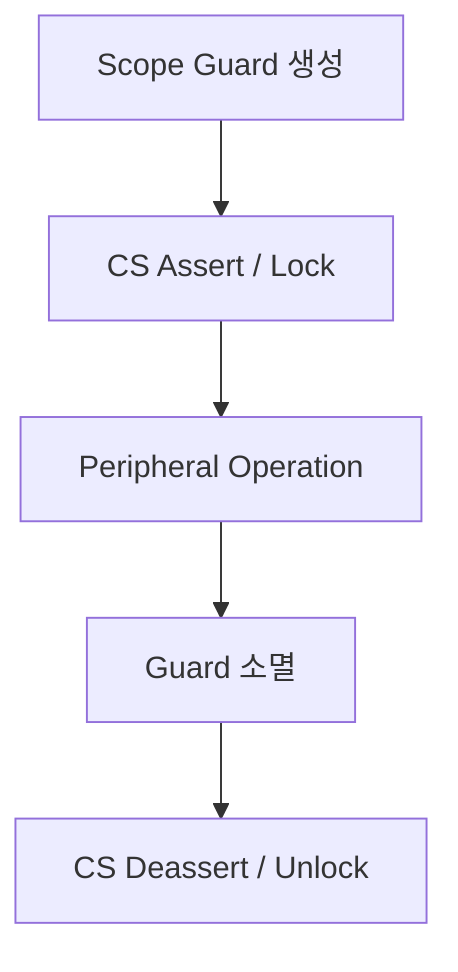

단, **소멸자에서 무조건 Peripheral Clock을 끄거나 장치를 Reset하는 설계가 안전하다고 가정해서는 안 된다.** 공유 사용자, ISR, DMA, 다른 Task와의 소유권 계약을 먼저 정해야 한다.

## 22. 임베디드: ISR과 소멸자

ISR에서 객체를 사용할 때는 다음을 검토한다.

- 생성자·소멸자의 실행 시간과 최악 실행 시간
- 잠금의 Blocking 가능성
- 동적 할당 여부
- Interrupt-safe API인지 여부
- ISR과 Task 사이의 소유권 이전 규칙

일반적인 `std::mutex`나 Blocking API를 ISR에서 안전하게 사용할 수 있다고 가정하면 안 된다. MCU·RTOS가 제공하는 ISR 전용 동기화 규칙을 따른다.

## 23. 임베디드: 정적 객체의 수명

```cpp
static Driver driver;
```

정적 저장 기간 객체는 프로그램 종료 시점에 파괴되는 것이 일반적인 C++ 모델이지만, Bare-metal Firmware는 정상적인 프로그램 종료 경로에 도달하지 않을 수 있다.

따라서 정적 객체의 소멸자에 **전원 차단 직전 반드시 실행되어야 하는 Hardware 정리**를 의존시키는 설계는 적절하지 않을 수 있다. 명시적 Shutdown 절차가 필요할 수 있다.

## 24. 임베디드: Heap 제한과 RAII

RAII와 Heap 사용은 같은 개념이 아니다.

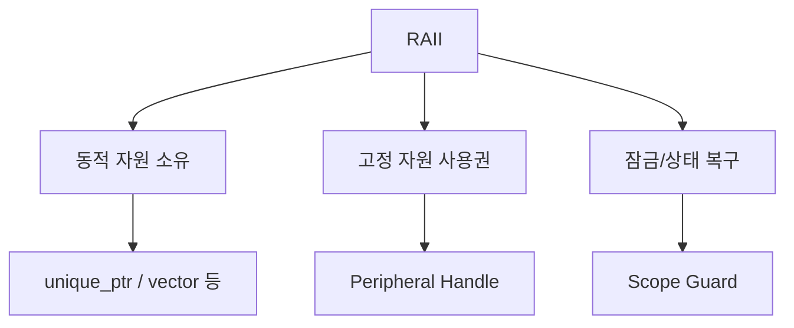

Heap 사용을 금지한 프로젝트에서도 Stack 기반 Guard와 고정 자원 관리용 RAII는 유효할 수 있다. 다만 표준 라이브러리 타입별 실제 할당 정책은 확인해야 한다.

## 25. RAII와 C의 Cleanup 패턴 비교

| 관점 | C | C++ RAII |
|---|---|---|
| 정리 시점 | 명시적 Cleanup 경로 | 소유자 수명 종료 |
| 조기 반환 | 모든 경로에서 해제 확인 | 지역 소유자의 소멸자 활용 |
| 소유권 표현 | 문서·API·관례 중심 | 타입으로 표현 가능 |
| 실패 처리 | Return Code 등 | Return Code, Exception, Result 등 |
| 주의점 | 누락된 Cleanup | 잘못된 복사/이동·수명·소멸자 설계 |

C의 `goto cleanup` 같은 방식도 올바르게 구현하면 유효하다. RAII의 차이는 **정리 책임을 객체의 타입과 수명에 내재화**한다는 데 있다.

## 26. 흔한 오해

| 오해 | 정확한 이해 |
|---|---|
| RAII는 메모리 관리만 뜻한다 | 모든 종류의 획득·반환 자원에 적용 가능 |
| RAII는 반드시 Heap을 쓴다 | Stack 기반 잠금/상태 Guard에도 적용 가능 |
| `std::move`가 무조건 이동시킨다 | 이동을 허용하는 값 범주 변환이며 실제 동작은 선택된 연산에 달림 |
| `unique_ptr::release()`가 해제한다 | 포인터를 반환하고 소유권을 포기할 뿐 정리하지 않음 |
| RAII면 Dangling Reference가 사라진다 | 비소유 참조의 수명은 여전히 관리해야 함 |
| `shared_ptr`면 모든 접근이 thread-safe하다 | 소유권 관리와 대상 객체의 동기화는 별개 |
| 소멸자는 어떤 종료 상황에도 호출된다 | 전원 차단·강제 종료 등에서는 보장되지 않음 |
| `volatile`로 RAII 잠금 대체 가능 | `volatile`은 동기화 수단이 아님 |

## 27. 설계 판단 흐름

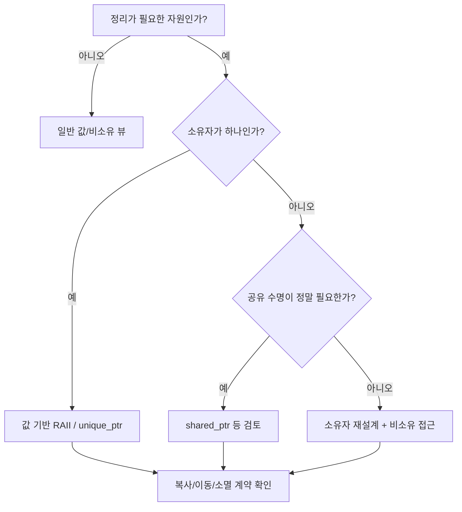

## 28. 개념 체크리스트

- [ ] RAII를 자원 소유권과 객체 수명의 결합으로 설명할 수 있다.
- [ ] 생성자·소멸자의 역할을 구분할 수 있다.
- [ ] 자동 객체와 동적 객체의 수명 차이를 설명할 수 있다.
- [ ] 단독 소유·공유 소유·비소유 접근을 구분할 수 있다.
- [ ] 원시 포인터 소유 객체의 기본 복사가 위험한 이유를 설명할 수 있다.
- [ ] Rule of Three/Five/Zero의 관계를 이해한다.
- [ ] 복사와 이동, `std::move`의 역할을 구분할 수 있다.
- [ ] `unique_ptr`, `shared_ptr`, `weak_ptr`의 소유권 차이를 이해한다.
- [ ] `get`, `reset`, `release`의 차이를 이해한다.
- [ ] Mutex와 같은 비메모리 자원의 RAII를 설명할 수 있다.
- [ ] 예외 발생 시 스택 해제와 소멸자 관계를 이해한다.
- [ ] 생성자 실패 시 부분 생성 객체의 정리 규칙을 이해한다.
- [ ] 임베디드에서 RAII와 Heap 사용을 별개로 판단할 수 있다.
- [ ] ISR·DMA·정적 객체 수명에서 RAII 설계 주의점을 이해한다.

## 29. 핵심 요약

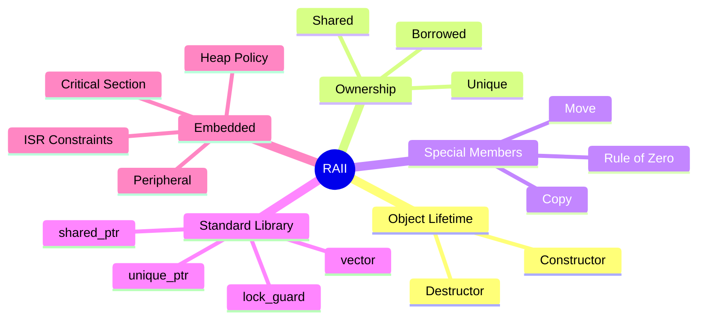

> **RAII의 핵심은 “자원을 누가 소유하며 언제 정리하는가?”를 객체 수명으로 표현하는 것이다.**
>
> **가능하면 표준 RAII 타입에 자원 관리를 위임해 Rule of Zero를 지향한다.**
>
> **임베디드에서도 RAII는 유효하지만 Heap, ISR, DMA, 종료 경로, 실행 시간 제약을 별도로 검토해야 한다.**

---

## 30. 학습 진행 상태와 다음 문서


```text
C_Cpp_Study/
└── 02_CPP/
    ├── Reference.md       ✓
    ├── Class.md           ✓
    ├── RAII.md            ← 현재
    ├── Template.md
    ├── STL.md
    └── Smart_Pointer.md
```

**다음 문서:** `02_CPP/Template.md` — 함수·클래스 템플릿, 타입 매개변수, 인스턴스화, 특수화, 제약 조건, STL과의 연결.
