# Template — C++ 템플릿 개념 정리

> **위치:** `C_Cpp_Study/02_CPP/Template.md`  
> **기준:** C++20을 중심으로 설명하며, C++11/14/17에서 도입된 기능은 필요할 때 구분한다.  
> **범위:** 개념, 문법의 의미, 설계 판단, C 및 임베디드와의 연결. 실습·퀴즈는 포함하지 않는다.

## 1. 한 문장 정의

**템플릿(template)은 타입이나 컴파일 시점의 값을 매개변수로 받아 함수·클래스 등의 선언과 정의를 여러 구체적인 형태로 생성할 수 있게 하는 C++의 언어 기능이다.**


예를 들어 `int`용 최댓값 함수와 `double`용 최댓값 함수를 따로 작성하는 대신, 비교 연산을 지원하는 타입을 매개변수로 표현할 수 있다.

```cpp
template <typename T>
T max_value(const T& a, const T& b)
{
    return (a < b) ? b : a;
}
```

`max_value(3, 5)`는 `T = int`로 추론될 수 있다. 이 정의가 **모든 타입에서 유효한 것은 아니다**. `T`에 필요한 연산과 반환 방식이 성립해야 한다.

---

## 2. 왜 템플릿이 필요한가?

타입만 다르고 구조가 같은 코드를 반복 작성하면 중복이 늘어난다.

```text
int용 알고리즘
float용 알고리즘
사용자 정의 타입용 알고리즘
         ↓
공통 알고리즘 + 타입별 요구사항
```

| 접근 | 특징 |
|---|---|
| 함수 오버로딩 | 타입별로 서로 다른 함수 정의를 작성할 수 있음 |
| 매크로 | 전처리기에서 토큰을 치환하며 C++ 타입 시스템의 검사를 직접 제공하지 않음 |
| 템플릿 | 타입·값을 매개변수화하고 인스턴스화 과정에서 구체적인 코드의 유효성을 검사함 |
| 런타임 다형성 | 보통 상속·가상 함수를 통해 실행 시점에 동작을 선택함 |

템플릿은 **컴파일 시점의 일반화**를 지원하지만, 템플릿을 사용한다고 모든 계산이 컴파일 시점에 실행되는 것은 아니다.

---

## 3. 기본 구성 요소

```cpp
template <typename T> // 템플릿 매개변수
T identity(T value)    // 템플릿 정의
{
    return value;
}

int x = identity<int>(10); // 명시적 템플릿 인수
int y = identity(10);      // 템플릿 인수 추론
```

| 용어 | 의미 |
|---|---|
| Template parameter | 정의에서 받는 타입·값 등의 매개변수 |
| Template argument | 사용 시 전달하는 구체적인 타입·값 등의 인수 |
| Instantiation | 인수를 적용해 구체적인 선언·정의를 형성하는 과정 |
| Specialization | 특정 인수 조합에 맞춘 형태 |
| Deduction | 함수 호출 등의 문맥에서 템플릿 인수를 추론하는 과정 |

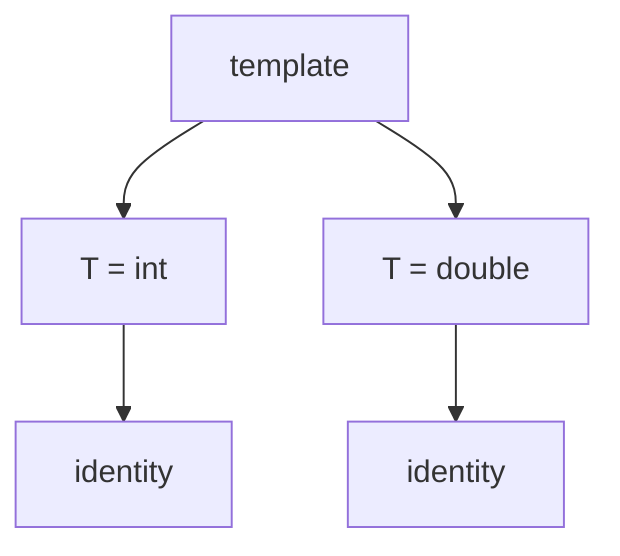

---

## 4. 함수 템플릿

```cpp
template <typename T>
void swap_values(T& a, T& b)
{
    T temp = a;
    a = b;
    b = temp;
}
```

위 함수는 `T`가 복사 생성과 대입에 필요한 연산을 지원할 때 사용할 수 있다. 표준 라이브러리의 `std::swap`은 이동 연산 등을 활용하므로 이 단순 예제와 구현 요구사항이 같지는 않다.

```cpp
int a = 1;
int b = 2;
swap_values(a, b); // T는 int로 추론
```

**함수 템플릿은 함수 하나가 아니라 여러 함수 특수화를 만들 수 있는 패턴**으로 이해한다.

### `typename`과 `class`

타입 템플릿 매개변수 선언에서는 다음 두 형태가 같은 역할을 한다.

```cpp
template <typename T> struct BoxA {};
template <class T>    struct BoxB {};
```

여기서 `class`는 `T`에 클래스 타입만 전달할 수 있다는 뜻이 아니다. `int`도 가능하다.

---

## 5. 템플릿 인수 추론

함수 호출에서 인수 타입을 이용해 템플릿 매개변수를 추론할 수 있다.

```cpp
template <typename T>
T add(T a, T b)
{
    return a + b;
}

int n = add(2, 3);       // T = int
// add(2, 3.5);          // 두 인수에서 T가 서로 다르게 추론되어 실패할 수 있음
```

서로 다른 타입을 받도록 설계하려면 매개변수를 분리할 수 있다.

```cpp
template <typename A, typename B>
auto add_mixed(A a, B b)
{
    return a + b;
}
```

반환 타입 `auto`는 `a + b` 표현식의 타입으로 추론된다. **호출 가능 여부는 해당 연산이 유효한지에 달려 있다.**

---

## 6. 클래스 템플릿

클래스의 멤버 타입이나 크기 등을 매개변수화한다.

```cpp
template <typename T>
class Box
{
public:
    explicit Box(T value) : value_(value) {}

    const T& get() const { return value_; }

private:
    T value_;
};

Box<int> number(10);
Box<float> ratio(0.5f);
```

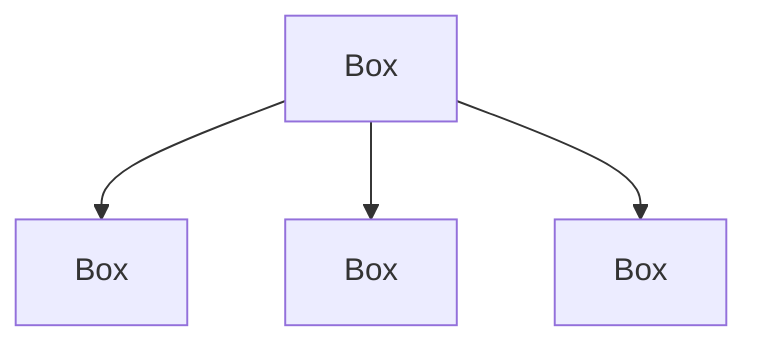

`Box<int>`와 `Box<float>`는 서로 다른 클래스 템플릿 특수화다. 템플릿이라는 이유만으로 둘 사이에 상속 관계나 암시적 변환이 생기지 않는다.

---

## 7. 타입이 아닌 템플릿 매개변수

템플릿은 타입 외에도 컴파일 시점의 값을 받을 수 있다. C++ 표준에서는 **non-type template parameter**라고 부르며, C++20 이후에는 *constant template parameter*라는 표현도 사용된다.

```cpp
#include <cstddef>

template <typename T, std::size_t N>
struct FixedBuffer
{
    T data[N];
};

FixedBuffer<std::uint8_t, 64> rx; // <cstdint> 포함 필요
```

`N`은 런타임 변수가 아니라 템플릿 인수로 주어진 값이다.

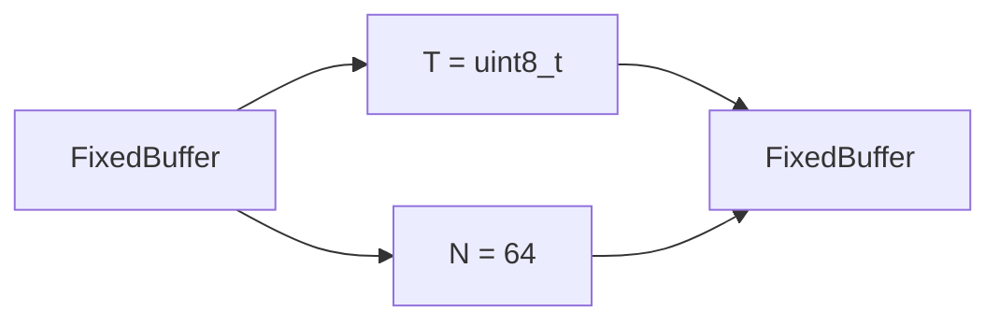

임베디드에서는 고정 크기 Buffer, Register 폭, 채널 수 등을 타입 수준에서 표현할 때 유용하다.

**주의:** C++20에서도 아무 객체나 non-type template argument로 사용할 수 있는 것은 아니다. 허용 타입과 상수 표현식 규칙을 만족해야 한다.

---

## 8. 기본 템플릿 인수

```cpp
template <typename T = int, std::size_t N = 16>
struct Storage
{
    T data[N];
};

Storage<> default_storage;
Storage<float, 8> float_storage;
```

기본 인수는 자주 사용하는 구성을 간결하게 표현하지만, 지나치게 많은 기본값은 API의 실제 구성을 파악하기 어렵게 만들 수 있다.

---

## 9. 명시적 특수화와 부분 특수화

### 명시적 특수화

특정 템플릿 인수에 대해 별도 정의를 제공한다.

```cpp
template <typename T>
struct TypeName
{
    static constexpr const char* value = "other";
};

template <>
struct TypeName<int>
{
    static constexpr const char* value = "int";
};
```

### 부분 특수화

클래스 템플릿에서는 인수의 **일부 패턴**에 대해 별도 정의를 제공할 수 있다.

```cpp
template <typename T>
struct IsPointer
{
    static constexpr bool value = false;
};

template <typename T>
struct IsPointer<T*>
{
    static constexpr bool value = true;
};
```

| 형태 | 의미 |
|---|---|
| 기본 템플릿 | 일반적인 경우 |
| 명시적 특수화 | 특정 인수 조합 |
| 부분 특수화 | 특정 인수 패턴 |

**함수 템플릿에는 부분 특수화를 할 수 없다.** 함수 템플릿에서는 오버로딩, 제약 조건 등으로 유사한 요구를 표현한다.

---

## 10. 오버로딩과 특수화의 차이

```cpp
template <typename T>
void process(T value);

void process(int value); // 일반 함수 오버로드
```

위의 `process(int)`는 함수 템플릿의 특수화가 아니라 별도의 일반 함수 오버로드다.

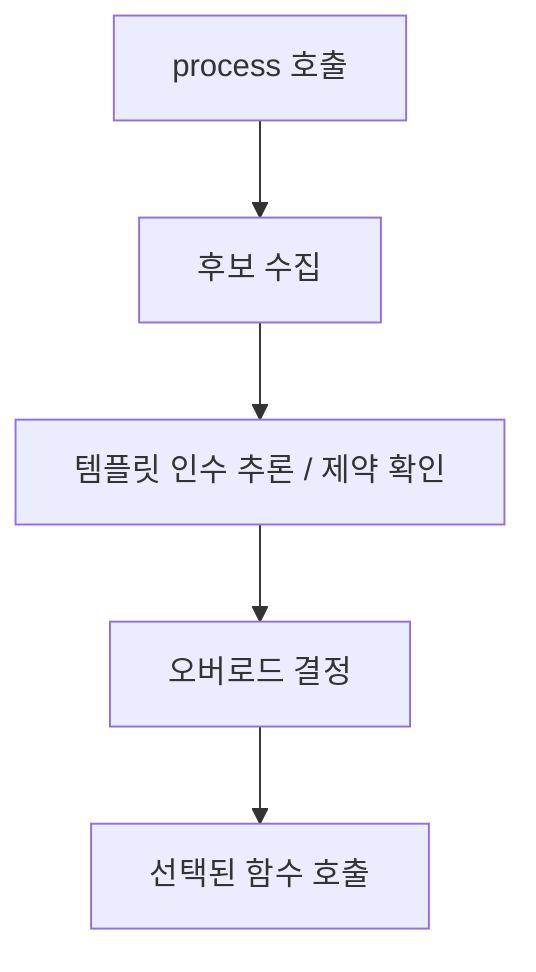

함수 템플릿, 일반 함수, 명시적 특수화가 함께 있으면 선택 규칙이 복잡해질 수 있으므로 **오버로딩과 특수화를 같은 개념으로 취급하지 않는다.**

---

## 11. 컴파일 시점 다형성과 런타임 다형성

| 관점 | 템플릿 중심 | 가상 함수 중심 |
|---|---|---|
| 동작 선택 | 구체 타입과 코드가 컴파일 과정에서 결정되는 경우가 많음 | 가상 호출의 최종 대상이 런타임에 결정될 수 있음 |
| 인터페이스 | 필요한 연산·제약 조건 | 공통 기반 클래스의 가상 함수 |
| 타입 관계 | 상속이 필수 아님 | 일반적으로 상속 관계 사용 |
| 코드 크기 | 특수화별 코드가 늘 수 있음 | 구현과 호출 구조에 따라 다름 |
| 임베디드 고려 | 정적 구성·최적화 기회 | 유연한 런타임 교체·추상화 |

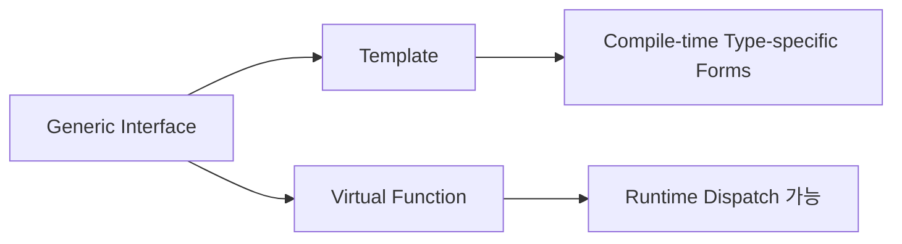

템플릿 호출이 언제나 더 빠르거나 가상 함수가 언제나 느리다고 단정하지 않는다. 최종 결과는 코드와 최적화 조건에 따라 달라진다.

---

## 12. 컴파일 타임과 `constexpr`

템플릿과 `constexpr`는 관련이 있지만 다른 기능이다.

```cpp
template <int N>
constexpr int square_constant()
{
    return N * N;
}

static_assert(square_constant<4>() == 16);
```

- **템플릿:** 타입·값에 따라 선언과 정의를 일반화한다.
- **`constexpr`:** 정해진 조건에서 상수 표현식으로 평가될 수 있음을 표현한다.
- **`consteval` (C++20):** 즉시 함수 호출에 컴파일 시점 평가를 요구한다.

템플릿 인스턴스화와 함수 실행 시점을 혼동하지 않는다.

---

## 13. Variadic Template

매개변수 팩(parameter pack)으로 가변 개수의 타입이나 값을 표현할 수 있다.

```cpp
template <typename... Ts>
struct TypeList {};

TypeList<int, float, char> types;
```

함수 예:

```cpp
template <typename... Args>
void forward_to_logger(Args&&... args)
{
    logger(std::forward<Args>(args)...); // logger 선언과 <utility> 필요
}
```

위 함수는 `logger`라는 호출 대상이 존재한다고 가정한 **개념 예시**다.

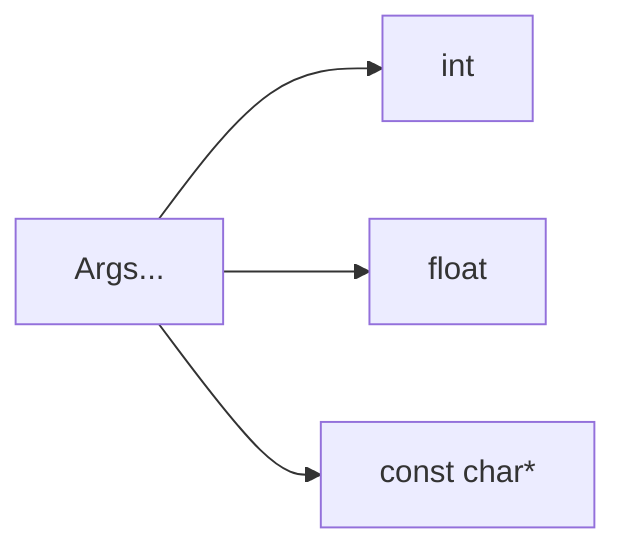

가변 템플릿은 `std::tuple`, `std::variant`, 범용 래퍼 등에서 사용된다.

---

## 14. Fold Expression (C++17)

매개변수 팩을 연산자로 결합한다.

```cpp
template <typename... Args>
auto sum(Args... args)
{
    return (args + ... + 0);
}
```

초깃값 `0`을 두었으므로 인수가 없는 경우에도 유효한 합계 표현식을 만들 수 있다. 실제로 어떤 타입과 연산이 허용되는지는 각 인수와 `+`의 정의에 달려 있다.

---

## 15. `auto`, `decltype`, 타입 추론

템플릿과 `auto`는 모두 타입 추론과 연결된다.

```cpp
template <typename T>
auto read_value(const T& source)
{
    return source.get();
}
```

`auto` 반환은 값으로 반환되는 형태이므로 참조 성질이 유지되지 않을 수 있다. 정확한 반환 타입과 참조를 보존해야 한다면 `decltype(auto)`를 고려한다.

```cpp
template <typename T>
decltype(auto) access(T& object)
{
    return (object); // T&로 추론
}
```

`auto`, `auto&`, `const auto&`, `auto&&`, `decltype(auto)`는 동일하지 않다. 이전 `Reference.md`의 값 범주와 참조 규칙이 여기서 다시 중요해진다.

---

## 16. Perfect Forwarding

범용 래퍼에서 전달받은 인수의 값 범주를 보존하려는 패턴이다.

```cpp
#include <utility>

template <typename F, typename... Args>
decltype(auto) invoke_wrapper(F&& function, Args&&... args)
{
    return std::forward<F>(function)(
        std::forward<Args>(args)...
    );
}
```

여기서 추론되는 `T&&` 형태는 **forwarding reference**가 될 수 있다. 모든 `&&`가 forwarding reference인 것은 아니다.


이 패턴은 생성자 래퍼, 컨테이너의 `emplace` 계열 API, 범용 함수 어댑터와 연결된다.

---

## 17. 타입 특성: `<type_traits>`

타입의 성질을 컴파일 시점에 질의하는 표준 라이브러리 기능이다.

```cpp
#include <type_traits>

static_assert(std::is_integral_v<int>);
static_assert(std::is_pointer_v<int*>);
static_assert(!std::is_pointer_v<int>);
```

대표 예:

| Trait | 의미 |
|---|---|
| `std::is_integral_v<T>` | 정수 계열 타입인지 |
| `std::is_pointer_v<T>` | 포인터 타입인지 |
| `std::is_same_v<A, B>` | 같은 타입인지 |
| `std::is_trivially_copyable_v<T>` | trivially copyable 타입인지 |
| `std::remove_reference_t<T>` | 참조를 제거한 타입 |

타입 특성은 **템플릿이 어떤 타입에 적용 가능한지 표현하거나 분기하는 도구**다.

---

## 18. `if constexpr` (C++17)

컴파일 시점 조건에 따라 템플릿의 서로 다른 코드 경로를 선택할 수 있다.

```cpp
#include <type_traits>

template <typename T>
void describe(const T& value)
{
    if constexpr (std::is_integral_v<T>)
    {
        handle_integer(value);
    }
    else
    {
        handle_other(value);
    }
}
```

`handle_integer`, `handle_other`는 별도 정의가 있다고 가정한다. 선택되지 않은 분기에도 문법 등 일정한 규칙이 적용되므로 `if constexpr`가 임의의 잘못된 코드를 무조건 허용하는 것은 아니다.

---

## 19. Concepts와 Constraints (C++20)

Concept은 템플릿 인수에 필요한 조건을 이름 붙여 표현한다.

```cpp
#include <concepts>

template <std::integral T>
T twice(T value)
{
    return value + value;
}
```

`std::integral`은 정수 계열 타입에 대한 표준 Concept이다.

`requires` 표현식으로 필요한 연산을 표현할 수도 있다.

```cpp
template <typename T>
concept Addable = requires(T a, T b)
{
    a + b;
};
```

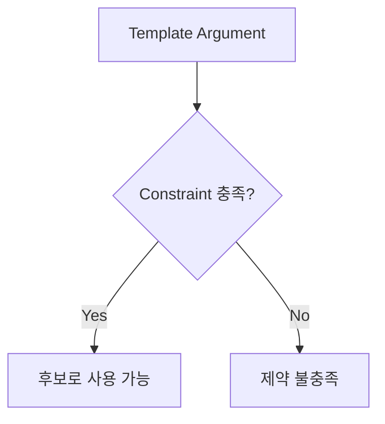

Concept은 인터페이스 요구사항을 문서화하고 진단을 개선하는 데 도움을 주지만, 함수의 런타임 동작을 자동으로 검증하지는 않는다.

---

## 20. SFINAE와 Concepts의 관계

SFINAE는 템플릿 인수 치환 과정에서 특정 종류의 실패가 발생하면 해당 템플릿 후보를 제거하는 C++ 규칙이다.

```text
Substitution Failure Is Not An Error
```

C++20 이전에는 `std::enable_if`, `void_t` 등을 사용해 조건부 참여를 표현하는 코드가 많았다. C++20에서는 Concepts와 `requires`가 많은 경우 의도를 더 직접적으로 표현한다.

단, **모든 컴파일 오류가 SFINAE로 처리되는 것은 아니다.** 치환의 즉시 문맥(immediate context) 등 구체적인 규칙이 있다.

---

## 21. 템플릿과 헤더 파일

일반적인 템플릿 정의는 인스턴스화가 필요한 Translation Unit에서 보여야 한다.

```text
main.cpp ─┐
          ├─ include → buffer.hpp
uart.cpp ─┘             ├─ Template Declaration
                       └─ Template Definition
```

따라서 함수/클래스 템플릿의 정의를 헤더에 두는 방식이 흔하다.

```cpp
// buffer.hpp
#pragma once

template <typename T>
T identity(T value)
{
    return value;
}
```

템플릿 정의를 `.cpp`에 숨기는 것이 불가능한 것은 아니다. **명시적 인스턴스화** 등을 사용해 필요한 타입을 제한적으로 제공할 수 있다.

---

## 22. 명시적 인스턴스화

```cpp
// identity.cpp
template <typename T>
T identity(T value)
{
    return value;
}

template int identity<int>(int);
```

이는 특정 인수에 대한 인스턴스화를 명시하는 형태다. 여러 파일에서 사용하려면 선언, 정의 가시성, 링크 관계를 일관되게 설계해야 한다.

임베디드 라이브러리에서는 지원 타입을 제한하거나 빌드 결과를 관리하는 전략과 연결될 수 있다.

---

## 23. 템플릿과 코드 크기

`Buffer<int, 16>`과 `Buffer<int, 32>`는 서로 다른 클래스 템플릿 특수화다. 각 특수화가 사용하는 함수도 별도 인스턴스화될 수 있다.

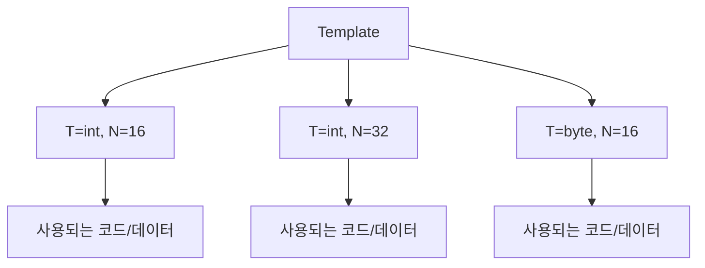

가능한 비용:

- 특수화 수 증가에 따른 컴파일 시간 증가
- 디버그 심볼 및 오류 메시지 복잡도 증가
- 코드 크기 증가 가능성

다만 실제 바이너리 크기는 최적화, 인라인화, 링커의 중복 제거, 사용 여부에 따라 달라진다. **템플릿을 사용하면 반드시 코드가 커진다고 단정하지 않는다.**

---

## 24. 임베디드 C++에서의 활용

### 고정 크기 Buffer

```cpp
#include <array>
#include <cstdint>

std::array<std::uint8_t, 128> rx_buffer{};
```

`std::array<T, N>`은 크기를 타입에 포함하는 표준 라이브러리 컨테이너다. 자체적으로 동적 메모리를 할당하지 않는다.

### 정책 기반 구성

```cpp
template <typename Transport>
class Protocol
{
public:
    explicit Protocol(Transport& transport)
        : transport_(transport) {}

    void send_byte(std::uint8_t value)
    {
        transport_.write(value);
    }

private:
    Transport& transport_;
};
```

`Transport`는 `write(std::uint8_t)`에 해당하는 호출을 지원해야 한다. C++20에서는 이러한 요구를 Concept으로 명시할 수 있다.

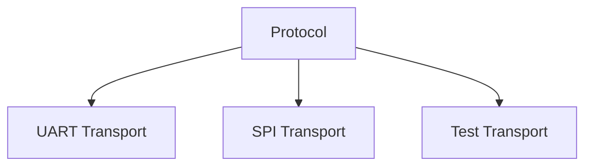

이 패턴은 상속 없이도 다양한 전송 방식을 결합할 수 있게 하지만, 구체 타입별 코드 생성과 컴파일 의존성을 고려해야 한다.

---

## 25. 템플릿은 Heap 사용을 의미하지 않는다

템플릿은 타입과 값의 일반화 기능이며 메모리 할당 정책이 아니다.

```cpp
std::array<int, 16> fixed{};  // 컨테이너 자체는 고정 크기
std::vector<int> dynamic;    // 원소 저장을 위한 동적 할당이 발생할 수 있음
```

두 타입 모두 템플릿을 사용하지만 메모리 특성은 다르다.

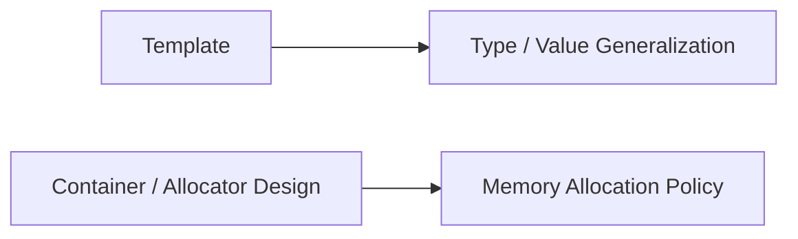

임베디드에서는 `std::array`, 정적 버퍼, 사용자 정의 Allocator, 프로젝트의 Heap 정책을 각각 구분해 판단한다.

---

## 26. C의 매크로·`void*`와 비교

C에서 일반화에 사용하던 대표 방식:

```c
#define SQUARE(x) ((x) * (x))
```

매크로는 타입별 코드를 작성하지 않아도 되지만, 인수의 중복 평가와 진단·스코프 등의 문제를 고려해야 한다.

```cpp
template <typename T>
T square(T x)
{
    return x * x;
}
```

C의 `void*` 기반 범용 인터페이스는 원소 크기와 변환을 별도로 관리해야 할 수 있다. C++ 템플릿은 타입 정보를 유지하면서 일반화할 수 있지만, 모든 타입에서 동일한 바이너리 인터페이스를 제공한다는 뜻은 아니다.

---

## 27. `Class.md`, `RAII.md`, `Reference.md`와 연결

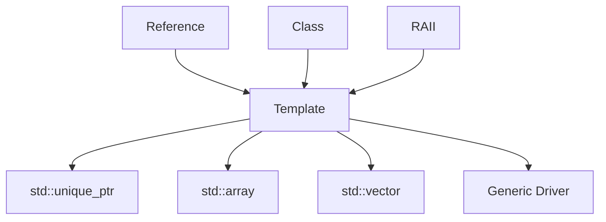

- `Reference`: `T&`, `const T&`, `T&&`, forwarding reference 이해의 기반
- `Class`: 클래스 템플릿과 특수화의 기반
- `RAII`: 자원을 소유하는 범용 클래스 설계와 연결
- `STL`: 컨테이너, Iterator, Algorithm의 핵심 기반

---

## 28. 자주 혼동하는 개념

| 오해 | 정확한 구분 |
|---|---|
| 템플릿은 컴파일 시점에 모든 계산을 끝낸다 | 템플릿 인스턴스화와 함수의 런타임 실행은 별개다 |
| `template <class T>`는 클래스만 받는다 | `class`는 타입 매개변수 표기다 |
| 템플릿은 반드시 Heap을 사용한다 | 할당 정책은 실제 타입과 구현에 달려 있다 |
| 함수 템플릿도 부분 특수화할 수 있다 | 함수 템플릿은 부분 특수화를 지원하지 않는다 |
| 모든 `T&&`는 forwarding reference다 | 추론 문맥 등 조건에 따라 다르다 |
| 템플릿 정의는 반드시 `.cpp`에 둔다 | 보통 사용 지점에서 정의가 보여야 한다 |
| Concept은 런타임 검증이다 | 템플릿 인수에 대한 컴파일 시점 제약이다 |
| 템플릿은 항상 더 빠르다 | 코드 생성과 최적화에 따라 달라진다 |

---

## 29. 개념 체크리스트

- [ ] 템플릿 정의·인수·인스턴스화의 차이를 이해한다.
- [ ] 함수 템플릿과 클래스 템플릿을 구분한다.
- [ ] `typename`과 타입 매개변수 위치의 `class`를 이해한다.
- [ ] 템플릿 인수 추론과 명시적 인수를 구분한다.
- [ ] 타입이 아닌 템플릿 매개변수의 용도를 이해한다.
- [ ] 명시적 특수화와 부분 특수화를 구분한다.
- [ ] 함수 템플릿의 부분 특수화가 지원되지 않음을 안다.
- [ ] 오버로딩과 특수화를 구분한다.
- [ ] 템플릿과 런타임 다형성의 차이를 설명할 수 있다.
- [ ] `constexpr`와 템플릿을 혼동하지 않는다.
- [ ] Variadic Template과 Fold Expression의 역할을 안다.
- [ ] `auto`, `decltype(auto)`, forwarding reference의 연결을 이해한다.
- [ ] `<type_traits>`, `if constexpr`, Concept의 목적을 구분한다.
- [ ] 템플릿 정의를 헤더에 두는 이유를 이해한다.
- [ ] 특수화 수와 코드 크기·컴파일 시간의 관계를 이해한다.
- [ ] 템플릿과 Heap 사용 여부가 별개임을 이해한다.

---

## 30. 핵심 요약

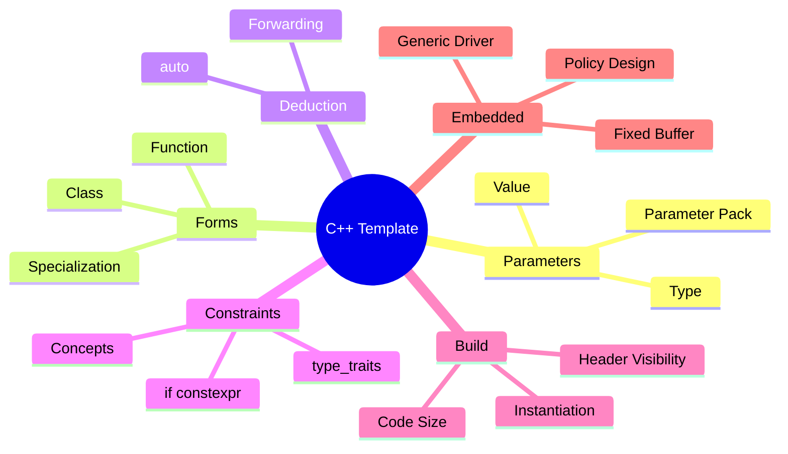

**기억할 핵심:** 템플릿은 *타입·컴파일 시점 값에 대한 일반화*다. `Reference`는 인수 전달을, `Class`는 객체 구조를, `RAII`는 자원 수명을 설명하며, 템플릿은 이 구조들을 여러 타입과 설정에 재사용할 수 있도록 연결한다.

**다음 문서:** `02_CPP/STL.md` — 컨테이너, Iterator, Algorithm, Range, 메모리·무효화 규칙을 개념 중심으로 정리한다.
