# STL — Standard Template Library

> **학습 목표:** C++ 표준 라이브러리의 컨테이너·반복자·알고리즘을 하나의 모델로 이해하고, 코딩 테스트와 임베디드 C++에서 선택 기준을 구분한다.
>
> 위치: `C_Cpp_Study/02_CPP/STL.md` · 기준: **C++20** · 구성: **개념 정리만 포함(실습·퀴즈 제외)**

---

## 1. STL이란?

STL(Standard Template Library)은 자료를 저장하는 **컨테이너(Container)**, 요소를 가리키고 순회하는 **반복자(Iterator)**, 자료를 처리하는 **알고리즘(Algorithm)** 등을 제네릭 프로그래밍으로 연결하는 라이브러리 설계다. 현재 C++ 표준 라이브러리는 전통적인 STL을 넘어 문자열, 스마트 포인터, 동시성, 입출력, ranges 등 더 넓은 기능을 포함한다.

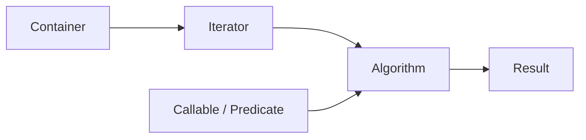

```cpp
#include <algorithm>
#include <vector>

std::vector<int> values{4, 1, 3, 2};
std::sort(values.begin(), values.end());
```

`std::vector`는 데이터를 소유하고, `begin()`/`end()`는 구간을 표현하며, `std::sort`는 그 구간을 처리한다.

---

## 2. STL의 공통 언어: 반열린 구간 `[first, last)`

많은 알고리즘은 시작 반복자를 포함하고 끝 반복자를 제외하는 구간을 받는다.

```text
[first, last)
 first 포함 · last 제외
```


장점은 빈 구간을 `first == last`로 나타낼 수 있고, 구간을 연결하거나 분할하기 쉽다는 점이다. `end()`를 역참조하면 안 된다.

---

## 3. 컨테이너의 분류

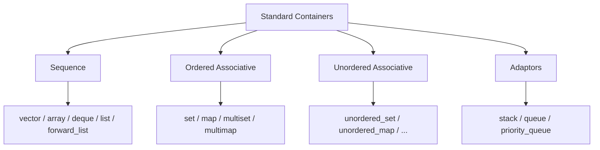

| 계열 | 대표 타입 | 기본 성질 |
|---|---|---|
| 시퀀스 | `vector`, `array`, `deque`, `list` | 요소의 순서가 핵심 |
| 정렬 연관 | `map`, `set` | 비교 기준에 따라 정렬 |
| 비정렬 연관 | `unordered_map`, `unordered_set` | 해시 기반 탐색 |
| 어댑터 | `stack`, `queue`, `priority_queue` | 제한된 연산 인터페이스 제공 |

---

## 4. `std::vector`: 기본 동적 배열

```cpp
#include <vector>

std::vector<int> data{10, 20, 30};
data.push_back(40);
```

`vector`는 요소를 **연속된 메모리**에 저장한다. 인덱스 접근이 빠르고 끝에 추가하기 좋지만, 중간 삽입·삭제는 뒤 요소 이동이 필요할 수 있다.

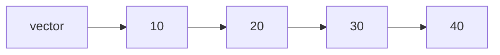

| 연산 | 대표적인 복잡도 |
|---|---|
| `operator[]`, `at()` | O(1) |
| `push_back()` | 분할 상환 O(1) |
| 끝 요소 삭제 | O(1) |
| 중간 삽입·삭제 | O(n) |
| 값 선형 탐색 | O(n) |

`operator[]`는 범위 검사를 하지 않는다. `at()`는 범위를 검사하고 잘못된 인덱스에서 `std::out_of_range`를 던진다(예외가 활성화된 환경 기준).

---

## 5. `size()`와 `capacity()`

- `size()`: 실제 저장된 요소 수.
- `capacity()`: 재할당 없이 수용 가능한 요소 수.
- `reserve(n)`: 적어도 `n`개를 수용할 용량 확보를 요청한다. `size()`는 바뀌지 않는다.
- `resize(n)`: 실제 요소 수를 `n`으로 변경한다.

```cpp
std::vector<int> v;
v.reserve(100);  // size == 0, capacity >= 100
v.resize(10);   // size == 10
```

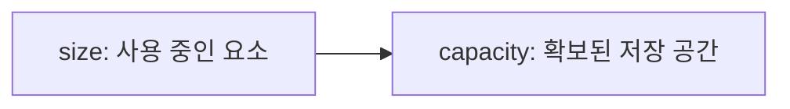

`reserve()`는 재할당 횟수를 줄일 수 있지만 이후 무제한 확장을 보장하지 않는다. 재할당이 일어나면 기존 요소를 가리키던 반복자·포인터·참조가 무효화된다.

---

## 6. `std::array`: 고정 크기 배열

```cpp
#include <array>

std::array<int, 4> values{1, 2, 3, 4};
```

크기가 타입에 포함되고, 객체 안에 요소 저장 공간을 가진다. `std::array` 자체가 동적 할당을 수행하지 않는다.

| 비교 | `std::array<T, N>` | `std::vector<T>` |
|---|---|---|
| 크기 | 컴파일 시 고정 | 실행 중 변경 가능 |
| 요소 저장 | 객체 내부 | 별도 동적 저장 공간 |
| 연속성 | 보장 | 보장 |
| 크기 증가 | 불가 | 가능 |

임베디드의 크기가 정해진 Buffer에서는 `std::array`가 적합할 수 있다. 다만 큰 지역 `std::array`는 Stack 사용량을 증가시킬 수 있다.

---

## 7. `std::deque`, `std::list`, `std::forward_list`

| 타입 | 핵심 구조적 특성 | 적합한 접근 패턴 |
|---|---|---|
| `deque` | 분할된 저장 공간, 양끝 확장 | 앞뒤 삽입·삭제, 인덱스 접근 |
| `list` | 이중 연결 리스트 | 위치를 알고 있을 때 삽입·삭제 |
| `forward_list` | 단일 연결 리스트 | 전방 순회, 이전 위치 기반 삽입·삭제 |

`deque`는 임의 접근을 지원하지만 `vector`처럼 전체 요소가 하나의 연속된 배열은 아니다. `list`의 중간 삽입·삭제가 O(1)이라는 설명은 **삽입·삭제할 위치의 반복자를 이미 알고 있을 때** 적용된다. 위치 탐색에는 별도 비용이 든다.

---

## 8. `std::map`과 `std::set`

```cpp
#include <map>
#include <set>

std::map<int, int> frequency;
frequency[7]++;

std::set<int> unique_values{3, 1, 3};
```

`map`은 고유한 Key에 값을 연결하고, `set`은 고유한 Key 자체를 저장한다. 정렬 연관 컨테이너의 주요 탐색·삽입·삭제는 일반적으로 O(log n)이다.

`map::operator[]`는 Key가 없으면 값을 기본 삽입할 수 있다. 단순 존재 확인에는 `find()` 또는 C++20 `contains()`를 사용한다.

```cpp
if (frequency.contains(7)) {
    // Key exists
}
```

`multimap`과 `multiset`은 중복 Key를 허용한다.

---

## 9. `std::unordered_map`과 `std::unordered_set`

```cpp
#include <unordered_map>

std::unordered_map<int, int> frequency;
frequency[42]++;
```

해시 기반이며 주요 탐색·삽입·삭제는 **평균 O(1)**, 최악에는 O(n)이 될 수 있다. 순회 순서는 정렬 순서도 삽입 순서도 보장하지 않는다.

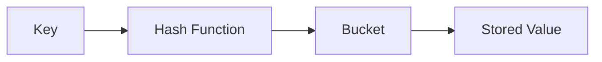

`reserve()`와 `max_load_factor()`는 해시 테이블의 재해시 동작과 관련된다. 재해시는 반복자를 무효화할 수 있으므로 순회 중 삽입할 때 주의한다.

---

## 10. `map`과 `unordered_map`의 선택 기준

| 기준 | `map` | `unordered_map` |
|---|---|---|
| Key 순서 | 정렬됨 | 보장 없음 |
| 주요 연산 | O(log n) | 평균 O(1), 최악 O(n) |
| 범위 탐색 | `lower_bound`, `upper_bound` | 정렬 기반 범위 탐색 없음 |
| 기반 | 비교 순서 | Hash + Equality |
| 반복자 무효화 | 삭제된 요소 중심 | 재해시에도 주의 |

정렬된 출력·구간 탐색이 필요하면 `map`, 순서가 필요 없고 해시 가능한 Key의 빈도 집계라면 `unordered_map`을 검토한다. 실제 성능은 데이터 크기, Key 타입, 메모리 할당, Cache 특성에 영향을 받는다.

---

## 11. 컨테이너 어댑터

```cpp
#include <stack>
#include <queue>

std::stack<int> st;
std::queue<int> q;
std::priority_queue<int> pq;
```

| 타입 | 꺼내는 기준 | 대표 연산 |
|---|---|---|
| `stack` | LIFO | `push`, `top`, `pop` |
| `queue` | FIFO | `push`, `front`, `pop` |
| `priority_queue` | 우선순위 | `push`, `top`, `pop` |

`priority_queue<int>`는 기본적으로 가장 큰 값이 `top()`에 온다. 최소 힙 형태는 다음과 같이 구성할 수 있다.

```cpp
#include <functional>
#include <vector>

std::priority_queue<int, std::vector<int>, std::greater<int>> min_heap;
```

어댑터는 일반적인 `begin()`/`end()` 순회 인터페이스를 제공하지 않는다.

---

## 12. 반복자(Iterator)

반복자는 컨테이너와 알고리즘을 연결하는 추상화다.

```cpp
for (auto it = values.begin(); it != values.end(); ++it) {
    // *it accesses the current element
}
```

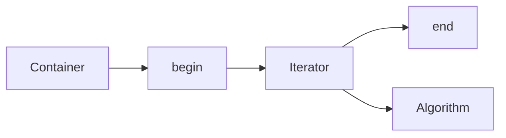

반복자 종류에 따라 허용되는 연산이 다르다. 모든 반복자에 `it + 1`이나 `it < end`를 사용할 수 있는 것은 아니다.

---

## 13. 반복자 범주

| 범주 | 핵심 기능 | 대표 예 |
|---|---|---|
| Input | 순차 읽기 | 입력 반복자 |
| Output | 순차 쓰기 | 출력 반복자 |
| Forward | 다중 순회 가능한 전방 이동 | `forward_list` |
| Bidirectional | 앞뒤 이동 | `list`, `map` |
| Random Access | `it + n`, 거리·순서 연산 | `vector`, `deque` |
| Contiguous (C++20) | 요소가 연속 저장됨 | `vector`의 일반 요소, `array` |

`std::sort`는 Random Access Iterator가 필요하므로 `std::list`에 직접 적용할 수 없다. `list`에는 자체 `sort()`가 있다.

---

## 14. 반복자·참조 무효화

컨테이너를 수정한 뒤 기존 반복자나 참조를 계속 사용해도 되는지 확인해야 한다.

| 동작 | 대표적인 주의점 |
|---|---|
| `vector` 재할당 | 모든 요소 반복자·포인터·참조 무효화 |
| `vector` 중간 삽입/삭제 | 위치 이후 요소 및 `end()` 무효화 규칙 주의 |
| `deque` 삽입/삭제 | 위치와 동작에 따른 복잡한 규칙 확인 |
| `list` 삽입 | 기존 요소의 반복자·참조 유지 |
| `map` 삽입 | 기존 요소의 반복자·참조 유지 |
| `unordered_map` 재해시 | 반복자 무효화; 기존 요소 참조·포인터는 유지 |

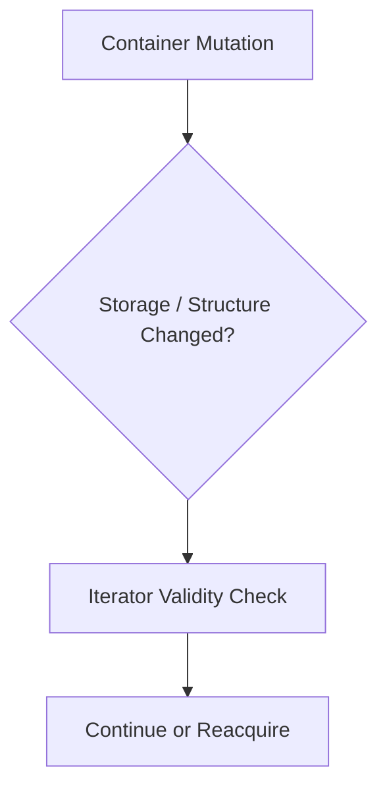

삭제된 요소에 대한 반복자·참조는 사용할 수 없다. 실제 규칙은 컨테이너와 연산별로 확인한다.

---

## 15. Range-based `for`와 참조

```cpp
for (int value : values) { /* copy */ }
for (int& value : values) { /* mutable reference */ }
for (const int& value : values) { /* read-only reference */ }
```

큰 객체의 불필요한 복사를 피하려면 `const auto&`가 유용하다. 요소를 수정할 때는 `auto&`를 사용한다.

```cpp
for (auto& value : values) {
    value *= 2;
}
```

`std::vector<bool>`은 특수화되어 요소 접근이 일반 `bool&`와 다를 수 있다. 모든 컨테이너의 `operator[]`가 진짜 요소 참조를 반환한다고 가정하지 않는다.

---

## 16. 알고리즘과 Callable

```cpp
#include <algorithm>

std::sort(values.begin(), values.end());
```

알고리즘은 일반적으로 컨테이너를 직접 받는 대신 반복자 구간을 받는다. 조건을 받는 알고리즘에는 Lambda, 함수 객체 또는 함수 포인터 등을 전달할 수 있다.

```cpp
std::sort(values.begin(), values.end(),
          [](int a, int b) { return a > b; });
```

정렬 비교 함수는 **strict weak ordering**을 만족해야 한다. 예를 들어 `a <= b`는 동등한 값에서 참이므로 정렬 비교 함수로 부적절하다.

---

## 17. 자주 사용하는 알고리즘

| 알고리즘 | 역할 | 헤더 |
|---|---|---|
| `sort` | 정렬 | `<algorithm>` |
| `stable_sort` | 동등 요소의 기존 순서 유지 | `<algorithm>` |
| `find` | 값 탐색 | `<algorithm>` |
| `find_if` | 조건 탐색 | `<algorithm>` |
| `count`, `count_if` | 개수 계산 | `<algorithm>` |
| `all_of`, `any_of`, `none_of` | 조건 검사 | `<algorithm>` |
| `reverse` | 순서 반전 | `<algorithm>` |
| `min_element`, `max_element` | 최소·최대 위치 | `<algorithm>` |
| `accumulate` | 누적 계산 | `<numeric>` |
| `iota` | 연속 값 채우기 | `<numeric>` |

```cpp
#include <numeric>

long long sum = std::accumulate(values.begin(), values.end(), 0LL);
```

`accumulate`의 초기값 타입이 누적 결과 타입에 영향을 준다. 합이 커질 수 있으면 `0LL`처럼 적절한 타입을 사용한다.

---

## 18. 이진 탐색 알고리즘

정렬된 구간에서 자주 사용하는 함수:

```cpp
std::binary_search(first, last, key);
std::lower_bound(first, last, key);
std::upper_bound(first, last, key);
```

| 함수 | 의미 |
|---|---|
| `binary_search` | 동등한 값 존재 여부 |
| `lower_bound` | `key` 이상인 첫 위치(기본 오름차순 비교) |
| `upper_bound` | `key` 초과인 첫 위치(기본 오름차순 비교) |

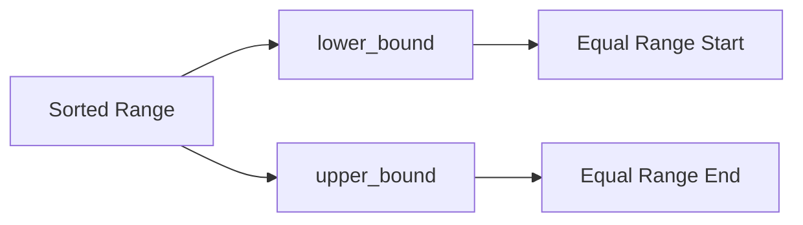

**전제조건이 중요하다.** 해당 비교 기준으로 구간이 적절히 정렬/분할되어 있어야 한다. `vector`의 Random Access Iterator에서는 O(log n) 비교와 이동이 가능하지만, 비임의 접근 반복자에서는 반복자 이동 비용이 추가될 수 있다.

---

## 19. `remove`–`erase` 관용구

`std::remove`는 컨테이너의 크기를 줄이지 않는다. 유지할 요소를 앞으로 옮기고 새 논리적 끝을 반환한다.

```cpp
values.erase(
    std::remove(values.begin(), values.end(), 0),
    values.end()
);
```

C++20에서는 `std::erase`와 `std::erase_if`가 지원되는 컨테이너에 대해 더 간결한 인터페이스를 제공한다.

```cpp
std::erase(values, 0);
```

`std::remove`와 컨테이너의 `erase`는 이름이 비슷하지만 서로 다른 역할이다.

---

## 20. 문자열: `std::string`

```cpp
#include <string>

std::string text = "embedded";
text += " C++";
```

`std::string`은 문자열의 크기와 저장 공간을 관리한다. `size()`는 문자열의 문자 수가 아니라 저장된 `char` 요소 수(바이트 수)다. UTF-8 문자열에서는 사용자에게 보이는 글자 수와 다를 수 있다.

`c_str()`는 널 종료된 C 문자열 인터페이스를 제공한다. 문자열이 변경되면 이전에 얻은 포인터의 유효성을 다시 확인해야 한다.

---

## 21. 비소유 뷰: `std::string_view`, `std::span`

```cpp
#include <string_view>
#include <span>

std::string_view name = "UART";
std::span<const int> view(values);
```

- `string_view`: 문자 시퀀스를 **소유하지 않고** 참조한다.
- `span`: 연속된 요소 구간을 **소유하지 않고** 참조한다.


원본 저장 공간의 수명이 뷰보다 짧으면 Dangling View가 생긴다. 뷰를 반환하거나 장기 저장할 때 특히 중요하다.

---

## 22. C++20 Ranges

전통적인 반복자 쌍을 대신해 Range를 직접 다루는 API를 제공한다.

```cpp
#include <algorithm>
#include <ranges>

std::ranges::sort(values);
```

View를 이용하면 데이터를 즉시 복사하지 않고 변환된 구간을 표현할 수 있다.

```cpp
#include <ranges>

auto positive = values
    | std::views::filter([](int x) { return x > 0; });
```

View 역시 원본 데이터의 수명과 변경에 영향을 받을 수 있다. 모든 View가 데이터를 소유하거나 결과를 미리 계산하는 것은 아니다.

---

## 23. `std::pair`, `std::tuple`, 구조 분해

```cpp
#include <utility>

std::pair<int, int> point{3, 5};
auto [x, y] = point;
```

`pair`는 두 값을, `tuple`은 여러 값을 묶는다. 구조 분해에서 `auto [x, y]`는 원본 요소를 단순히 별칭으로 만드는 것과 다르다. 참조가 필요하면 `auto& [x, y]`를 고려한다.

```cpp
for (const auto& [key, value] : frequency) {
    // read key and value
}
```

---

## 24. 복잡도는 컨테이너 선택의 출발점

| 요구사항 | 검토할 타입/도구 |
|---|---|
| 인덱스 기반 순회 | `vector`, `array` |
| 크기 고정, 동적 할당 회피 | `array` |
| 앞뒤 추가·삭제 | `deque` |
| 정렬된 Key와 범위 탐색 | `map`, `set` |
| 빈도 집계 | `unordered_map` 또는 작은 범위의 배열 |
| 중복 제거 | `set`, `unordered_set`, 정렬 후 `unique` |
| BFS 대기열 | `queue` |
| DFS/괄호 처리 | `stack` |
| 우선순위 기반 처리 | `priority_queue` |
| 정렬된 배열 탐색 | `lower_bound` |

Big-O는 중요한 기준이지만 실제 성능은 메모리 배치, 동적 할당, 상수 비용, 입력 크기에도 좌우된다.

---

## 25. 코딩 테스트에서의 STL

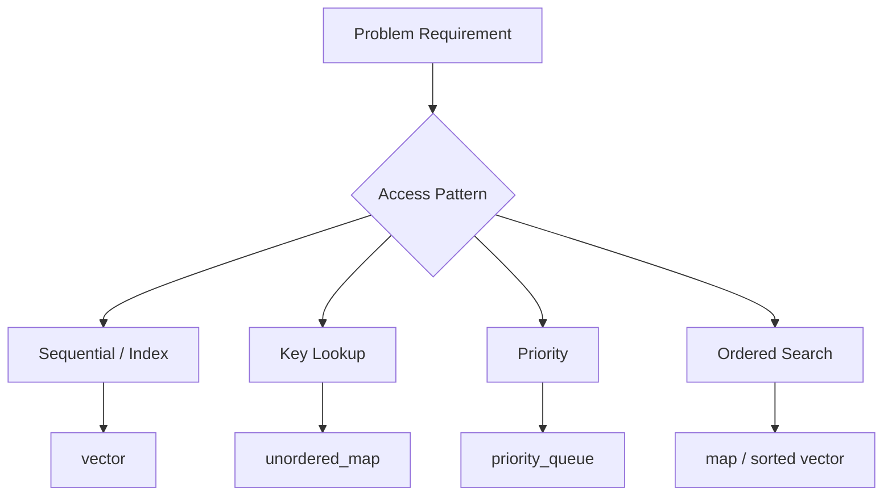

코딩 테스트에서는 STL이 자료구조 구현 시간을 줄여 알고리즘 설계에 집중하게 해 준다. 다만 `unordered_map`을 항상 O(1)이라고 가정하거나, 정렬되지 않은 구간에 `lower_bound`를 적용하거나, `vector` 중간 삽입을 O(1)로 취급하는 오류는 피해야 한다.

---

## 26. 임베디드 C++에서의 STL

임베디드에서도 STL을 사용할 수 있지만 **대상 Toolchain과 표준 라이브러리 구현, Heap 정책, 예외 정책, 코드 크기, 실시간 요구사항**을 함께 검토해야 한다.

| 관점 | 검토 내용 |
|---|---|
| 메모리 | 정적/동적 저장 공간, 최대 사용량 |
| 시간 | 최악 실행 시간, 재할당 가능성 |
| 코드 크기 | 템플릿 인스턴스화, 링크 결과 |
| 예외 | 예외 사용 가능 여부와 오류 처리 정책 |
| 동시성 | ISR/Task 공유와 동기화 |
| API | 버퍼 소유권과 수명 |

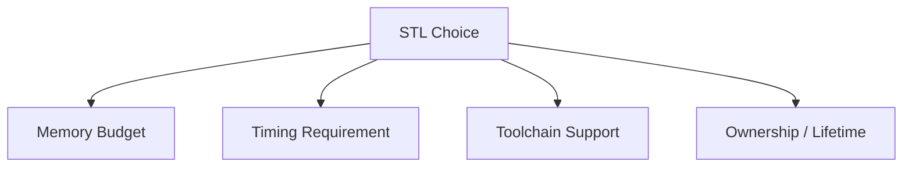

`std::array`, `std::span`, 알고리즘은 고정 크기 데이터와 잘 맞을 수 있다. `std::vector`나 노드 기반 컨테이너는 필요에 따라 동적 할당이 발생할 수 있다. **STL 전체가 임베디드에서 금지되는 것도, 아무 검토 없이 사용 가능한 것도 아니다.**

---

## 27. STL과 RAII의 연결

컨테이너는 자신의 요소와 저장 공간을 관리한다. 범위를 벗어나 소멸자가 실행되면 컨테이너가 소유한 자원을 정리한다.

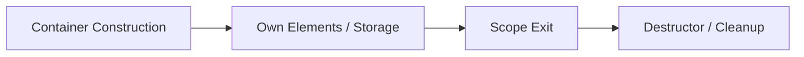

이는 이전 `RAII.md`의 **자원 수명을 객체 수명에 연결한다**는 원리와 이어진다. 단, 컨테이너에 `T*`를 저장하면 그 포인터가 가리키는 객체까지 자동으로 삭제하는 것은 아니다. 소유권이 필요하면 `std::unique_ptr<T>` 등 적절한 타입을 사용한다.

---

## 28. STL과 Template의 연결

```cpp
std::vector<int>
std::vector<float>
std::map<int, std::string>
```

하나의 컨테이너 템플릿을 다양한 타입으로 인스턴스화할 수 있다. 알고리즘도 반복자와 Callable의 요구사항을 만족하는 다양한 타입에 적용된다.

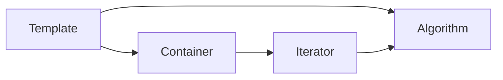

STL은 `Template.md`에서 배운 제네릭 프로그래밍이 실제 라이브러리 구조로 구현된 대표 사례다.

---

## 29. 자주 혼동하는 개념

| 혼동 | 구분 |
|---|---|
| `size` vs `capacity` | 요소 수 vs 확보된 용량 |
| `reserve` vs `resize` | 용량 확보 vs 요소 수 변경 |
| `map` vs `unordered_map` | 정렬 기반 vs 해시 기반 |
| `array` vs `vector` | 고정 크기 vs 가변 크기 |
| `remove` vs `erase` | 요소 재배치 vs 컨테이너에서 제거 |
| `begin` vs `end` | 첫 요소 vs 마지막 다음 위치 |
| `operator[]` vs `at` | 범위 검사 없음 vs 범위 검사 |
| `string` vs `string_view` | 소유 문자열 vs 비소유 뷰 |
| `vector` vs `span` | 소유 컨테이너 vs 비소유 연속 구간 |
| `sort` vs `stable_sort` | 일반 정렬 vs 동등 요소의 상대 순서 유지 |

---

## 30. 핵심 연결도

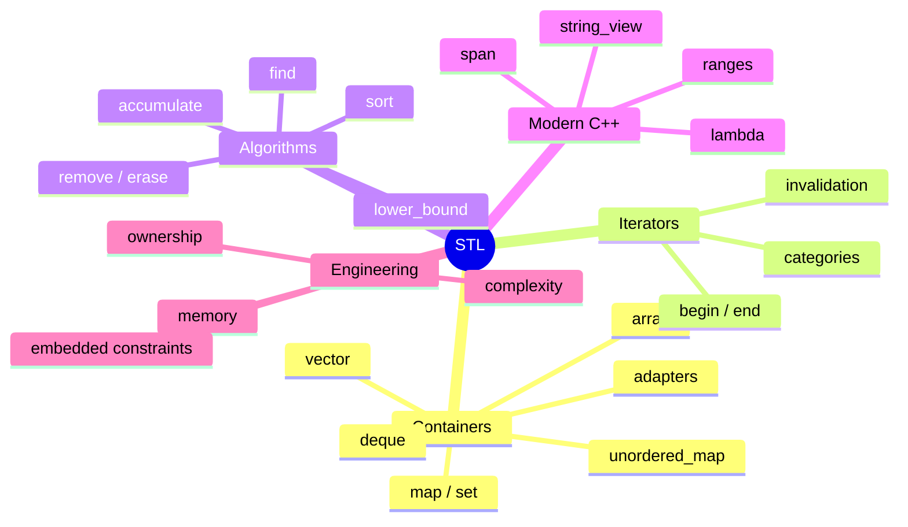

**핵심 정리:** STL은 컨테이너를 암기하는 주제가 아니라 **저장 방식 → 반복자 능력 → 알고리즘 요구사항 → 복잡도 → 수명·무효화 → 실행 환경의 제약**을 연결해서 이해하는 주제다.

---

## 31. 학습 진행 상태

```text
C_Cpp_Study/
└── 02_CPP/
    ├── Reference.md      ✓
    ├── Class.md          ✓
    ├── RAII.md           ✓
    ├── Template.md       ✓
    ├── STL.md            ← 현재
    └── Smart_Pointer.md
```

**다음 문서:** `02_CPP/Smart_Pointer.md` — `unique_ptr`, `shared_ptr`, `weak_ptr`, 소유권 이전, 참조 카운팅, 순환 참조, 커스텀 삭제자, 임베디드에서의 사용 기준.
