# Interrupt

> **학습 위치:** `C_Cpp_Study/05_Embedded/Interrupt.md`  
> **핵심 연결:** `Peripheral Event → Interrupt Controller → CPU → ISR → Main Loop / RTOS Task`  
> **구성:** 개념 정리 전용. 실습·퀴즈는 포함하지 않는다.

---

## 1. 한 문장 정의

**Interrupt(인터럽트)는 하드웨어 또는 시스템 이벤트에 대응하기 위해 CPU가 현재 실행 흐름을 일시적으로 변경하고 지정된 처리 루틴을 실행하도록 하는 메커니즘이다.**

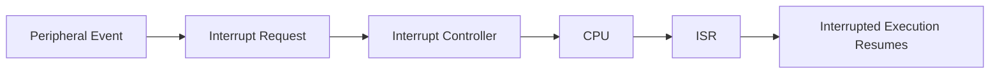

인터럽트는 **이벤트 전달 방식**이며, ISR은 그 이벤트를 처리하는 **코드**다.

## 2. Polling과 Interrupt

| 구분 | Polling | Interrupt |
|---|---|---|
| 이벤트 감지 | CPU가 상태를 반복 확인 | 하드웨어가 요청 전달 |
| 실행 구조 | 확인 루프 | 현재 흐름 중단 후 ISR |
| CPU 사용 | 대기 중 CPU를 점유할 수 있음 | 이벤트 사이에 다른 작업 가능 |
| 고려사항 | 확인 주기, Timeout | 우선순위, 지연, 공유 상태 |
| 적합성 | 간단한 초기화·짧은 대기 | 비동기 이벤트·주기적 처리 |

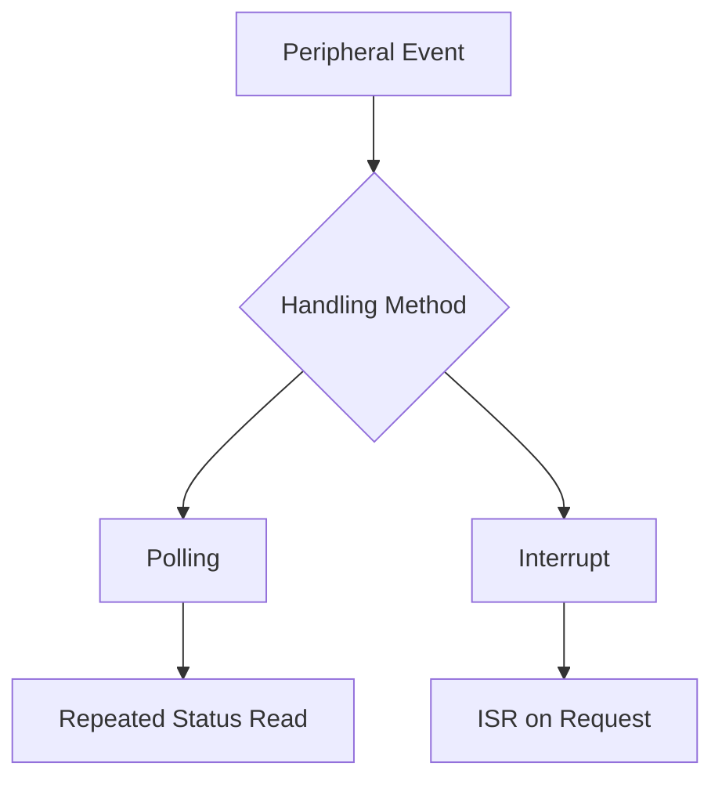

두 방식은 함께 사용할 수도 있다. 예를 들어 초기화 완료는 Polling으로 확인하고 수신 데이터는 Interrupt로 처리할 수 있다.

## 3. Interrupt 발생 흐름

일반적인 MCU에서의 개념적인 순서:

1. Peripheral에 이벤트가 발생한다.
2. Peripheral의 Status/Pending Flag가 설정될 수 있다.
3. Interrupt Enable 및 Controller 설정에 따라 CPU에 요청이 전달된다.
4. CPU가 현재 실행 상태를 보존하고 ISR로 진입한다.
5. ISR이 원인을 확인하고 장치별 규칙에 따라 이벤트를 처리·확인(acknowledge)한다.
6. ISR 종료 후 중단했던 실행으로 복귀한다.

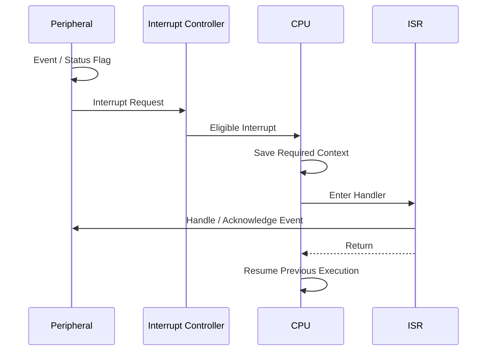

정확한 진입·복귀 순서와 저장되는 Context는 CPU 아키텍처에 따라 다르다.

## 4. Interrupt의 주요 구성 요소

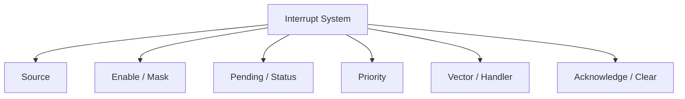

| 구성 요소 | 의미 |
|---|---|
| Source | UART RX, Timer Update, GPIO Edge 등의 발생 원인 |
| Enable | 해당 이벤트의 Interrupt 요청 허용 여부 |
| Pending | 아직 처리되지 않은 요청의 존재 여부 |
| Priority | 여러 요청 사이의 처리 우선순위 |
| Vector | 해당 Interrupt에 대응하는 Handler 진입 정보 |
| ISR/Handler | 실제 처리 코드 |
| Acknowledge | 이벤트 처리를 하드웨어에 알리는 절차 |

**Status Flag, Peripheral Interrupt Enable, Interrupt Controller Enable, CPU 전역 마스크는 서로 다른 계층**일 수 있다.

## 5. Interrupt Vector Table

Interrupt Vector Table은 예외/인터럽트별 Handler 주소 또는 아키텍처가 요구하는 진입 정보를 담는 구조다.

```text
Vector Table (개념)
├── Reset
├── Fault
├── Timer Interrupt
├── UART Interrupt
└── GPIO Interrupt
```

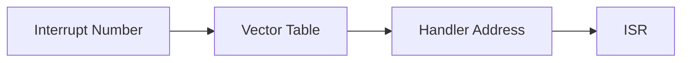

Vector Table의 위치·형식·재배치 가능 여부는 MCU 및 Boot 구조에 따라 달라진다.

## 6. ISR(Interrupt Service Routine)

ISR은 Interrupt에 대응해 실행되는 함수 또는 Handler다.

```c
/* 이름·선언 방식은 MCU SDK 및 Toolchain에 따라 다름 */
void UART_IRQHandler(void)
{
    /* Check source, handle event, acknowledge as documented. */
}
```

일반 C 함수처럼 보일 수 있지만, 실제 ISR의 호출 규약과 진입·복귀 처리는 대상 아키텍처·컴파일러·런타임이 정의한다. 임의의 일반 함수 이름만으로 Interrupt에 연결되지는 않는다.

## 7. ISR 설계 원칙

ISR은 보통 **시간에 민감한 최소 작업**을 처리하고 나머지는 Main Loop나 Task로 넘기도록 설계한다.


ISR에서 주의할 요소:

- 장시간 Blocking과 무한 대기
- Interrupt 문맥에서 허용되지 않는 RTOS API
- 재진입 가능성이 없는 함수 호출
- 큰 Stack 사용량
- 공유 데이터의 경쟁 상태
- 처리하지 않은 Interrupt Source로 인한 반복 진입

“ISR은 무조건 한 줄이어야 한다”는 규칙은 아니다. **Deadline과 Worst-case 실행 시간을 충족하는가**가 중요하다.

## 8. Interrupt Latency

**Interrupt Latency**는 이벤트 또는 요청이 발생한 시점부터 ISR이 실제 실행되기까지의 지연을 뜻한다. 측정 기준은 문맥에 따라 명시해야 한다.


영향 요소에는 현재 실행 중인 명령, Interrupt Mask, 높은 우선순위 ISR, 아키텍처의 예외 진입 비용, 메모리 지연 등이 있다.

| 용어 | 의미 |
|---|---|
| Latency | 이벤트/요청부터 ISR 시작까지의 지연 |
| ISR Execution Time | ISR 자체의 실행 시간 |
| Response Time | 정의한 이벤트부터 요구 동작까지의 전체 시간 |
| Jitter | 반복 이벤트 간 처리 시점 변동 |

이 네 용어를 동일하게 취급하지 않는다.

## 9. Interrupt Priority

여러 Interrupt가 동시에 또는 근접해 발생하면 Controller와 CPU의 우선순위 규칙에 따라 처리 순서가 정해진다.

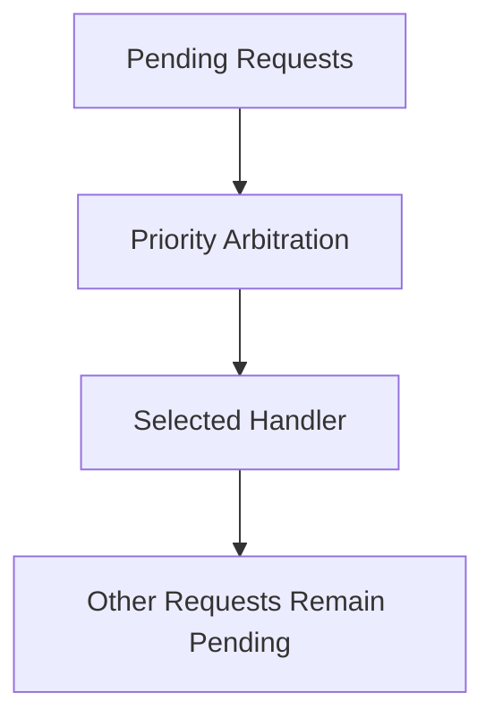

우선순위 숫자가 작을수록 높은지, 클수록 높은지는 플랫폼에 따라 다르다. ARM Cortex-M의 NVIC 규칙을 다른 MCU에 일반화하지 않는다.

## 10. Nesting과 Preemption

**Nesting**은 ISR 실행 중 다른 Interrupt가 들어와 중첩 처리되는 상황이다. **Preemption**은 높은 우선순위의 처리 흐름이 현재 실행을 선점하는 것이다.

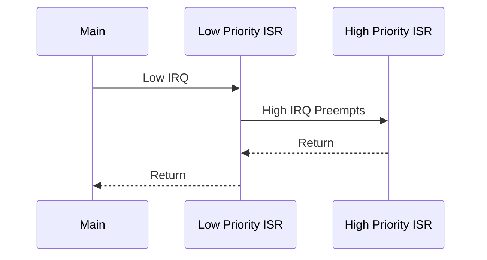

모든 MCU가 동일한 Nesting 모델을 제공하지 않으며, Priority 설정·Mask 상태·CPU 구조에 따라 동작이 달라진다.

## 11. Pending, Enable, Mask의 차이

- **Pending:** 이벤트 요청이 처리 대기 중임을 나타낼 수 있다.
- **Enable:** 해당 Source 또는 Interrupt Line의 전달을 허용한다.
- **Mask:** 특정 범위의 Interrupt 처리를 일시적으로 막는다.


Interrupt를 Disable해도 Peripheral의 Status Flag나 Pending 상태가 남는지 여부는 하드웨어별로 확인해야 한다.

## 12. Interrupt Flag의 Clear/Acknowledge

Register 문서에 따라 다음 방식이 사용될 수 있다.

| 방식 | 의미 |
|---|---|
| W1C | 1을 써서 해당 Flag Clear |
| Read-to-Clear | 읽기 자체가 상태 변경 |
| 특정 순서 | Status Read 후 Data Read 등 |
| 별도 Clear Register | 전용 Register에 쓰기 |
| 자동 Clear | 특정 하드웨어 이벤트에 의해 Clear |

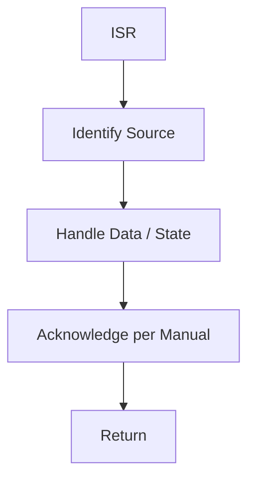

**무조건 ISR 시작 시 Flag를 Clear하거나 무조건 끝에서 Clear하는 보편 규칙은 없다.** 데이터 손실·재진입·이벤트 누락을 막으려면 Peripheral별 순서를 따른다.

## 13. Interrupt Storm

Interrupt Source가 제대로 처리되지 않거나 Flag가 남아 있으면 ISR이 반복 진입할 수 있다.

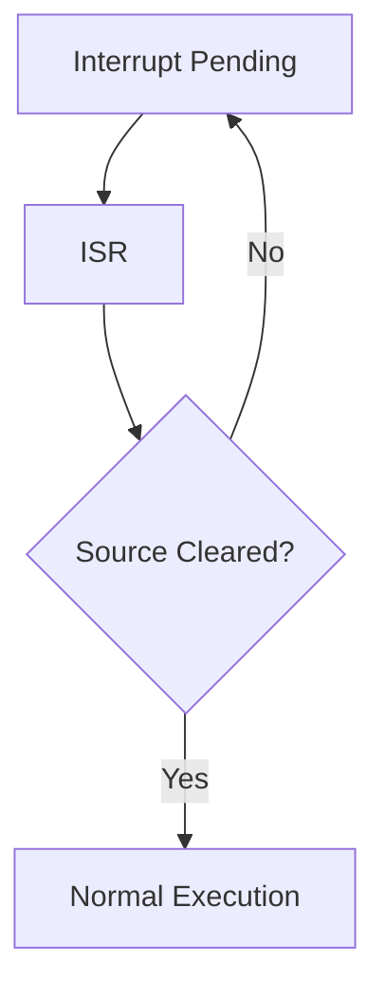

원인은 Flag 처리 누락뿐 아니라 계속 발생하는 Hardware 조건, 잘못된 Trigger 설정, 오류 상태 등이 될 수 있다.

## 14. Edge-triggered와 Level-triggered

| 유형 | 개념 |
|---|---|
| Edge-triggered | 신호의 상승/하강 등 변화에 반응 |
| Level-triggered | 신호가 특정 수준인 동안 요청 조건 유지 가능 |

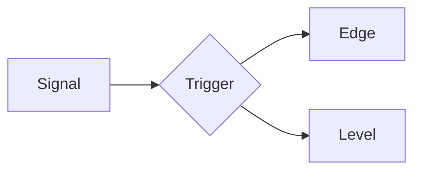

Level-triggered 요청에서는 원인 조건이 유지되는 한 다시 요청될 수 있다. Edge-triggered 요청에서도 Pending 보존과 이벤트 병합 방식은 장치별로 다르다.

## 15. ISR과 공유 데이터

Main과 ISR이 같은 데이터를 접근하면 **비동기 실행에 따른 경쟁 상태**를 고려해야 한다.

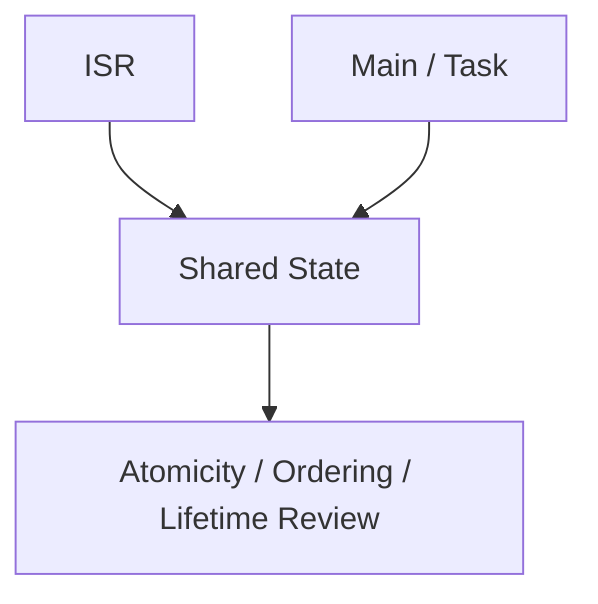

대표 공유 데이터:

```text
Event Flag
Event Counter
Ring Buffer Index
Received Data
Peripheral State
```

## 16. `volatile`의 역할과 한계

```c
static volatile uint32_t event_flag;
```

`volatile`은 ISR 등 외부 요인으로 변경될 수 있는 객체의 접근 의미를 표현하는 데 사용될 수 있다.

그러나:

```text
volatile ≠ Atomicity
volatile ≠ Mutual Exclusion
volatile ≠ Inter-thread Synchronization
volatile ≠ Hardware Memory Barrier
```

특히 C11 Thread 사이에서 `volatile` 일반 객체를 동기화 없이 공유하면 Data Race가 발생할 수 있다. ISO C의 Signal Handler 규칙과 MCU의 Hardware ISR 규칙도 구분해야 한다.

## 17. Atomicity와 데이터 폭

8-bit MCU에서 32-bit 값을 읽거나 쓸 때 여러 기계 명령이 필요할 수 있다. 반대로 특정 MCU에서는 정렬된 특정 폭의 접근이 원자적일 수 있다.

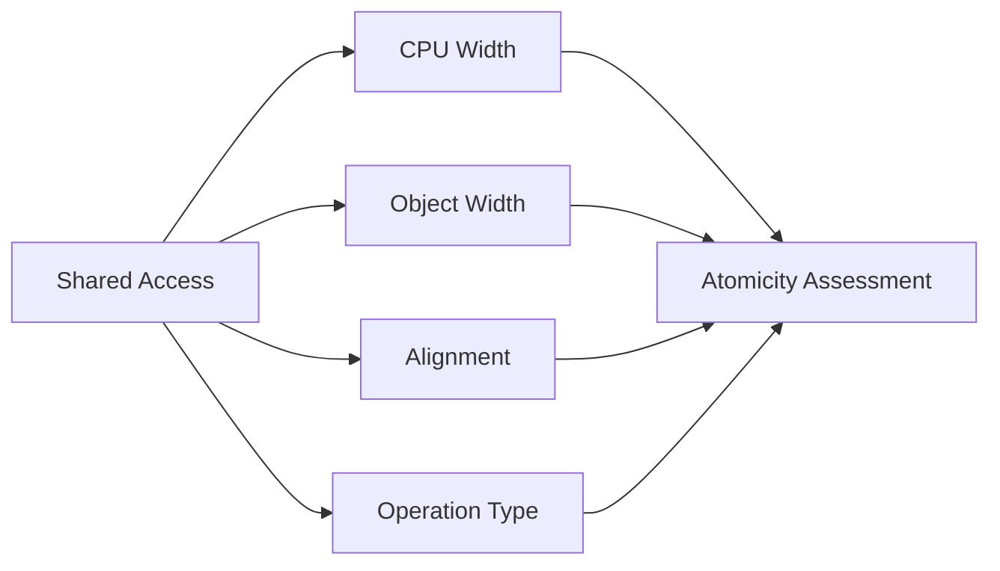

`counter++`처럼 Read-Modify-Write를 포함한 연산은 단순 Load/Store와 별도로 분석해야 한다.

## 18. Lost Update와 Lost Event

두 실행 흐름이 같은 Counter를 증가시키면 갱신이 유실될 수 있다.

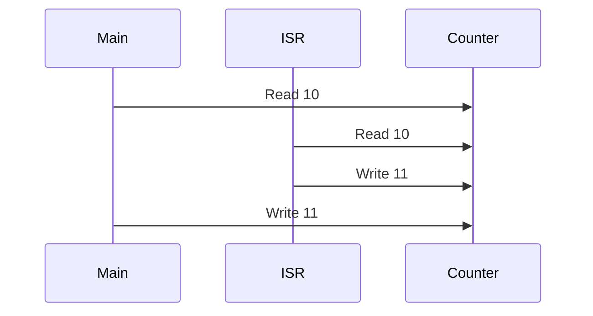

단일 Flag도 여러 이벤트를 구별하지 못할 수 있다.

```text
Event 1 → flag = 1
Event 2 → flag = 1
Main    → flag = 0
```

이벤트 **발생 여부**만 필요하다면 Flag가 적합할 수 있지만, **발생 횟수나 개별 데이터**가 중요하다면 Counter, Queue, Ring Buffer 등 별도 설계가 필요하다.

## 19. Critical Section

Critical Section은 공유 상태를 일관되게 다루기 위해 다른 실행 주체의 간섭을 제한하는 구간이다.

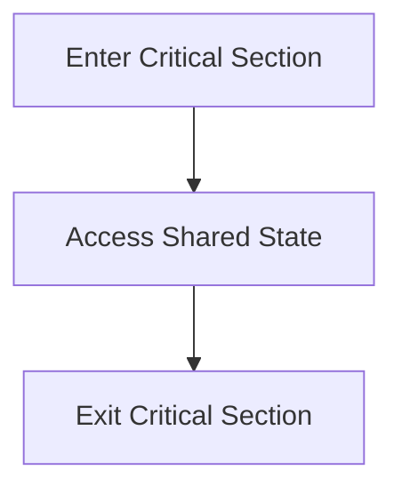

Bare-metal에서는 특정 Interrupt Masking이 한 방법일 수 있다. 다만:

- 모든 CPU Core나 DMA를 멈추는 것은 아니다.
- 높은 우선순위·Non-maskable Interrupt는 별도 규칙이 있을 수 있다.
- Critical Section이 길면 Interrupt Latency가 증가한다.
- 이전 Interrupt Mask 상태를 적절히 복원해야 한다.

## 20. Atomic과 RTOS Primitive

환경에 따라 사용할 수 있는 도구:

| 도구 | 주된 목적 |
|---|---|
| 지원되는 Atomic Operation | 특정 공유 연산의 원자성·순서 |
| Interrupt Masking | 해당 CPU/Interrupt 범위의 간섭 제한 |
| RTOS Queue | ISR과 Task 사이의 데이터 전달 |
| RTOS Semaphore/Notification | Task 깨우기·이벤트 전달 |
| Mutex | Task 사이의 상호 배제 |

C11 `_Atomic`이 모든 타깃에서 Lock-free이거나 ISR-safe인 것은 아니다. ISR에서 사용할 수 있는 Atomic/RTOS API는 플랫폼 문서를 확인한다. 일반 Mutex는 ISR에서 사용할 수 없거나 부적절한 경우가 많다.

## 21. Deferred Processing

ISR에서 필요한 최소 처리를 수행한 뒤 무거운 작업을 다른 문맥으로 미루는 구조다.


장점은 ISR 실행 시간을 제한하고 다른 Interrupt의 응답성을 확보하기 쉽다는 것이다. 단, Buffer 용량과 Producer/Consumer 동기화가 필요하다.

## 22. Ring Buffer와 Interrupt

UART 수신처럼 비동기 데이터가 연속으로 들어오는 경우 Ring Buffer가 사용될 수 있다.


주요 설계 요소:

```text
Read Index / Write Index
Full / Empty 구분
Overflow Policy
Atomic Index Access
Producer / Consumer Ownership
```

“ISR은 쓰고 Main은 읽는다”는 구조라도 Index와 Buffer 내용의 가시성·순서를 플랫폼에 맞게 검토해야 한다.

## 23. DMA와 Interrupt

DMA 전송 완료나 오류를 Interrupt로 전달할 수 있다.

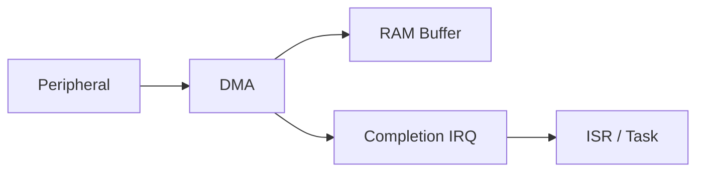

이때 확인할 요소:

- 전송 완료의 정확한 의미
- Buffer 소유권 전환 시점
- Cache Clean/Invalidate 필요성
- Memory Barrier 및 Ordering
- 다음 전송과의 충돌

**Interrupt가 발생했다는 사실만으로 CPU Cache Coherency가 자동으로 해결되지는 않는다.**

## 24. Timer Interrupt

Timer는 주기적 이벤트를 생성하는 대표 Peripheral이다.

```mermaid
flowchart LR
    A["Clock"] --> B["Prescaler"]
    B --> C["Counter"]
    C --> D["Update Event"]
    D --> E["Timer ISR"]
```

주요 활용:

```text
Periodic Tick
Sampling Trigger
Timeout Accounting
Control Loop Scheduling
```

실제 주기는 Clock, Prescaler, Counter 설정, ISR 지연에 영향을 받는다.

## 25. GPIO External Interrupt

GPIO 입력 변화가 Interrupt Source가 될 수 있다.

```mermaid
flowchart LR
    A["External Signal"] --> B["GPIO / EXTI"]
    B --> C["Interrupt Controller"]
    C --> D["ISR"]
```

기계식 버튼처럼 신호가 튀는 경우 **Debouncing**이 별도로 필요할 수 있다. Interrupt는 입력 이벤트를 전달할 뿐 물리적 신호 품질을 보장하지 않는다.

## 26. UART Interrupt

UART는 RX Data Ready, TX Empty, Transmission Complete, Error 등의 Interrupt Source를 제공할 수 있다.

| 이벤트 | 개념 |
|---|---|
| RX Ready | 수신 데이터가 준비됨 |
| TX Empty | 다음 데이터 기록 가능 |
| TX Complete | 전송 완료 상태 |
| Error | Overrun, Framing 등 장치별 오류 |

**TX Empty와 TX Complete는 동일한 의미가 아닐 수 있다.** 정확한 Flag 의미는 UART Reference Manual을 따른다.

## 27. Interrupt와 RTOS

RTOS 환경에서는 ISR이 Task를 깨우거나 Queue로 데이터를 전달할 수 있다.

```mermaid
sequenceDiagram
    participant P as Peripheral
    participant I as ISR
    participant R as RTOS
    participant T as Task
    P->>I: Interrupt
    I->>R: ISR-safe Notify / Queue
    R->>T: Task Becomes Ready
    T->>T: Process Event
```

일부 RTOS는 ISR에서 호출 가능한 API를 별도로 제공하며, Interrupt Priority에도 API 호출 제약을 둔다. 예를 들어 FreeRTOS의 `FromISR` 계열처럼 **RTOS별 규칙**을 확인해야 한다.

## 28. Priority Inversion과 ISR

Task Priority Inversion은 일반적으로 낮은 우선순위 Task가 가진 자원을 높은 우선순위 Task가 기다리는 상황에서 논의된다. ISR Priority와 RTOS Task Priority는 서로 다른 체계일 수 있다.

```mermaid
flowchart TD
    A["CPU Interrupt Priority"] --> C["System Responsiveness"]
    B["RTOS Task Priority"] --> C
```

둘의 숫자 체계나 선점 관계를 동일하게 가정하지 않는다.

## 29. Fault와 Exception

일부 CPU는 일반 Peripheral Interrupt 외에도 Fault, Trap, Exception을 제공한다.

```text
Peripheral Interrupt
System Exception
Fault
Reset
```

ARM Cortex-M의 예외 모델처럼 하나의 Vector Table에서 관리하는 구조도 있지만, 세부 분류는 아키텍처마다 다르다.

Fault Handler는 단순 이벤트 처리뿐 아니라 원인 진단, 안전 상태 전환, Reset 정책과 연결된다.

## 30. Interrupt와 Watchdog

Interrupt가 과도하게 발생하거나 ISR이 반환하지 못하면 Main Loop/Task가 정상 진행하지 못할 수 있다.

```mermaid
flowchart TD
    A["Interrupt Storm / Long ISR"] --> B["Main / Task Starvation"]
    B --> C["Watchdog Refresh Missed"]
    C --> D["Reset / Fault Action"]
```

Watchdog은 이런 문제를 감지하는 한 수단이지만, 원인 제거와 안전한 복구 설계를 대신하지 않는다.

## 31. Debugging 시 주의점

Interrupt Debugging에서 확인할 항목:

```text
Peripheral Status Flag
Peripheral Interrupt Enable
Controller Pending / Enable
Priority / Mask State
Vector Table / Handler 연결
ISR 진입 횟수
Flag Clear 순서
Stack 사용량
Latency / Execution Time
```

Debugger가 Register를 읽는 동작 자체가 Read-to-Clear 같은 부작용을 일으킬 수 있으므로 Peripheral View를 무조건 무해한 관찰로 간주하지 않는다.

## 32. C와 C++에서의 Interrupt

| 관점 | C | C++ |
|---|---|---|
| Handler 연결 | 툴체인·SDK 규약 | 동일한 플랫폼 규약 필요 |
| 상태 전달 | 전역/모듈 상태, Buffer | 클래스·객체·Queue 등 활용 가능 |
| Register 접근 | `volatile` 포인터·구조체 | 동일한 저수준 접근 가능 |
| 동기화 | 플랫폼 Atomic/Mask/RTOS | `std::atomic` 등도 검토 가능 |

C++의 일반 멤버 함수는 암묵적인 `this` 매개변수가 있으므로 플랫폼이 요구하는 C 형태의 Handler와 직접 호환된다고 가정하지 않는다. ISR 진입점과 객체 기반 처리는 별도 연결 설계가 필요할 수 있다.

## 33. 설계 관점 정리

```mermaid
flowchart TD
    A["Event Requirement"] --> B["Choose Polling / Interrupt"]
    B --> C["Define Source / Enable / Priority"]
    C --> D["Define ISR Responsibility"]
    D --> E["Define Shared Data / Handoff"]
    E --> F["Check Timing / Error / Overflow"]
    F --> G["Verify Manual / RTOS Rules"]
```

설계 시 중요한 질문:

- 어떤 이벤트가 Interrupt를 발생시키는가?
- 이벤트를 놓쳐도 되는가, 발생 횟수까지 보존해야 하는가?
- ISR에서 반드시 끝내야 하는 작업은 무엇인가?
- Main/Task로 넘길 데이터는 무엇인가?
- 공유 상태에 Atomicity와 Ordering이 필요한가?
- 최악의 지연과 ISR 실행 시간이 요구사항에 맞는가?
- Flag를 어떤 순서로 Clear해야 하는가?

## 34. 선행 개념과 연결

```mermaid
flowchart TD
    A["Register"] --> F["Interrupt"]
    B["Bit Operation"] --> F
    C["volatile"] --> F
    D["Memory Model"] --> F
    E["Control Flow"] --> F
    F --> G["ISR / Buffer / Driver"]
    G --> H["UART / Timer / RTOS"]
```

| 선행 문서 | Interrupt에서의 역할 |
|---|---|
| `Register.md` | Enable, Status, Pending, Clear |
| `Bit_Operation.md` | Interrupt Flag Mask |
| `volatile.md` | 하드웨어/비동기 접근 의미 |
| `Memory_Model.md` | 공유 객체의 수명과 배치 |
| `Array_String.md` | 수신 Buffer |
| `Embedded_C.md` | Driver, Main Loop, Peripheral |

## 35. 핵심 요약

```mermaid
mindmap
  root((Interrupt))
    Event
      Peripheral
      Timer
      GPIO
      UART
    Controller
      Enable
      Pending
      Priority
      Vector
    Execution
      ISR
      Latency
      Nesting
      Preemption
    Shared State
      volatile
      Atomicity
      Critical Section
      Queue
    Reliability
      Acknowledge
      Overflow
      Timeout
      Watchdog
    Architecture
      Main Loop
      RTOS Task
      Deferred Processing
```

> **Interrupt는 Hardware Event에 대응해 CPU 실행 흐름을 변경하는 메커니즘이다.**
>
> **ISR은 Interrupt를 처리하는 코드이며, 가능한 한 예측 가능한 실행 시간을 유지하도록 설계한다.**
>
> **Enable, Pending, Priority, Status Flag는 서로 다른 역할을 가진다.**
>
> **Flag의 Clear 방식과 순서는 Peripheral Reference Manual을 따른다.**
>
> **`volatile`은 Atomicity와 Synchronization을 대신하지 않는다.**
>
> **이벤트를 잃지 않으려면 Flag·Counter·Queue·Ring Buffer 중 요구사항에 맞는 전달 방식을 선택해야 한다.**
>
> **Interrupt Latency, ISR Execution Time, 전체 Response Time은 구분해서 생각한다.**
>
> **RTOS에서는 ISR-safe API와 Interrupt Priority 제약을 함께 확인한다.**

---

## 다음 학습

**다음 문서:** `05_Embedded/UART.md`

```mermaid
flowchart LR
    A["Register"] --> B["Interrupt"]
    B --> C["UART"]
    C --> D["RX/TX Buffer"]
    D --> E["Ring Buffer / Protocol"]
```

UART의 TX/RX 동작, Baud Rate, Status Flag, Polling·Interrupt·DMA 방식, Buffer와 Error Handling을 개념 중심으로 정리한다.
