# UART

> **학습 위치:** `C_Cpp_Study/05_Embedded/UART.md`  
> **핵심 연결:** `Clock → UART Register → TX/RX → Interrupt/DMA → Buffer → Protocol`  
> **정리 방식:** 개념 설명과 비교 중심. 실습·퀴즈는 포함하지 않는다.

---

## 1. 한 문장 정의

**UART(Universal Asynchronous Receiver/Transmitter)는 병렬 데이터를 비동기 직렬 데이터로 변환해 송신하고, 수신한 직렬 데이터를 병렬 데이터로 복원하는 하드웨어 주변장치다.**

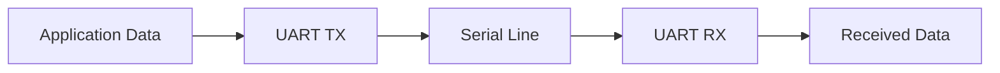

UART는 통신을 수행하는 **주변장치**이며, UART 통신에서 흔히 사용하는 시작 비트·데이터 비트·선택적 패리티·정지 비트의 프레임 형식도 함께 이해해야 한다.

## 2. UART와 USART

- **UART:** 일반적으로 비동기 직렬 통신을 담당한다.
- **USART:** 구현에 따라 비동기 및 동기 통신 모드를 제공한다.

MCU 제조사의 Peripheral 명칭이 USART이더라도 비동기 모드로 사용하면 UART 방식으로 통신할 수 있다. 지원 기능과 Register 구성은 해당 MCU Reference Manual을 따른다.

## 3. 비동기 통신의 의미

UART는 데이터 비트마다 별도의 Clock 선을 함께 전송하지 않는다. 송신기와 수신기는 사전에 합의한 Baud Rate와 Frame 형식에 따라 비트의 위치를 해석한다.

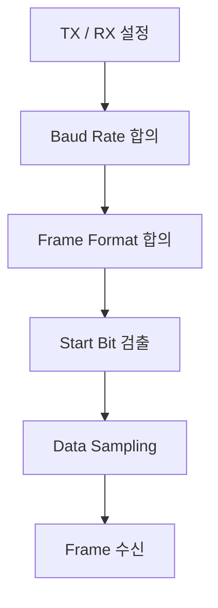

Clock 선이 없다는 뜻이지, 송수신 장치 내부에 Clock이 필요 없다는 뜻은 아니다.

## 4. TX와 RX

| 신호 | 의미 | 방향 |
|---|---|---|
| TX | Transmit | 해당 장치에서 나가는 데이터 |
| RX | Receive | 해당 장치로 들어오는 데이터 |
| GND | 기준 전위 | 장치 사이 공통 기준으로 필요한 경우가 많음 |

두 UART 장치를 연결할 때는 일반적으로 한쪽 TX를 다른 쪽 RX에 연결한다. **전압 레벨과 전기적 인터페이스 호환성은 별도 확인**해야 한다.

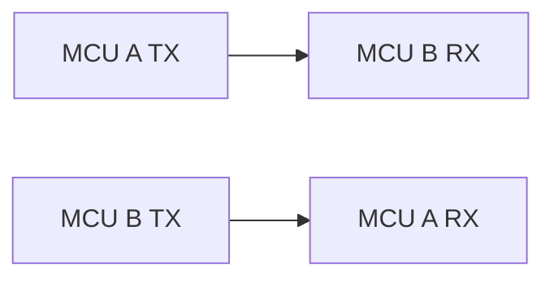

UART의 논리적 TX/RX와 RS-232·RS-485 같은 물리 계층은 구분한다.

## 5. UART Frame

흔히 사용하는 설정은 **8N1**이다.

```text
Idle | Start | D0 D1 D2 D3 D4 D5 D6 D7 | Stop | Idle
  1  |   0   |         8 bits          |  1   |  1
```

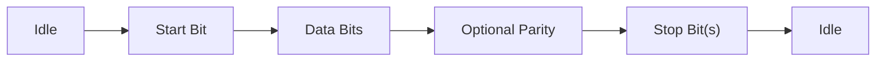

| 구성 | 역할 |
|---|---|
| Idle | 일반적인 UART 논리 신호에서 High 상태 |
| Start Bit | 프레임 시작을 알리는 Low 상태 |
| Data Bits | 실제 데이터 값 |
| Parity | 선택적인 단순 오류 검출 |
| Stop Bit(s) | 프레임 종료 및 수신기 동기 회복에 필요한 구간 |

데이터 비트 전송 순서는 일반적인 UART에서 LSB First이지만 대상 Peripheral의 설정과 문서를 확인한다.

## 6. 8N1의 의미

```text
8 → Data Bit 8개
N → No Parity
1 → Stop Bit 1개
```

따라서 8N1은 데이터 1바이트를 보내는 데 일반적으로 다음 **10비트 시간**을 사용한다.

```text
1 Start + 8 Data + 1 Stop = 10 Bit Times
```

이는 실제 사용자 데이터의 비트 수와 전송 선로에서 소비되는 비트 시간을 구분해야 함을 보여 준다.

## 7. Baud Rate

Baud Rate는 초당 Symbol 수다. 일반적인 2레벨 UART에서는 한 Symbol이 한 Bit를 나타내므로 흔히 bit/s와 수치가 같다.

대표 설정 예:

```text
9600
115200
1000000
```

8N1에서 이론적인 사용자 데이터 처리량은 다음과 같다.

```text
Payload bytes/s ≈ Baud Rate / 10
```

예를 들어 115200 Baud, 8N1에서는 약 **11,520 byte/s**가 프레임 오버헤드를 고려한 이론적 상한이다. 실제 처리량은 간격·소프트웨어 처리·프로토콜 오버헤드 등에 따라 낮아질 수 있다.

## 8. Baud Rate와 Clock

UART Peripheral은 입력 Clock과 Divider 등을 사용해 송수신 타이밍을 만든다.

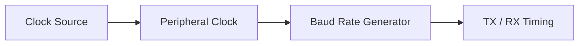

Clock 설정이 바뀌면 Baud Rate도 달라질 수 있다. Divider 계산식과 Oversampling 방식은 MCU별로 다르므로 제조사 SDK/Reference Manual을 기준으로 한다.

## 9. Baud Rate 불일치

송신기와 수신기의 실제 Bit Time이 지나치게 다르면 프레임 후반으로 갈수록 Sampling 위치가 어긋날 수 있다.

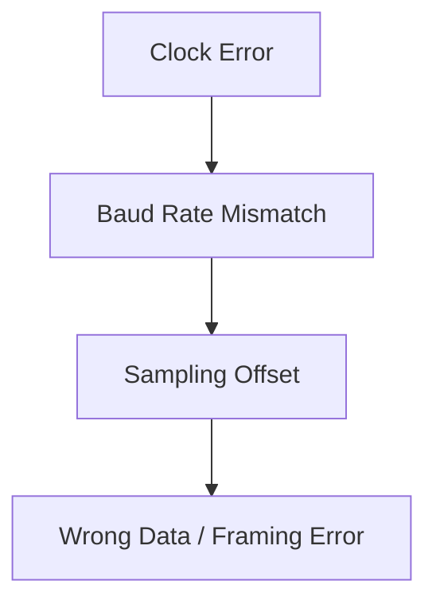

허용 오차는 Frame 길이, Oversampling, Receiver 구현, 양쪽 Clock 오차에 따라 달라진다. 특정 퍼센트를 모든 UART에 공통으로 적용하지 않는다.

## 10. Sampling과 Oversampling

수신기는 Start Bit를 감지한 뒤 예상되는 각 Bit의 중심 부근에서 값을 읽는다. 일부 UART는 하나의 Bit를 여러 번 Sampling하는 Oversampling 기능을 제공한다.

```text
Start Detection
      ↓
Bit Timing Estimate
      ↓
Data Bit Sampling
      ↓
Stop Bit Validation
```

Oversampling 배율과 Noise Filtering 동작은 하드웨어 구현에 따라 다르다.

## 11. UART의 주요 Register

| Register 계열 | 대표 역할 |
|---|---|
| CONTROL | TX/RX Enable, 기능 설정 |
| BAUD / DIVIDER | Baud Rate 설정 |
| STATUS | TX Ready, RX Available, Error Flag |
| TX DATA | 송신 데이터 쓰기 |
| RX DATA | 수신 데이터 읽기 |
| INTERRUPT ENABLE | UART Interrupt 허용 |
| INTERRUPT STATUS/CLEAR | Interrupt 원인 확인·처리 |

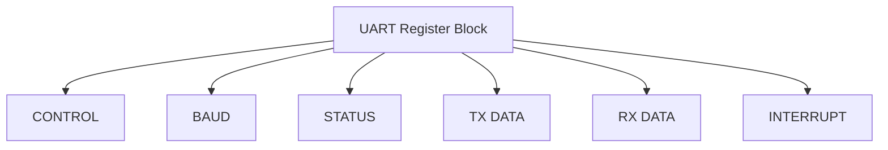

Register 이름, 통합 여부, FIFO 지원 여부는 MCU마다 다르다.

## 12. UART 초기화의 개념적 순서

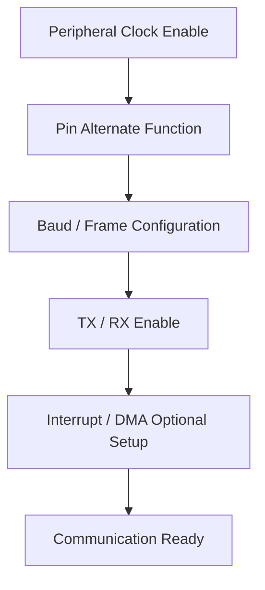

초기화 순서는 대상 MCU의 Clock Tree, Pin Multiplexing, Register 쓰기 제약과 SDK 규칙에 맞춰야 한다.

## 13. 송신 경로(TX)

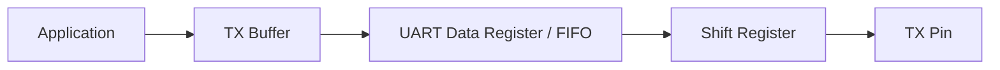

일반적으로 소프트웨어는 Hardware가 새 데이터를 받을 수 있는 상태인지 확인하고 송신 데이터를 제공한다.

**TX Register Empty**와 **Transmission Complete**는 다를 수 있다.

- TX Register/FIFO에 공간이 생김: 다음 데이터를 받아들일 수 있다는 의미.
- Transmission Complete: 마지막 데이터의 실제 직렬 전송까지 완료되었다는 의미일 수 있음.

정확한 Flag 의미는 MCU 문서를 확인한다. RS-485 방향 전환 등에서는 이 차이가 특히 중요하다.

## 14. 수신 경로(RX)

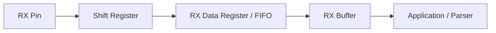

RX Available Flag가 설정되면 수신 데이터가 준비되었음을 나타낼 수 있다. Data Register 읽기가 Flag를 해제하거나 FIFO에서 데이터를 제거할 수 있으므로 **읽기 부작용**을 확인해야 한다.

## 15. Polling 방식

Polling은 상태 Register를 반복 확인해 송수신한다.

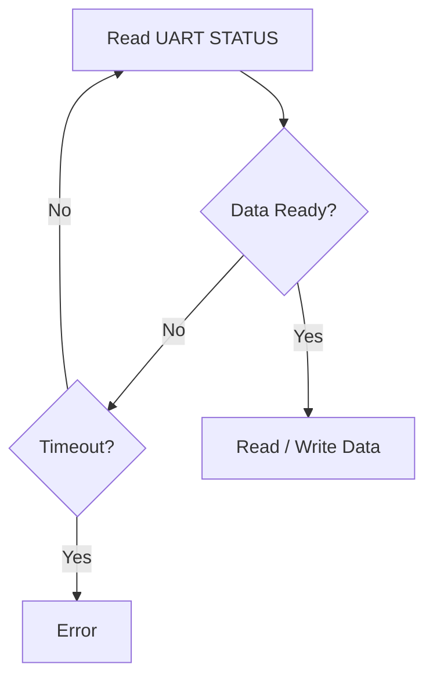

장점은 흐름이 단순하다는 것이고, 단점은 CPU가 대기하는 동안 다른 작업을 수행하기 어려울 수 있다는 것이다. 실제 Driver에서는 Timeout과 오류 Flag를 함께 확인한다.

## 16. Interrupt 방식

Interrupt 방식은 UART Event 발생 시 ISR을 통해 송수신 처리를 수행한다.

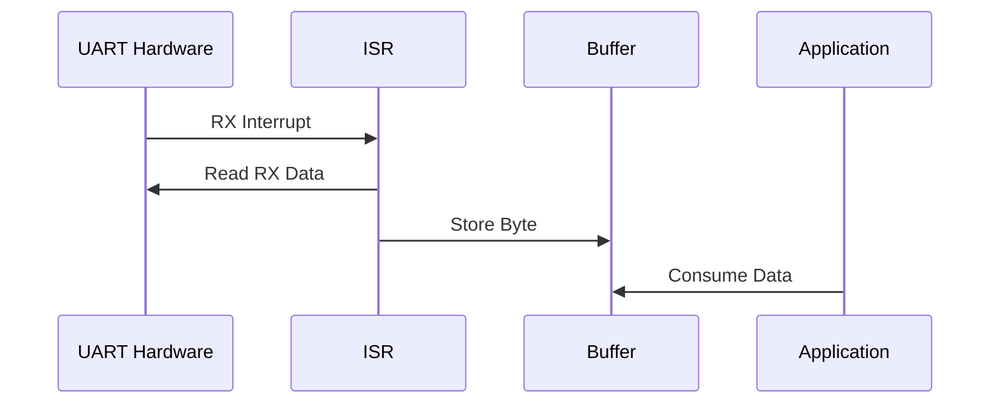

ISR에서 복잡한 Parsing이나 긴 Blocking 처리를 수행하면 Latency와 다른 Interrupt 처리에 영향을 줄 수 있다. 일반적으로 ISR은 데이터를 안전하게 받아 Buffer에 전달하고 상위 처리를 분리한다.

## 17. DMA 방식

DMA를 지원하는 UART에서는 CPU가 바이트마다 Data Register를 처리하는 부담을 줄일 수 있다.

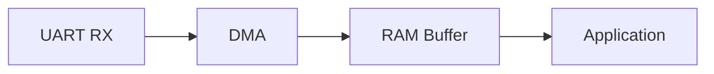

DMA 수신에서 중요한 개념:

```text
Buffer Address / Size
Transfer Completion
Half Transfer
Circular Mode
Idle-line Detection (지원 시)
Cache Coherency
Memory Ordering
```

DMA Buffer의 유효 수명과 CPU·DMA 사이의 소유권 전환을 설계해야 한다. `volatile`만으로 Cache Coherency 문제가 해결되지는 않는다.

## 18. Polling·Interrupt·DMA 비교

| 관점 | Polling | Interrupt | DMA |
|---|---|---|---|
| 기본 원리 | CPU가 상태 반복 확인 | Event 시 ISR 실행 | Hardware가 데이터 이동 |
| CPU 개입 | 대기 중 많을 수 있음 | Event 단위 | 설정·완료 처리 중심 |
| 구현 복잡도 | 비교적 낮음 | 공유 Buffer/ISR 고려 | Buffer/Cache/전송 상태 고려 |
| 대표 사용 | 단순 초기 통신 | 비동기 송수신 | 연속·대량 전송 |

세 방식은 상황에 따라 조합할 수 있다. DMA 완료를 Interrupt로 통지하는 구조가 대표적이다.

## 19. UART Buffer

수신 데이터는 Application이 즉시 처리하지 못할 수 있으므로 Buffer가 필요하다.

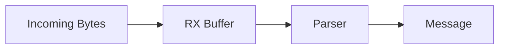

Buffer 설계 시 고려사항:

- 최대 수신 속도와 최악의 처리 지연
- Buffer 크기와 메모리 예산
- Full/Overflow 정책
- ISR과 Main/Task 사이의 동시 접근
- 데이터 손실 감지 방법

## 20. Ring Buffer와 UART

Ring Buffer는 고정 크기 배열을 순환 사용해 UART 데이터 스트림을 저장하는 대표적인 구조다.

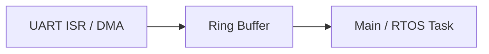

핵심 요소:

```text
Write Index
Read Index
Wrap-around
Full / Empty 판별
Overflow Policy
```

단일 생산자·단일 소비자 구조에서도 데이터 폭, 메모리 순서, ISR/Task 환경에 맞는 동기화가 필요할 수 있다. 단순히 Index에 `volatile`을 붙였다고 모든 경쟁 문제가 해결되지는 않는다.

## 21. UART는 Byte Stream이다

UART 자체는 Application의 “메시지 경계”를 정의하지 않는다.

예를 들어 연속해서 전송된 다음 데이터는:

```text
[0x10, 0x20, 0x30, 0x40]
```

수신 측에서 다음 중 무엇을 뜻하는지 UART만으로는 알 수 없다.

```text
메시지 1개: [10 20 30 40]
메시지 2개: [10 20] [30 40]
메시지 4개: [10] [20] [30] [40]
```

따라서 상위 **Protocol/Framing**이 필요하다.

## 22. 상위 Protocol과 Packet

메시지 경계를 표현하는 대표 방식:

| 방식 | 개념 | 주의점 |
|---|---|---|
| Fixed Length | 항상 같은 길이 | 길이 변경에 유연하지 않음 |
| Delimiter | 특정 종료 문자/패턴 | 데이터 내 Delimiter Escape 필요 가능 |
| Length Field | Header에 길이 포함 | 길이값 검증 필요 |
| Idle Gap | 수신 공백으로 경계 추정 | Timing 의존성 |

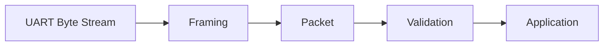

Packet Header, Payload, Checksum/CRC 등은 UART Hardware가 아니라 상위 Protocol에서 정의한다.

## 23. 데이터 표현: Binary와 Text

같은 숫자 `123`도 표현 방식에 따라 다르게 전송된다.

```text
Binary 8-bit value: 0x7B
ASCII text "123": 0x31 0x32 0x33
```

UART는 바이트를 전달할 뿐, 그 바이트가 숫자·문자열·구조체·명령인지 해석하지 않는다.

서로 다른 시스템 간 Binary Protocol에서는 Endianness, 정수 폭, Signedness, 구조체 Padding을 명시해야 한다. C 구조체를 그대로 송신하는 방식은 Portable Protocol 정의가 아니다.

## 24. Parity와 오류 검출

Parity는 데이터 비트의 1 개수에 대한 규칙을 추가하는 단순 오류 검출 방식이다.

```text
Even Parity
Odd Parity
No Parity
```

Parity는 모든 오류를 검출하지 못하며 오류를 자동 수정하지도 않는다. 상위 Protocol에서 더 강한 검증이 필요하면 Checksum이나 CRC를 사용할 수 있다.

## 25. 대표 UART 오류

| 오류 | 개념 | 관련 상황 |
|---|---|---|
| Framing Error | 예상한 Stop Bit 등을 올바르게 인식하지 못함 | Baud 불일치, Noise |
| Parity Error | 수신 Parity 규칙 불일치 | Bit 오류, 설정 불일치 |
| Overrun Error | 이전 데이터를 처리하기 전에 새 데이터 도착 | CPU 지연, Buffer 부족 |
| Noise Error | 수신 신호 품질 문제를 감지한 경우 | 배선·전기적 환경 |
| Buffer Overflow | Software Buffer 용량 초과 | 소비 속도 부족 |

Hardware Overrun과 Software Buffer Overflow는 서로 다른 계층의 문제다.

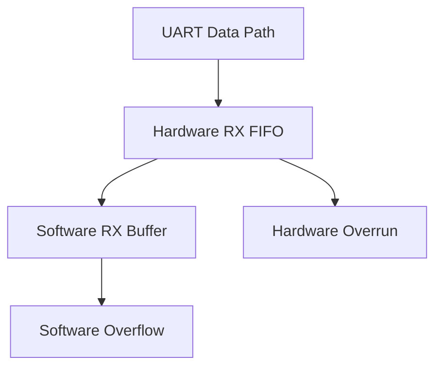

오류 Flag의 Clear 방법과 오류 발생 시 Data Register 처리 순서는 MCU별로 다르다.

## 26. Flow Control

수신 측이 처리 가능한 속도보다 빠르게 데이터가 들어오는 문제를 완화하기 위해 Flow Control을 사용할 수 있다.

```text
Hardware Flow Control: RTS / CTS
Software Flow Control: XON / XOFF 등
```

지원 여부와 신호 방향, 활성 레벨은 Peripheral 및 연결 장치의 문서를 확인한다.

Flow Control은 Buffer 설계와 오류 처리를 대체하지 않는다.

## 27. UART와 물리 계층 구분

| 항목 | 의미 |
|---|---|
| MCU UART | 비동기 직렬 데이터 생성·수신 |
| TTL/CMOS 레벨 UART | MCU 전압 영역의 디지털 신호 표현 |
| RS-232 | 별도의 전압·신호 규격을 사용하는 직렬 인터페이스 |
| RS-485 | 차동 신호 기반 물리 계층; 반이중 구성 등에 사용 |
| USB-UART Bridge | USB와 UART 사이 변환 |

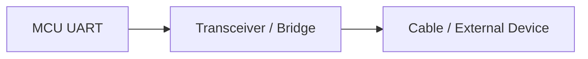

**RS-232 전압을 MCU UART Pin에 직접 연결하면 안 된다.** 대상 Pin의 허용 전압과 Transceiver 필요 여부를 확인한다.

## 28. RS-485와 TX 완료

반이중 RS-485 구성에서는 송신 중 Driver Enable을 켜고 송신이 끝나면 수신 모드로 전환할 수 있다.

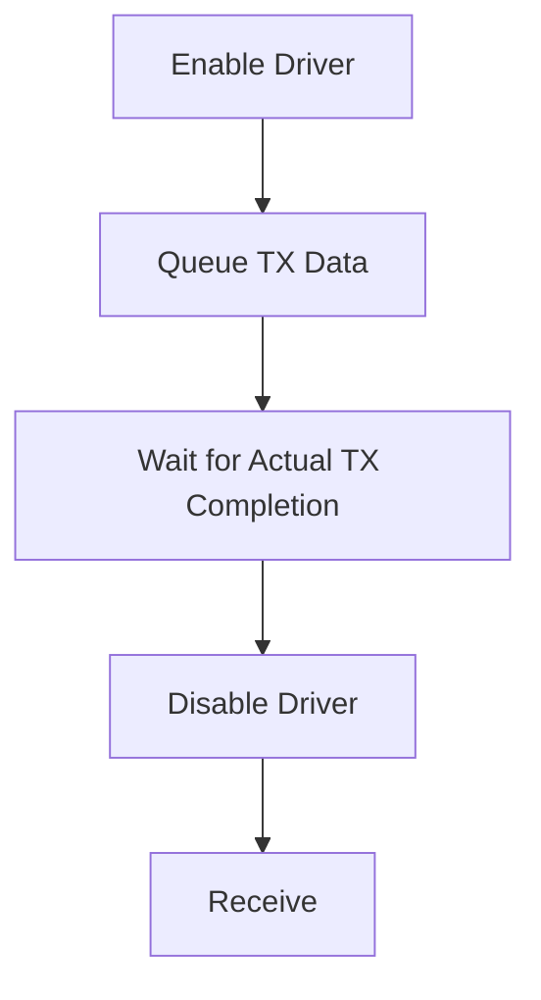

이때 “TX Data Register에 공간이 생겼다”는 Flag와 “마지막 Stop Bit까지 전송 완료” Flag를 혼동하지 않는다.

## 29. UART와 `printf`

Embedded 프로젝트에서는 `printf`의 출력을 UART로 연결하는 경우가 있다.

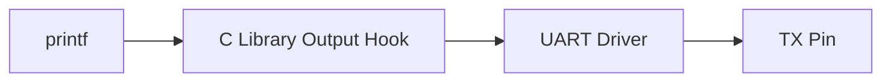

주의사항:

- C Library와 Toolchain에 따라 Retargeting 방식이 다르다.
- Formatting은 Code Size와 Stack/CPU 사용량에 영향을 줄 수 있다.
- Blocking 출력은 Timing을 바꿀 수 있다.
- ISR에서의 호출 가능성은 Reentrancy와 Driver 구조에 따라 판단한다.

## 30. UART Driver 계층

```mermaid
flowchart TD
    A["Application"] --> B["Protocol / Parser"]
    B --> C["UART Driver API"]
    C --> D["TX/RX Buffer"]
    D --> E["ISR / DMA / Polling"]
    E --> F["UART Registers"]
    F --> G["TX/RX Pins"]
```

계층별 책임:

| 계층 | 책임 |
|---|---|
| Application | 명령·업무 로직 |
| Protocol | 메시지 경계·유효성·해석 |
| Driver | 송수신 API, Buffer, Timeout, 오류 처리 |
| Hardware Access | Register·Interrupt·DMA |
| Physical Interface | Pin·Transceiver·배선 |

## 31. RTOS와 UART

RTOS 환경에서는 UART ISR과 Application Task 사이에 Queue, Stream Buffer, Notification 등을 사용할 수 있다.

```mermaid
sequenceDiagram
    participant U as UART
    participant I as ISR
    participant Q as Queue / Buffer
    participant T as Task
    U->>I: RX Event
    I->>Q: Deliver Data
    Q->>T: Wake / Notify
    T->>T: Parse Message
```

ISR에서는 해당 RTOS가 제공하는 **ISR-safe API**를 사용해야 하며 일반 Task용 Blocking API를 그대로 사용하면 안 될 수 있다.

## 32. 설계 시 확인할 핵심 사항

- **전기적 호환성:** TX/RX 전압, GND, Transceiver, 배선 길이.
- **Timing:** Peripheral Clock, Baud Rate, Frame Format, 허용 오차.
- **Hardware:** FIFO 깊이, 상태 Flag, 오류 Clear 규칙.
- **Data Path:** Polling, Interrupt, DMA 선택과 조합.
- **Memory:** RX/TX Buffer 크기, 수명, DMA Cache 정책.
- **Concurrency:** ISR·Task 간 데이터 전달과 동기화.
- **Protocol:** Packet 경계, 길이 검증, CRC, Timeout.
- **Recovery:** Overrun, Noise, 연결 단절, 재동기화.

## 33. 이전 학습과 연결

```mermaid
flowchart TD
    A["Register"] --> F["UART"]
    B["Interrupt"] --> F
    C["Pointer / Array"] --> G["Buffer"]
    D["volatile"] --> A
    E["Bit Operation"] --> A
    G --> F
    F --> H["Ring Buffer"]
    H --> I["Protocol Parser"]
```

| 선행 개념 | UART에서의 역할 |
|---|---|
| Register | Control, Status, Data |
| Bit Operation | Flag·설정 Field 제어 |
| `volatile` | MMIO Access Semantics |
| Interrupt | 비동기 TX/RX Event 처리 |
| Pointer/Array | 송수신 Buffer |
| Memory Model | Buffer Lifetime·Stack·Static Memory |
| Struct | Driver Context·Protocol Packet |
| FSM | Packet Parser·통신 상태 관리 |

## 34. 핵심 요약

```mermaid
mindmap
  root((UART))
    Frame
      Start
      Data
      Parity
      Stop
    Timing
      Baud Rate
      Clock
      Sampling
    Hardware
      Register
      FIFO
      TX RX
    Data Path
      Polling
      Interrupt
      DMA
    Software
      Buffer
      Ring Buffer
      Protocol
    Reliability
      Timeout
      Overrun
      Framing Error
      CRC
    Physical
      Voltage Level
      RS-232
      RS-485
      USB-UART
```

> **UART는 비동기 직렬 통신을 담당하는 Hardware Peripheral이다.**
>
> **Baud Rate와 Frame Format은 송수신 양쪽에서 호환되어야 한다.**
>
> **TX Register Empty와 실제 Transmission Complete는 구분해야 한다.**
>
> **UART는 Byte Stream을 제공하며 메시지 경계는 상위 Protocol에서 정의한다.**
>
> **Polling·Interrupt·DMA는 UART 데이터를 처리하는 서로 다른 방식이며 함께 사용할 수 있다.**
>
> **Buffer, Overflow, Timeout, Error Flag, Concurrency는 UART Driver의 핵심 설계 요소다.**
>
> **UART의 논리 신호와 RS-232/RS-485 같은 물리적 인터페이스는 구분해야 한다.**

---

## 다음 학습

**다음 문서:** `05_Embedded/Ring_Buffer.md`

```mermaid
flowchart LR
    A["UART RX"] --> B["Ring Buffer"]
    B --> C["Packet Parser"]
    C --> D["Application"]
```

Ring Buffer의 구조, Read/Write Index, Full/Empty 판별, Overflow 정책, ISR·Task 동시 접근을 개념 중심으로 정리한다.
