# Ring Buffer

> **학습 위치:** `C_Cpp_Study/05_Embedded/Ring_Buffer.md`  
> **선행 개념:** `Array_String.md` · `Pointer.md` · `Bit_Operation.md` · `volatile.md` · `Interrupt.md` · `UART.md`  
> **기준:** C17 / C++20. 실습·퀴즈 없이 개념, 설계 기준과 예시 코드만 정리한다.

---

## 1. Ring Buffer란?

**Ring Buffer(원형 버퍼, Circular Buffer)** 는 고정된 저장 공간의 끝에 도달하면 다시 처음으로 돌아가며 데이터를 기록하고 읽는 자료구조다. 일반적으로 FIFO(First In, First Out) 큐로 사용한다.

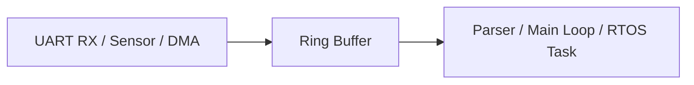

핵심은 **배열 자체가 움직이는 것이 아니라 읽기·쓰기 위치가 순환한다**는 점이다. 임베디드에서는 Interrupt나 DMA가 데이터를 받아들이는 시점과 Application이 처리하는 시점을 분리하는 데 자주 사용한다.

## 2. 왜 필요한가?

UART는 바이트가 도착하는 시점을 Application이 결정할 수 없다. 수신 시점마다 긴 파싱 작업을 ISR에서 수행하면 Interrupt Latency가 늘어날 수 있다. Ring Buffer는 수신 경로를 짧게 만들고, 나중에 소비자가 데이터를 처리하도록 한다.

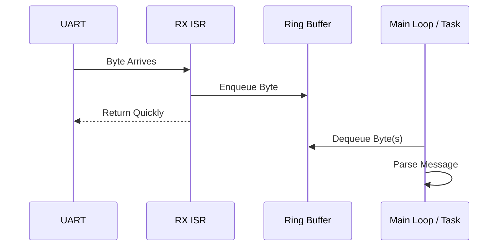

Ring Buffer는 **순간적인 생산·소비 속도 차이를 흡수**하지만, 생산 속도가 장기간 소비 속도보다 빠르면 결국 가득 찬다. 무한한 처리 능력을 제공하지는 않는다.

---

## 3. 기본 구성 요소

| 구성 요소 | 의미 |
|---|---|
| `buffer` | 실제 데이터가 저장되는 배열 |
| `capacity` | 물리적 배열 크기 |
| `head` / `write_index` | 다음 데이터를 쓸 위치 |
| `tail` / `read_index` | 다음 데이터를 읽을 위치 |
| `size` 또는 별도 상태 | 비어 있음과 가득 참을 구분하는 선택적 정보 |
| Overflow Policy | 가득 찼을 때의 처리 규칙 |

이 문서에서는 **`head = 다음 쓰기 위치`, `tail = 다음 읽기 위치`** 로 정의한다. 자료마다 이름을 반대로 쓰는 경우도 있으므로 명칭보다 불변식(invariant)을 확인해야 한다.

```text
Capacity = 8
Index:    0   1   2   3   4   5   6   7
        +---+---+---+---+---+---+---+---+
Buffer: | A | B | C |   |   |   |   |   |
        +---+---+---+---+---+---+---+---+
                    ^               ^
                 head=3           tail=0 (개념적 위치는 0)
```

위 그림에서 `head=3`, `tail=0`이며 읽을 순서는 `A → B → C`다.

## 4. 순환 인덱스

배열 길이를 `N`이라 할 때 다음 위치는 다음과 같다.

```c
next = (index + 1u) % N;
```

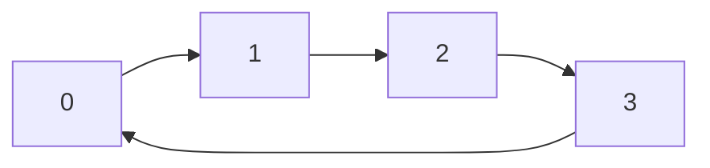

`N`이 2의 거듭제곱이면 다음과 같은 마스킹도 가능하다.

```c
next = (index + 1u) & (N - 1u);
```

단, **`N`이 정확히 2의 거듭제곱일 때만** 이 식이 `% N`과 같은 순환 결과를 낸다. 마스킹이 항상 성능상 유리하다고 단정할 수 없으며 Compiler가 상수 나눗셈을 최적화할 수도 있다.

---

## 5. 비어 있음과 가득 참의 모호성

단순히 `head == tail`만 검사하면 **비어 있음**과 **정확히 한 바퀴를 돌아 가득 참**을 구별하기 어렵다. 이를 해결하는 설계는 여러 가지다.

| 설계 | Empty | Full | 실제 저장 가능량 |
|---|---|---|---|
| 한 칸 비워 두기 | `head == tail` | `next(head) == tail` | `N - 1` |
| `count` 유지 | `count == 0` | `count == N` | `N` |
| 별도 Full Flag | `head == tail && !full` | `head == tail && full` | `N` |
| 단조 증가 카운터 | `write == read` | `write - read == N` | `N` |

**어느 설계가 항상 우월한 것은 아니다.** 구현 단순성, 사용 가능한 저장량, 동시성, 카운터 오버플로 처리 조건에 따라 선택한다.

## 6. 한 칸 비워 두는 설계

가장 설명하기 쉬운 구조다.

```text
Empty: head == tail
Full:  next(head) == tail
Usable Capacity: N - 1
```

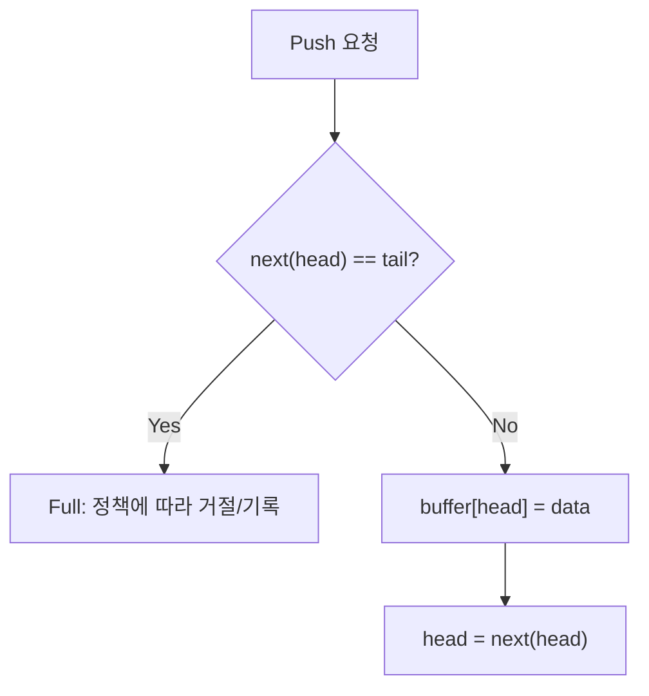

이 방식은 Full/Empty 구분을 위해 추가 `count`를 공유하지 않아도 되는 장점이 있다. 배열 길이 8이면 저장 가능한 원소는 최대 7개다.

## 7. `count`를 사용하는 설계

```text
Empty: count == 0
Full:  count == N
```

배열 전체를 사용할 수 있고 현재 저장량을 즉시 알 수 있다. 반면 Producer와 Consumer가 모두 `count`를 수정하면, 서로 다른 실행 문맥에서 접근할 때 동기화 문제가 생길 수 있다. **`count`를 추가했다고 Thread/ISR Safety가 자동으로 확보되지는 않는다.**

## 8. 단조 증가 카운터 방식

`read`와 `write`를 실제 배열 인덱스가 아니라 누적 진행량으로 두고, 배열 접근 때만 나머지를 취하는 방식도 있다.

```text
Physical Index = Counter % N
Occupancy      = write - read
```

이 방식은 정수 폭, Unsigned Wraparound, 최대 미처리량, 동시 접근 순서에 대한 전제가 명확해야 한다. **단순히 카운터만 크게 만들면 Lock-free가 되는 것은 아니다.**

---

## 9. Push와 Pop의 논리적 순서

한 칸 비워 두는 FIFO를 기준으로 한다.

**Push(생산):** Full 확인 → 현재 `head` 위치에 데이터 저장 → `head`를 다음 위치로 이동.

**Pop(소비):** Empty 확인 → 현재 `tail` 위치에서 데이터 읽기 → `tail`을 다음 위치로 이동.

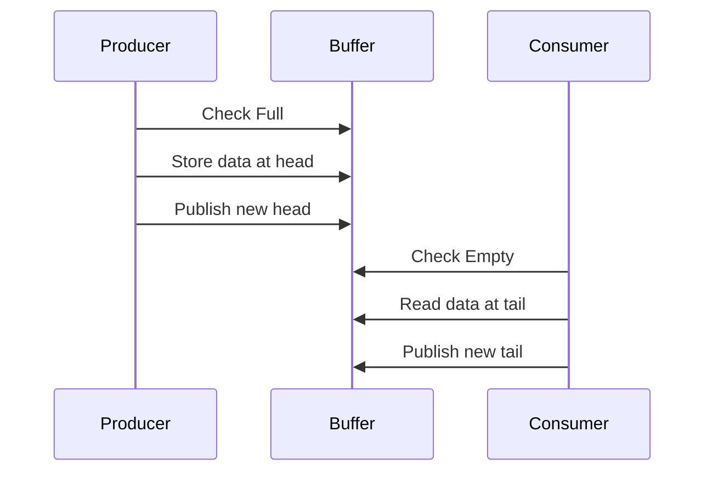

**데이터를 완전히 쓴 뒤 새 `head`를 공개하고, 데이터를 읽은 뒤 새 `tail`을 공개**하는 순서는 동시성 설계에서 중요하다.

## 10. C의 단일 실행 문맥 예시

다음 코드는 Ring Buffer의 자료구조를 설명하는 **단일 실행 문맥용 예시**다. ISR/Task 사이에서 그대로 공유하는 동기화 구현이 아니다.

```c
#include <stdbool.h>
#include <stddef.h>
#include <stdint.h>

#define RB_CAPACITY 8u

typedef struct {
    uint8_t data[RB_CAPACITY];
    size_t head;
    size_t tail;
} RingBuffer;

static size_t rb_next(size_t index)
{
    return (index + 1u) % RB_CAPACITY;
}

static bool rb_empty(const RingBuffer *rb)
{
    return rb->head == rb->tail;
}

static bool rb_full(const RingBuffer *rb)
{
    return rb_next(rb->head) == rb->tail;
}

static bool rb_push(RingBuffer *rb, uint8_t value)
{
    if (rb_full(rb)) {
        return false;
    }

    rb->data[rb->head] = value;
    rb->head = rb_next(rb->head);
    return true;
}

static bool rb_pop(RingBuffer *rb, uint8_t *out)
{
    if (out == NULL || rb_empty(rb)) {
        return false;
    }

    *out = rb->data[rb->tail];
    rb->tail = rb_next(rb->tail);
    return true;
}
```

이 구현은 초기화 시 `head = 0`, `tail = 0`이 필요하다. `RB_CAPACITY`는 최소 2여야 한 칸 비워 두는 방식으로 데이터를 저장할 수 있다.

---

## 11. 시간 복잡도와 공간 복잡도

| 연산 | 일반적인 시간 복잡도 | 설명 |
|---|---|---|
| Push 한 원소 | `O(1)` | 고정 횟수의 검사·저장·인덱스 갱신 |
| Pop 한 원소 | `O(1)` | 고정 횟수의 검사·읽기·인덱스 갱신 |
| Empty / Full | `O(1)` | 상태 비교 |
| `k`개 복사 | `O(k)` | 실제 데이터 수에 비례 |
| 저장 공간 | `O(N)` | 미리 확보한 배열 크기 |

`O(1)`은 **연산량의 증가율**이지 모든 상황에서 동일한 실행 시간이나 Hard Real-time 보장을 뜻하지 않는다. Critical Section 대기, Cache, DMA 경쟁, Scheduler 등의 비용은 별도로 평가해야 한다.

## 12. Overflow: 가득 찼을 때의 정책

| 정책 | 의미 | 사용 시 고려사항 |
|---|---|---|
| Reject New | 새 데이터 수용 실패 | 오래된 데이터 보존, 최신 데이터 손실 |
| Drop Oldest | 가장 오래된 데이터 제거 후 수용 | 최신 데이터 보존, 이전 데이터 손실 |
| Overwrite | 기존 데이터를 덮어씀 | 손실 감지와 읽기 위치 처리 필요 |
| Block / Wait | 공간이 생길 때까지 대기 | Task 문맥에서만 적절한지 검토 |
| Backpressure | 송신 측에 속도 조절 요청 | Protocol·Hardware 지원 필요 |

**ISR에서는 소비자를 기다리는 무기한 Blocking을 피해야 한다.** 어떤 정책을 선택하든 데이터 손실 여부를 호출자가 알 수 있도록 반환값이나 Overflow Counter를 설계하는 것이 중요하다.

## 13. Underflow: 비었을 때의 정책

비어 있는 버퍼에서 Pop을 요청하면 유효한 데이터가 없다. 반환값으로 성공 여부를 분리하는 방식이 흔하다.

```c
bool rb_pop(RingBuffer *rb, uint8_t *out);
```

데이터가 `0x00`일 수 있으므로 **특정 바이트 값을 Empty의 표시로 사용하는 것은 일반적인 바이트 버퍼에서 부적절하다.**

---

## 14. UART RX와 Ring Buffer

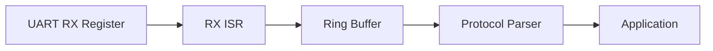

RX ISR의 일반적인 책임은 수신 Register 확인, 필요한 오류 상태 처리, 데이터 수집, Buffer 전달, Interrupt 원인 처리다. 실제 Register 읽기 순서와 Flag Clear 방식은 MCU Reference Manual을 따른다.

Ring Buffer는 **바이트를 순서대로 저장**할 뿐 메시지 경계를 자동으로 찾지 않는다. Packet의 시작·길이·종료·Checksum 등은 상위 Protocol Parser가 해석한다.

## 15. UART TX와 Ring Buffer

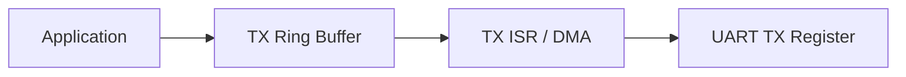

TX에서는 Application이 Producer이고, TX ISR 또는 DMA 처리 경로가 Consumer가 될 수 있다. 빈 상태에서 첫 데이터를 넣은 뒤 **전송 Interrupt나 DMA를 시작하는 시점**을 별도로 설계해야 한다.

UART의 `TXE`/`TX Ready`와 `Transmission Complete`는 다른 의미일 수 있다. Buffer가 비었다고 물리적 송신선의 마지막 비트까지 전송 완료된 것은 아니다.

## 16. Packet Parser와의 관계

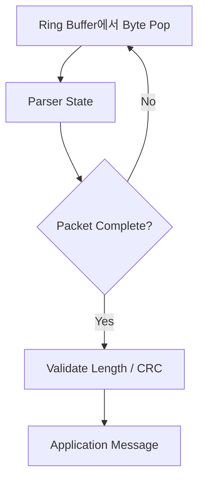

Ring Buffer의 인덱스와 Parser의 상태는 별개의 개념이다. 메시지가 중간에 끊기거나 오류가 발생하면 Parser의 재동기화 정책이 필요할 수 있다.

---

## 17. ISR과 Main Loop 사이의 공유

전형적인 구조는 **Single Producer / Single Consumer(SPSC)** 다.

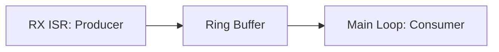

한 칸 비워 두는 설계에서 Producer가 `head`를 갱신하고 Consumer가 `tail`을 갱신하면 각 인덱스의 **쓰기 주체를 하나로 제한**할 수 있다. 하지만 이것만으로 모든 MCU·Compiler에서 안전한 공유가 증명되는 것은 아니다.

확인할 사항은 다음과 같다.

- 인덱스의 Load/Store가 대상 MCU에서 원자적으로 수행되는가?
- 데이터 저장과 인덱스 공개의 순서가 보장되는가?
- Interrupt와 Main Loop가 같은 Memory를 어떻게 관찰하는가?
- Cache가 있는 플랫폼이라면 Coherency가 확보되는가?
- Compiler 및 언어 메모리 모델에 맞는 동기화 수단을 쓰는가?

## 18. `volatile`과 Atomicity는 다르다

```c
volatile size_t head;
volatile size_t tail;
```

이 선언만으로 SPSC Ring Buffer가 범용적으로 안전해지지는 않는다. `volatile`은 원자적 Load/Store, Release/Acquire 순서, Inter-core Synchronization을 보장하지 않는다.

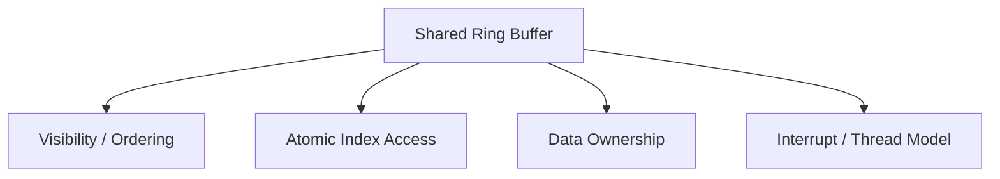

C11/C++11 이후의 `_Atomic`/`std::atomic`은 Thread 간 동기화에 사용할 수 있다. 다만 **ISR에서 특정 Atomic 연산을 안전하게 사용할 수 있는지, Lock-free인지, 라이브러리 호출이 발생하는지**는 대상 환경과 구현을 확인해야 한다.

## 19. C++ SPSC에서의 Publish 순서

개념적으로 Producer는 데이터를 먼저 쓰고, `head`를 Release로 공개한다. Consumer는 `head`를 Acquire로 확인한 뒤 데이터를 읽는다. 반대 방향으로 `tail`을 공개하는 경우에도 적절한 순서가 필요하다.

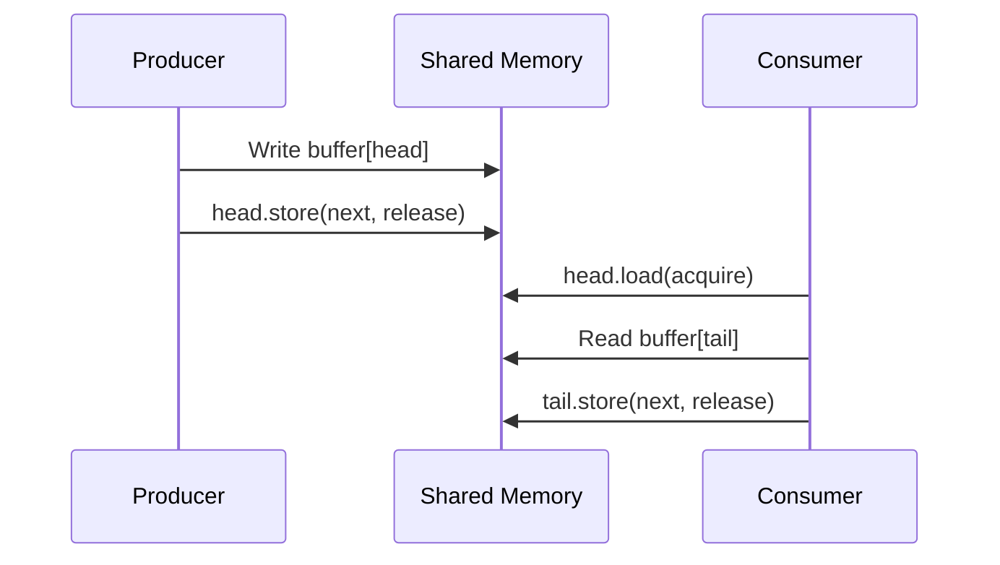

이는 **개념도**이며 완전한 Lock-free 구현 코드는 아니다. 원소 타입, 소유권, Full 검사, Atomic의 지원 여부, DMA와의 상호작용까지 포함해 설계해야 한다.

## 20. Critical Section을 사용하는 방식

작은 MCU에서는 필요한 구간에 Interrupt Masking 등 Critical Section을 적용하는 설계가 더 단순할 수 있다.

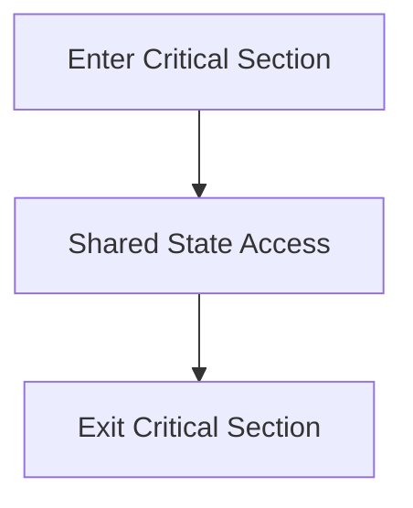

Critical Section은 가능한 짧게 유지한다. **모든 Interrupt를 장시간 비활성화하면 수신 손실이나 Latency 증가**로 이어질 수 있다. RTOS Mutex는 일반적으로 ISR에서 사용할 수 없으므로 ISR 전용 API와 동기화 정책을 구분한다.

## 21. SPSC와 MPSC/MPMC의 차이

| 구조 | Producer | Consumer | 설계 난이도 |
|---|---:|---:|---|
| SPSC | 1 | 1 | 상대적으로 단순 |
| MPSC | 여러 개 | 1 | Producer 간 쓰기 위치 경쟁 처리 필요 |
| SPMC | 1 | 여러 개 | Consumer 간 읽기 위치 경쟁 처리 필요 |
| MPMC | 여러 개 | 여러 개 | 양방향 경쟁 처리 필요 |

UART RX ISR 한 곳과 Main Loop 한 곳 사이의 SPSC 구현을 **여러 Task가 동시에 Pop하는 구조에 그대로 재사용하면 안 된다.**

---

## 22. DMA와 Ring Buffer

DMA는 CPU가 바이트마다 개입하지 않고 Memory와 Peripheral 사이에서 데이터를 이동시키는 기능이다. UART RX DMA와 Ring Buffer를 함께 사용하면 CPU 부담을 줄일 수 있다.

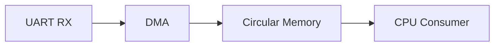

DMA Circular Mode에서는 Hardware가 쓰기 위치를 진행시키며, CPU는 DMA의 남은 전송량·현재 위치·Half/Full/Idle Event 등으로 새 데이터 범위를 계산할 수 있다. **DMA가 사용하는 물리적 위치와 Software의 `head`는 반드시 같은 개념인 것은 아니다.**

## 23. DMA에서 추가로 고려할 문제

- DMA가 아직 쓰는 영역을 CPU가 읽지 않는가?
- CPU가 읽기 전에 DMA가 한 바퀴 돌아 미처리 데이터를 덮어쓰지 않는가?
- DMA Transfer Count를 언제 읽어야 일관된 위치를 얻는가?
- CPU Cache가 있다면 Invalidate/Clean 등 필요한 Cache Maintenance를 수행하는가?
- DMA가 접근 가능한 Memory 영역과 Alignment 조건을 지키는가?
- UART Idle Line과 DMA Half/Full Event가 어떤 단위로 새 데이터를 알리는가?

**`volatile`만으로 DMA Cache Coherency가 해결되지는 않는다.** DMA/Cache 제어 절차는 MCU·SoC와 SDK 문서를 따른다.

## 24. Zero-copy와 두 구간 처리

Ring Buffer에 연속된 데이터가 있어도 물리적 배열의 끝을 지나면 두 구간으로 나뉜다.

```text
Physical Array:
+---+---+---+---+---+---+---+---+
| C | D |   |   |   | A | B |   |
+---+---+---+---+---+---+---+---+
Read Order: A → B → C → D
```

이때 연속 메모리를 요구하는 API에는 다음 두 구간을 나누어 전달하거나 별도 Linear Buffer로 복사할 수 있다.

```text
Segment 1: tail → end
Segment 2: begin → head
```

Zero-copy는 복사 비용을 줄일 수 있지만, **Consumer가 해당 메모리를 사용하는 동안 Producer가 덮어쓰지 못하도록 수명·소유권을 관리**해야 한다.

---

## 25. Buffer 크기 선정

필요한 크기는 단순히 평균 데이터율만으로 결정되지 않는다.

```text
Required Buffer ≳ Arrival Rate × Maximum Service Delay + Burst Margin
```

이 식은 **초기 산정용 개념식**이다. 실제로는 다음을 함께 검토한다.

| 요소 | 의미 |
|---|---|
| Baud Rate / Frame Format | 단위 시간당 수신 바이트 수 |
| Burst Size | 짧은 시간에 몰리는 데이터량 |
| Worst-case Processing Delay | 소비자가 처리하지 못하는 최장 시간 |
| Interrupt Masking Time | 수신 경로가 지연되는 시간 |
| RTOS Scheduling | Consumer Task가 실행되기까지의 지연 |
| Usable Capacity | 한 칸 비워 두기 등의 실제 저장 가능량 |
| Overflow Tolerance | 데이터 손실 허용 여부 |

예를 들어 일반적인 8N1 UART에서는 한 바이트 프레임이 Start 1 + Data 8 + Stop 1 = **10비트 시간**을 차지한다. 실제 데이터율 계산에는 Baud Rate와 프레임 형식을 함께 사용한다.

## 26. Ring Buffer와 Queue의 차이

Ring Buffer는 저장 구조이고 Queue는 FIFO 동작을 뜻하는 추상 자료형이다. Ring Buffer로 Queue를 구현할 수 있지만 두 단어가 완전히 같은 의미는 아니다.

| 항목 | Ring Buffer | 일반적인 동적 Queue 구현 |
|---|---|---|
| 저장 공간 | 보통 고정 크기 | 구현에 따라 확장 가능 |
| Allocation | 초기화 이후 불필요하게 설계 가능 | 동적 할당이 발생할 수 있음 |
| 최대 저장량 | 명시적으로 제한 | 메모리·정책에 따름 |
| 실행 시간 예측 | 고정 크기 구조로 분석 용이 | Allocation 등 고려 필요 |

C++의 `std::queue`는 **Container Adaptor**이며, 자체적으로 Ring Buffer임을 보장하지 않는다.

## 27. C++에서의 표현

고정 크기 배열은 `std::array`로 표현할 수 있다.

```cpp
#include <array>
#include <cstddef>
#include <cstdint>

template <std::size_t N>
struct RingStorage {
    static_assert(N >= 2);
    std::array<std::uint8_t, N> data{};
    std::size_t head{};
    std::size_t tail{};
};
```

`std::array` 자체는 Heap Allocation을 요구하지 않는다. 그러나 객체가 어디에 배치되는지는 선언 위치와 소유 구조에 따라 달라진다. `std::vector`도 Ring Buffer의 저장소로 활용할 수 있지만 기본 Allocator의 동적 할당 정책과 Capacity 변화를 별도로 검토해야 한다.

---

## 28. 자주 혼동하는 개념

| 오해 | 정확한 구분 |
|---|---|
| Ring Buffer는 데이터 손실이 없다 | Full 정책과 처리율에 따라 손실 가능 |
| `head == tail`이면 언제나 Empty | Full/Empty 구분 방식에 따라 달라짐 |
| Capacity가 8이면 8개 저장 가능 | 한 칸 비우는 설계에서는 7개 |
| `%`는 항상 느리다 | 상수 최적화와 CPU에 따라 다름 |
| `volatile`이면 ISR 공유가 안전하다 | Atomicity와 Ordering은 별도 문제 |
| SPSC면 자동으로 Lock-free다 | 메모리 모델·원자성·구현 조건 필요 |
| DMA Circular Mode가 Overflow를 막는다 | CPU가 느리면 미처리 영역을 덮어쓸 수 있음 |
| Ring Buffer가 Packet을 구분한다 | Packet 경계는 Parser/Protocol의 책임 |
| TX Buffer Empty는 전송 완료다 | UART Shift Register의 전송 완료와 다름 |
| `O(1)`이면 Hard Real-time이다 | 최악 지연과 시스템 간섭을 별도 분석해야 함 |

## 29. 설계 검토 체크리스트

- [ ] `head`와 `tail`의 의미를 문서화했는가?
- [ ] Empty/Full 구분 방식과 **실제 사용 가능 용량**을 명시했는가?
- [ ] Overflow 시 Reject/Overwrite/Backpressure 중 정책을 정했는가?
- [ ] 데이터 손실을 감지할 반환값 또는 Counter가 있는가?
- [ ] Producer와 Consumer의 수와 실행 문맥을 확인했는가?
- [ ] 공유 인덱스의 원자성·순서·Cache 요구사항을 검토했는가?
- [ ] ISR에서 Blocking하거나 긴 작업을 하지 않는가?
- [ ] DMA 사용 시 Overwrite와 Cache Coherency를 고려했는가?
- [ ] Buffer 크기에 Burst와 최악 처리 지연을 반영했는가?
- [ ] UART Byte Stream과 Protocol Packet 처리를 분리했는가?

## 30. 전체 개념도

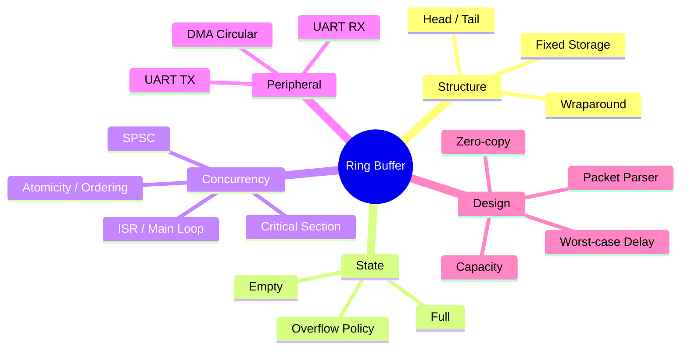

---

## 다음 학습

**다음 문서:** `05_Embedded/FSM.md` — Finite State Machine의 상태·이벤트·전이, UART Packet Parser와 장치 제어, Interrupt/Task와의 연결을 개념 중심으로 정리한다.
