# FSM (Finite State Machine)

> **학습 위치:** `C_Cpp_Study/05_Embedded/FSM.md`
> **연결 흐름:** `Register → Interrupt → UART → Ring Buffer → FSM`
> **범위:** 임베디드 펌웨어에서의 유한 상태 기계 개념과 설계 원칙. 실습·퀴즈는 포함하지 않는다.

---

## 1. FSM이란?

**FSM(Finite State Machine, 유한 상태 기계)**은 시스템이 유한한 개수의 **상태(State)** 중 하나에 있으며, **이벤트(Event)** 또는 **조건(Guard)**에 따라 다른 상태로 이동하는 동작 모델이다.

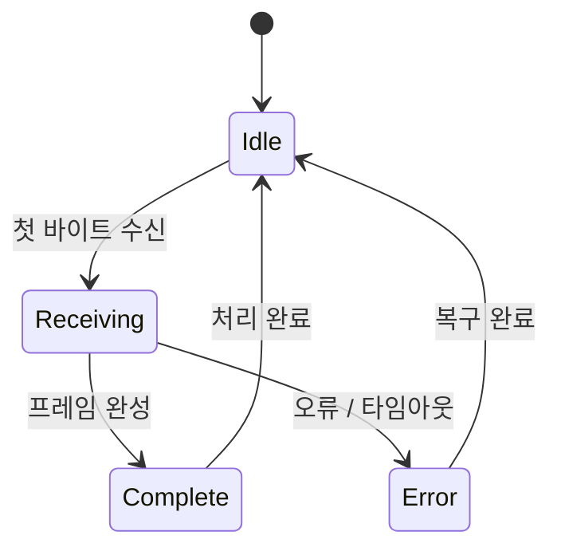

FSM은 코드를 특정 문법으로 작성하는 기법이라기보다 **동작과 전이 규칙을 명시적으로 표현하는 설계 방법**이다.

### 핵심 요소

| 요소          | 의미                              | UART 수신 예시                    |
| ------------- | --------------------------------- | --------------------------------- |
| State         | 현재 동작 단계                    | `WAIT_HEADER`, `READ_PAYLOAD` |
| Event         | 상태 변화를 유발하는 사건         | 바이트 도착, 타임아웃             |
| Transition    | 상태 간 이동                      | 헤더 수신 → 길이 수신            |
| Guard         | 전이의 추가 조건                  | 길이가 버퍼 용량 이내인가?        |
| Action        | 전이 시 또는 상태에서 수행할 작업 | 버퍼에 저장, 오류 카운트 증가     |
| Initial State | 시작 상태                         | `WAIT_HEADER`                   |

---

## 2. 임베디드에서 FSM이 필요한 이유

펌웨어는 한 번의 함수 호출로 끝나지 않는 작업을 자주 처리한다.

- UART로 여러 바이트에 걸친 명령 수신
- 버튼 눌림·길게 누름·떼기 판정
- 센서 초기화 → 측정 → 결과 처리
- 모터 정지 → 기동 → 운전 → 오류 정지
- 통신 연결 → 대기 → 재시도 → 복구

이런 흐름을 여러 플래그와 중첩된 `if` 문으로만 관리하면 **현재 가능한 동작과 예외 상황**을 파악하기 어려워진다.


FSM은 모든 문제를 해결하는 것은 아니지만, **단계별로 허용되는 입력과 반응이 명확한 제어 로직**에 적합하다.

---

## 3. State와 Event의 구분

- **State:** 지금 시스템이 *어떤 단계에 있는가?*
- **Event:** 지금 시스템에 *무슨 일이 발생했는가?*

| 구분   | 예시                        | 지속성               |
| ------ | --------------------------- | -------------------- |
| State  | `WAIT_ACK`                | 다음 전이까지 유지   |
| Event  | `ACK_RECEIVED`            | 처리할 사건으로 전달 |
| Guard  | `retry_count < MAX_RETRY` | 전이 시 평가         |
| Action | 재전송 요청                 | 전이 과정에서 실행   |

`timeout`은 보통 **타이머 만료로 발생한 이벤트**이고, `WAIT_ACK`는 **상태**다. 반면 `TIMEOUT_ERROR`를 상태로 두는 설계도 가능하다. 구분 기준은 이름이 아니라 **설계에서 맡는 역할**이다.

---

## 4. 전이(Transition)를 정확히 정의하기

전이는 보통 다음과 같이 표현한다.

```text
(Current State, Event, Guard)
    → Action
    → Next State
```

| 현재 상태   | 이벤트    | Guard     | Action      | 다음 상태   |
| ----------- | --------- | --------- | ----------- | ----------- |
| `IDLE`    | `START` | 준비 완료 | 장치 활성화 | `RUNNING` |
| `RUNNING` | `STOP`  | —        | 장치 정지   | `IDLE`    |
| `RUNNING` | `FAULT` | —        | 출력 차단   | `ERROR`   |
| `ERROR`   | `RESET` | 오류 해소 | 상태 초기화 | `IDLE`    |

전이표는 구현 전에 **누락된 이벤트, 불가능한 상태 이동, 오류 처리 부재**를 확인하는 데 유용하다.

---

## 5. Moore와 Mealy 모델

FSM의 출력이 무엇에 의해 결정되는지에 따른 대표적인 분류다.

| 모델  | 출력 결정 기준          | 특징                                      |
| ----- | ----------------------- | ----------------------------------------- |
| Moore | 현재 State              | 상태별 출력 정의가 명확함                 |
| Mealy | 현재 State와 입력/Event | 입력에 대한 즉각적인 반응을 표현하기 쉬움 |

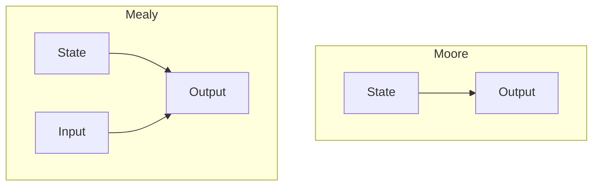

실제 펌웨어에서는 두 방식을 엄격히 분리하기보다 **상태 진입 동작과 이벤트 처리 동작을 함께 사용하는 혼합형 설계**도 흔하다.

---

## 6. Entry, Do, Exit Action

상태에서 수행하는 동작을 세 가지로 나눠 생각할 수 있다.

| 종류  | 실행 시점            | 예시                    |
| ----- | -------------------- | ----------------------- |
| Entry | 상태에 진입할 때     | 타임아웃 시작, LED 켜기 |
| Do    | 상태를 유지하는 동안 | 수신 데이터 확인        |
| Exit  | 상태에서 벗어날 때   | 타이머 정지, 자원 정리  |

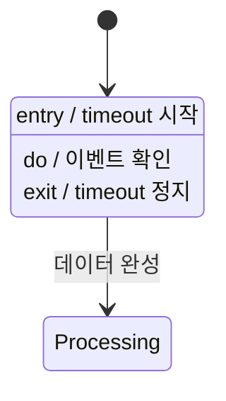

**Entry Action을 매 주기마다 실행하는 실수**에 주의한다. 예를 들어 상태를 유지하는 동안 타임아웃 시작 시각을 계속 갱신하면 타임아웃이 발생하지 않을 수 있다.

---

## 7. C에서의 기본 표현

상태를 `enum`으로 명시하고 `switch`로 분기하는 방식은 작고 이해하기 쉬운 FSM에 적합하다.

```c
#include <stdbool.h>

typedef enum {
    STATE_IDLE,
    STATE_RUNNING,
    STATE_ERROR
} State;

typedef enum {
    EVENT_NONE,
    EVENT_START,
    EVENT_STOP,
    EVENT_FAULT,
    EVENT_RESET
} Event;

typedef struct {
    State state;
} Controller;

void controller_dispatch(Controller *controller, Event event)
{
    switch (controller->state) {
    case STATE_IDLE:
        if (event == EVENT_START) {
            controller->state = STATE_RUNNING;
        }
        break;

    case STATE_RUNNING:
        if (event == EVENT_FAULT) {
            controller->state = STATE_ERROR;
        } else if (event == EVENT_STOP) {
            controller->state = STATE_IDLE;
        }
        break;

    case STATE_ERROR:
        if (event == EVENT_RESET) {
            controller->state = STATE_IDLE;
        }
        break;

    default:
        controller->state = STATE_ERROR;
        break;
    }
}
```

이 예시는 **전이 구조만 표현**한다. 실제 장치 제어에는 상태 전이와 함께 필요한 Hardware Action, Guard, 초기화, 오류 복구 정책이 포함되어야 한다.

### 구조 선택

| 방식             | 적합한 경우                     | 고려사항                                 |
| ---------------- | ------------------------------- | ---------------------------------------- |
| `switch` 기반  | 상태 수가 적고 흐름이 단순함    | 상태·이벤트 증가 시 함수가 커질 수 있음 |
| 전이 테이블      | 규칙적인 상태/이벤트 조합       | Guard·Action 표현을 설계해야 함         |
| 함수 포인터 기반 | 상태별 처리가 독립적임          | 호출 흐름을 추적하기 어려울 수 있음      |
| C++ 클래스 기반  | 상태 데이터·자원 소유권 캡슐화 | 과도한 동적 할당·상속은 필요성 검토     |

---

## 8. 상태와 데이터는 별개다

FSM은 상태만으로 모든 정보를 표현하지 않는다.

```c
typedef struct {
    State state;
    unsigned int retry_count;
    unsigned int received_length;
    bool error_latched;
} ControllerContext;
```

- `state`: 현재 동작 단계
- `retry_count`: 재시도 횟수
- `received_length`: 수신 진행 정도
- `error_latched`: 별도로 보존할 오류 정보

**모든 변수 조합을 새로운 State로 만들면 상태 폭발(State Explosion)이 발생한다.** 단계는 State로, 연속적인 수치와 부가 정보는 Context로 표현하는 것이 일반적이다.

---

## 9. 이벤트가 없을 때의 처리

이벤트 기반 FSM은 **새 사건이 없으면 상태를 유지**할 수 있다.

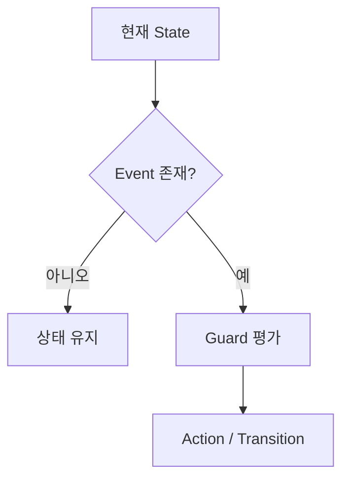

`EVENT_NONE`을 별도로 정의할 수도 있고, 이벤트 큐가 비어 있으면 Dispatch를 호출하지 않을 수도 있다. 어느 방식을 택하든 **이벤트가 없다는 사실을 상태 변화로 오해하지 않도록** 한다.

---

## 10. 이벤트 우선순위와 충돌

같은 순간에 여러 사건이 관찰될 수 있다.

```text
RUNNING 상태
 ├─ STOP 요청
 └─ FAULT 발생
```

오류가 안전과 관련된다면 `FAULT`를 먼저 처리하도록 정책을 정할 수 있다. 다만 구체적인 우선순위는 시스템 요구사항에 따라 달라진다.

| 설계 질문               | 예시                  |
| ----------------------- | --------------------- |
| 동시 이벤트 우선순위는? | `FAULT`와 `STOP`  |
| 이벤트를 버려도 되는가? | 중복된`READY`       |
| 순서 보존이 필요한가?   | UART 수신 바이트      |
| 이벤트를 합쳐도 되는가? | 반복된 상태 변경 요청 |
| 반드시 처리해야 하는가? | 안전 관련 오류        |

**FSM 자체가 이벤트 순서와 우선순위를 자동으로 결정하지 않는다.** 이벤트 전달 계층의 정책도 함께 설계해야 한다.

---

## 11. UART 수신 FSM

UART는 바이트 스트림을 제공한다. 패킷의 시작·길이·본문·검증 정보는 상위 Protocol에서 해석해야 한다.

가상의 프레임:

```text
[HEADER][LENGTH][PAYLOAD ...][CHECKSUM]
```

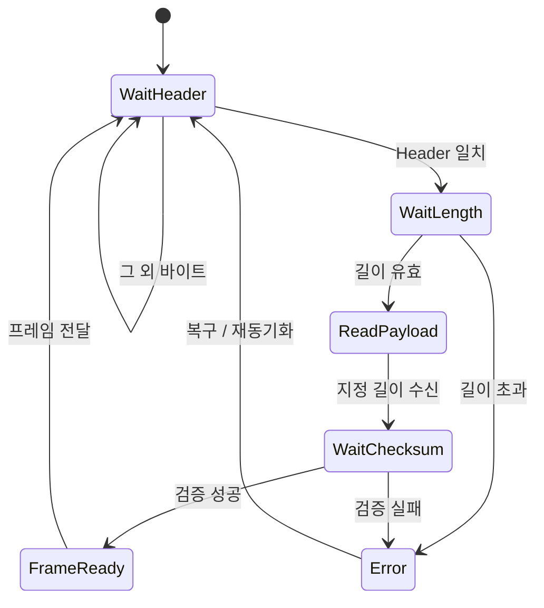

### 설계상 핵심

1. Header가 아닌 바이트는 어떻게 처리하는가?
2. LENGTH가 0일 때 다음 단계는 무엇인가?
3. LENGTH가 수신 버퍼를 초과하면 어떻게 처리하는가?
4. 프레임 중간에 타임아웃이 나면 어디로 복귀하는가?
5. CHECKSUM 실패 후 다음 Header를 어떻게 찾는가?
6. 완성된 프레임의 버퍼 소유권은 누가 갖는가?

위 질문은 개념 설계 항목이며 실습 과제가 아니다.

---

## 12. Ring Buffer와 FSM의 역할 분리

**Ring Buffer는 바이트를 보관하고, FSM은 바이트의 의미를 해석한다.**

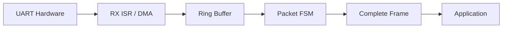

| 계층        | 책임                                |
| ----------- | ----------------------------------- |
| UART Driver | 바이트 수신과 Hardware 오류 처리    |
| Ring Buffer | 생산자·소비자 간 데이터 보관       |
| Packet FSM  | Header/Length/Payload/Checksum 해석 |
| Application | 명령 실행 및 응답 생성              |

이 분리는 **Interrupt 처리 시간을 줄이고 Protocol 변경이 UART Driver에 영향을 주는 범위를 제한**하는 데 도움이 된다.

---

## 13. ISR에서 FSM을 실행할 것인가?

두 가지 설계가 가능하다.

| 구조                                    | 장점                           | 주의점                           |
| --------------------------------------- | ------------------------------ | -------------------------------- |
| ISR에서 FSM 처리                        | 사건에 빠르게 반응             | ISR 실행 시간·복잡도 증가       |
| ISR은 저장/알림, Main/Task에서 FSM 처리 | 책임 분리·응답 시간 관리 용이 | Buffer 크기·지연·Overflow 고려 |

일반적인 UART 수신에서는 **ISR이 바이트를 Ring Buffer에 넣고 Main Loop 또는 RTOS Task가 FSM을 실행**하는 구조를 자주 사용한다. 단, 짧고 실행 시간이 엄격히 제한된 FSM을 ISR에서 처리하는 설계도 가능하다.

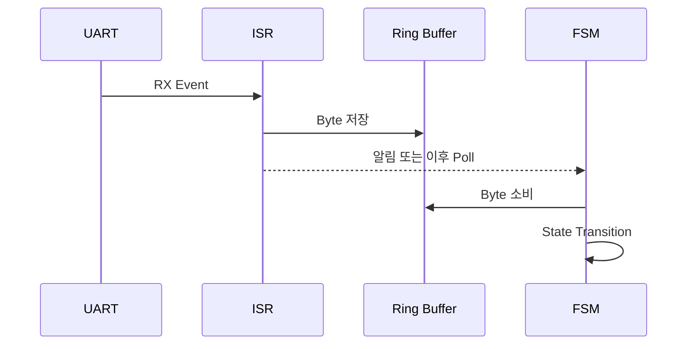

---

## 14. Timeout을 FSM에 포함하기

시간 조건도 전이 규칙으로 모델링한다.

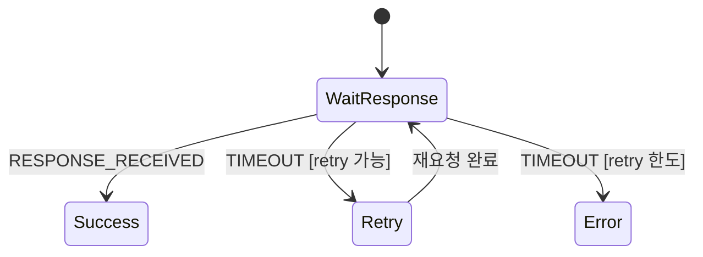

### 상대 시간 비교

고정 폭의 **Unsigned Tick Counter**를 사용할 때는 카운터 Wrap-around를 고려한 차이 계산을 사용할 수 있다.

```c
#include <stdint.h>

uint32_t elapsed = (uint32_t)(now_tick - start_tick);
if (elapsed >= timeout_ticks) {
    /* Timeout event */
}
```

이 패턴은 카운터와 타임아웃 범위, 실제 Tick의 Wrap-around 의미가 일치한다는 전제에서 사용한다. **긴 기간의 다중 Wrap-around까지 자동으로 추적하지는 못한다.** Tick의 폭과 시스템 시간 정책을 확인해야 한다.

**Timeout 시작 시각은 보통 상태 진입 시 한 번 설정**하며, 매번 Dispatch할 때 초기화하지 않는다.

---

## 15. Blocking FSM과 Non-blocking FSM

| 방식         | 예시                             | 영향                                   |
| ------------ | -------------------------------- | -------------------------------------- |
| Blocking     | 상태 처리 함수에서 응답까지 대기 | 다른 작업의 진행을 막을 수 있음        |
| Non-blocking | 이벤트 확인 후 바로 반환         | Main Loop/Task에서 여러 작업 조정 가능 |

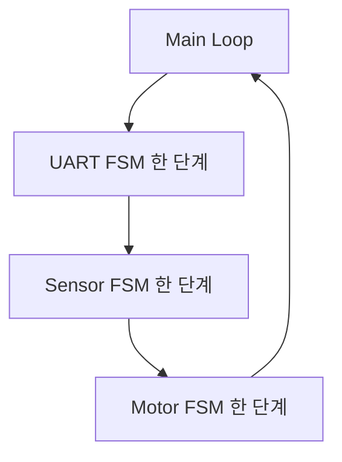

**Non-blocking은 함수가 아무 일도 하지 않는다는 뜻이 아니라, 긴 대기로 실행 흐름을 점유하지 않는다는 뜻**이다. 각 단계의 실행 시간과 전체 응답 지연은 여전히 분석해야 한다.

---

## 16. Main Loop 기반 FSM과 RTOS Task 기반 FSM

| 관점        | Main Loop                | RTOS Task                         |
| ----------- | ------------------------ | --------------------------------- |
| 실행 시점   | 반복 루프에서 순차 호출  | Scheduler에 따라 실행             |
| 이벤트 전달 | Polling, Flag, Queue 등  | Queue, Notification, Semaphore 등 |
| 시간 관리   | Tick 비교·주기 호출     | Timer·Timeout API 등             |
| 공유 데이터 | ISR·다른 실행 문맥 고려 | Task 간 동기화 추가 고려          |


RTOS를 사용해도 FSM의 **상태·이벤트·전이 정의는 그대로 유효**하다. 달라지는 것은 주로 실행 문맥과 이벤트 전달 방식이다.

---

## 17. 동시성과 단일 소유자 원칙

하나의 FSM Context를 ISR과 여러 Task가 동시에 변경하면 전이 순서가 깨질 수 있다.

```text
ISR: state = ERROR
Task: 이전 state를 읽고 state = RUNNING
```

가능한 구조:

- FSM Context의 변경 권한을 **한 실행 문맥**에 집중한다.
- 다른 문맥은 Event Queue 등으로 사건을 전달한다.
- 공유 자원에는 시스템에 맞는 Atomic Operation, Critical Section, Lock 등을 적용한다.

`volatile`은 이러한 동기화를 대신하지 않는다. **Queue 사용만으로 모든 공유 자원의 동시성 문제가 해결되는 것도 아니다.**

---

## 18. 오류 상태와 복구 정책

오류가 발생했을 때 항상 `IDLE`로 돌아가는 것은 적절하지 않을 수 있다.

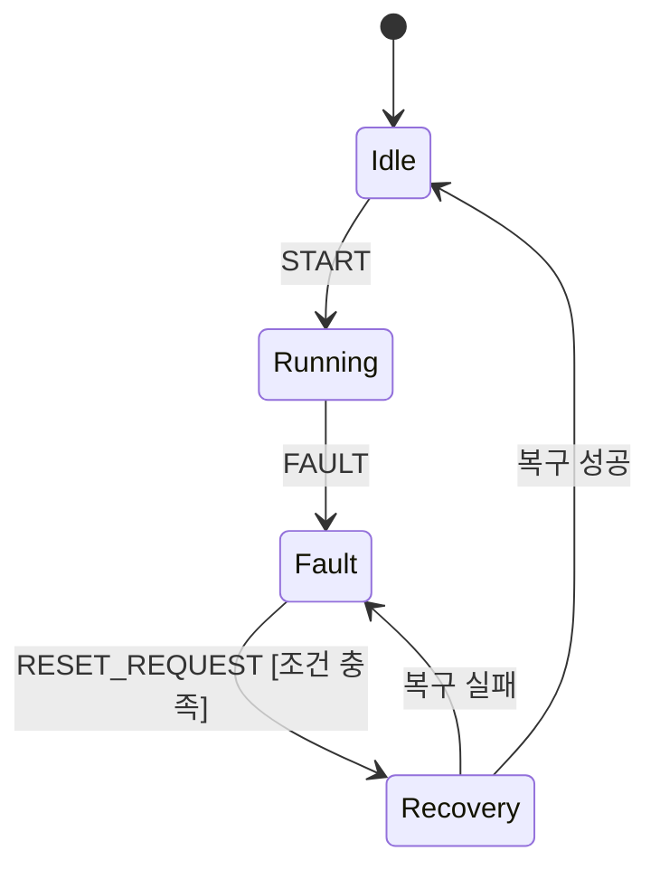

오류 상태에서 정해야 할 항목:

| 항목               | 의미                                |
| ------------------ | ----------------------------------- |
| Safe Output        | 모터·출력 등의 안전한 상태         |
| Error Latching     | 오류를 복구 전까지 유지할지         |
| Retry Policy       | 재시도 횟수·간격                   |
| Recovery Condition | 복구 허용 조건                      |
| Logging            | 오류 원인과 발생 시점 보존          |
| Watchdog           | 비정상 정지 시 시스템 복구와의 관계 |

안전 관련 기능은 단순 FSM 예시만으로 충분하지 않으며 제품 요구사항과 해당 안전 표준을 별도로 검토해야 한다.

---

## 19. 상태 폭발(State Explosion)

여러 독립 기능을 하나의 State에 합치면 조합 수가 급격히 늘어난다.

```text
통신: 3 States
모터: 4 States
센서: 5 States

단일 조합 상태의 최대 경우의 수: 3 × 4 × 5 = 60
```

대안:

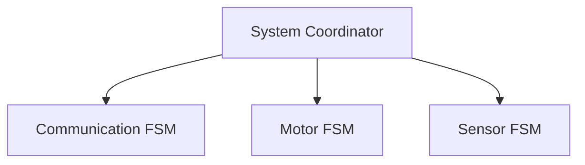

독립된 동작을 별도 FSM으로 분리하고, 상위 Coordinator가 **FSM 간 이벤트와 제약**을 조정할 수 있다. 단, 기능 사이의 강한 결합을 무조건 분리하면 오히려 전이 관계가 불명확해질 수 있다.

---

## 20. 계층형 FSM(Hierarchical State Machine)

여러 상태에 공통 규칙이 있으면 상위 상태로 묶는 방식이 유용하다.

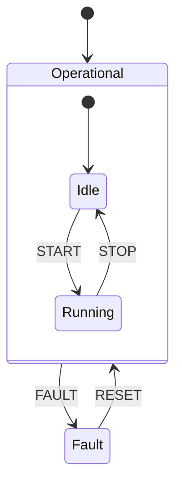

`IDLE`과 `RUNNING` 모두에서 발생하는 `FAULT`를 상위 상태 `Operational`의 전이로 표현할 수 있다.

단순한 FSM에서는 계층화를 도입하지 않아도 된다. **중복 규칙이 많아질 때 고려하는 확장 방법**이다.

---

## 21. 전이 누락과 기본 처리 정책

정의되지 않은 이벤트를 어떻게 처리할지 결정해야 한다.

| 정책   | 적합한 상황                         | 주의                           |
| ------ | ----------------------------------- | ------------------------------ |
| Ignore | 현재 상태에서 의미 없는 중복 이벤트 | 중요한 오류를 숨기지 않아야 함 |
| Reject | 잘못된 명령을 호출자에게 알림       | 오류 응답 방식 정의            |
| Defer  | 다른 상태에서 나중에 처리           | Queue 용량·순서·만료 고려    |
| Fault  | 규약 위반을 오류로 처리             | 과도한 오류 전이 방지          |

**`default:`에서 무조건 무시하는 구현**은 초기에는 편리하지만 예기치 않은 상태값이나 이벤트를 감출 수 있다.

---

## 22. 상태 불변식(Invariant)

불변식은 특정 상태에서 항상 성립해야 하는 조건이다.

| State            | Invariant 예시         |
| ---------------- | ---------------------- |
| `IDLE`         | 모터 구동 명령 비활성  |
| `WAIT_PAYLOAD` | 수신 길이 ≤ 버퍼 용량 |
| `WAIT_ACK`     | 대기 타이머가 유효     |
| `FAULT`        | 위험 출력 차단         |

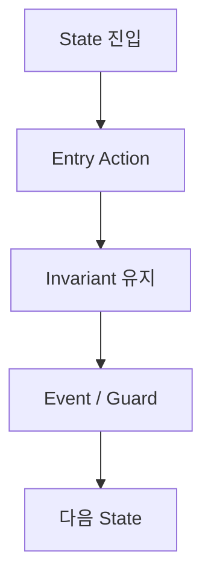

불변식을 정해 두면 전이표가 단순히 “어디로 이동하는가”를 넘어 **상태가 의미하는 안전·동작 조건**을 표현한다.

---

## 23. 상태 진입과 전이 순서

전이 과정에서 다음 중 어떤 순서를 사용할지 일관되게 정해야 한다.

```text
Old State Exit
→ Transition Action
→ Update State
→ New State Entry
```

혹은 구현 특성에 따라 State 갱신 시점이 달라질 수 있다. 중요한 것은 **Callback, ISR, 다른 Task가 중간 상태를 관찰할 수 있는지**와 **Action 실패 시 어떤 상태가 남는지**를 정의하는 것이다.

특히 Hardware Action이 실패할 수 있다면 “상태만 먼저 변경하고 실제 장치는 이전 상태로 남는” 불일치를 고려해야 한다.

---

## 24. FSM과 C++

C++에서는 Context와 전이 함수를 클래스로 묶을 수 있다.

```cpp
#include <cstdint>

enum class State : std::uint8_t {
    Idle,
    Running,
    Error
};

enum class Event : std::uint8_t {
    Start,
    Stop,
    Fault,
    Reset
};

class Controller {
public:
    void dispatch(Event event) noexcept {
        switch (state_) {
        case State::Idle:
            if (event == Event::Start) state_ = State::Running;
            break;
        case State::Running:
            if (event == Event::Fault) state_ = State::Error;
            else if (event == Event::Stop) state_ = State::Idle;
            break;
        case State::Error:
            if (event == Event::Reset) state_ = State::Idle;
            break;
        }
    }

    [[nodiscard]] State state() const noexcept { return state_; }

private:
    State state_{State::Idle};
};
```

- `enum class`는 상태·이벤트 타입을 구분한다.
- 클래스는 State와 Context를 캡슐화한다.
- FSM 구현에 동적 메모리 할당이나 가상 함수가 **반드시 필요한 것은 아니다**.
- C와 C++ 모두 같은 전이 모델을 표현할 수 있다.

---

## 25. FSM과 RTOS는 경쟁 개념이 아니다

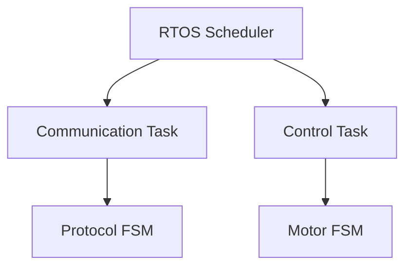

- **FSM:** 어떤 상태에서 어떤 이벤트에 어떻게 반응할 것인가?
- **RTOS:** 어떤 Task를 언제 실행할 것인가?

RTOS가 없어도 FSM은 가능하며, RTOS가 있어도 복잡한 제어 흐름을 명확히 하기 위해 FSM이 유용하다.

---

## 26. 흔한 오해와 주의점

| 오해                                     | 정확한 이해                                                 |
| ---------------------------------------- | ----------------------------------------------------------- |
| FSM은`switch` 문이다                   | `switch`는 여러 구현 방식 중 하나다                       |
| State가 많을수록 설계가 정교하다         | 불필요한 State는 복잡도를 증가시킨다                        |
| 이벤트가 없으면 무조건 상태를 초기화한다 | 보통 기존 State를 유지한다                                  |
| Timeout은 반복문에서 오래 기다리면 된다  | Non-blocking FSM에서는 시간 만료를 Event로 모델링할 수 있다 |
| `volatile` State면 동시성이 안전하다   | Atomicity·동기화·소유권이 별도로 필요하다                 |
| ISR에서 FSM을 실행하면 항상 빠르다       | ISR Latency와 다른 Interrupt에 미치는 영향을 고려해야 한다  |
| Ring Buffer가 패킷을 완성해 준다         | Ring Buffer는 저장, Packet FSM은 해석을 담당한다            |
| 오류 발생 시`IDLE`로 복귀하면 된다     | Safe State와 복구 조건을 정의해야 한다                      |
| RTOS가 있으면 FSM이 불필요하다           | Scheduling과 State Transition은 다른 책임이다               |

---

## 27. 설계 검토 체크리스트

- [ ] 초기 State가 명확하다.
- [ ] 각 State에서 허용되는 Event가 정의되어 있다.
- [ ] Guard와 Action이 전이표에 구분되어 있다.
- [ ] Entry Action이 반복 실행되지 않는다.
- [ ] Timeout의 시작·만료·취소 시점이 정해져 있다.
- [ ] 오류 발생 시 Safe State와 복구 조건이 정해져 있다.
- [ ] 동시에 발생하는 Event의 우선순위와 처리 순서가 정해져 있다.
- [ ] Event Queue의 Overflow 정책이 정해져 있다.
- [ ] FSM Context의 변경 주체와 동기화 방식이 정해져 있다.
- [ ] ISR에서 수행하는 처리량이 제한되어 있다.
- [ ] State와 부가 데이터(Context)가 구분되어 있다.
- [ ] 각 State의 Invariant가 설명 가능하다.

---

## 28. 전체 연결 요약

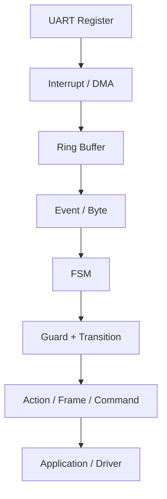

> **FSM은 상태를 저장하는 자료구조가 아니라, 상태·이벤트·조건·동작 사이의 관계를 명시하는 설계 모델이다.**

> **임베디드에서는 ISR/RTOS/Main Loop가 이벤트를 전달하고 FSM이 단계별 동작을 결정하도록 책임을 분리할 수 있다.**

> **안전한 FSM 설계에는 정상 전이뿐 아니라 타임아웃, 오류, 복구, 이벤트 누락, 동시성까지 포함된다.**

---

## 다음 학습

**다음 문서:** `05_Embedded/RTOS.md`

FSM을 Task, Scheduler, Queue, Semaphore, Mutex, Timer 등 RTOS 구성 요소와 연결해 정리한다.
