# RTOS — 실시간 운영체제 개념 정리

> **학습 위치:** `C_Cpp_Study/05_Embedded/RTOS.md`  
> **선행 개념:** `Register.md`, `Interrupt.md`, `UART.md`, `Ring_Buffer.md`, `FSM.md`  
> **기준:** 일반적인 임베디드 RTOS 개념. FreeRTOS·Zephyr·ThreadX 등의 구체적인 API와 정책은 서로 다를 수 있다.  
> **구성:** 개념·비교·설계 관점 중심. 실습과 퀴즈는 포함하지 않는다.

---

## 1. RTOS란?

**RTOS(Real-Time Operating System)**는 여러 작업을 관리하면서, 중요한 작업이 정해진 시간 제약 안에 실행되도록 설계된 운영체제다.

여기서 *Real-Time*은 단순히 처리 속도가 빠르다는 뜻이 아니다. **결과의 정확성뿐 아니라 결과가 나오는 시점도 올바름의 일부**라는 뜻이다.

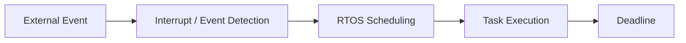

예를 들어 센서 값을 10 ms마다 읽어 제어 출력을 갱신해야 하는 시스템에서는 평균 실행 속도보다 **최악의 상황에서도 시간 제한을 지킬 수 있는지**가 중요하다.

## 2. Bare-Metal과 RTOS

| 구분 | Bare-Metal Super Loop | RTOS |
|---|---|---|
| 실행 구조 | 반복 루프와 ISR 중심 | Task, Scheduler, ISR 중심 |
| 작업 분리 | 상태 변수·함수로 분리 | 독립 Task로 분리 가능 |
| 작업 전환 | 개발자가 직접 흐름 설계 | Scheduler가 관리 |
| 시간 관리 | Timer·Tick·직접 구현 | Delay, Timeout, Timer 등 제공 |
| 동기화 | 직접 구현 | Mutex, Semaphore, Queue 등 제공 |
| 비용 | 작은 메모리·단순한 구조 가능 | Kernel·Task Stack 등 추가 비용 |
| 적합성 | 기능이 단순하고 흐름이 명확한 장치 | 독립적인 작업과 시간 제약이 많은 장치 |

RTOS를 사용한다고 모든 설계가 자동으로 실시간성을 만족하는 것은 아니다. 반대로 Bare-Metal이라고 실시간 제어가 불가능한 것도 아니다.

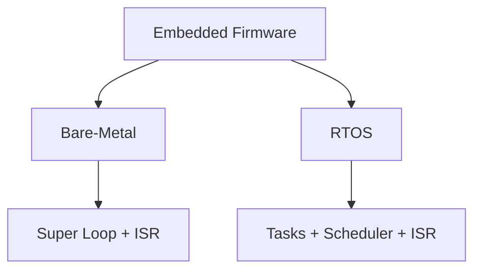

## 3. Hard / Firm / Soft Real-Time

| 구분 | Deadline을 놓쳤을 때 | 예시 성격 |
|---|---|---|
| Hard Real-Time | 시스템 요구사항 위반이 중대하거나 허용되지 않음 | 엄격한 제어·안전 관련 경로 |
| Firm Real-Time | 늦은 결과는 가치가 없지만 가끔의 미준수가 반드시 전체 실패는 아님 | 유효 시간이 짧은 데이터 처리 |
| Soft Real-Time | 지연이 품질 저하로 이어짐 | 사용자 반응·일부 통신 처리 |

분류는 **제품과 요구사항에 따라 달라진다.** 특정 Peripheral이나 기능 이름만으로 Hard Real-Time 여부를 단정하지 않는다.

## 4. RTOS의 주요 구성 요소

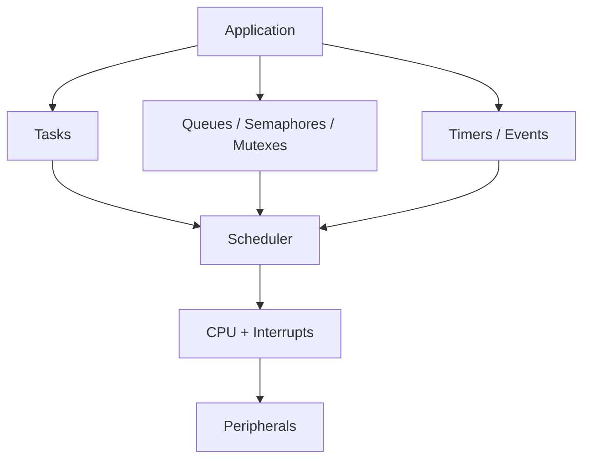

| 구성 요소 | 역할 |
|---|---|
| Task / Thread | 독립적으로 스케줄링되는 실행 흐름 |
| Scheduler | 다음에 실행할 Task 선택 |
| Context Switch | Task 실행 상태 저장·복원 |
| Queue | Task 사이의 데이터 전달 |
| Semaphore | 이벤트 통지·자원 개수 관리 |
| Mutex | 공유 자원의 상호 배제 |
| Event Flags | 여러 조건·이벤트의 비트 표현 |
| Software Timer | 일정 시간 후 Callback 또는 이벤트 발생 |
| Tick / Clock | 시간 경과와 Timeout 관리 |

---

# Task와 Scheduler

## 5. Task란?

Task는 RTOS가 관리하는 실행 단위다. 일반적으로 다음 요소를 가진다.

- 실행할 함수 또는 Entry Point
- 독립적인 Stack
- 현재 실행 상태를 보관할 Context
- Priority
- Task Control Block(TCB) 등 Kernel 관리 정보

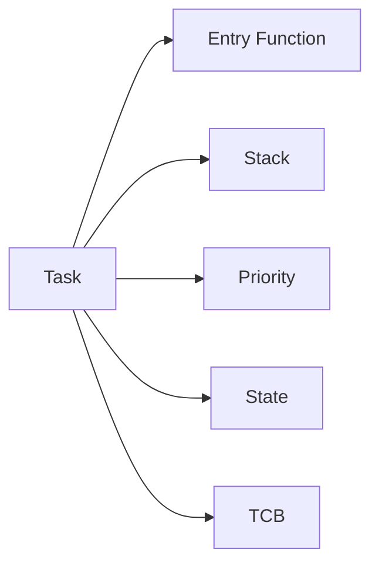

**Task는 함수와 같지 않다.** 함수는 호출되면 호출자의 실행 흐름 안에서 동작하지만, Task는 Scheduler가 독립적으로 실행·중단·재개할 수 있다.

## 6. Task State

대표적인 상태는 다음과 같다. 실제 명칭과 전이 조건은 RTOS마다 다르다.

| 상태 | 의미 |
|---|---|
| Running | 현재 CPU에서 실행 중 |
| Ready | 실행 가능하지만 CPU 할당을 기다림 |
| Blocked / Waiting | Queue, Semaphore, Delay 등의 조건을 기다림 |
| Suspended | 명시적 재개를 기다림 |
| Terminated / Deleted | 실행 종료 또는 제거 |

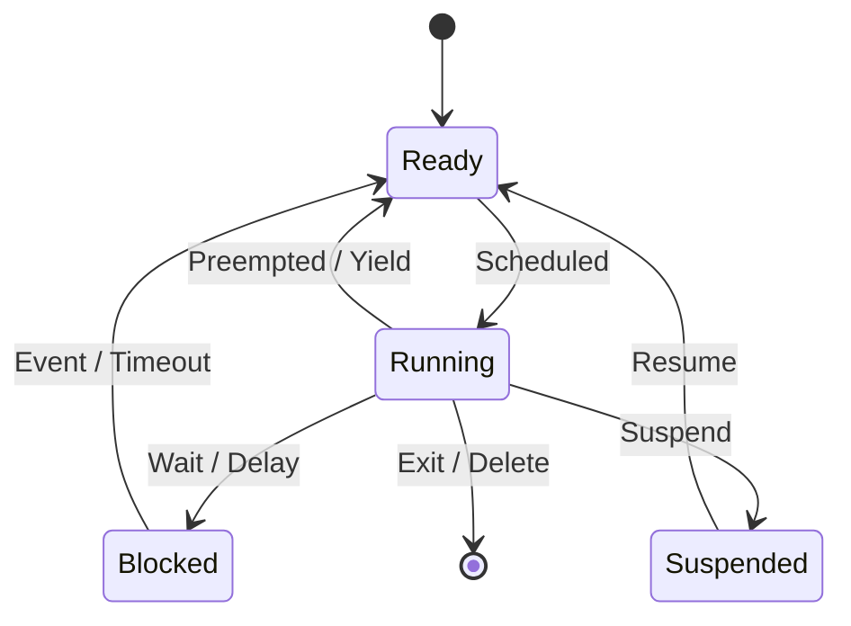

Blocked 상태의 Task는 **조건을 기다리면서 CPU를 계속 소비하는 Busy Waiting과 다르다.**

## 7. Priority

Priority는 여러 Ready Task 중 어떤 Task를 먼저 실행할지 결정하는 기준이다.

```text
Higher Priority Ready Task
          ↓
       Scheduler
          ↓
         CPU
```

주의할 점:

- 숫자가 클수록 높은 Priority인지 여부는 RTOS마다 다르다.
- Priority가 높다고 작업의 중요도나 안전성이 자동으로 보장되는 것은 아니다.
- 높은 Priority Task가 계속 Ready이면 낮은 Priority Task가 실행되지 못할 수 있다.
- Priority는 **시간 제약, 실행 시간, Blocking 특성**을 함께 고려해 정한다.

## 8. Preemptive / Cooperative Scheduling

| 방식 | 동작 | 주요 고려사항 |
|---|---|---|
| Preemptive | 더 높은 우선순위의 Ready Task가 현재 Task를 선점할 수 있음 | 공유 데이터 보호와 Context Switch |
| Cooperative | 실행 중 Task가 자발적으로 CPU를 양보할 때 전환 | 양보하지 않는 Task가 전체 응답을 지연시킬 수 있음 |

RTOS의 설정과 Scheduler 정책에 따라 세부 동작은 달라진다.

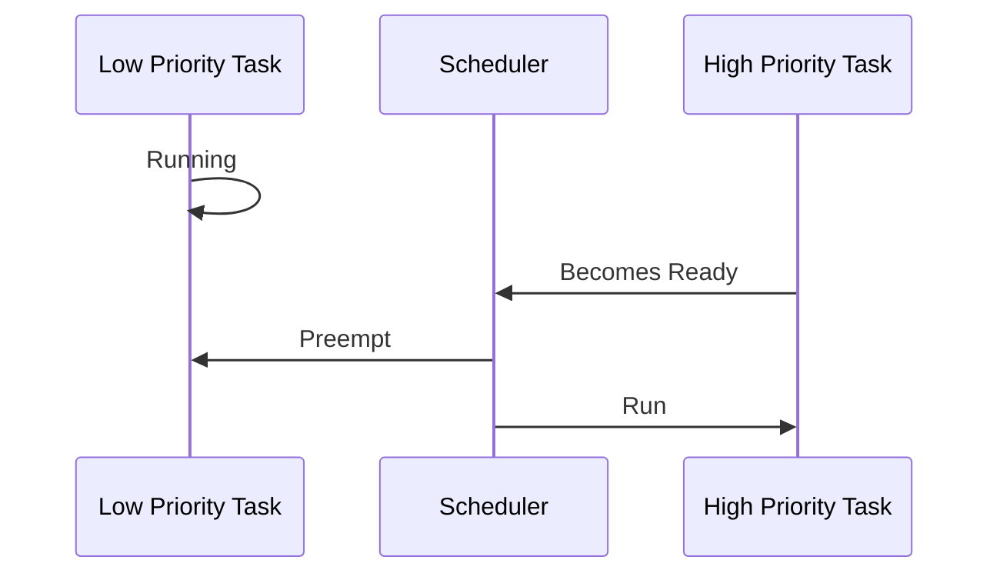

## 9. Time Slicing

동일 Priority의 Ready Task 사이에서 일정 시간 단위로 CPU를 나누는 정책이다.

```text
Time →
Task A |----|    |----|
Task B      |----|    |----|
```

Time Slicing 사용 여부와 Tick 기반 동작은 Kernel 설정에 따라 달라진다. **동일 Priority라고 항상 공평한 실행 시간이 보장되는 것은 아니다.**

## 10. Context Switch

Context Switch는 실행 중인 Task의 상태를 보관하고 다른 Task의 상태를 복원하는 과정이다.

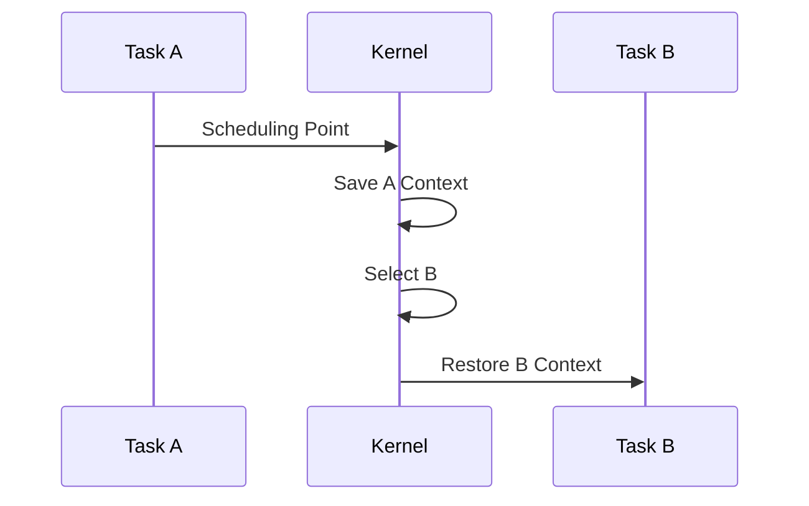

저장·복원 대상에는 CPU Register, Stack Pointer 등 아키텍처가 요구하는 실행 상태가 포함된다. 부동소수점 Context와 특수 Register 처리 방식은 MCU와 RTOS 설정에 따라 달라진다.

Context Switch에는 실행 시간 비용이 있으므로 Task를 무조건 잘게 나누는 것이 유리하지는 않다.

---

# 시간과 실시간성

## 11. Tick과 System Clock

많은 RTOS는 주기적인 Timer Interrupt를 이용해 Kernel Time을 관리한다.

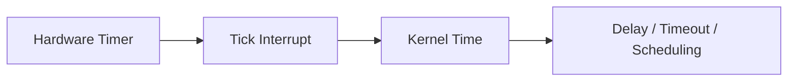

Tick 주기는 시간 해상도와 Interrupt Overhead 사이의 절충 요소다. Tickless Idle처럼 불필요한 주기 Tick을 줄이는 구현도 있다.

**RTOS Tick, CPU Clock, Peripheral Clock은 같은 개념이 아니다.**

## 12. Delay와 Periodic Execution

단순 Delay는 “현재 시점부터 일정 시간 기다림”을 의미할 수 있다.

```text
Work → Delay → Work → Delay
```

이 방식은 작업 실행 시간에 따라 실제 주기가 길어질 수 있다.

고정 주기 실행은 “기준 시점에 맞춰 다음 실행을 기다림”이라는 별도 개념이다.

```text
T0       T1       T2       T3
|--------|--------|--------|
Run      Run      Run      Run
```

정확한 주기 보장은 Tick 해상도, Interrupt 지연, Scheduler 지연, 실행 시간 및 시스템 부하에 좌우된다.

## 13. Deadline, Latency, Jitter

| 용어 | 의미 |
|---|---|
| Deadline | 결과가 준비되어야 하는 시점 |
| Response Time | 이벤트 발생부터 해당 처리 완료까지 걸린 시간 |
| Scheduling Latency | 실행 가능해진 Task가 실제 실행되기까지의 지연 |
| Interrupt Latency | Interrupt 발생부터 ISR 실행 시작까지의 지연 |
| Jitter | 실행 시점이나 주기 간격의 변동 |
| WCET | Worst-Case Execution Time, 최악 실행 시간 |

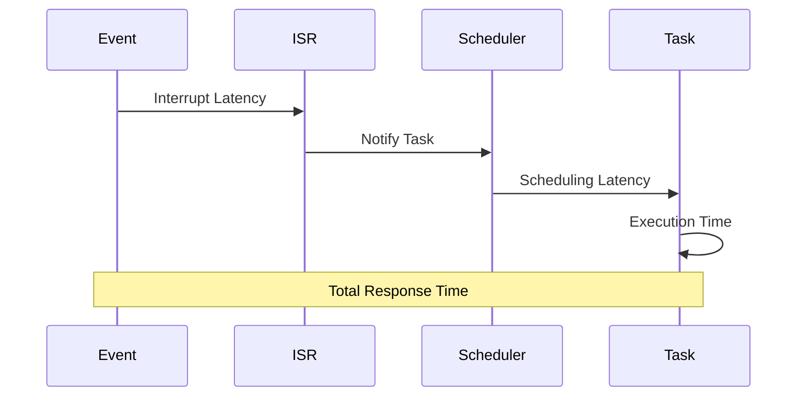

**평균 처리 시간이 Deadline보다 짧다는 사실만으로 Deadline 만족을 증명할 수 없다.** 최악 실행 시간, Blocking, 선점, Interrupt 지연 등을 함께 고려한다.

## 14. CPU Utilization과 Overload

여러 주기 Task가 있을 때 실행 시간과 주기의 비율은 부하를 이해하는 출발점이 된다.

```text
Task Utilization ≈ Execution Time / Period
Total Utilization ≈ Sum of Task Utilizations
```

이 식만으로 모든 스케줄링 정책의 Deadline 충족 여부를 판정할 수는 없다. 우선순위, 비주기 작업, Blocking, Interrupt 비용, Task 간 의존성 등이 영향을 준다.

---

# Task 간 통신과 동기화

## 15. Queue

Queue는 생산자가 보낸 데이터를 소비자가 순서대로 받도록 하는 대표적인 통신 수단이다.


일반적인 용도:

- ISR에서 Task로 이벤트 또는 데이터를 전달
- Task 간 Command 전달
- 수신 데이터와 처리 흐름 분리

Queue가 **데이터를 복사하는지, 포인터를 전달하는지**는 API와 설계에 따라 다르다. 포인터를 전달한다면 실제 데이터의 수명과 소유권을 별도로 관리해야 한다.

## 16. Semaphore

Semaphore는 이벤트 발생이나 제한된 자원 수를 표현하는 동기화 도구다.

| 종류 | 개념적 용도 |
|---|---|
| Binary Semaphore | 이벤트 발생·처리 가능 상태 통지 |
| Counting Semaphore | 여러 이벤트 발생 횟수 또는 자원 개수 표현 |

Semaphore는 데이터 자체를 전달하는 Queue와 목적이 다르다. Binary Semaphore도 Mutex와 같은 의미로 취급하면 안 된다.

## 17. Mutex

Mutex는 여러 Task가 하나의 공유 자원에 동시에 접근하지 않도록 보호한다.

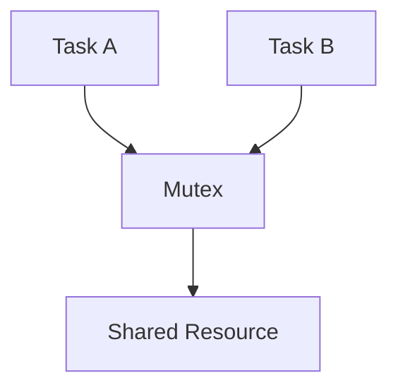

Mutex에는 일반적으로 **소유권(획득한 Task가 해제)** 개념이 있으며, RTOS에 따라 Priority Inheritance 같은 기능을 제공한다.

대표적인 보호 대상:

- 여러 Task가 공유하는 Driver 상태
- 공통 버퍼의 복합 갱신
- 동일 Peripheral에 대한 직렬화된 접근

## 18. Queue / Semaphore / Mutex 비교

| 도구 | 핵심 목적 | 데이터 전달 | 소유권 개념 |
|---|---|---|---|
| Queue | 메시지 전달 | 가능 | Queue API·메시지 설계에 따름 |
| Semaphore | 통지·개수 관리 | 일반적으로 데이터 자체는 없음 | 일반적으로 Mutex와 다름 |
| Mutex | 상호 배제 | 없음 | 일반적으로 있음 |
| Event Flags | 여러 조건의 조합 통지 | Bit 상태 중심 | Kernel 정책에 따름 |

**이름이 비슷해도 서로 대체 가능한 도구가 아니다.**

## 19. Event Flags / Event Groups

여러 이벤트를 Bit로 표현하고 특정 조합을 기다릴 수 있다.

```text
Bit 0: UART RX Ready
Bit 1: Sensor Ready
Bit 2: Communication Error
```

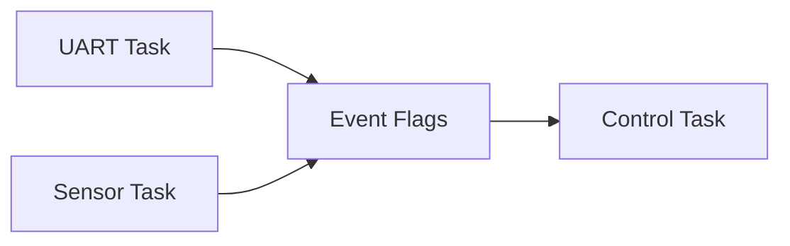

“어느 하나라도 발생”과 “모든 조건 충족”은 서로 다른 대기 조건이다. Flag의 자동 Clear 여부는 RTOS API를 확인한다.

## 20. Race Condition

여러 실행 주체의 접근 순서에 따라 결과가 달라지는 문제다.

```text
Task A: Read shared value
Task B: Modify shared value
Task A: Write based on old value
```

RTOS 환경에서 실행 주체는 Task뿐 아니라 ISR, DMA, 다른 Core일 수도 있다.

**`volatile`은 Race Condition 해결 수단이 아니다.** 접근의 Atomicity, 공유 데이터의 일관성, 실행 순서와 Memory Ordering을 각각 고려해야 한다.

## 21. Critical Section

Critical Section은 공유 상태를 보호해야 하는 코드 영역이다.

보호 방식의 예:

- Mutex 사용
- 짧은 구간에서 Interrupt Masking
- 아키텍처가 지원하는 Atomic Operation
- 단일 소유 Task에 요청을 보내 접근을 직렬화

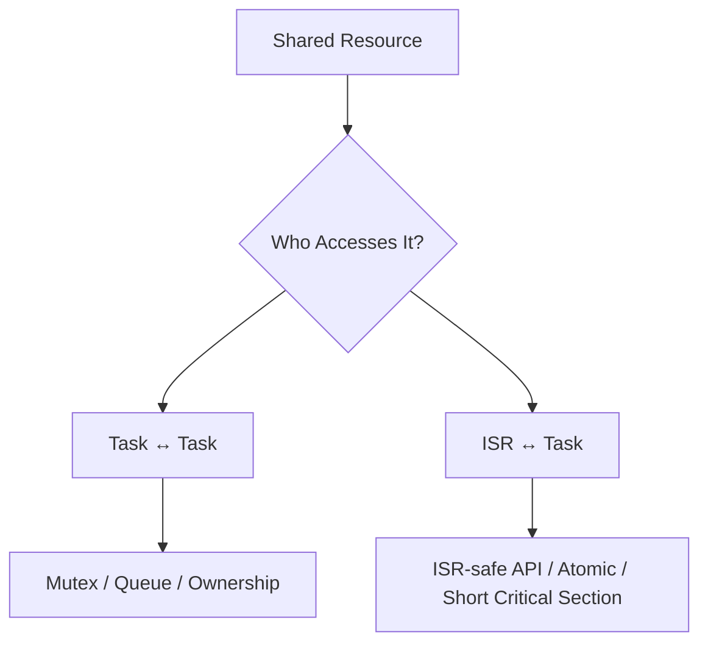

Interrupt를 막는 방식은 Interrupt Latency를 증가시킬 수 있다. Mutex는 일반적으로 ISR에서 사용할 수 없으므로 **ISR-safe API와 Task API를 구분**한다.

## 22. Priority Inversion

낮은 Priority Task가 보유한 자원을 높은 Priority Task가 기다리는 상황이다. 그 사이 중간 Priority Task가 낮은 Priority Task를 선점하면 높은 Priority Task의 대기가 길어질 수 있다.

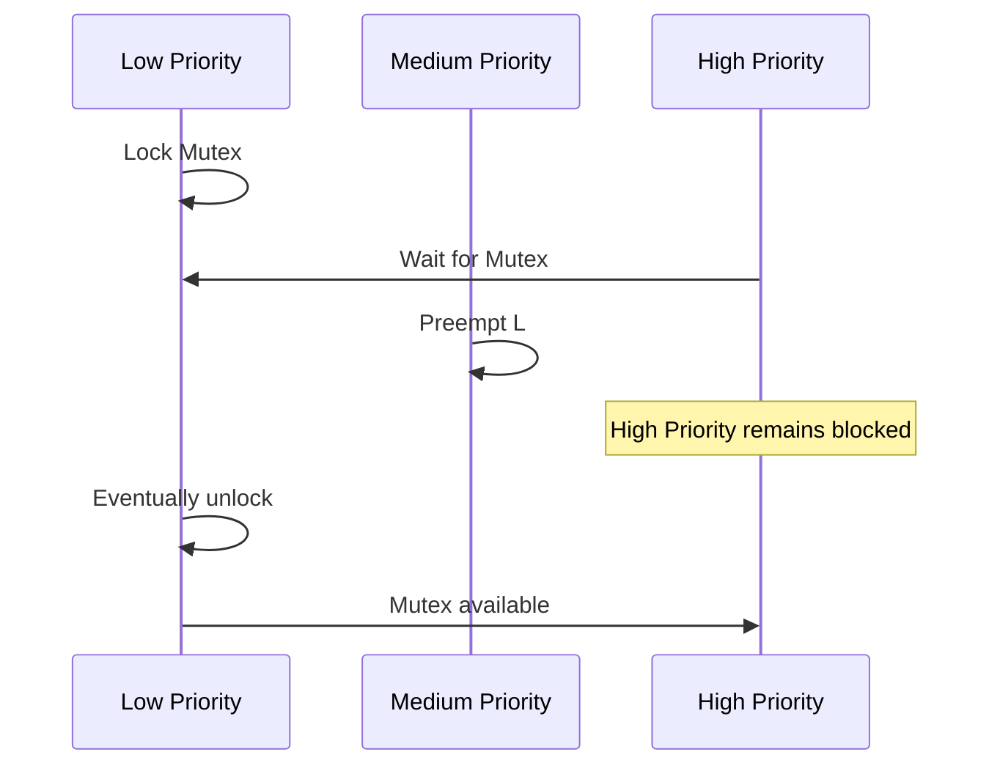

**Priority Inheritance**는 Mutex 보유 Task의 우선순위를 일시적으로 높여 일부 Priority Inversion을 완화하는 방식이다. 모든 지연 문제를 해결하지는 않으며 Kernel 지원 범위를 확인해야 한다.

## 23. Deadlock

둘 이상의 실행 흐름이 서로가 가진 자원을 기다리며 진행하지 못하는 상태다.


설계 관점의 대응:

- Lock 획득 순서 통일
- Lock 보유 시간 최소화
- 여러 Lock 동시 보유 감소
- Timeout 및 오류 복구 정책 정의
- 가능하면 단일 소유 Task와 메시지 전달 활용

Timeout은 무한 대기를 피할 수 있지만 **공유 상태의 정합성을 자동 복구하지는 않는다.**

---

# Interrupt와 RTOS

## 24. ISR과 Task의 역할 분리

ISR은 Hardware 이벤트를 빠르게 처리하고, 상대적으로 긴 작업은 Task로 넘기는 구조가 흔하다.

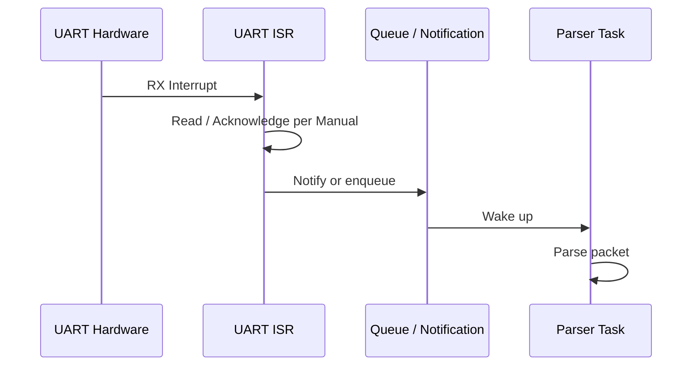

ISR에서 피하거나 엄격히 제한할 작업의 예:

- 긴 반복 처리
- Blocking Wait
- 일반 Task용 Mutex Lock
- 예측하기 어려운 동적 메모리 할당
- 오래 걸리는 로그 출력

정확한 제한은 RTOS, MCU, Driver 구현에 따라 다르다.

## 25. ISR-safe API

많은 RTOS는 ISR에서 호출 가능한 API를 별도로 제공한다.

```text
Task Context API  ≠  ISR Context API
```

ISR-safe API는 일반적으로 Blocking하지 않으며, ISR 종료 시 더 높은 Priority Task로 전환할 필요가 있는지 Scheduler에 전달하는 방식이 사용될 수 있다.

ISR의 우선순위가 RTOS API 호출 허용 범위와 연결되는 MCU/Kernel 조합도 있으므로 **Interrupt Priority 설정 규칙을 반드시 확인**한다.

## 26. Interrupt Priority와 Task Priority

| 구분 | 관리 주체 | 역할 |
|---|---|---|
| Interrupt Priority | CPU / Interrupt Controller | ISR 사이의 선점·처리 순서 |
| Task Priority | RTOS Scheduler | Ready Task 사이의 실행 순서 |

둘은 별개의 체계다.

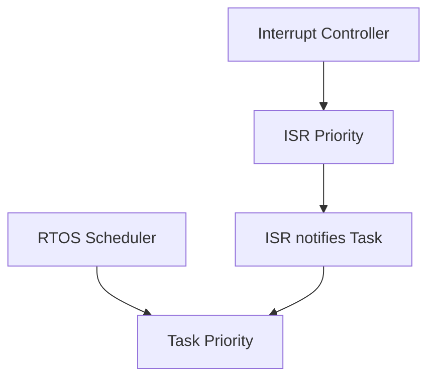

특히 ARM Cortex-M에서는 Interrupt Priority 숫자와 논리적 우선순위의 관계, Kernel이 허용하는 ISR API 호출 범위가 설정에 따라 중요해진다.

---

# 메모리와 자원 관리

## 27. Task Stack

각 Task는 일반적으로 별도 Stack을 사용한다.

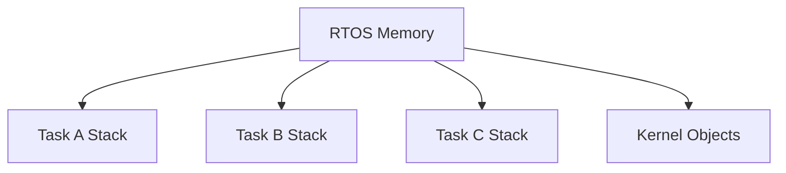

Stack에는 지역 변수, 함수 호출 정보, 저장된 Context 등이 놓일 수 있다. 실제 Stack 사용량은 Compiler, 최적화, 호출 깊이, ISR·FPU 처리 방식 등에 영향을 받는다.

Stack Overflow는 데이터 손상이나 예측 불가능한 오류로 이어질 수 있다. Kernel이 제공하는 Stack Usage / High-water Mark 확인 기능은 **설정과 측정 조건에 따른 관측값**이지 모든 미래 경로의 보증은 아니다.

## 28. Static / Dynamic Allocation

| 방식 | 특징 | 고려사항 |
|---|---|---|
| Static Allocation | 필요한 객체·버퍼를 미리 확보 | 메모리 예측 가능성, 최대치 산정 |
| Dynamic Allocation | 실행 중 생성·삭제 가능 | 실패 처리, 단편화, 할당 시간 |

RTOS마다 Task·Queue·Timer를 정적으로 생성할 수 있는 범위와 API가 다르다.

**RTOS 사용 = 반드시 Heap 사용**은 아니다. 반대로 정적 할당을 사용한다고 시간 제약이 자동으로 보장되는 것도 아니다.

## 29. Heap Fragmentation과 결정성

반복적인 가변 크기 할당·해제는 Allocator에 따라 단편화를 유발할 수 있다.

실시간 설계에서는 다음을 함께 고려한다.

```text
Maximum Memory Usage
Allocation Failure
Worst-case Allocation Time
Lifetime / Ownership
Fragmentation Policy
```

C++의 RAII와 Smart Pointer는 자원 수명을 관리하는 데 도움을 주지만, 내부 동적 할당의 시간·메모리 특성까지 없애 주지는 않는다.

## 30. Software Timer

Software Timer는 Kernel의 시간 관리 기능을 사용해 만료 이벤트를 전달한다.


Software Timer Callback이 어느 Context에서 실행되는지, Blocking 가능 여부와 Priority는 Kernel마다 다르다.

**Software Timer는 Hardware Timer와 다르다.** 매우 정밀한 파형 출력이나 짧은 Hardware Timing이 필요하면 Peripheral Timer·PWM·DMA 등을 검토한다.

---

# UART·Ring Buffer·FSM과의 연결

## 31. UART 수신 처리 구조

앞서 정리한 내용을 RTOS 구조로 연결하면 다음과 같다.


역할을 분리하면 다음과 같다.

| 구성 | 주요 책임 |
|---|---|
| UART Peripheral | Byte 송수신 |
| ISR / DMA | Hardware 이벤트 처리·데이터 이동 |
| Ring Buffer | 생산·소비 속도 차이 흡수 |
| Notification | 처리할 데이터가 있음을 Task에 전달 |
| Parser Task | Byte Stream 해석 |
| Packet FSM | Header·Length·Payload·Checksum 상태 관리 |
| Application Task | 완성된 명령·데이터 처리 |

Queue에 모든 Byte를 복사하는 방식과 Ring Buffer + Notification 방식은 메모리·복사 비용·구현 복잡도가 다르다. 어느 방식이 적절한지는 데이터율과 처리 요구사항에 따라 결정한다.

## 32. Producer–Consumer와 Backpressure

수신 속도가 처리 속도보다 빠르면 Queue나 Ring Buffer가 가득 찰 수 있다.

```mermaid
flowchart TD
    A[Producer Rate] --> C{Buffer Capacity}
    B[Consumer Rate] --> C
    C --> D[Normal Operation]
    C --> E[Overflow]
    E --> F[Drop / Flow Control / Error]
```

Overflow 정책의 예:

- 새 데이터 폐기
- 오래된 데이터 덮어쓰기
- 송신 측 Flow Control
- 패킷 전체 폐기 후 재동기화
- 오류 기록 및 복구

**버퍼 크기를 키우는 것만으로 지속적인 생산·소비 속도 불균형을 해결할 수는 없다.**

## 33. FSM과 Task의 관계

FSM은 **상태와 전이의 모델**, Task는 **실행과 스케줄링의 단위**다.

```mermaid
flowchart LR
    A[Task] --> B[Receive Event]
    B --> C[FSM Transition]
    C --> D[Action]
    D --> A
```

하나의 Task가 여러 FSM을 관리할 수도 있고, 하나의 FSM을 특정 Task가 단독 소유하도록 설계할 수도 있다. 상태를 단일 Task가 소유하면 여러 Task가 직접 상태를 수정하는 구조보다 동기화 범위를 줄이기 쉽다.

---

# 설계 시 고려사항

## 34. Task를 나누는 기준

Task를 나누는 기준은 단순히 함수 개수나 Peripheral 개수가 아니다.

- 서로 다른 Deadline과 Priority가 있는가?
- 서로 독립적으로 Blocking할 필요가 있는가?
- 데이터 소유권과 통신 경계가 명확한가?
- Stack과 Kernel Object 비용을 감당할 수 있는가?
- Task 간 공유 상태가 지나치게 늘어나지 않는가?

```mermaid
flowchart TD
    A[Functionality] --> B{Independent Timing / Blocking?}
    B -->|Yes| C[Consider Separate Task]
    B -->|No| D[Consider Same Task / FSM]
    C --> E[Check Memory + Synchronization Cost]
    D --> E
```

## 35. Priority를 정하는 관점

Priority는 다음 정보를 바탕으로 설계한다.

| 항목 | 질문 |
|---|---|
| Deadline | 언제까지 끝나야 하는가? |
| Period | 얼마나 자주 실행되는가? |
| WCET | 최악 실행 시간은 얼마인가? |
| Blocking | 어떤 자원을 얼마나 기다릴 수 있는가? |
| Interrupt | ISR의 빈도·실행 시간은 어느 정도인가? |
| Dependency | 다른 Task 결과를 기다리는가? |

“UART Task이므로 무조건 최고 Priority” 같은 규칙은 적절하지 않다. 시스템 전체의 시간 제약으로 판단한다.

## 36. 흔한 오해

| 오해 | 정확한 이해 |
|---|---|
| RTOS를 쓰면 반드시 더 빠르다 | RTOS는 작업 관리와 시간 제약 대응을 돕지만 Overhead도 있다. |
| Task가 많을수록 병렬 처리된다 | 단일 Core에서는 대부분 실행 시간을 나누어 사용한다. |
| 높은 Priority면 Deadline을 반드시 지킨다 | ISR·Blocking·WCET·다른 작업의 영향이 남는다. |
| `volatile`이면 Task 공유 변수가 안전하다 | Atomicity와 동기화를 보장하지 않는다. |
| Semaphore와 Mutex는 같다 | 통지/개수 관리와 상호 배제·소유권은 다르다. |
| ISR에서 일반 Task API를 호출해도 된다 | ISR-safe API 여부를 확인해야 한다. |
| Queue가 있으면 Overflow가 없다 | Queue도 용량 제한과 Overflow 정책이 필요하다. |
| `delay()`를 쓰면 정확한 주기 실행이다 | 실행 시간과 Scheduling Jitter를 고려해야 한다. |
| RTOS에서는 동적 할당이 필수다 | 정적 객체 생성 기능을 제공하는 Kernel도 있다. |
| Software Timer는 Hardware Timer만큼 정밀하다 | Callback Scheduling 지연 등이 존재할 수 있다. |

## 37. 개념 체크리스트

- [ ] Real-Time과 단순 고속 처리의 차이를 설명할 수 있다.
- [ ] Bare-Metal Super Loop와 RTOS 구조를 비교할 수 있다.
- [ ] Task의 Running·Ready·Blocked 상태를 구분할 수 있다.
- [ ] Preemption과 Context Switch의 역할을 설명할 수 있다.
- [ ] Deadline·Latency·Jitter·WCET를 구분할 수 있다.
- [ ] Queue·Semaphore·Mutex의 목적을 구분할 수 있다.
- [ ] Priority Inversion과 Deadlock의 발생 구조를 이해한다.
- [ ] ISR-safe API와 Task API를 구분해야 하는 이유를 안다.
- [ ] Task Stack·Heap·Kernel Object의 메모리 비용을 이해한다.
- [ ] UART → Ring Buffer → Parser FSM → Application Task의 데이터 흐름을 설명할 수 있다.

## 38. 전체 요약

```mermaid
mindmap
  root((RTOS))
    Real-Time
      Deadline
      Latency
      Jitter
      WCET
    Execution
      Task
      Scheduler
      Priority
      Context Switch
    Synchronization
      Queue
      Semaphore
      Mutex
      Event Flags
    Hardware
      ISR
      UART
      DMA
      Timer
    Reliability
      Stack
      Memory
      Overflow
      Deadlock
      Priority Inversion
```

> **핵심:** RTOS는 Task를 많이 만드는 도구가 아니라, **시간 제약이 있는 여러 실행 흐름과 자원 공유를 체계적으로 관리하는 기반**이다. 올바른 Task 경계, Priority, 동기화, 버퍼 정책, 최악 실행 시간 분석이 함께 있어야 한다.

---

## 다음 학습 방향

`Register → Interrupt → UART → Ring Buffer → FSM → RTOS`로 이어지는 임베디드 기본 흐름을 정리했다. 이후에는 목적에 따라 **DMA**, **Timer/PWM**, **SPI/I²C**, **Watchdog**, **Bootloader**, **Linker Script / Startup Code** 등을 별도 문서로 확장할 수 있다.
