# DMA (Direct Memory Access)

> **학습 위치:** `C_Cpp_Study/05_Embedded/DMA.md`  
> **연결 흐름:** `Register → Interrupt → UART → Ring Buffer → FSM → RTOS → DMA`  
> **범위:** C/C++ 임베디드 펌웨어 관점의 개념 정리. 실습·퀴즈는 포함하지 않는다.

---

## 1. DMA란?

**DMA(Direct Memory Access)**는 CPU가 데이터의 각 항목을 직접 읽고 쓰는 대신, DMA Controller 같은 하드웨어가 지정된 소스와 목적지 사이에서 데이터 전송을 수행하는 방식이다. CPU는 전송 조건을 설정하고, DMA는 가능한 경우 CPU의 개별 Load/Store 명령 없이 전송을 진행한다.

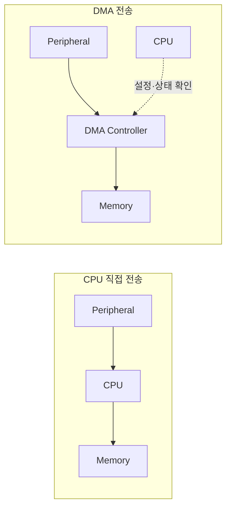

DMA를 사용해도 CPU 사용량이 **항상 0이 되는 것은 아니다.** 설정, 완료 처리, 오류 처리, 캐시 관리, 데이터 소비 등은 소프트웨어의 책임으로 남는다.

## 2. DMA가 필요한 이유

UART, SPI, ADC 등에서 데이터가 지속적으로 들어오면 CPU가 매 바이트 또는 샘플을 복사하는 방식은 다른 작업의 실행 시간을 소모할 수 있다. DMA는 반복적인 데이터 이동을 하드웨어로 분담한다.

| 관점 | CPU 직접 전송 | DMA 전송 |
|---|---|---|
| 데이터 이동 | CPU가 항목마다 처리 | DMA가 설정된 범위를 이동 |
| 초기 설정 | 상대적으로 단순 | 주소·길이·방향 등 설정 필요 |
| 완료 인지 | Polling/Peripheral Interrupt | DMA 완료·절반 완료·오류 이벤트 등 |
| 짧은 전송 | 설정 비용이 작을 수 있음 | 설정 비용이 이득보다 클 수 있음 |
| 큰·반복 전송 | CPU 점유가 커질 수 있음 | CPU 개입을 줄일 수 있음 |
| 지연 예측 | 코드·Interrupt에 영향 | Bus 경합·DMA 우선순위에 영향 |

**DMA는 CPU 사용량을 줄이는 수단이지, 무조건 전송 속도를 높이는 장치는 아니다.** 실제 성능은 Bus, Peripheral, 메모리 및 DMA Controller의 제약에 따라 달라진다.

---

## 3. DMA를 구성하는 요소

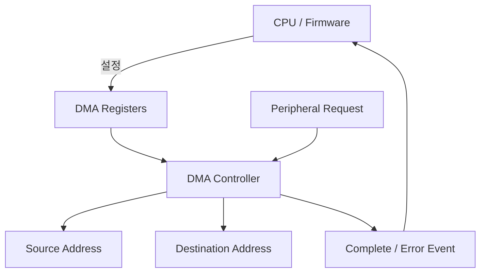

| 요소 | 역할 |
|---|---|
| Source | 읽어 올 데이터의 위치 |
| Destination | 데이터를 기록할 위치 |
| Transfer Length | 전송할 항목 수 또는 바이트 수. **단위는 장치별 확인** |
| Data Width | 8/16/32-bit 등 각 전송 항목의 폭 |
| Address Increment | 전송 후 주소를 증가시킬지 여부 |
| Trigger/Request | 전송을 시작하거나 다음 항목을 요청하는 신호 |
| Channel/Stream | DMA Controller의 전송 자원. 명칭은 MCU마다 다름 |
| Status/Interrupt | 완료·절반 완료·오류 등 결과 통지 |

## 4. 대표적인 전송 방향

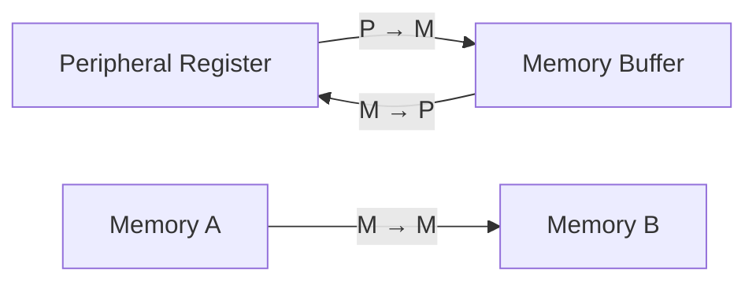

- **Peripheral → Memory:** UART RX, ADC 샘플 수집 등.
- **Memory → Peripheral:** UART TX, SPI TX, DAC 출력 등.
- **Memory → Memory:** 지원하는 Controller에서 메모리 블록 복사 등.

모든 DMA Controller가 세 방향을 모두 지원하는 것은 아니다. Peripheral별 DMA Request 연결도 제한될 수 있다.

## 5. Peripheral Register와 메모리 주소

UART RX를 예로 들면 Source는 UART 수신 데이터 Register이고 Destination은 RAM의 수신 Buffer가 될 수 있다.

```text
Source:       UART_RX_DATA_REGISTER
Destination:  rx_buffer[0]
Length:       N items
Direction:    Peripheral → Memory
```

DMA가 접근할 수 있는 RAM 영역과 Peripheral 주소는 **MCU의 Bus Matrix와 메모리 맵**에 따라 달라진다. CPU가 접근할 수 있는 모든 주소를 DMA도 접근할 수 있다고 가정하지 않는다.

---

## 6. 주소 증가 설정

일반적인 UART RX DMA에서는 Peripheral Data Register의 주소는 고정되고, RAM Buffer 주소는 전송마다 증가한다.

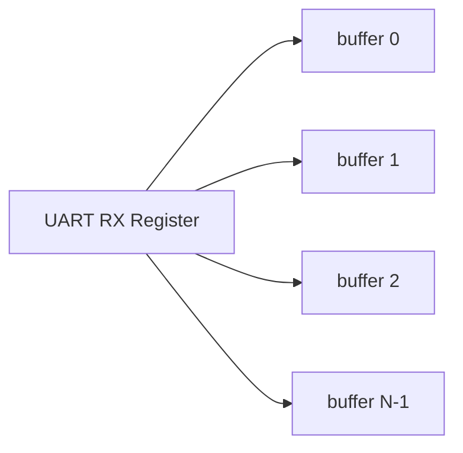

| 설정 | UART RX 예시 | Memory-to-Memory 예시 |
|---|---|---|
| Source Increment | 비활성화 | 활성화 |
| Destination Increment | 활성화 | 활성화 |

설정이 잘못되면 동일한 메모리 위치에 덮어쓰거나, 존재하지 않는 Peripheral Register를 순회하는 문제가 발생할 수 있다.

## 7. Data Width와 Alignment

전송 폭은 Peripheral Data Register와 Buffer의 자료형·정렬 요구사항에 맞춰야 한다.

```text
UART 8-bit data → byte-oriented buffer
ADC 12-bit result → often 16-bit storage unit
```

ADC 결과가 12-bit여도 DMA 전송 폭은 16-bit일 수 있다. 실제 데이터 정렬, Sign Extension, Packing은 장치 문서를 따른다.

**Transfer Length가 바이트 수인지 데이터 항목 수인지** 확인하지 않으면 Buffer 크기 계산이 틀어질 수 있다.

## 8. DMA Request와 Handshake

Peripheral이 데이터를 준비했을 때 DMA Controller에 Request를 보내는 구조가 흔하다.

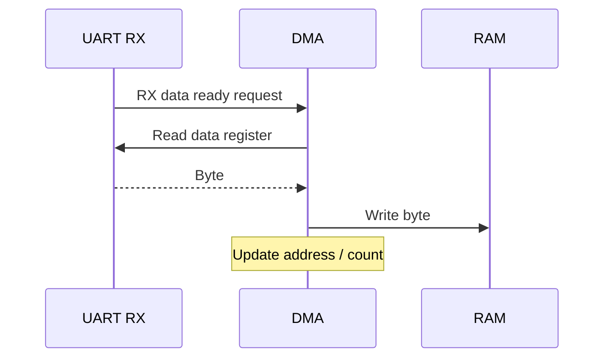

Request 처리 능력보다 데이터 도착이 빠르면 Peripheral Overrun이 발생할 수 있다. DMA 사용만으로 모든 수신 손실이 사라지는 것은 아니다.

---

## 9. DMA 전송의 일반적인 생명주기

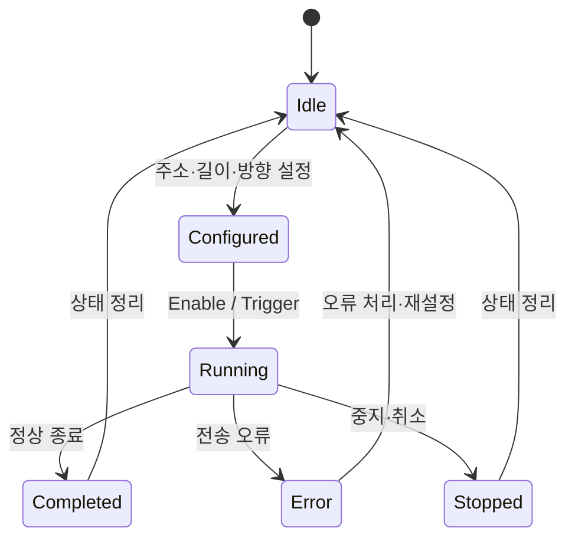

전형적인 초기화 순서는 DMA Channel 비활성화, 설정값 기록, 관련 Flag 정리, Peripheral의 DMA Request 활성화, DMA 활성화 등으로 구성될 수 있다. **정확한 순서와 금지 조건은 MCU Reference Manual과 SDK를 따른다.**

## 10. Normal Mode

Normal Mode는 정해진 길이만큼 전송한 뒤 해당 전송을 완료하는 방식이다.

```text
[0][1][2][3][4][5][6][7]
 ↓  ↓  ↓  ↓  ↓  ↓  ↓  ↓
           Done
```

주요 용도는 고정 길이 Packet, 일회성 UART TX, 특정 수량의 ADC 샘플 수집 등이다. 재전송하려면 다음 전송을 설정하거나 재시작해야 할 수 있다.

## 11. Circular Mode

Circular Mode는 Buffer 끝에 도달하면 다시 시작 위치로 돌아가며 전송을 이어가는 방식이다.

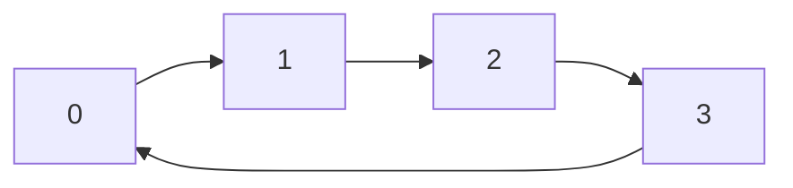

UART RX나 연속 ADC 수집에 적합하다. 그러나 **DMA가 오래된 데이터를 덮어쓰기 전에 CPU가 읽어야 한다.** Circular Mode는 데이터 보존을 보장하지 않는다.

## 12. Double Buffer / Ping-Pong Buffer

두 Buffer를 번갈아 사용하여 하나는 DMA가 채우고 다른 하나는 CPU가 처리하는 구조다.

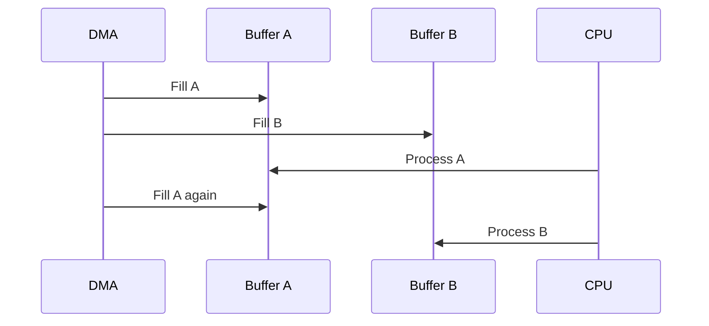

이 그림은 개념적인 흐름이다. 실제로 CPU 처리가 늦으면 다음 DMA 쓰기와 충돌할 수 있다. Hardware Double-Buffer 지원 여부와 Buffer 전환 시점도 장치별로 다르다.

---

## 13. Half Transfer와 Transfer Complete

| 이벤트 | 일반적 의미 | 활용 |
|---|---|---|
| Half Transfer (HT) | 지정된 전송 범위의 절반에 도달 | 앞쪽 영역 처리 시점 |
| Transfer Complete (TC) | 지정된 전송 범위를 완료 | 전체 전송 완료 또는 뒤쪽 영역 처리 |
| Transfer Error (TE) | DMA Controller가 오류를 감지 | 복구·진단 |

Circular Mode에서는 HT/TC가 반복적으로 발생할 수 있다. 정확한 Flag 의미와 Clear 절차는 DMA Controller별로 확인한다.


## 14. DMA와 Interrupt의 역할 분담

DMA는 데이터를 옮기고 Interrupt는 소프트웨어에 처리 시점을 알리는 데 사용할 수 있다.

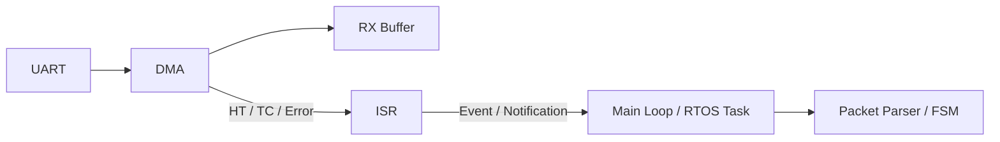

ISR에서는 가능한 한 짧게 상태를 확인하고 필요한 이벤트를 전달한다. 단, RTOS API는 **ISR에서 호출 가능한 전용 API인지** 확인해야 한다.

## 15. Polling과 DMA Interrupt는 별개 선택이다

DMA를 사용한다고 반드시 DMA Interrupt를 켜야 하는 것은 아니다.

- DMA + Polling: CPU가 DMA Status 또는 Remaining Count를 확인.
- DMA + Interrupt: 완료·절반 완료·오류 시점에 ISR 실행.
- DMA + Peripheral Event: UART IDLE 감지 등과 조합.

전송 방식과 완료 통지 방식은 구분한다.

---

## 16. UART RX DMA와 Ring Buffer

DMA Circular Buffer를 UART 수신 Ring Buffer처럼 활용할 수 있다. DMA의 현재 쓰기 위치를 파악하고 CPU가 마지막으로 처리한 위치부터 새 데이터 구간을 소비한다.

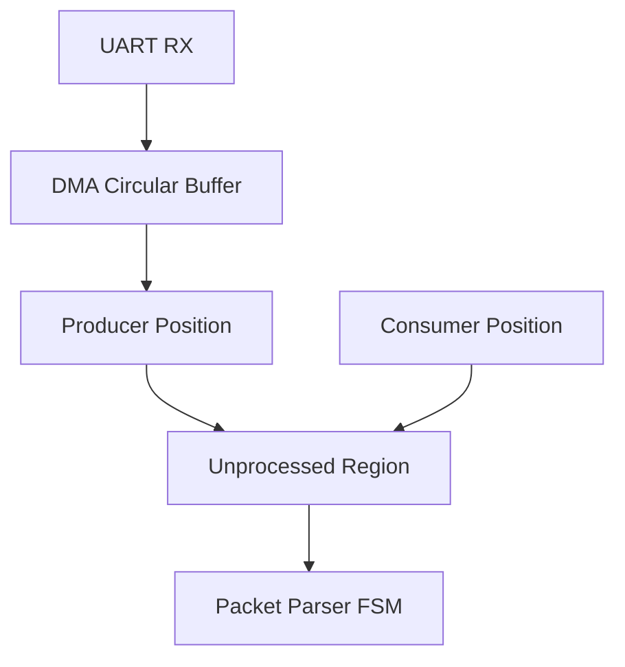

**중요한 차이:** 일반 소프트웨어 Ring Buffer는 Producer가 `head`를 갱신하지만 DMA 기반 Buffer는 Hardware의 Remaining Count나 Current Address 등으로 생산 위치를 추정할 수 있다. 이 값의 읽기 시점과 일관성은 장치 문서 및 드라이버 설계에 따른다.

## 17. UART IDLE Detection과 DMA

가변 길이 UART 데이터에서는 Buffer가 가득 찰 때까지 기다리지 않고 **일정 시간 수신이 없음을 나타내는 IDLE 이벤트**를 이용할 수 있다.

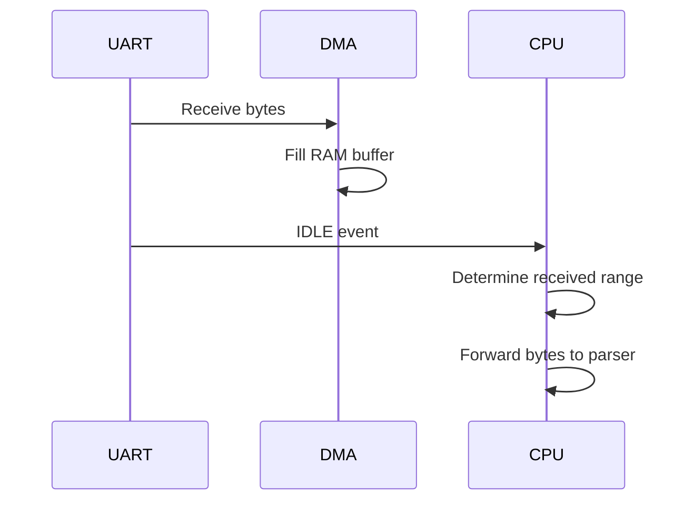

IDLE은 **프로토콜의 Packet 경계와 항상 같지 않다.** 송신 측 타이밍과 통신 규격에 따라 하나의 Packet 안에서도 IDLE이 발생하거나 여러 Packet이 붙어 올 수 있다. 최종 Packet 판별은 Length, Delimiter, Checksum 등을 다루는 Parser/FSM이 맡는다.

## 18. DMA 수신과 Overrun

Overrun은 구분해서 이해한다.

| 문제 | 발생 위치 | 의미 |
|---|---|---|
| Peripheral Overrun | UART 등 | 이전 데이터가 처리되기 전에 새 데이터 도착 |
| DMA Buffer Overwrite | RAM Circular Buffer | CPU가 읽기 전에 DMA가 같은 영역에 재기록 |
| Application Queue Overflow | 소프트웨어 Queue | Parser/Task가 처리하지 못한 데이터 누적 |

DMA를 추가해도 전체 파이프라인의 가장 느린 단계가 처리량을 제한한다.

---

## 19. Buffer의 수명과 소유권

DMA 전송 중에는 Hardware가 Buffer에 접근하므로 CPU 관점의 변수 수명만으로 안전성을 판단할 수 없다.

```text
DMA 시작
   ↓
Buffer 주소·크기 유지
   ↓
DMA 완료 또는 안전한 중지 확인
   ↓
Buffer 재사용·해제 가능
```

- DMA가 사용하는 Buffer를 전송 도중 해제하면 안 된다.
- 전송 중 Buffer를 이동시키는 재할당도 위험하다.
- DMA TX 중 CPU가 송신 데이터를 수정하면 전송 내용이 달라질 수 있다.
- DMA RX 중 CPU가 DMA가 쓰는 영역을 무분별하게 수정하면 데이터가 손상될 수 있다.

C++의 `std::vector`를 DMA Buffer로 쓸 경우 **재할당과 크기 변경으로 주소가 바뀔 수 있음**에 주의한다. `std::array` 또는 정적 배열은 고정 크기·안정적인 저장 공간을 표현하기에 유용하지만, 해당 RAM이 DMA에서 접근 가능한지는 별도로 확인해야 한다.

## 20. DMA와 CPU Cache Coherency

Cache가 있는 MCU에서는 DMA가 RAM을 수정해도 CPU가 이전 Cache 내용을 읽을 수 있고, CPU가 수정한 데이터가 아직 RAM에 반영되지 않았을 수도 있다.

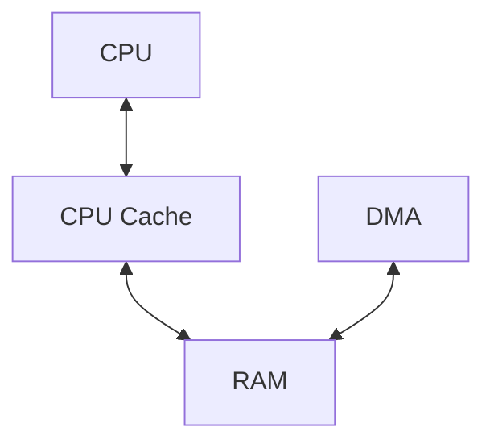

| 방향 | 대표적인 고려사항 |
|---|---|
| Memory → Peripheral | CPU가 수정한 데이터를 DMA가 볼 수 있도록 필요한 Cache Clean 수행 |
| Peripheral → Memory | DMA가 쓴 최신 데이터를 CPU가 읽도록 필요한 Cache Invalidate 수행 |

Cache Line 정렬, Buffer 경계, 작업 시점은 Architecture/SDK 규칙에 따라야 한다. 잘못된 Invalidate는 인접한 다른 데이터에 영향을 줄 수 있다. **모든 MCU에 Cache Maintenance가 필요한 것은 아니다.** Cache가 없거나 Hardware Coherency가 제공되는 경우가 있다.

## 21. `volatile`과 DMA

`volatile`은 Compiler의 접근 처리와 관련된 도구이며, DMA Buffer의 모든 동기화 문제를 해결하지 않는다.

```text
volatile ≠ DMA Cache Coherency
volatile ≠ CPU/DMA Ownership Protocol
volatile ≠ Memory Barrier
volatile ≠ Atomicity
```

DMA Buffer에 무조건 `volatile`을 붙이는 대신, MCU의 Memory Attribute, Cache Maintenance, Barrier, Driver API와 동기화 절차를 함께 검토한다. Hardware가 갱신하는 상태 Register와 RAM Buffer는 역할이 다르다.

## 22. Memory Barrier와 완료 순서

CPU가 DMA 시작 Register를 쓰기 전에 Descriptor나 Buffer 내용을 준비해야 하는 시스템에서는 Memory Ordering이 중요하다.

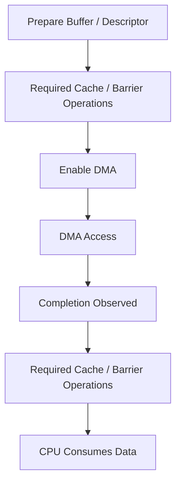

Barrier의 종류와 위치는 CPU Architecture, Bus, Cache, DMA Engine에 따라 달라진다. `volatile` 접근만으로 필요한 모든 순서와 가시성이 보장된다고 가정하지 않는다.

---

## 23. DMA의 동시성 문제

DMA는 CPU와 별도의 실행 주체로 RAM에 접근할 수 있다. ISR·Task뿐 아니라 **Hardware도 공유 데이터의 작성자**가 된다.

| 공유 대상 | 충돌 예시 | 설계 관점 |
|---|---|---|
| RX Buffer | CPU가 읽는 동안 DMA가 덮어씀 | 읽기 가능 구간·소비 위치 관리 |
| TX Buffer | DMA 전송 중 CPU가 내용 수정 | 전송 완료 전 변경 금지 |
| Descriptor | DMA 사용 중 CPU가 설정 수정 | 소유권 전환 절차 |
| Status Flag | ISR과 Task가 동시에 갱신 | 적절한 동기화·이벤트 전달 |

RTOS Mutex가 DMA Hardware의 RAM 접근을 자동으로 멈추게 하지는 않는다. CPU 측 동기화와 Hardware Buffer 소유권은 별도로 설계한다.

## 24. DMA와 RTOS

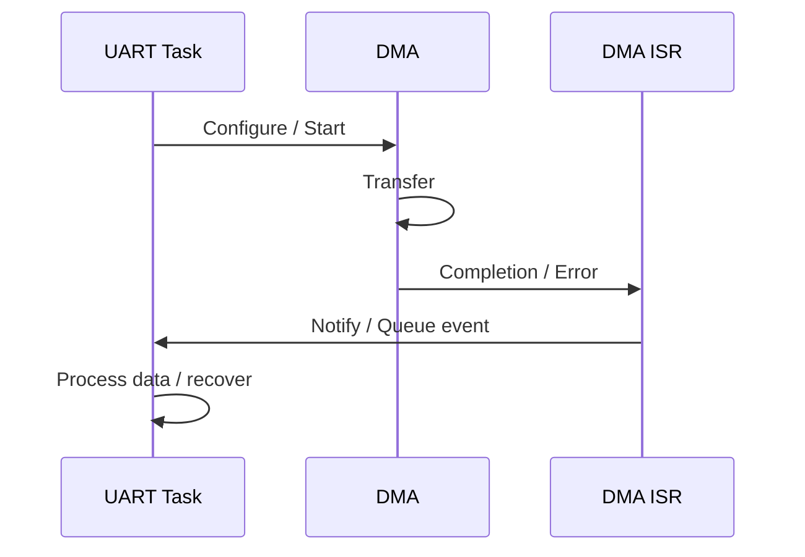

DMA가 완료될 때까지 Task가 Busy-Wait하면 CPU 절약 효과가 줄어들 수 있다. RTOS 환경에서는 완료 이벤트를 기다리며 Task를 Block하는 구조를 고려할 수 있다. ISR에서 일반 Blocking API를 호출하지 않는 등 RTOS별 제약을 따른다.

## 25. DMA Priority와 Bus Contention

DMA와 CPU는 Memory Bus를 공유할 수 있다. DMA 전송량이 커지면 CPU의 RAM 접근 또는 다른 DMA Channel의 전송 지연에 영향을 줄 수 있다.

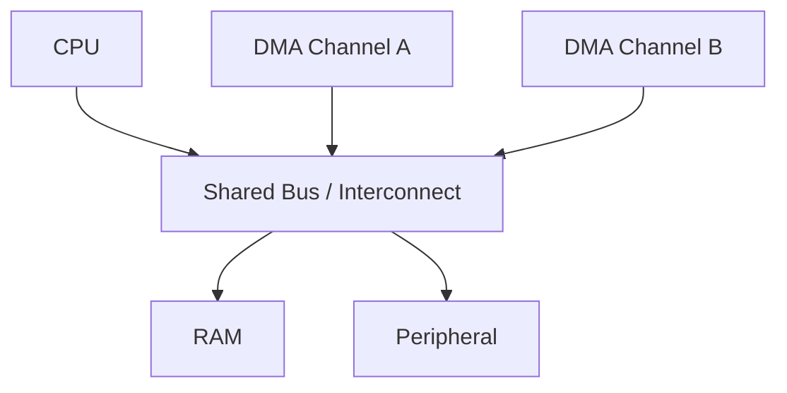

DMA 우선순위는 일반적으로 DMA Controller 내부의 자원 중재와 관련된다. **RTOS Task Priority와 같은 개념이 아니다.** CPU Interrupt Priority와도 별개로 설정될 수 있다.

## 26. Latency와 Throughput

- **Throughput:** 단위 시간당 전송한 데이터량.
- **Latency:** 데이터 준비부터 사용 가능해질 때까지 걸린 시간.
- **CPU Utilization:** CPU가 전송 관리에 사용하는 시간 비율.

DMA는 CPU Utilization을 낮출 수 있지만, 큰 Buffer의 완료 이벤트만 기다리면 Application이 데이터를 인지하는 Latency는 증가할 수 있다. Half Transfer, IDLE, 작은 Buffer 등은 지연과 처리 오버헤드 사이의 절충점이다.

---

## 27. 오류 처리

DMA 오류의 원인은 Controller별로 다르지만, 다음 범주를 검토한다.

| 범주 | 확인할 사항 |
|---|---|
| 주소 오류 | DMA 접근 가능 영역인가? |
| 폭·정렬 오류 | Source/Destination 접근 조건과 맞는가? |
| 길이 오류 | Buffer 크기와 Count 단위가 맞는가? |
| Peripheral 오류 | UART Overrun 등 별도 Flag가 있는가? |
| 중지·재시작 오류 | Channel 상태 전환 순서를 지켰는가? |
| Cache 문제 | CPU와 DMA가 같은 데이터를 보고 있는가? |
| Buffer Overwrite | 소비 속도가 생산 속도를 따라가는가? |

DMA Error Flag와 Peripheral Error Flag는 서로 다른 Register에 있을 수 있다. 둘 중 하나만 확인해서는 원인을 놓칠 수 있다.

## 28. DMA 중지·취소 시 주의

전송 취소는 단순히 소프트웨어의 `busy` 변수를 `false`로 만드는 작업이 아니다.

```text
Stop Request
→ Hardware가 실제로 중지했는지 확인
→ Pending Request / Flag 처리
→ Buffer Ownership 회수
→ 필요하면 Peripheral 상태 복구
```

전송 중지 후 남은 데이터 수, 마지막으로 기록된 위치, Peripheral FIFO의 잔여 데이터는 장치별로 확인한다.

## 29. DMA가 적합하지 않을 수 있는 상황

- 전송량이 매우 작아 설정 비용이 더 큰 경우.
- DMA Channel이 다른 중요한 Peripheral과 충돌하는 경우.
- DMA가 접근할 수 없는 Memory Region을 사용하는 경우.
- 복잡한 Cache/Alignment 관리가 시스템 규모에 비해 과도한 경우.
- 개별 데이터마다 즉시 판단해야 하여 단순 Buffer 전송으로 해결되지 않는 경우.

따라서 Polling, Interrupt, DMA는 서로를 완전히 대체하는 기술이 아니라 **전송 규모와 실시간 요구에 따라 조합하는 선택지**다.

---

## 30. UART 수신 파이프라인에서의 위치

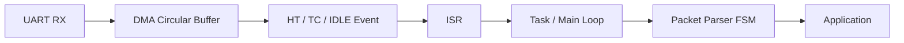

이 흐름에서 각 요소의 책임은 다음과 같다.

| 요소 | 책임 |
|---|---|
| UART | 직렬 데이터를 수신하고 오류 상태를 제공 |
| DMA | 수신 데이터를 RAM으로 이동 |
| Buffer | 처리 전 데이터를 보관 |
| Interrupt | 처리 시점과 오류를 통지 |
| Task/Main Loop | 새 데이터 구간을 안전하게 소비 |
| FSM | 바이트 스트림에서 Packet 의미를 해석 |

DMA를 사용해도 **Packet Parsing은 자동으로 수행되지 않는다.** UART와 DMA는 주로 바이트의 이동을 담당한다.

## 31. C와 C++ 설계 연결

| C/C++ 개념 | DMA에서의 의미 |
|---|---|
| Pointer | Source/Destination 주소 |
| Fixed-width Integer | Register와 데이터 폭 |
| `volatile` | MMIO Register 접근 의미 |
| `struct` | DMA Register Block·Descriptor 표현 |
| `std::array` | 고정 크기 Buffer의 소유권 표현 |
| `std::span` | Buffer를 소유하지 않는 구간 View |
| RAII | Driver 리소스·전송 상태 관리에 활용 가능 |
| Smart Pointer | 메모리 소유권을 표현할 수 있지만 DMA 완료 전에 해제되지 않도록 별도 수명 관리 필요 |

`std::span`은 Buffer의 수명을 연장하지 않는다. DMA가 `span`이 가리키는 메모리를 사용 중이면 실제 저장 공간의 소유자와 완료 시점을 별도로 관리해야 한다.

## 32. 핵심 개념 체크리스트

- [ ] DMA가 CPU 대신 수행하는 작업과 CPU에 남는 작업을 구분한다.
- [ ] Source/Destination, Direction, Width, Count, Increment의 의미를 설명할 수 있다.
- [ ] Normal, Circular, Double Buffer의 차이를 구분한다.
- [ ] HT/TC/Error와 UART IDLE의 역할을 구분한다.
- [ ] Peripheral Overrun과 DMA Buffer Overwrite를 구분한다.
- [ ] DMA Buffer의 수명·소유권·재할당 위험을 이해한다.
- [ ] Cache Coherency와 `volatile`이 다른 문제임을 이해한다.
- [ ] DMA Priority, Interrupt Priority, Task Priority를 구분한다.
- [ ] DMA가 Packet Parsing이나 RTOS 동기화를 자동으로 해결하지 않음을 이해한다.

## 33. 전체 요약

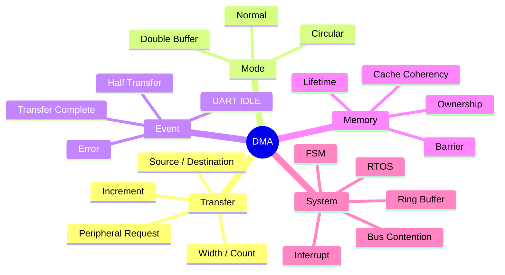

> **DMA는 데이터 이동을 하드웨어에 위임하는 메커니즘이다. 정확한 펌웨어 설계에는 Register 설정뿐 아니라 Buffer 소유권, 전송 완료 판단, Cache/Memory Ordering, 오류 복구와 상위 Protocol 처리가 함께 필요하다.**

---

## 다음 학습

**다음 문서 제안:** `05_Embedded/Timer.md` — Timer/Counter, Prescaler, Period, Compare/Capture, PWM, Interrupt, DMA Trigger, 시간 측정과 RTOS Tick의 연결.
