# Timer

> **학습 위치:** `C_Cpp_Study/05_Embedded/Timer.md`  
> **선행 개념:** Register · Interrupt · DMA · FSM · RTOS  
> **범위:** 임베디드 타이머의 동작 원리와 설계 관점. 실습·퀴즈 제외.

---

## 1. Timer란?

**Timer는 기준 Clock을 세어 시간 경과를 측정하거나 정해진 시점에 하드웨어 이벤트를 발생시키는 주변장치**다. MCU마다 기능과 Register 이름은 다르지만, 일반적으로 Clock Source, Prescaler, Counter, Auto-Reload/Period, Compare/Capture 기능을 조합한다.

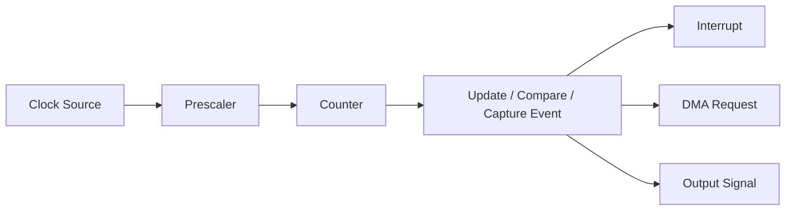

CPU가 반복문을 실행해 시간을 세는 방식과 달리, 하드웨어 Timer는 CPU가 다른 일을 수행하는 동안에도 설정된 Clock Domain에서 동작할 수 있다. 단, Sleep Mode와 Clock Gating에 따라 정지할 수 있다.

## 2. Timer가 쓰이는 곳

| 목적 | 대표적인 사용 |
|---|---|
| 주기적 이벤트 | 센서 샘플링, 제어 루프, 시스템 Tick |
| 경과 시간 측정 | Timeout, 실행 시간 측정 |
| 신호 생성 | PWM, 주파수 출력 |
| 외부 신호 측정 | Pulse Width, 주기·주파수 측정 |
| 통신 지원 | Baud Rate 기준, 프로토콜 Timeout |
| 다른 Peripheral 트리거 | ADC 변환 시작, DMA Request |

**시간 측정**, **시점 예약**, **파형 생성**을 구분하면 Timer 기능을 이해하기 쉽다.

---

## 3. Clock Source와 Clock Tree

Timer는 CPU Clock과 반드시 같은 속도로 동작하지 않는다. MCU의 Clock Tree, Bus Prescaler, Peripheral Clock 설정, 저전력 모드에 따라 Timer Input Clock이 결정된다.

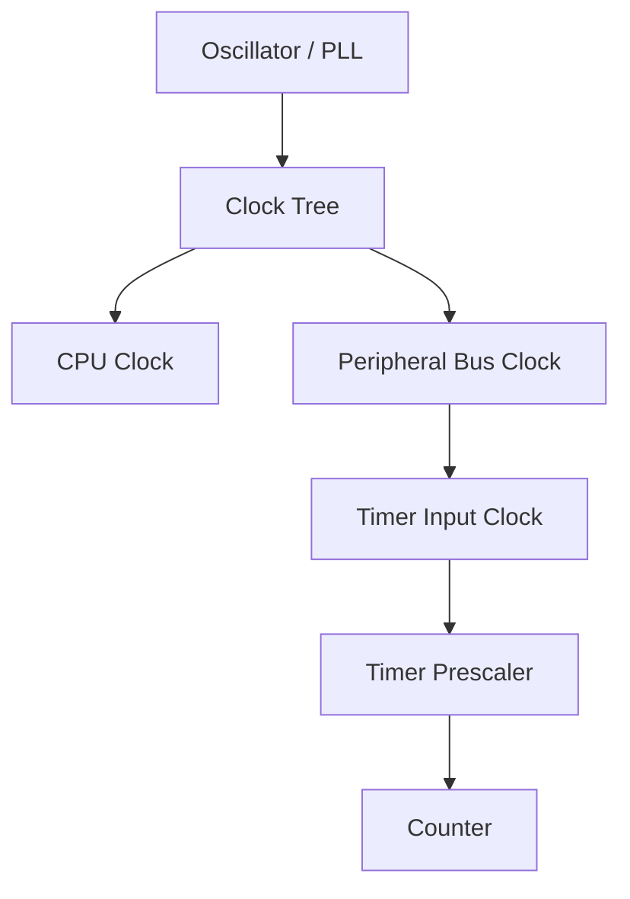

일부 MCU에서는 특정 Bus Prescaler 설정에 따라 Timer Clock이 Bus Clock과 다른 배율을 갖는다. **실제 Timer Input Clock 공식은 해당 MCU Reference Manual에서 확인**해야 한다.

## 4. Prescaler와 Counter Tick

Prescaler는 Timer Input Clock을 분주한다. 많은 MCU Timer에서 분주비가 `PSC + 1`이지만 모든 Timer에 적용되는 보편 법칙은 아니다.

해당 구조를 사용하는 Timer라면:

\[
f_{counter} = \frac{f_{timer}}{PSC + 1}
\]

\[
T_{tick} = \frac{1}{f_{counter}}
\]

예를 들어 Timer Input Clock이 48 MHz이고 `PSC = 47`이면 Counter는 1 MHz, 한 Tick은 1 µs다.

> 식의 `PSC`는 **Register에 기록하는 값**을 의미한다. 문서에서 Prescaler를 실제 분주비로 정의하면 식의 표기가 달라진다.

## 5. Counter와 Auto-Reload/Period

Counter(`CNT`)는 Tick마다 증가하거나 감소한다. Period 또는 Auto-Reload Register(`ARR` 등)는 주기 경계를 정한다.

많은 Up-counting Timer가 `0 → ARR`를 포함하여 센다면:

\[
T_{update} = \frac{(PSC+1)(ARR+1)}{f_{timer}}
\]

\[
f_{update} = \frac{f_{timer}}{(PSC+1)(ARR+1)}
\]

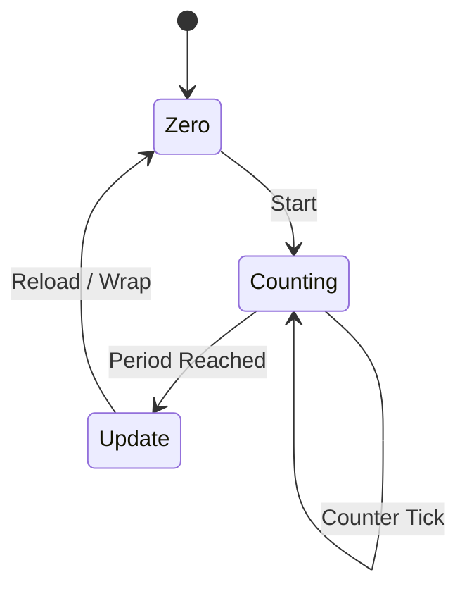

**주의:** Center-aligned, Down-counting, Repetition Counter, One-pulse Mode 등에서는 Update Event의 발생 빈도와 계산 방식이 달라질 수 있다.

## 6. Counter 폭과 Overflow

| Counter 폭 | 표현 가능한 값의 수 |
|---|---:|
| 8-bit | 256 |
| 16-bit | 65,536 |
| 32-bit | 4,294,967,296 |

Counter가 표현 범위를 넘어 Wraparound되는 현상을 Overflow라고 한다. `ARR`를 별도로 설정하면 실제 주기 경계는 Counter 최대값과 다를 수 있다.

```text
... 65533 → 65534 → 65535 → 0 → 1 ...
```

Overflow 자체는 오류가 아니다. 시간 측정에서는 이를 고려해 경과 Tick을 계산해야 한다.

---

## 7. 주요 Timer 동작 모드

| 모드 | 핵심 개념 |
|---|---|
| Up-counting | 0에서 Period까지 증가 |
| Down-counting | Period에서 0까지 감소 |
| Center-aligned | 증가·감소를 반복 |
| One-pulse | 정해진 이벤트 이후 한 번 동작 |
| Free-running | 지속적으로 Counter 실행 |
| Input Capture | 외부 이벤트 시 Counter 값 기록 |
| Output Compare | Counter와 Compare 값 일치 시 이벤트 |
| PWM | Period와 Compare 값으로 출력 파형 생성 |
| Encoder Interface | 외부 인코더 신호로 위치·방향 계산, 지원 MCU 한정 |

실제 지원 모드와 동작은 Timer 인스턴스별로 다르다. MCU 안의 모든 Timer가 같은 기능을 제공하는 것은 아니다.

## 8. Update Event와 Update Interrupt

Update Event는 Timer가 설정된 주기 경계 등에 도달했을 때 발생하는 내부 이벤트다. 이 이벤트가 Interrupt를 발생시키려면 해당 Interrupt Enable과 Interrupt Controller 설정이 필요할 수 있다.

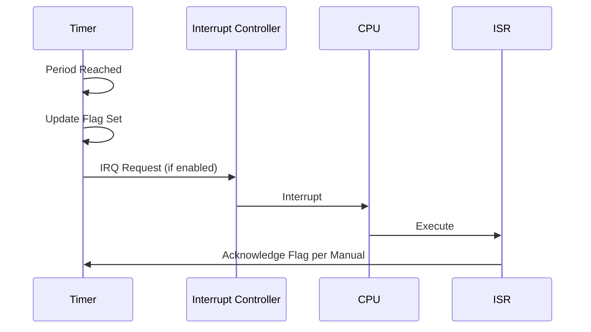

**Event 발생**, **Flag 설정**, **Interrupt 요청**, **ISR 실행**은 서로 다른 단계다. Event가 발생해도 Interrupt가 비활성화되어 있으면 ISR은 실행되지 않을 수 있다.

## 9. Timer Interrupt와 실행 시간

Timer가 1 ms마다 Interrupt를 발생시켜도 ISR이 정확히 1 ms 간격으로 시작된다고 단정할 수 없다.

- 높은 우선순위 Interrupt가 먼저 실행될 수 있다.
- Interrupt Masking 구간이 지연을 만들 수 있다.
- RTOS와 Critical Section이 응답 시간에 영향을 준다.
- ISR 실행 시간이 다음 주기보다 길면 이벤트 누락·병합·지연 가능성이 있다.

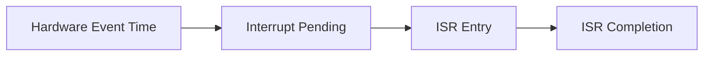

Hardware Event의 시간 정확도와 Software Handler의 시작 시간 정확도는 별도로 평가해야 한다.

---

## 10. Output Compare

Output Compare는 Counter 값과 Compare Register 값이 일치할 때 이벤트를 발생시킨다.

```text
CNT:  0  1  2  3  4  5  6  7 ...
CCR:           3
              ↑ Compare Match
```

Compare Match를 Interrupt, DMA Request 또는 출력 Pin 동작과 연결할 수 있다. 출력 Pin을 직접 제어하는 경우 CPU가 매번 Pin을 토글하는 것보다 시점의 재현성이 좋아질 수 있다.

## 11. Input Capture

Input Capture는 외부 신호의 Edge가 감지될 때 Counter 값을 Capture Register에 저장한다.

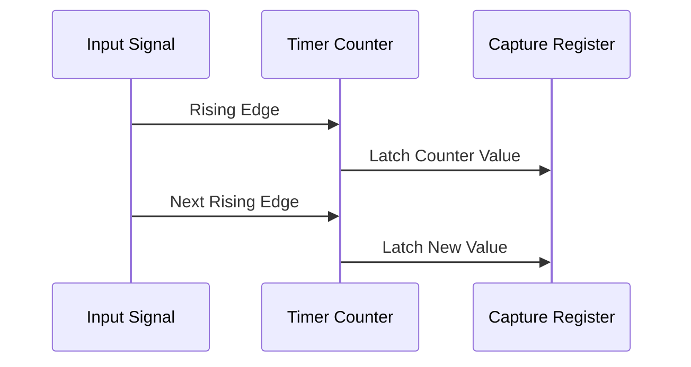

두 Capture 값의 차이를 이용해 Pulse 간격이나 주기를 구할 수 있다. Overflow, 입력 필터, Capture 지연, Overcapture Flag 등을 고려해야 한다.

## 12. PWM(Pulse Width Modulation)

PWM은 일정한 Period 내에서 High/Low 비율을 조절하는 파형이다.

```text
High  ┌──────┐        ┌──────┐
      │      │        │      │
Low ──┘      └────────┘      └──────
      <------- Period ------->
```

\[
Duty\ Cycle = \frac{T_{high}}{T_{period}} \times 100\%
\]

PWM Frequency는 반복 주기로 결정되고 Duty Cycle은 High 구간 비율로 결정된다. 일반적인 Edge-aligned PWM에서는 Period Register와 Compare Register를 통해 설정하지만, 정확한 극성·경계값·Center-aligned 공식은 Timer Mode에 따라 다르다.

| 활용 | 예시 |
|---|---|
| LED 밝기 | 평균 구동량 조절 |
| Motor 제어 | 구동 신호 생성 |
| Servo 제어 | Pulse Width 기반 제어 신호 |
| Power Electronics | Switching 제어 |

PWM은 전압을 연속적으로 바꾸는 DAC와 동일하지 않다. 부하와 필터에 따라 평균 효과가 달라진다.

## 13. Preload와 Shadow Register

일부 Timer는 Period·Compare 설정을 즉시 적용하지 않고 내부 Shadow Register에 보관했다가 Update Event에 맞춰 반영한다.

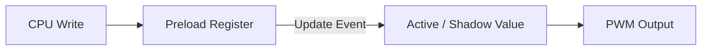

이 구조는 PWM 주기 중간에 설정이 바뀌어 예상치 못한 짧은 Pulse가 생기는 문제를 줄이는 데 유용하다. Preload Enable 여부와 Update Event 생성 방식은 제조사 문서를 따른다.

---

## 14. Timer를 이용한 Timeout

Timeout은 작업이 일정 시간 내 완료되지 않을 때 다른 경로로 전환하는 설계다.

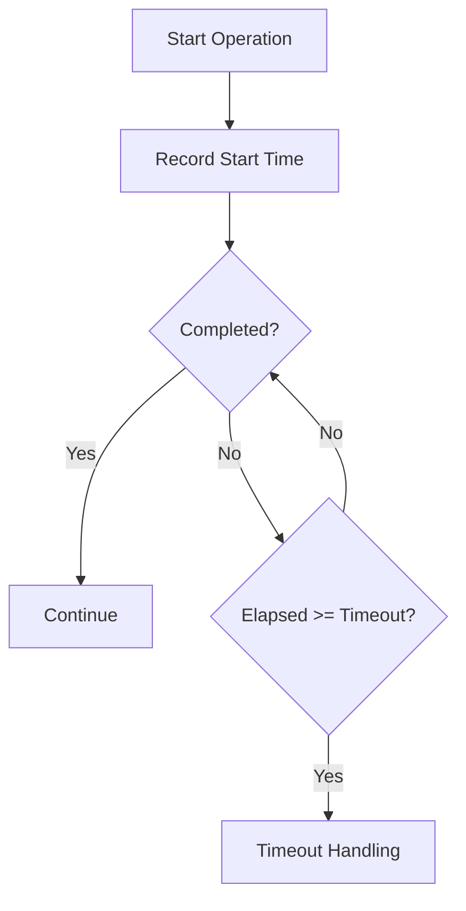

Timer는 Timeout을 판단할 **시간 기준**을 제공한다. Timeout 처리 자체는 FSM, Driver 또는 RTOS Task에서 수행할 수 있다.

## 15. Wraparound를 고려한 경과 시간

고정 폭의 Unsigned Tick Counter에서는 Modular Arithmetic을 이용해 경과 시간을 계산할 수 있다.

```c
#include <stdint.h>

uint32_t elapsed = (uint32_t)(now - start);
if (elapsed >= timeout_ticks) {
    /* Timeout condition */
}
```

이 방식은 같은 폭의 Unsigned Counter가 정상적으로 Wraparound되고, 실제 경과 시간이 **Counter의 한 바퀴보다 짧아 구분 가능한 범위**에 있을 때 유용하다. 여러 바퀴가 지난 경우에는 단순 차이만으로 전체 경과 시간을 알 수 없다.

또한 8/16-bit 타입은 C의 Integer Promotion으로 인해 연산 의미가 달라질 수 있으므로 폭과 캐스팅을 검토해야 한다.

## 16. Busy Wait와 Hardware Timer

| 방식 | 특징 | 주의 |
|---|---|---|
| 단순 반복문 Delay | 구현이 단순해 보임 | 최적화·Clock·Interrupt 영향, 이식성 낮음 |
| Timer Polling | Hardware Tick 기준 | CPU를 계속 점유할 수 있음 |
| Timer Interrupt | 이벤트 기반 | ISR 부하·Latency 고려 |
| RTOS Delay | Task 실행을 일정 시간 뒤로 미룸 | Scheduler Tick·우선순위에 따른 지연 |
| Output Compare/PWM | Hardware가 시점·파형 처리 | Peripheral 설정·Pin 기능 확인 |

**정확한 Pin 파형**이 필요하면 Software Delay보다 Hardware Output 기능을 우선 검토한다.

---

## 17. System Tick과 RTOS Tick

RTOS는 주기적 Tick Interrupt를 이용해 Delay와 Timeout을 관리할 수 있다. 그러나 모든 RTOS가 반드시 고정 주기 Tick에만 의존하는 것은 아니며 Tickless Idle 같은 구조도 있다.

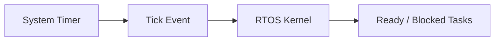

- Timer Tick: Hardware Counter의 기본 시간 단위.
- RTOS Tick: Kernel이 사용하는 시간 기준.
- Task Period: Application이 요구하는 실행 주기.

세 값은 서로 같지 않을 수 있다.

## 18. 주기적 Task와 Drift

Task 종료 후 일정 시간 기다리는 방식은 실행 시간만큼 주기가 늘어날 수 있다.

```text
Execute → Delay → Execute → Delay
```

반면 고정 기준 시점에 맞춰 다음 실행을 예약하면 장기 Drift를 줄이는 데 도움이 된다.

```text
T0 → T0+P → T0+2P → T0+3P
```

다만 Deadline Miss, Scheduler 지연, Tick 해상도는 별도 문제다. RTOS의 주기적 Delay API가 어떤 기준으로 시간을 계산하는지 확인한다.

## 19. FSM과 Timer

FSM에서 Timer는 Timeout Event를 만드는 역할을 한다.

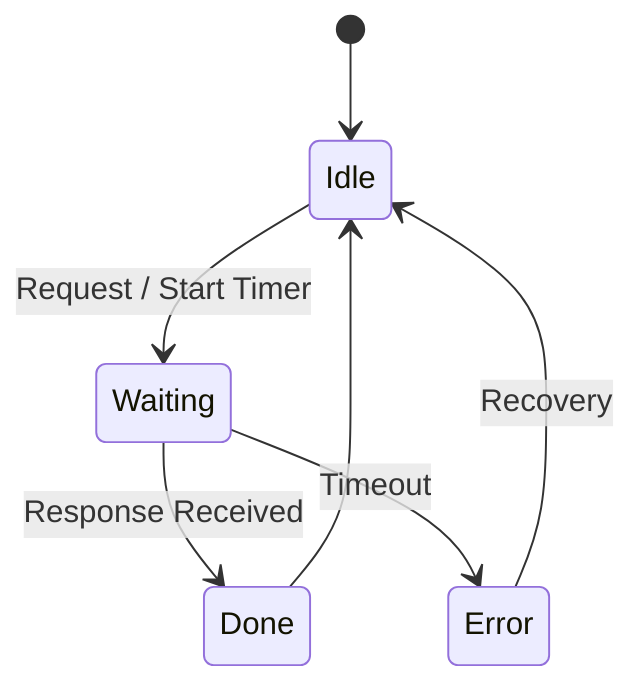

Timeout 판단을 상태 전이와 분리하면 UART Packet Parser, Sensor Driver, 통신 재시도 로직의 책임이 명확해진다.

## 20. UART와 Timer

UART 주변장치 자체가 Baud Rate Generator를 제공하는 경우가 일반적이지만, Timer는 다음 보조 역할을 할 수 있다.

- 수신 Packet의 Inter-byte Timeout.
- 전송 완료 대기 Timeout.
- 통신 Retry 간격.
- 특정 MCU의 특수 Serial Timing.

UART의 실제 Bit Timing을 일반 Timer가 항상 담당한다고 가정하지 않는다.

## 21. ADC·DMA와 Timer Trigger

Timer Event는 지원되는 MCU에서 ADC 변환이나 DMA 전송의 Trigger가 될 수 있다.

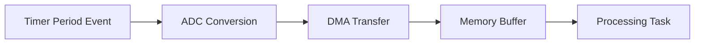

이 구조는 Software Loop보다 일정한 샘플링 시점을 만들기 쉽다. 다만 ADC Conversion Time, Trigger Latency, DMA 대역폭, Buffer 처리 속도를 함께 고려한다.

---

## 22. Interrupt, DMA, Timer의 역할 구분

| 구성 요소 | 핵심 역할 |
|---|---|
| Timer | 시간 기준·이벤트 생성 |
| Interrupt | CPU에 이벤트 처리 요청 |
| DMA | CPU의 반복 복사 없이 데이터 이동 |
| Ring Buffer | 연속 데이터의 생산·소비 분리 |
| FSM | 이벤트에 따른 상태 전이 |
| RTOS | Task 실행·대기·동기화 관리 |

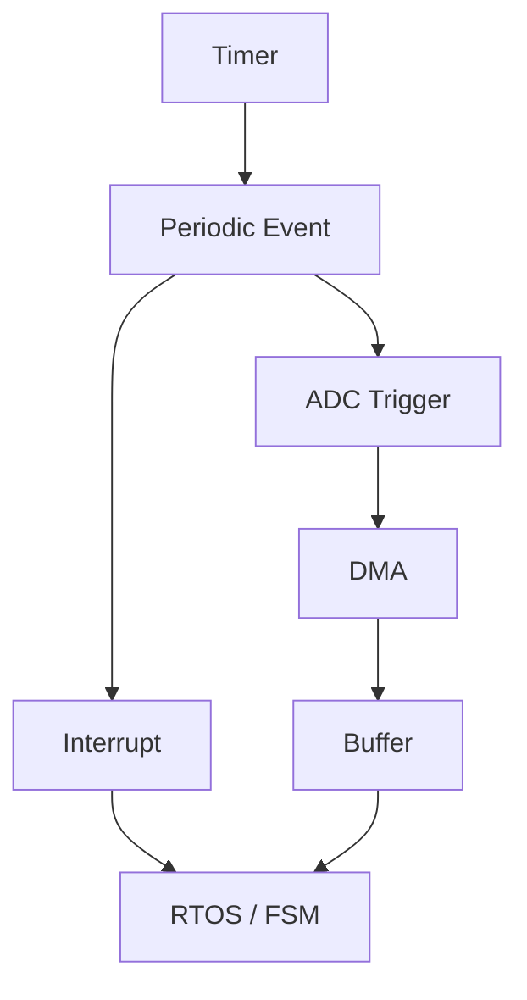

## 23. Register와 Timer 설정

Timer Driver는 대체로 다음 Register 계열을 다룬다.

| Register 계열 | 역할 |
|---|---|
| Clock/Enable | Timer Clock 및 기능 활성화 |
| Prescaler | Counter Clock 분주 |
| Counter | 현재 Tick 값 |
| Period/Reload | 주기 경계 |
| Compare/Capture | 비교 시점·외부 이벤트 시점 |
| Status | Update·Compare·Capture 등 Flag |
| Interrupt/DMA Enable | 이벤트의 전달 경로 선택 |
| Control/Mode | Count 방향, One-pulse, PWM 등 |

실제 Register 이름·Reset Value·Write Semantics는 MCU마다 다르다. 특히 Status Flag는 W1C 또는 다른 Clear 방식일 수 있으므로 `Register.md`의 원칙을 적용한다.

## 24. Timer 초기화 순서의 의미

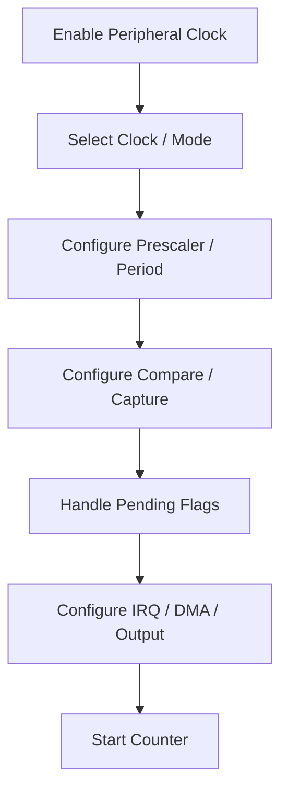

위 흐름은 **개념적 순서**다. 실제 하드웨어에서는 Register Update Event 강제 발생, Preload 반영, Counter 초기화, Interrupt Pending Clear, Pin Alternate Function 설정의 순서가 중요할 수 있다. 제조사 HAL 또는 Reference Manual의 초기화 절차를 따른다.

## 25. 정확도와 분해능

Timer의 품질을 설명할 때는 다음 개념을 분리한다.

| 개념 | 의미 |
|---|---|
| Resolution | 구분 가능한 최소 Tick 간격 |
| Accuracy | 실제 시간과 측정·생성 시간의 일치 정도 |
| Precision | 반복 측정·생성 결과의 일관성 |
| Jitter | 이벤트 시점의 변동 |
| Drift | 장기적으로 기준 시간에서 누적되는 편차 |
| Latency | 이벤트 발생부터 처리까지의 지연 |

1 µs Tick을 가진 Timer라도 Clock Source 오차가 크면 장기 시간 정확도는 낮을 수 있다. ISR로 처리하는 이벤트에는 Interrupt Latency와 Jitter가 추가된다.

## 26. Clock 오차와 장기 시간

Timer는 기준 Clock보다 더 정확해질 수 없다. 내부 RC Oscillator, 외부 Crystal, PLL 등은 서로 다른 오차·전력·기동 특성을 가진다.

```text
Reference Clock Error
        ↓
Timer Frequency Error
        ↓
Period / Timeout Error
```

온도, 전압, Clock Calibration, 저전력 전환도 실제 시간에 영향을 줄 수 있다.

## 27. Low-power Mode와 Timer

Sleep/Stop/Standby 계열 모드에서는 일반 Timer가 정지할 수 있다. 일부 MCU는 Low-power Timer 또는 RTC가 별도 저속 Clock Domain에서 동작한다.

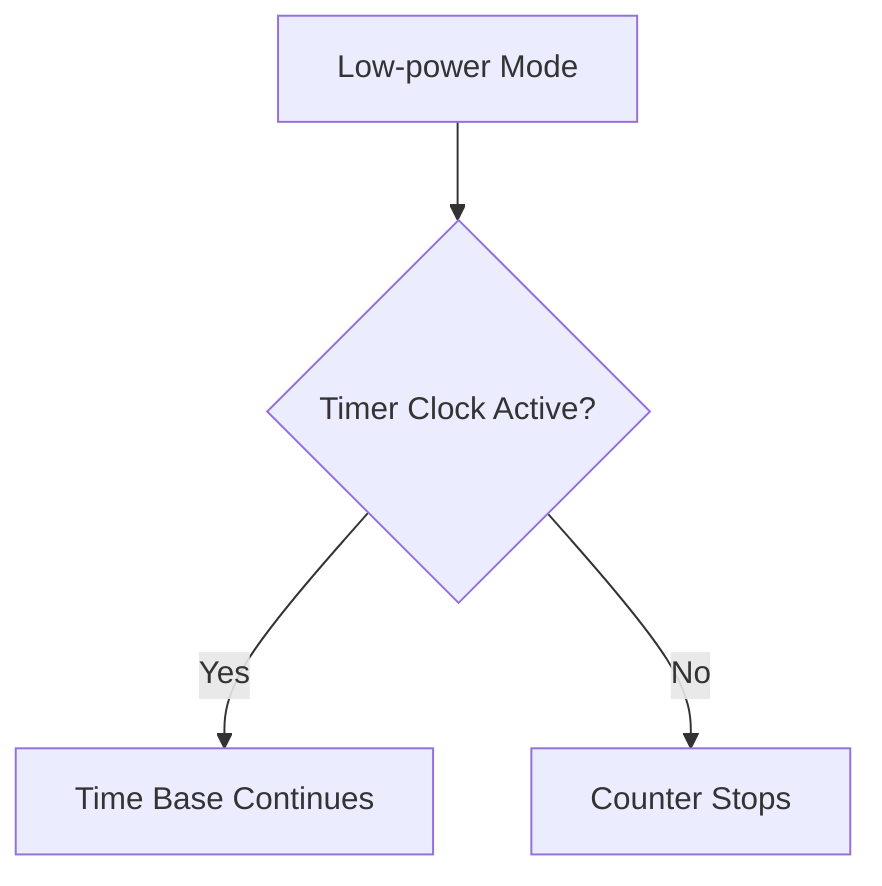

Sleep 중 Timeout이나 Wakeup이 필요하다면 **해당 전력 모드에서 실제로 동작하는 Timer와 Clock Source**를 선택해야 한다.

## 28. Watchdog과 일반 Timer

Watchdog Timer(WDT)는 Software가 정해진 시간 안에 정상 동작을 증명하지 못하면 Reset 등 복구 동작을 유발하도록 설계된다.

| 일반 Timer | Watchdog |
|---|---|
| 시간 측정·주기 이벤트 | 시스템 이상 감지·복구 |
| Event/Interrupt/출력 활용 | Feed/Refresh Window와 Reset 동작 중심 |
| Application Timing | Fault Recovery 정책 |

Watchdog을 단순 Delay Timer로 취급하지 않는다. Independent Watchdog, Window Watchdog, Debug Mode 동작은 MCU별로 확인한다.

## 29. Timer 공유와 동시성

하나의 Timer를 여러 모듈이 임의로 재설정하면 Prescaler, Period, Interrupt, PWM 출력이 함께 영향을 받을 수 있다.

- Timer별 **소유 모듈**을 정한다.
- 공유 Time Base와 전용 PWM Timer를 구분한다.
- ISR과 Task가 같은 Timer Register를 수정할 때 동기화 정책을 세운다.
- `volatile`만으로 Read-Modify-Write의 원자성이 보장되지는 않는다.
- 여러 채널이 같은 Counter/Period를 공유하는지 확인한다.

## 30. 자주 혼동하는 개념

| 혼동 | 구분 |
|---|---|
| Timer Clock = CPU Clock | Clock Tree에 따라 다를 수 있음 |
| Prescaler Register = 분주비 | 흔히 `PSC+1`이 분주비이나 장치별 확인 |
| Timer Event = ISR 실행 | Interrupt Enable·Priority·Masking이 별도 |
| Timer Resolution = 시간 Accuracy | Clock 오차와 Jitter를 별도로 고려 |
| PWM = 아날로그 전압 출력 | PWM은 디지털 Pulse 파형 |
| `volatile` = 정확한 Timing | Compiler 접근 의미와 실제 Hardware Timing은 별개 |
| Counter Overflow = 오류 | 설계상 정상적인 Wraparound일 수 있음 |
| RTOS Delay = 정확한 Hardware Output | Task Scheduling과 Pin Output Timing은 다름 |
| 모든 Timer가 PWM·Capture 지원 | 인스턴스별 기능 확인 필요 |

## 31. 전체 개념도

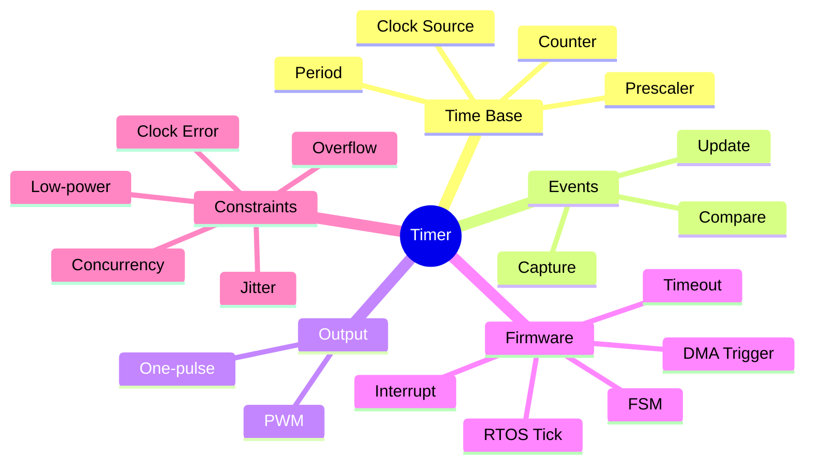

## 32. 핵심 요약

> Timer는 Clock을 세어 **시간 기준과 Hardware Event**를 만든다.

> Prescaler와 Period는 Counter Tick과 Event 주기를 결정하지만 정확한 공식은 Timer Mode와 MCU 문서를 따른다.

> Output Compare·Input Capture·PWM은 CPU의 반복적인 Software Timing 작업을 Hardware로 옮긴다.

> Timer Event, Interrupt Request, ISR 실행은 서로 다른 단계다.

> Timeout에는 Wraparound, Clock 오차, 실행 지연을 고려해야 한다.

> Timer는 ADC·DMA·UART·FSM·RTOS를 연결하는 공통 시간 기반이 될 수 있다.

---

## 다음 학습 문서

`05_Embedded/Watchdog.md` — Watchdog의 동작 원리, Refresh 정책, Window Watchdog, Reset Cause, Fault Recovery와 RTOS 연계를 정리한다.
