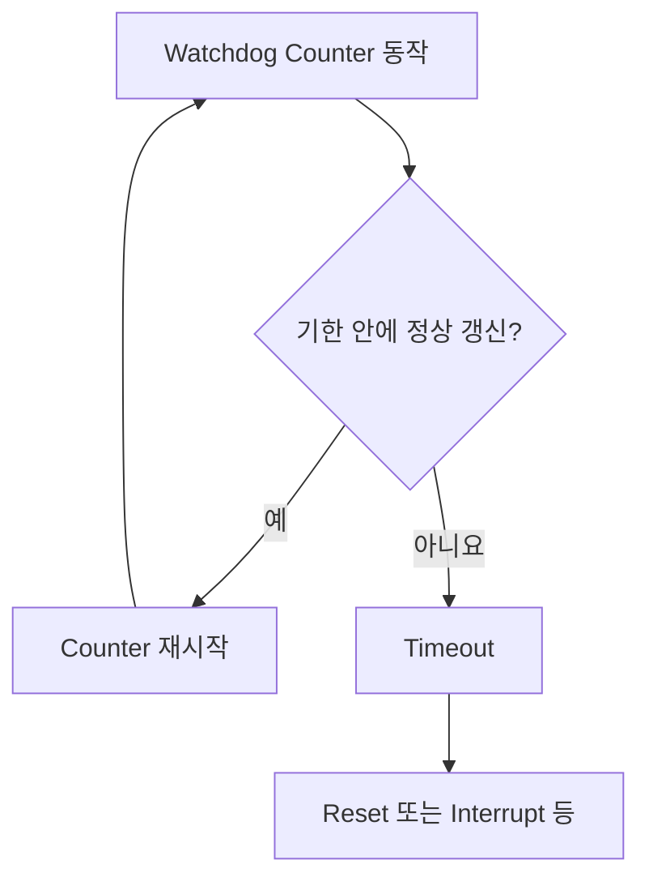
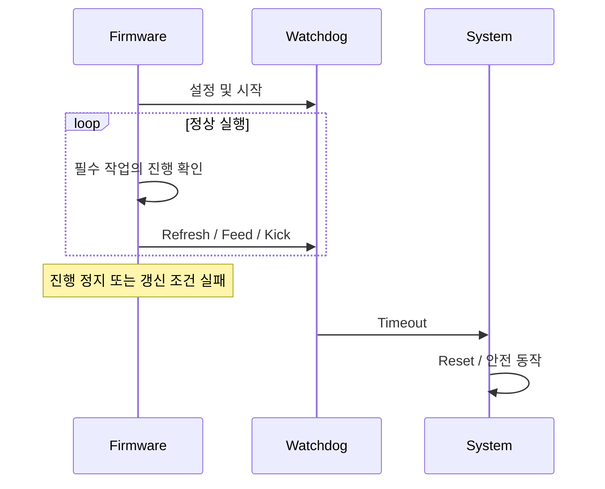
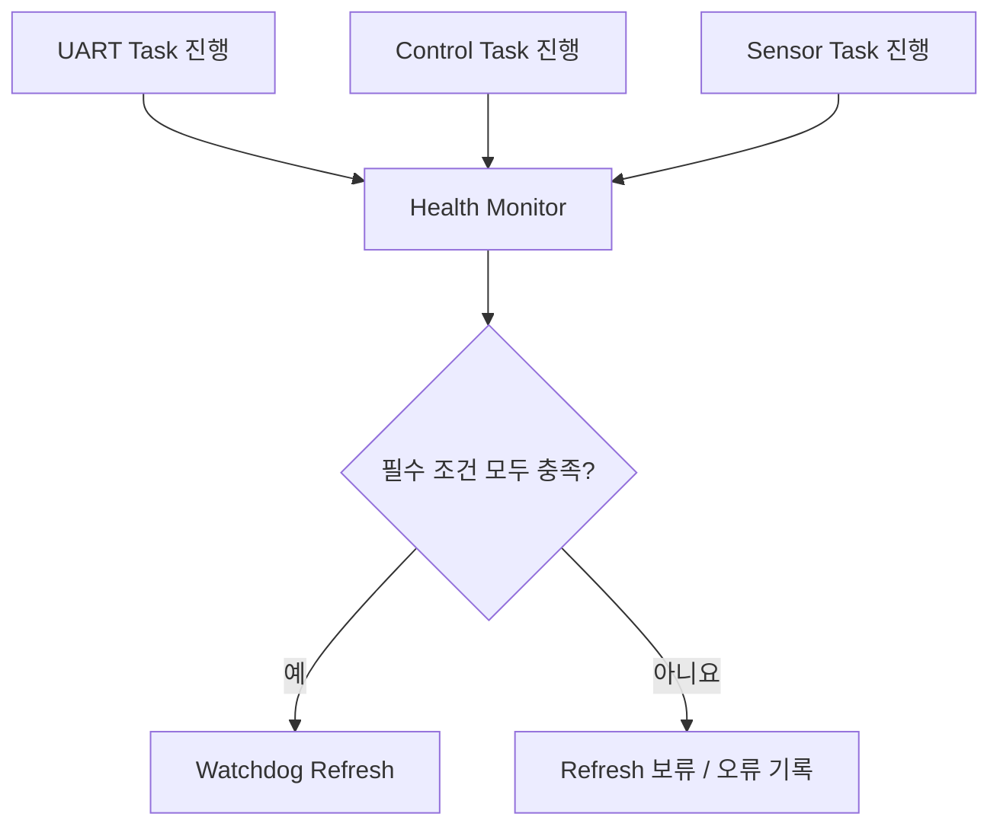
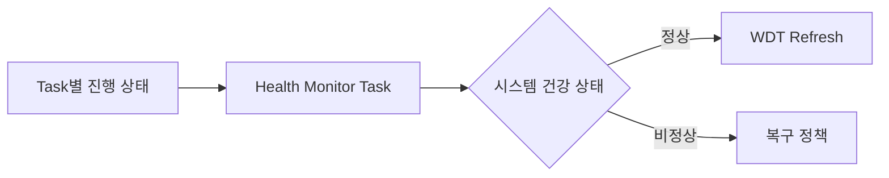
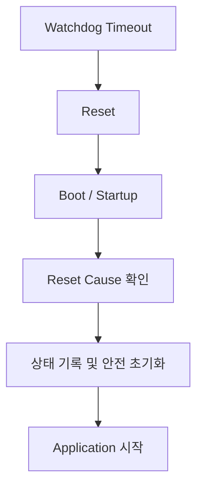
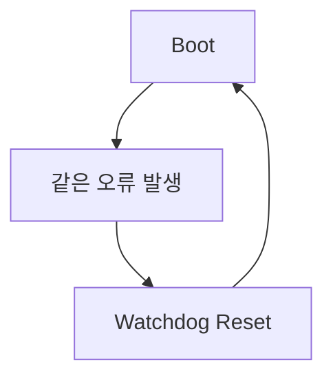
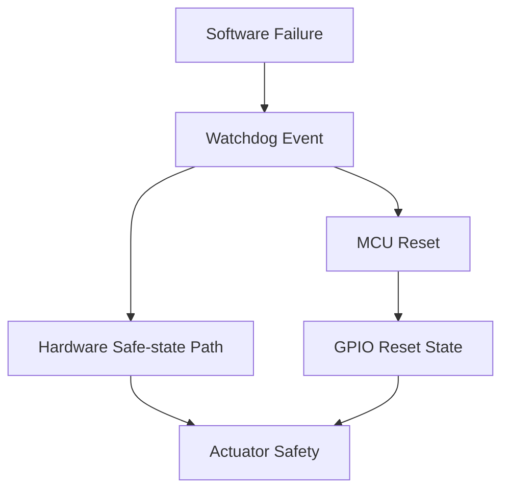
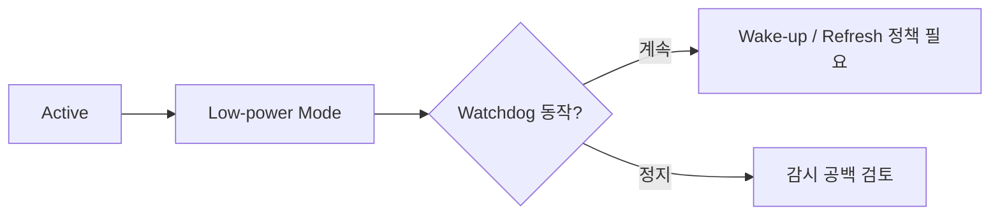
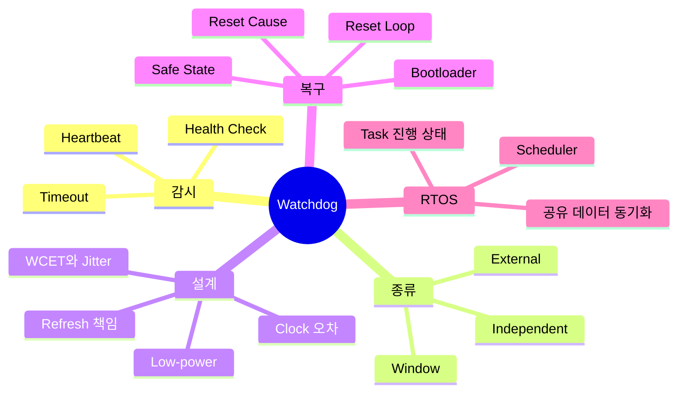

# Watchdog

> **학습 위치:** `C_Cpp_Study/05_Embedded/Watchdog.md`  
> **선행 개념:** `Register.md`, `Interrupt.md`, `Timer.md`, `RTOS.md`  
> **범위:** 개념 정리. 실습·퀴즈 제외. MCU별 구체적 설정값과 동작은 해당 Reference Manual 및 Errata 확인.

---

## 1. Watchdog란?

**Watchdog Timer(WDT)**는 펌웨어가 정해진 시간 안에 정상 동작의 증거를 제공하지 못하면 정해진 복구 동작을 유발하는 하드웨어 감시 장치다. 가장 흔한 복구 동작은 시스템 Reset이지만, 장치에 따라 먼저 Interrupt를 발생시키거나 별도 안전 출력으로 연결되기도 한다.



Watchdog는 **고장을 예방하거나 원인을 자동으로 고치는 기능이 아니다.** 이상 상태가 장시간 지속되지 않도록 탐지·복구 경로를 제공한다.

## 2. 왜 필요한가?

정상적인 펌웨어도 다음과 같은 상황에서 진행이 멈출 수 있다.

| 상황 | 예시 | Watchdog 관점 |
|---|---|---|
| 무한 루프 | 종료 조건이 충족되지 않음 | 정상 갱신이 멈추면 Timeout |
| Deadlock | Task들이 서로 자원을 기다림 | 감시 대상의 진행이 멈추면 Timeout |
| Interrupt 이상 | ISR에서 빠져나오지 못함 | 갱신 실행 기회를 잃을 수 있음 |
| 외부 장치 응답 대기 | 통신·버스 응답이 오지 않음 | Timeout 정책과 연계 가능 |
| 메모리 손상 | 제어 흐름 또는 상태 변수 손상 | 일부 이상을 간접 탐지 가능 |

**모든 오류가 Watchdog Timeout으로 이어지는 것은 아니다.** 잘못된 결과를 계속 내면서 Watchdog만 갱신하는 시스템은 감시를 통과할 수 있다.

## 3. Timer와 Watchdog의 차이

| 항목 | 일반 Timer | Watchdog |
|---|---|---|
| 주목적 | 시간 측정·주기 이벤트·PWM 등 | 시스템 진행 상태 감시 |
| 만료 시 | Flag, Interrupt, 출력 변화 등 | 주로 Reset 또는 경고 후 Reset |
| 갱신 의미 | Timer 설정에 따름 | 정해진 기한 안에 정상 동작 증명 |
| 운용 관점 | 기능 구현 | 오류 탐지·복구 |

둘 다 Counter와 Clock을 사용할 수 있지만 **설계 목적과 만료 후 동작**이 다르다.

---

## 4. 기본 동작 흐름



`Refresh`, `Feed`, `Kick`, `Pet`은 Watchdog Counter를 정상적으로 갱신한다는 뜻으로 사용되는 표현이다. 실제 Register 이름과 갱신 절차는 MCU마다 다르다.

## 5. Timeout의 의미

Watchdog Timeout은 마지막 유효 갱신 이후 허용되는 최대 시간과 관련된다. 실제 허용 시간은 Clock 오차, Prescaler, Counter 폭, Window 설정, Reset 지연 등에 따라 달라진다.

```text
Watchdog Clock → Prescaler → Counter → Timeout Event
```

**정확한 Timeout 식을 모든 MCU에 공통으로 적용할 수는 없다.** Up/Down Counter 방식과 갱신 조건이 다르므로 제조사 문서의 계산식을 따른다.

## 6. Watchdog Clock

Watchdog가 CPU의 주 Clock과 완전히 동일한 Clock에만 의존하면 CPU Clock 이상 시 감시 기능도 영향을 받을 수 있다. 많은 MCU는 별도 저속 내부 Oscillator를 Watchdog Clock으로 사용한다.

- 별도 Clock을 사용해도 **완전한 독립성이나 절대 정확도**가 보장되는 것은 아니다.
- 내부 저속 Oscillator의 허용 오차는 Timeout 설계에 반영한다.
- Sleep/Stop/Debug 모드에서 Watchdog가 계속 동작하는지는 MCU별 설정과 기능에 따라 다르다.

## 7. Independent Watchdog와 Window Watchdog

| 구분 | 일반적인 목적 | 주요 특징 |
|---|---|---|
| Independent Watchdog(IWDG 등) | 갱신 누락 감시 | 독립 Clock을 쓰는 구현이 많음 |
| Window Watchdog(WWDG 등) | 너무 늦거나 너무 이른 갱신 감시 | 허용 시간 구간 안에서만 갱신 가능 |

명칭과 구현은 제조사마다 다르다. **Independent**는 보통 Clock·기능의 독립성을, **Window**는 갱신 시점 제한을 강조한다.

## 8. Window Watchdog

일반 Watchdog는 기한 전에 갱신하기만 하면 되는 경우가 많다. Window Watchdog는 **너무 빠른 갱신도 오류**로 간주할 수 있다.


Window는 펌웨어가 의도한 실행 순서를 건너뛰고 지나치게 빠르게 갱신하는 일부 오류를 탐지하는 데 도움이 된다. 다만 너무 좁은 Window는 정상적인 실행 시간 변동에도 Reset을 유발할 수 있다.

## 9. Refresh를 어디서 수행할까?

Watchdog의 효과는 **어느 코드가 어떤 조건에서 갱신하는지**에 크게 좌우된다.

| 위치 | 장점 | 한계 |
|---|---|---|
| Main Loop | 구조가 단순함 | 루프만 살아 있고 필수 기능은 멈출 수 있음 |
| 주기 Timer ISR | 일정 주기 확보 용이 | Main/Task가 멈춰도 ISR이 갱신할 위험 |
| 단일 RTOS Task | 감시 정책을 집중 관리 | 해당 Task만 실행된다고 전체가 정상은 아님 |
| Health Monitor | 여러 필수 기능의 진행 상태 반영 | 진행 상태 정의·동기화 필요 |

**Timer ISR에서 무조건 Watchdog를 갱신하는 설계는 피해야 할 수 있다.** 실제 Application이 멈춰도 ISR이 계속 실행되면 오류가 가려진다.

## 10. Heartbeat와 Health Check

Heartbeat는 특정 Task나 모듈이 최근에 의미 있는 진행을 했음을 나타내는 신호다. 단순히 함수가 호출되었다는 사실과 **업무가 정상적으로 완료되었다는 사실**은 구분한다.



감시 조건은 시스템 요구사항에 따라 다르다. 모든 Task가 매 주기 반드시 실행되어야 하는 것은 아니며, 이벤트를 기다리는 정상적인 Blocked Task를 오류로 판단하지 않도록 설계한다.

## 11. RTOS와 Watchdog

RTOS 환경에서는 Task별 실행 주기, 우선순위, Blocking 시간과 Watchdog 기한이 연결된다.

- 고우선순위 Task가 CPU를 독점하면 저우선순위 Health Monitor가 실행되지 않을 수 있다.
- Mutex Deadlock이 발생해도 다른 Task는 계속 실행될 수 있다.
- Queue 수신 대기는 정상 상태일 수 있다.
- ISR에서의 장시간 처리로 Task 스케줄링이 지연될 수 있다.



Watchdog는 RTOS Scheduler의 대체물이 아니며, Task 동기화 문제 자체를 해결하지 않는다.

## 12. Timeout 선정 기준

Timeout은 단순히 짧을수록 좋은 값이 아니다.

| 너무 짧을 때 | 너무 길 때 |
|---|---|
| 정상적인 최악 실행 시간에도 Reset 가능 | 오류 탐지와 복구가 늦어짐 |
| Flash 작업·통신 대기와 충돌 가능 | 안전 요구사항을 충족하지 못할 수 있음 |
| Clock 오차와 Jitter에 민감 | 장애가 오래 지속될 수 있음 |

고려할 항목:

1. 정상 동작의 **최악 실행 시간(WCET)** 및 스케줄링 지연
2. Interrupt Mask 구간과 Critical Section
3. Flash Erase/Write 등 긴 Blocking 작업
4. Sleep/Stop 모드와 Wake-up 지연
5. Watchdog Clock 허용 오차
6. 제품의 허용 장애 감지·복구 시간

특정 수치나 안전 여유율을 보편 규칙으로 고정하지 않는다.

## 13. 긴 작업과 Watchdog

Firmware Update, Flash Erase, Calibration 등은 일반 주기보다 오래 걸릴 수 있다.

가능한 설계 관점은 다음과 같다.

- 긴 작업을 단계로 나누고 **단계별 정상 진행**을 확인한다.
- 작업 수행 중에도 Watchdog 갱신 책임이 유지되도록 한다.
- 필요하다면 허용되는 범위에서 Timeout/Window 정책을 변경한다.
- Watchdog를 일시 정지할 수 있는지, 정지가 안전 요구사항에 부합하는지 확인한다.

긴 작업이라는 이유만으로 무조건 갱신하면 해당 작업 내부의 무한 대기가 가려질 수 있다.

---

## 14. Reset 이후의 흐름

Watchdog Timeout 이후에는 대개 Boot Sequence가 다시 시작된다.



Reset이 모든 외부 장치, 통신 상대, 전원 Rail까지 초기화한다는 뜻은 아니다. MCU 내부 Reset Domain과 외부 Hardware의 상태를 구분한다.

## 15. Reset Cause Register

많은 MCU는 Reset 원인을 나타내는 Status Register를 제공한다.

```text
Power-on Reset
Software Reset
Watchdog Reset
Brown-out Reset
External Reset
```

주의점:

- 여러 Reset Flag가 동시에 설정되어 있을 수 있다.
- Flag의 Clear 방법은 W1C 등 MCU별 규칙을 따른다.
- Bootloader가 Flag를 먼저 읽거나 지울 수 있다.
- Reset 원인 정보가 모든 실패 원인을 완전하게 설명하지는 않는다.

**Reset Cause는 가능한 한 초기 Boot 단계에서 확인하고 보존하는 설계**를 검토한다.

## 16. Reset Loop

Watchdog로 재부팅했지만 같은 오류가 즉시 반복되면 Reset Loop에 빠질 수 있다.



제품 요구사항에 따라 Reset 횟수 기록, 안전 모드, 제한된 기능으로의 부팅, 진단 정보 보존, 외부 안전 회로 연계 등의 정책이 필요할 수 있다. 이러한 정책은 저장 매체 수명과 전원 차단 가능성도 고려해야 한다.

## 17. Watchdog와 안전 상태

Watchdog Reset은 **항상 안전 상태를 의미하지 않는다.** 예를 들어 Motor, Heater, Relay 등은 Reset 순간 출력이 어떻게 변하는지 별도로 검토해야 한다.



안전 요구사항이 높은 시스템은 MCU Watchdog 외에 External Watchdog, Power Supervisor, Fail-safe 출력 회로 등을 사용할 수 있다. 실제 설계는 해당 제품의 안전 요구사항과 Hardware 구조에 따른다.

## 18. External Watchdog

External Watchdog는 MCU 외부의 별도 IC 또는 회로가 펌웨어의 진행 신호를 감시하는 방식이다.

| 내부 Watchdog | 외부 Watchdog |
|---|---|
| MCU에 통합 | 별도 Hardware |
| 설정과 배선이 상대적으로 단순 | 추가 부품·배선·비용 필요 |
| MCU 내부 고장과 공통 원인 가능 | 일부 MCU 내부 고장에 대한 독립성 확보 가능 |

외부 Watchdog도 Clock, 전원, Feed 신호, Reset 경로를 포함한 전체 설계를 검증해야 한다.

## 19. Debug 모드와 Watchdog

Breakpoint에서 CPU가 멈춰도 Watchdog는 계속 진행할 수 있다. MCU에 따라 Debug Halt 중 Watchdog 정지 옵션을 제공한다.

- Debug 중 정지 여부와 Production 설정을 혼동하지 않는다.
- Debugger 연결 상태에서만 나타나는 동작 차이를 기록한다.
- Release Firmware에서 Watchdog가 실제로 활성화되는지 확인한다.

**Debug에서 정상이라는 사실만으로 실제 장치에서의 Timeout 동작을 보장할 수 없다.**

## 20. 저전력 모드와 Watchdog

Sleep/Stop/Standby 모드에서는 CPU와 일부 Clock이 정지할 수 있다. Watchdog가 계속 동작하면 예상한 Sleep 시간 중 Timeout이 발생할 수 있다.



모드별 동작과 정지 가능 여부는 MCU Reference Manual을 따른다.

## 21. Bootloader와 Firmware Update

Watchdog는 Application만이 아니라 Bootloader, Firmware Update 과정과도 연결된다.

- Bootloader가 Watchdog를 시작했는가?
- Application으로 진입해도 Watchdog가 계속 동작하는가?
- Flash Erase/Write 중 갱신 가능한가?
- Update 실패 후 어느 Image로 부팅하는가?
- Reset Cause와 Update 상태를 어떻게 보존하는가?

특히 **Watchdog가 한번 시작되면 Software로 중지할 수 없는 MCU**도 있으므로 Bootloader–Application 간 책임을 명확히 한다.

## 22. Interrupt, Timer, DMA와의 연결

| 관련 개념 | Watchdog와의 관계 |
|---|---|
| Interrupt | 장시간 ISR 또는 Interrupt 비활성화가 갱신을 지연시킬 수 있음 |
| Timer | Heartbeat 주기나 Timeout 측정의 기준이 될 수 있음 |
| DMA | 전송 자체가 계속돼도 Application 처리 상태는 별도 확인 필요 |
| UART | 수신 바이트 존재와 프로토콜 처리 정상 여부는 다름 |
| Ring Buffer | Producer/Consumer 진행과 Overflow 감시 가능 |
| FSM | 특정 State에서 허용되는 체류 시간과 연결 가능 |
| RTOS | 여러 Task의 진행 상태를 종합해 Refresh 결정 |

## 23. `volatile`과 Watchdog

Watchdog Register가 MMIO라면 `volatile` 접근이 필요할 수 있다. 하지만 Health Monitor가 읽는 Task 간 공유 상태는 별도의 동기화 설계가 필요하다.

```text
volatile Register Access
≠
Atomic Task-to-Task Communication
```

공유 Heartbeat의 읽기·쓰기 원자성, 가시성, 순서, Reset 시 초기화 정책은 MCU·컴파일러·RTOS의 지원 기능을 기준으로 설계한다.

## 24. 흔한 오해

| 오해 | 실제 개념 |
|---|---|
| Watchdog를 켜면 시스템이 안정적이다 | 갱신 정책과 Reset 후 복구 경로가 중요하다 |
| 주기 ISR에서 갱신하면 충분하다 | Application 정지를 가릴 수 있다 |
| Timeout은 짧을수록 좋다 | 정상 최악 지연과 Clock 오차를 고려해야 한다 |
| Watchdog Reset은 전원 재인가와 같다 | Reset Domain과 외부 장치 상태가 다를 수 있다 |
| `volatile`이면 Heartbeat 공유가 안전하다 | Atomicity와 동기화는 별개다 |
| Window Watchdog는 늦은 갱신만 감시한다 | 너무 이른 갱신도 오류일 수 있다 |
| Watchdog가 모든 Firmware 오류를 검출한다 | 갱신이 계속되는 논리 오류는 놓칠 수 있다 |

---

## 25. 핵심 개념 요약



> **Watchdog는 단순히 주기적으로 갱신하는 Timer가 아니라, 시스템의 정상 진행 여부를 복구 동작과 연결하는 감시 장치다.**

> **좋은 갱신 정책은 “코드가 실행되었다”보다 “필수 기능이 정해진 시간 안에 의미 있게 진행되었다”에 가깝다.**

> **Timeout, Reset Cause, 안전 상태, Bootloader, RTOS Task 상태를 함께 고려해야 Watchdog가 실제 복구 전략으로 작동한다.**

## 다음 학습

**다음 문서:** `05_Embedded/Bootloader.md` — Reset/Boot 흐름, 메모리 배치, Firmware Update, Image 검증과 Watchdog 연계를 개념 중심으로 정리한다.
