# Bootloader

> **학습 위치:** `C_Cpp_Study/05_Embedded/Bootloader.md`  
> **선행 개념:** `Register.md`, `Interrupt.md`, `UART.md`, `DMA.md`, `Watchdog.md`  
> **범위:** 임베디드 MCU의 부팅·펌웨어 업데이트 구조를 개념 중심으로 정리한다. 실습과 퀴즈는 포함하지 않는다.

---

## 1. Bootloader란?

**Bootloader는 Reset 이후 Application Firmware를 실행하기 전, 부팅 대상과 실행 가능 여부를 결정하고 필요한 초기화·검증·업데이트를 수행하는 소프트웨어다.**

모든 MCU가 사용자 작성 Bootloader를 필요로 하는 것은 아니다. 단일 Application을 Reset Vector에서 곧바로 실행할 수도 있고, MCU 내부의 **ROM Bootloader**를 이용할 수도 있다.

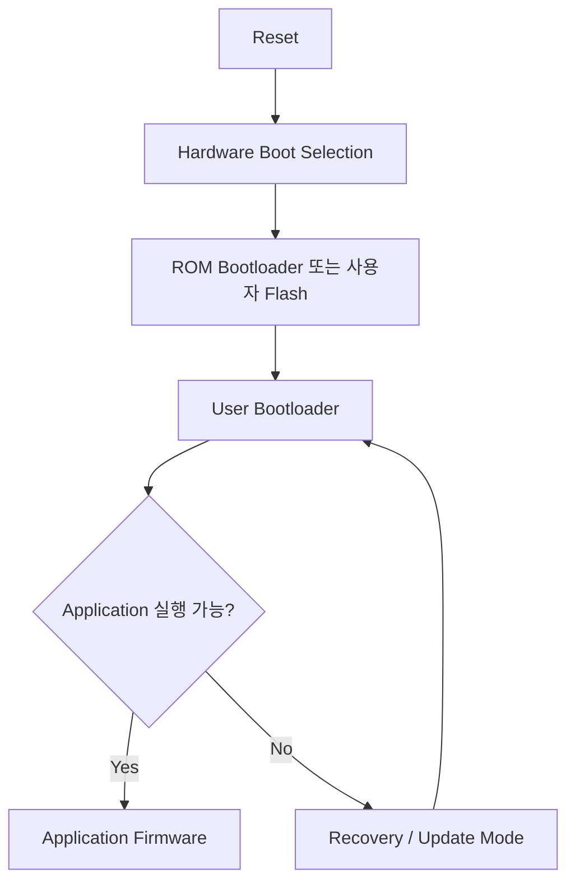

> 실제 경로는 MCU의 Boot Mode Pin, Option Byte/Fuse, Memory Mapping, ROM 코드와 Flash 배치에 따라 달라진다.

## 2. Bootloader가 맡는 역할

| 역할 | 설명 |
|---|---|
| 부팅 선택 | 정상 Application, 복구 Image, 업데이트 모드 중 선택 |
| 이미지 검증 | 길이, 주소 범위, 무결성, 필요 시 서명과 버전 검증 |
| 업데이트 | 통신으로 Image를 받고 비휘발성 메모리에 기록 |
| 장애 복구 | 중단된 업데이트와 실행 불가능한 Image에 대응 |
| 실행 이관 | Application의 실행 환경을 갖추고 제어권 전달 |
| 진단 | Reset Cause, 실패 사유, 부팅 횟수 등의 상태 기록 |

Bootloader가 단순히 “파일을 Flash에 복사하는 코드”만을 의미하지는 않는다. **전원 차단, 잘못된 이미지, 보안, 복구 가능성**까지 고려한 부팅 정책의 일부다.

## 3. ROM Bootloader와 User Bootloader

| 구분 | ROM Bootloader | User Bootloader |
|---|---|---|
| 위치 | 제조사가 내장한 ROM 등 | 사용자가 관리하는 Flash 등 |
| 수정 | 일반적으로 수정 불가 | 설계에 따라 업데이트 가능 |
| 통신 | 칩이 지원하는 인터페이스에 제한 | 제품 요구사항에 맞게 설계 |
| 목적 | 초기 프로그래밍·복구 등 | 현장 업데이트·제품 부팅 정책 등 |
| 신뢰 경계 | 제조사 구현·칩 설정에 의존 | 자체 검증·보호 설계 필요 |

ROM Bootloader가 존재하더라도 Application의 현장 업데이트 요구를 모두 만족하는 것은 아니다.

## 4. Reset부터 Application까지

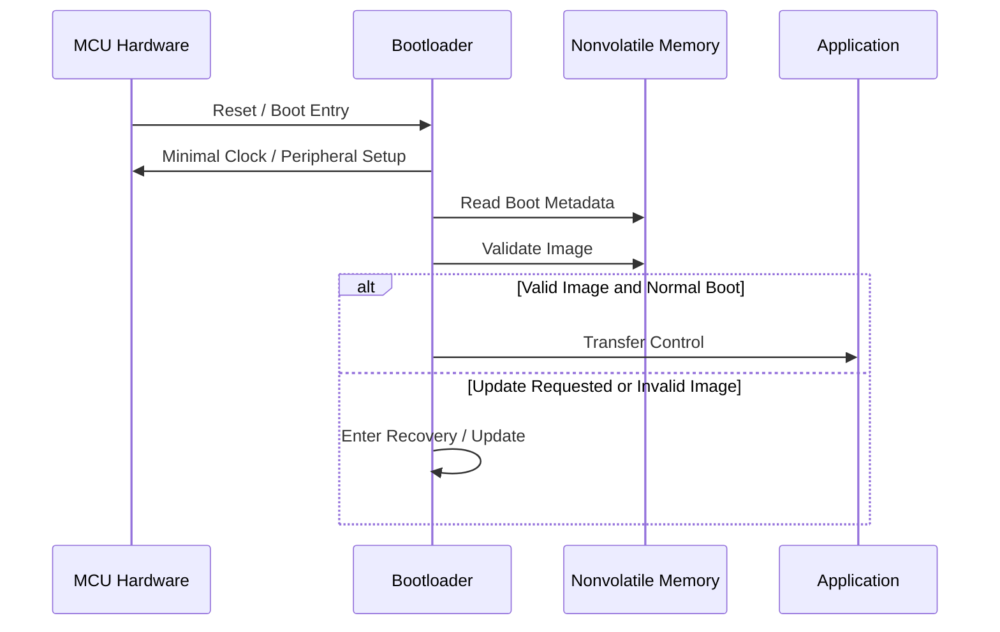

부팅 초기에 어떤 Clock·RAM·Peripheral이 이미 사용 가능한지는 MCU와 Startup Code에 따라 달라진다. 일반적인 C 런타임 초기화(`.data` 복사, `.bss` 초기화 등)를 누가 수행하는지도 부팅 구조에 포함된다.

## 5. 메모리 배치와 Linker Script

Bootloader와 Application이 같은 Flash를 사용한다면 **주소 영역을 명확하게 분리**해야 한다.

```text
Flash (개념적 예시)
┌────────────────────────────┐
│ Bootloader                 │
├────────────────────────────┤
│ Boot Metadata              │
├────────────────────────────┤
│ Application Slot A         │
├────────────────────────────┤
│ Application Slot B (선택)  │
└────────────────────────────┘
RAM
┌────────────────────────────┐
│ Application Stack / Data   │
│ Shared Handover Data       │
└────────────────────────────┘
```

위 그림은 **가상의 배치**다. 실제 Partition 크기와 위치는 Flash Erase 단위, Boot ROM 규칙, Vector Table, RAM 크기, 이미지 최대 크기, 보호 기능에 따라 정한다.

**Linker Script**는 각 실행 파일의 코드·상수·데이터가 배치될 주소를 정의한다. Bootloader용 Linker Script와 Application용 Linker Script는 서로 다른 시작 주소를 가질 수 있다.

## 6. Flash의 특성과 업데이트

Flash는 일반 RAM처럼 임의의 바이트를 자유롭게 덮어쓰는 저장장치가 아니다.

- **Erase 단위:** Sector 또는 Page 단위로 지우는 경우가 많다.
- **Program 단위:** Word, Double Word, Flash Phrase 등 최소 기록 단위가 존재한다.
- **정렬 제약:** 주소와 데이터 길이에 조건이 있을 수 있다.
- **실행 제약:** 같은 Bank의 Flash를 지우거나 기록하는 동안 코드 Fetch가 제한될 수 있다.
- **내구성:** Erase/Program 횟수에 한계가 있다.


실제 순서는 장치와 복구 설계에 따라 달라지며, **검증되지 않은 이미지를 활성 상태로 먼저 확정하지 않는 것**이 중요하다.

## 7. Firmware Image의 구성

Image는 실행 코드만이 아니라 검증과 부팅에 필요한 정보를 포함할 수 있다.

| 구성 요소 | 의미 |
|---|---|
| Header / Manifest | Image 식별·길이·대상 정보 |
| Version | 업데이트·호환성·Rollback 정책에 사용 |
| Load / Entry Address | 배치 및 실행 위치 관련 정보 |
| Payload | 코드·상수 등 Firmware 본문 |
| Checksum / CRC | 전송·저장 중 우발적 손상 탐지 |
| Cryptographic Hash | Image 내용의 암호학적 요약 |
| Digital Signature | 신뢰된 발행자의 Image인지 검증하는 데 사용 |

모든 Image Format이 위 항목을 동일한 형태로 갖는 것은 아니다. 제품의 Boot Chain과 Update Protocol에 맞춰 정의한다.

## 8. 무결성과 인증은 다르다

| 방법 | 확인하는 것 | 한계 |
|---|---|---|
| Checksum | 단순한 데이터 오류 | 의도적 변조 방지 수단이 아님 |
| CRC | 우발적 전송·저장 오류 | 공격자가 다시 계산할 수 있음 |
| Hash | 내용이 동일한지 비교할 근거 | 신뢰할 기준 Hash가 없다면 발행자 인증 불가 |
| Digital Signature | 신뢰된 키로 서명된 Image인지 | 키 관리·검증 코드·신뢰 시작점 필요 |

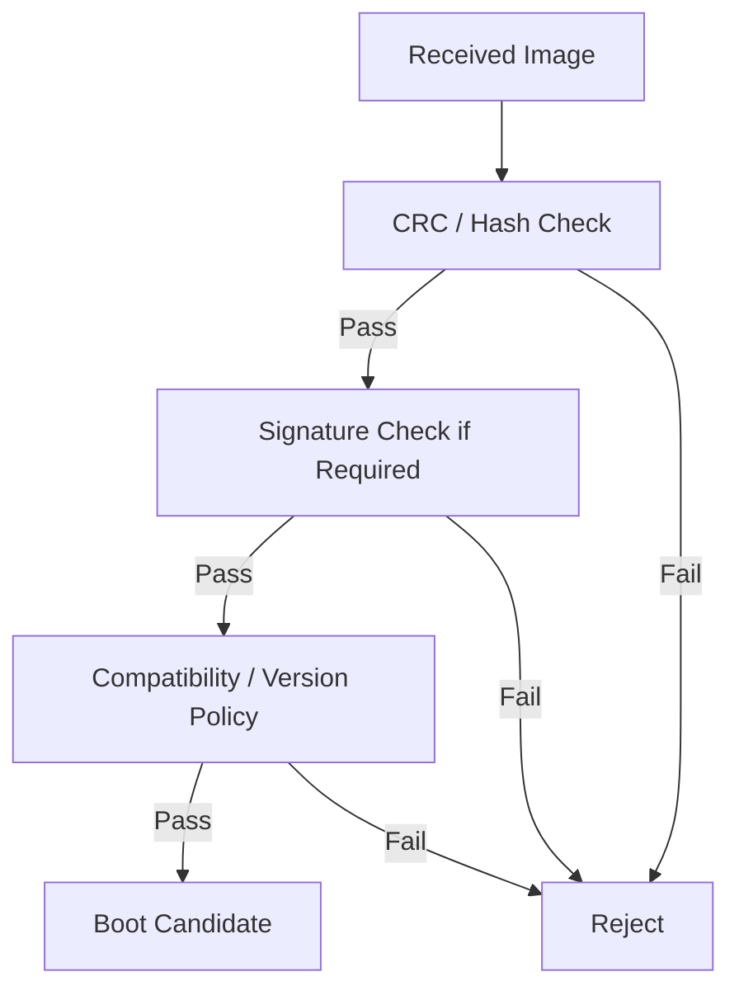

**CRC가 일치한다는 사실만으로 Image가 신뢰할 수 있는 공급자로부터 왔다고 판단할 수는 없다.**

## 9. Secure Boot와 신뢰의 시작점

Secure Boot는 실행 전 코드의 **진위와 무결성을 검증하는 부팅 체계**다. 신뢰의 시작점(Root of Trust)은 ROM 코드, 보호된 공개키/Hash, OTP/eFuse, Hardware Security 기능 등으로 구성될 수 있다.

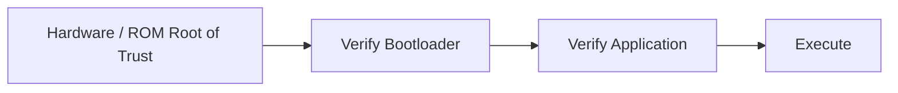

- Bootloader 자체가 변경 가능하다면 **누가 Bootloader를 검증하는가**가 중요하다.
- 서명 검증이 있더라도 **구버전 취약 Image의 재설치**를 막는 Rollback 정책이 별도로 필요할 수 있다.
- 디버그 포트, 읽기 보호, 키 저장, 제조·서비스 절차도 전체 보안 모델에 포함된다.

## 10. 업데이트 전송 경로

Bootloader가 Image를 수신하는 방법은 제품에 따라 다르다.

| 경로 | 고려사항 |
|---|---|
| UART | 프레이밍, 오류 검출, Timeout, 흐름 제어 |
| CAN | 프레임 분할·재조립, 노드 식별, 버스 오류 |
| USB | Device Class, 연결 상태, 전송 단위 |
| Ethernet / Wi-Fi | 네트워크 단절, 프로토콜·인증·TLS 등 |
| External Flash / SD | 파일·이미지 검증, 저장장치 오류 |

통신 방식과 무관하게 **수신 성공**, **Flash 기록 성공**, **실행 가능성 검증**, **부팅 성공**은 서로 다른 상태다.

## 11. 업데이트 상태 머신

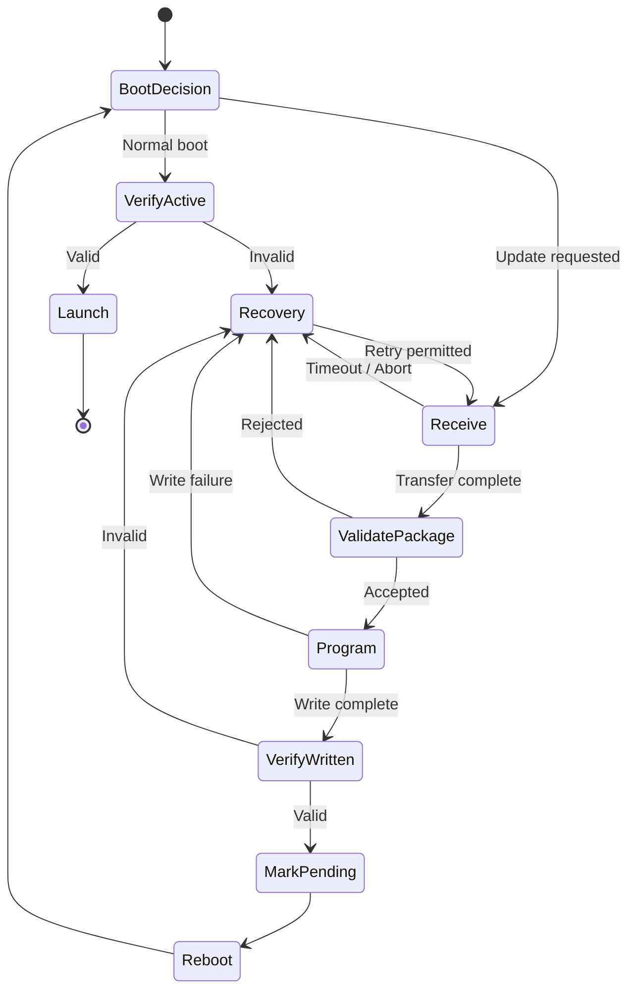

이 상태도는 개념 모델이다. 실제 구현에서는 중간 상태를 비휘발성 Metadata에 기록하거나 A/B Slot을 활용할 수 있다.

## 12. Single-Slot과 A/B Slot

| 방식 | 장점 | 위험·비용 |
|---|---|---|
| Single-Slot | Flash 사용량이 적음 | 기존 Image를 덮는 중 전원 차단 시 복구 경로 필요 |
| A/B Slot | 기존 Image를 유지하며 새 Image 검증 가능 | Flash 공간과 부팅 상태 관리 필요 |
| Staging Area | 새 Image를 임시 저장 후 적용 | 복사 단계의 중단 복구 정책 필요 |

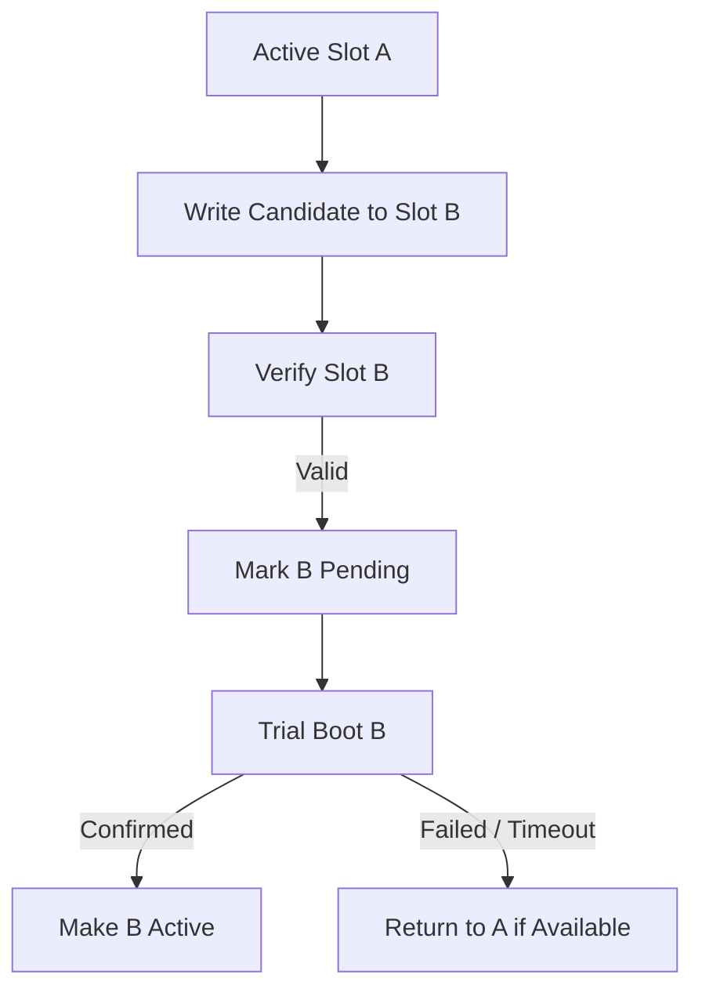

A/B라고 해서 자동으로 모든 실패에 안전한 것은 아니다. **Boot Metadata의 원자적 갱신과 두 Slot의 호환성**도 설계해야 한다.

## 13. Power-Fail Safety

업데이트 중 전원 차단은 정상적으로 예상해야 하는 사건이다.

```text
수신 중 전원 차단
기록 중 전원 차단
검증 중 전원 차단
활성 Slot 전환 중 전원 차단
첫 부팅 중 전원 차단
```

Bootloader는 각 지점에서 다음 Reset 후 **어떤 Image가 신뢰 가능한지 판단**할 수 있어야 한다.

- 미완성 Image를 실행 대상으로 취급하지 않는다.
- Metadata는 중간 쓰기 상태를 구분할 수 있어야 한다.
- 필요하다면 중복 Metadata, Sequence Number, CRC 등을 사용한다.
- Flash의 최소 Program/Erase 단위를 고려해 상태 전환을 설계한다.

“전원 차단에도 절대 실패하지 않는다”는 보장은 특정 하드웨어·메모리·설계에 대한 검증 없이 할 수 없다.

## 14. Boot Metadata

Boot Metadata는 현재 부팅 정책을 표현하는 비휘발성 정보다.

| 항목 | 예시 의미 |
|---|---|
| Active Slot | 현재 확정된 Image |
| Pending Slot | 시험 부팅할 Image |
| Confirmed Flag | Application이 정상 시작을 확인했는지 |
| Attempt Counter | 시험 부팅 실패 횟수 |
| Image Version | 버전·호환성 정책 |
| Metadata CRC | Metadata의 우발적 손상 탐지 |

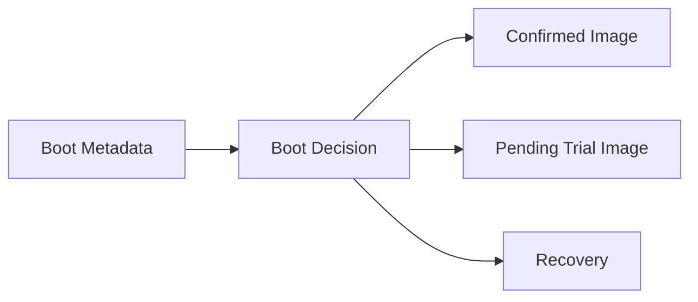

Metadata의 실제 저장 위치, 갱신 횟수와 Wear Leveling 필요성은 Flash 특성에 따라 정한다.

## 15. Trial Boot와 Confirm

새 Image가 검증되었다고 해서 제품 기능이 정상 동작한다고 확정할 수는 없다.

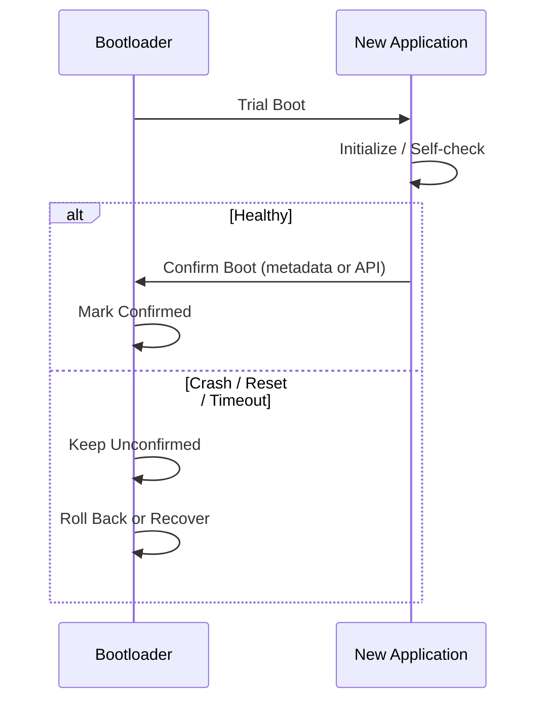

확정 기준은 제품별로 다르다. 단순히 `main()`에 도달했는지보다 **필수 Peripheral·통신·안전 기능의 정상 상태**가 중요할 수 있다.

## 16. Bootloader에서 Application으로 제어권 전달

단순한 함수 호출만으로 항상 올바른 Handover가 되는 것은 아니다.

대표적으로 확인할 사항:

1. Application의 Stack Pointer와 Entry Point가 유효한가?
2. Interrupt가 활성화되어 있는가? Pending Interrupt가 남았는가?
3. Vector Table 기준 주소를 바꿔야 하는가?
4. SysTick·DMA·UART 등 Bootloader가 사용한 Peripheral 상태는 어떤가?
5. Clock과 Cache 상태를 Application이 어떤 값으로 가정하는가?
6. Application Startup Code가 필요한 초기화를 수행하는가?

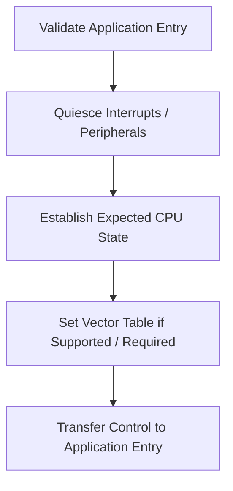

**Vector Table 위치 변경, Stack Pointer 설정, 실행 모드 전환의 정확한 방법은 CPU 아키텍처와 MCU에 종속적**이다. 예를 들어 Cortex-M 계열의 세부 절차를 모든 MCU에 적용할 수는 없다.

## 17. Vector Table과 Interrupt

Bootloader와 Application이 서로 다른 Interrupt Handler를 사용한다면 실행 중인 Image에 맞는 Vector Table이 필요하다.

```text
Bootloader Vector Table → Bootloader ISR
Application Vector Table → Application ISR
```

Handover 직전에 남은 Interrupt가 Application 초기화 전에 실행되면 예상치 못한 Handler가 호출될 수 있다. Interrupt Mask, Pending Flag, Peripheral Interrupt Enable을 구분해 다룬다.

## 18. Watchdog과 Bootloader

Watchdog은 부팅 중에도 동작할 수 있다.

| 구간 | 고려사항 |
|---|---|
| Image 수신 | 통신 Timeout과 Watchdog Timeout의 관계 |
| Flash Erase/Program | 긴 Flash 작업 중 Refresh 가능 여부 |
| Image 검증 | 큰 Image의 Hash/서명 검증 시간 |
| Trial Boot | Application의 정상 진행 판단 |
| Recovery | 무한 Reset Loop 방지 |

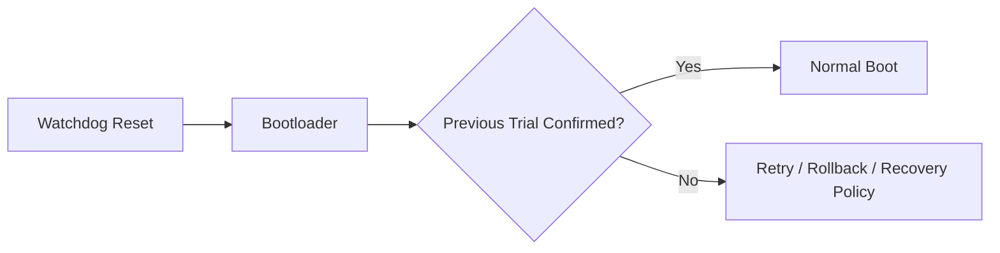

Watchdog을 단순히 무조건 Refresh하면 정지 상태를 감추는 결과가 될 수 있다. 반대로 긴 정상 업데이트 작업을 고려하지 않으면 불필요한 Reset이 반복될 수 있다.

## 19. Bootloader와 RTOS

Bootloader는 작은 Bare-Metal 프로그램으로 구성할 수도 있고, 요구사항에 따라 RTOS를 사용할 수도 있다.

| 관점 | 작은 Bare-Metal Bootloader | RTOS 기반 Bootloader |
|---|---|---|
| 구조 | 단일 흐름·상태 머신 중심 | 여러 Task와 서비스 분리 가능 |
| 자원 | 일반적으로 단순한 구성 가능 | Kernel·Task Stack 등의 비용 |
| 통신 | 제한된 인터페이스에 적합 | 복수 서비스 동시 처리에 활용 가능 |
| 검증 범위 | 작은 코드 경로에 집중 가능 | Scheduler·동기화까지 포함 |

**RTOS 사용 여부 자체가 Bootloader의 신뢰성이나 보안을 결정하지는 않는다.** 제품 요구사항과 검증 가능한 복잡도를 함께 고려한다.

## 20. Bootloader 업데이트의 별도 위험

Application 업데이트와 달리 Bootloader 자신을 덮어쓰는 과정은 복구 수단을 잃을 수 있다.

가능한 대응은 하드웨어 지원과 제품 구조에 따라 달라진다.

- 변경 불가능한 ROM Boot Path 활용
- 보호된 1차 Bootloader와 변경 가능한 2차 Bootloader 분리
- Dual-Bank 또는 별도 Recovery Image
- Debug/Factory Programming Interface 유지
- Bootloader 영역의 Write Protection

Bootloader 영역의 보호 기능은 MCU별 Flash Protection·Option Byte·Security 설정을 확인해야 한다.

## 21. 업데이트 실패 유형

| 실패 | 대표 원인 | 설계상 고려사항 |
|---|---|---|
| 전송 중단 | 케이블·무선 단절 | Timeout·재시도·Resume 정책 |
| 이미지 불일치 | 잘못된 제품용 Firmware | Device ID·Board Revision·호환성 검사 |
| Flash 기록 실패 | 전압·수명·정렬 문제 | 오류 코드·Readback·Recovery |
| 부팅 직후 Crash | 초기화·호환성 문제 | Trial Boot·Rollback |
| 반복 Reset | Watchdog·HardFault | Attempt Counter·Recovery Entry |
| 오래된 Image 재설치 | Rollback 공격 또는 운영 실수 | 버전 정책·보호된 상태 저장 |
| Metadata 손상 | 중간 전원 차단 | 중복·검증·원자적 상태 전환 |

## 22. UART·DMA·Ring Buffer·FSM과 연결

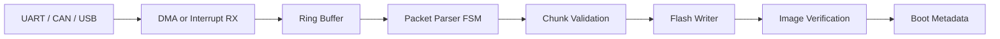

- **UART:** Firmware Byte Stream의 전송 경로가 될 수 있다.
- **DMA:** 수신 CPU 부하를 줄일 수 있지만 Buffer 소유권·Cache를 고려한다.
- **Ring Buffer:** 통신 수신 속도와 Flash 처리 속도의 차이를 흡수한다.
- **FSM:** Header, Length, Payload, CRC, Timeout 등 Packet 수신 상태를 관리한다.
- **Interrupt:** 통신·Flash 완료 이벤트를 전달한다.
- **Watchdog:** 업데이트와 Trial Boot의 정상 진행을 감시한다.

## 23. 자주 혼동하는 개념

| 혼동 | 구분 |
|---|---|
| Bootloader = ROM Bootloader | 사용자 Flash의 Bootloader도 존재한다. |
| CRC 통과 = 안전한 Firmware | CRC는 발행자 인증 수단이 아니다. |
| 전송 완료 = 업데이트 완료 | 기록·검증·활성화·부팅 확정은 별개다. |
| A/B Slot = 무조건 복구 가능 | Metadata·부팅 정책·Flash 보호가 필요하다. |
| Image 검증 완료 = 정상 동작 | Trial Boot와 Application Confirm이 필요할 수 있다. |
| Application Jump = 일반 함수 호출 | CPU·Stack·Vector Table·Interrupt 상태가 중요하다. |
| `volatile` = Flash 쓰기 안전성 | Flash Controller 절차·전원·정렬·검증과 무관하다. |
| Watchdog Reset = Firmware 손상 | Reset Cause만으로 근본 원인을 확정할 수 없다. |

## 24. 개념 체크리스트

- [ ] ROM Bootloader, User Bootloader, Application의 역할을 구분한다.
- [ ] Linker Script와 Flash Partition이 Boot Flow에 미치는 영향을 이해한다.
- [ ] Flash의 Erase·Program 단위와 전원 차단 위험을 이해한다.
- [ ] CRC·Hash·Digital Signature의 목적을 구분한다.
- [ ] Secure Boot의 Root of Trust와 Rollback 정책을 구분한다.
- [ ] Single-Slot, A/B Slot, Staging Area의 구조적 차이를 이해한다.
- [ ] Pending·Confirmed 상태와 Trial Boot의 필요성을 설명할 수 있다.
- [ ] Application Handover에 Stack·Interrupt·Vector Table이 관련됨을 이해한다.
- [ ] Watchdog과 Bootloader의 복구 정책이 연결됨을 이해한다.

---

## 핵심 구조 요약

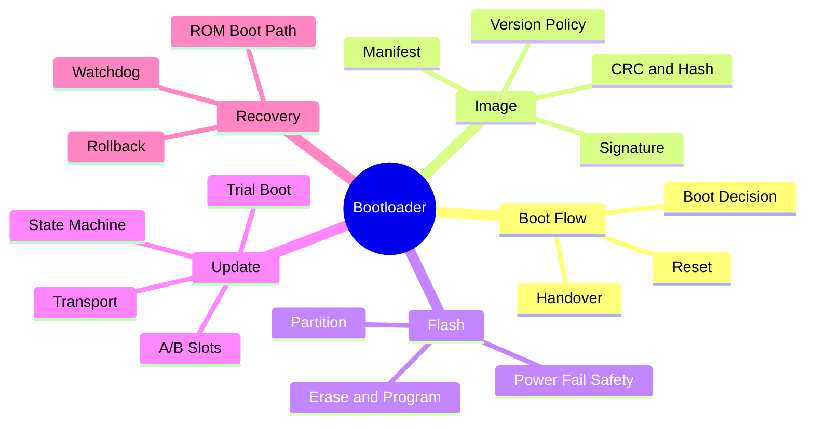

> **핵심:** Bootloader의 목표는 새 Firmware를 기록하는 것만이 아니라, **다음 Reset에서도 실행 가능한 신뢰된 Image를 선택할 수 있게 하는 것**이다.

**다음 학습 문서:** `05_Embedded/Low_Power.md` — Sleep/Stop/Standby, Clock·Peripheral 상태, Wake-up Source, Interrupt, Timer, Watchdog, RTOS Tickless Idle의 연결.
