# Low Power — 임베디드 저전력 설계

> **학습 위치:** `C_Cpp_Study/05_Embedded/Low_Power.md`  
> **연결 문서:** `Register.md`, `Interrupt.md`, `UART.md`, `DMA.md`, `Timer.md`, `Watchdog.md`, `RTOS.md`, `Bootloader.md`  
> **범위:** C/C++ 기반 MCU 펌웨어의 저전력 동작을 위한 개념 정리. 실습·퀴즈는 포함하지 않는다.

---

## 1. 저전력 설계의 목적

저전력(Low Power) 설계는 단순히 CPU를 느리게 동작시키는 것이 아니라, **시스템이 필요한 기능과 응답 시간을 유지하면서 소비 에너지를 줄이는 것**이다. 배터리 장치뿐 아니라 발열, 전원 공급 한계, 에너지 하베스팅, 대기 전력 규정에도 중요하다.

| 지표 | 의미 | 구분할 점 |
|---|---|---|
| 전력(Power) | 단위 시간당 에너지 소비 | W = J/s |
| 에너지(Energy) | 일정 기간에 소비한 총량 | J 또는 Wh |
| 전류(Current) | 전원에서 흐르는 전류 | 전압과 함께 전력 결정 |
| Latency | 이벤트 발생 후 응답까지 시간 | 절전 수준이 깊을수록 증가할 수 있음 |
| Duty Cycle | 전체 시간 중 활성 상태의 비율 | 평균 소비 전력에 영향 |

전압이 일정하다고 가정하면 다음과 같다.

```text
Power ≈ Voltage × Current
Energy = ∫ Power(t) dt
Average Current ≈ Σ(State Current × Time Fraction)
```

> 전류만 비교할 때는 동작 전압이 같은지도 확인한다. DC-DC 변환기 효율, 배터리 내부 저항, 순간 부하도 실제 사용 시간에 영향을 준다.

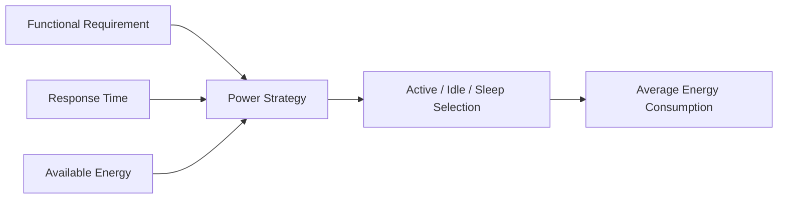

## 2. 소비 전력을 나누어 보는 관점

MCU의 전력 소비는 CPU만의 문제가 아니다.

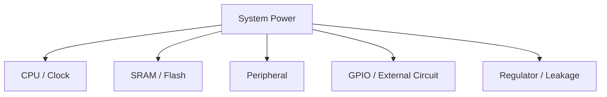

- **동적 전력:** 회로의 스위칭 활동, Clock 주파수, 전압 등에 영향을 받는다. CMOS의 단순화된 관계는 `P_dynamic ∝ C × V² × f`다.
- **정적 전력:** 누설 전류와 항상 켜진 회로의 소비 전력이다.
- **외부 부품:** 센서, 무선 모듈, LED, Pull-up, 레벨 시프터 등은 MCU보다 더 많은 전력을 소비할 수도 있다.

주파수를 낮추면 순간 전력이 줄 수 있지만 실행 시간이 길어져 **총 에너지가 반드시 줄어드는 것은 아니다.**

## 3. Run, Idle, Sleep, Deep Sleep

제조사마다 모드 명칭과 기능은 다르므로 아래는 **일반적인 분류**다.

| 개념적 모드 | CPU | Clock / Peripheral | RAM·Register 유지 | Wake-up 특성 |
|---|---|---|---|---|
| Run | 실행 | 필요한 기능 동작 | 유지 | 별도 복귀 불필요 |
| Idle / Sleep | 대기 | 일부 Clock·Peripheral 동작 가능 | 대체로 유지 | 비교적 빠름 |
| Deep Sleep / Stop | 대부분 정지 | 많은 Clock Domain 중지 | 일부만 유지될 수 있음 | Clock 복구 필요 가능 |
| Standby / Shutdown | 핵심 전원 영역까지 차단 가능 | 제한적 | 일부 또는 대부분 손실 가능 | Reset 유사 경로 가능 |

**정확한 이름, 소비 전류, Wake-up Source, RAM Retention, 복귀 경로는 대상 MCU의 Reference Manual과 Datasheet를 따른다.**

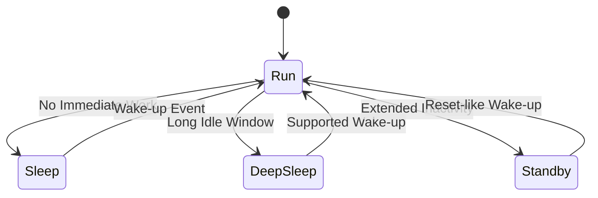

## 4. Clock Gating과 Power Gating

| 기법 | 동작 | 주요 효과 | 주의 |
|---|---|---|---|
| Clock Gating | 회로의 Clock 공급 중지 | 스위칭 전력 감소 | Register 접근·Peripheral 동작 가능 여부 확인 |
| Power Gating | 전원 Domain 차단 | 누설·동적 전력 감소 | 상태 손실·재초기화 비용 |
| Frequency Scaling | Clock 주파수 변경 | 성능과 전력 조절 | 타이밍·통신 Baud·Timer 기준 변화 |
| Voltage Scaling | 공급 전압 변경 | 동적 전력에 큰 영향 | 허용 주파수·Flash Wait State 제약 |

Clock을 끄기 전에는 해당 Peripheral이 **진행 중인 작업을 완료했는지** 확인해야 한다.

## 5. Sleep 진입과 복귀는 하나의 절차다

Sleep 진입은 단일 명령이 아니라 여러 Hardware/Software 상태를 맞추는 과정이다.

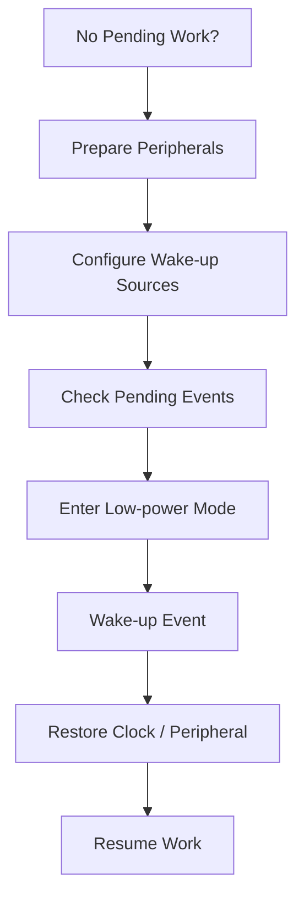

일반적으로 검토할 항목:

1. 통신·Flash Write·DMA 같은 진행 중 작업이 있는가?
2. 깨울 이벤트를 미리 활성화했는가?
3. Wake-up Flag 또는 Pending Interrupt를 올바르게 처리했는가?
4. 복귀 시 Clock, Pin, Peripheral 설정이 유지되는가?
5. Sleep 진입 전후에 다른 실행 주체가 새 작업을 등록할 수 있는가?

## 6. Sleep 진입의 Race Condition

다음 순서는 위험하다.

```text
1. Main Loop: 할 일이 없다고 확인
2. ISR: 새 데이터를 Queue에 등록
3. Main Loop: 그대로 Sleep 진입
```

새 작업이 있는데도 Sleep 상태가 될 수 있다. 실제 결과는 MCU의 Wake-up/Pending Event 규칙에 따라 다르지만, **검사와 Sleep 진입 사이의 경쟁 조건**은 설계해야 한다.

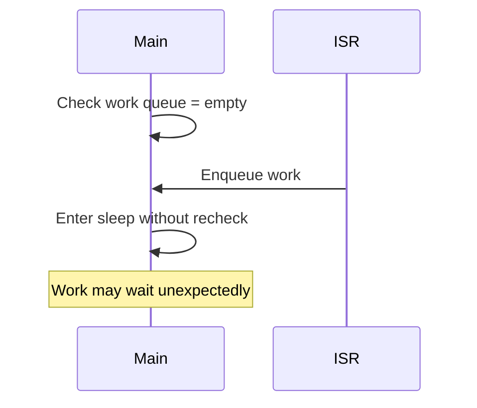

해결 방식은 아키텍처별 Atomic Sleep Sequence, Interrupt Masking과 Pending 재확인, Event/Interrupt 대기 명령, RTOS의 Idle/Sleep API 등을 따른다. **Interrupt를 무조건 끈 채 Sleep하면 된다는 식으로 일반화하지 않는다.**

## 7. Wake-up Source

Wake-up Source는 절전 모드에서 MCU를 다시 동작시키는 이벤트다.

| 종류 | 대표 용도 | 확인할 점 |
|---|---|---|
| GPIO / EXTI | 버튼·외부 신호 | Edge/Level, Pull-up, Debounce |
| RTC / Low-power Timer | 주기적 측정 | 저속 Clock의 정확도 |
| UART / Communication | 수신 데이터 | 모드별 수신 지원·첫 바이트 손실 가능성 |
| Comparator / ADC | 임계값 감지 | 절전 중 동작 지원 여부 |
| Watchdog | 비정상 정지 복구 | Wake-up인지 Reset인지 구분 |

모든 Interrupt가 모든 저전력 모드에서 Wake-up을 지원하는 것은 아니다. **Wake-up 가능한 Interrupt와 일반 Interrupt는 별도로 확인한다.**

## 8. Wake-up Latency와 Break-even Time

깊은 절전은 대기 전류가 낮을 수 있지만 진입·복귀에 시간과 에너지가 든다.

```text
Sleep Energy ≈ Entry Energy
             + Sleep Power × Sleep Duration
             + Wake-up Energy
```

절전이 유리하려면 해당 구간을 계속 Run/Idle로 유지했을 때보다 총 에너지가 작아야 한다.

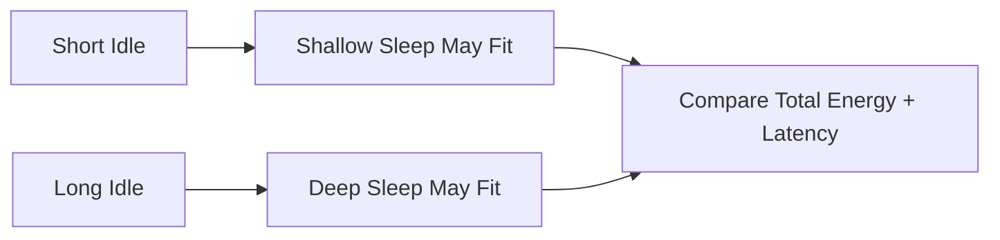

**Break-even Time**은 절전 진입·복귀 비용을 절약한 대기 전력으로 상쇄하는 데 필요한 최소 유휴 시간이다. 고정된 보편적 수치는 없으며 측정과 데이터시트로 결정한다.

## 9. Duty Cycling

Duty Cycling은 짧게 동작하고 나머지 시간에는 절전하는 구조다.

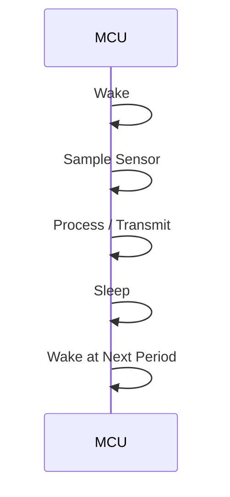

예를 들어 센서 노드는 다음 단계로 나눌 수 있다.

```text
Wake → Sensor Power-up → Stabilization → Measurement
     → Processing → Communication → Peripheral Off → Sleep
```

센서의 Warm-up Time, 무선 연결 비용, 데이터 누락 허용치가 주기를 제한한다.

## 10. Tickless Idle과 RTOS

일반적인 주기 Tick 방식은 할 일이 없어도 Tick Interrupt 때문에 자주 깨어날 수 있다. **Tickless Idle**은 다음 예정 작업까지 Tick 발생을 줄이거나 억제하여 더 긴 절전 구간을 확보한다.

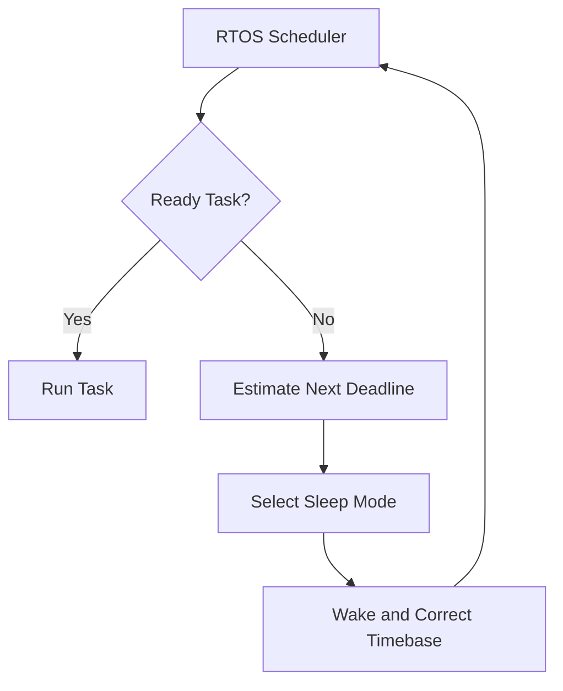

검토할 사항:

- 다음 Timer/Task Deadline까지 남은 시간
- Sleep 중 System Tick이 멈추는지 여부
- Wake-up 후 RTOS 시간 보정
- Driver가 절전을 금지해야 하는 구간
- ISR에서 깨운 Task의 우선순위와 응답 시간

Tickless Idle이 항상 가장 낮은 에너지를 보장하는 것은 아니며, 모드 전환 비용과 짧은 Idle 구간을 함께 고려한다.

## 11. Peripheral별 저전력 고려사항

| Peripheral | 절전 전 확인 | 복귀 후 확인 |
|---|---|---|
| UART | TX Complete, RX Wake-up 지원 | Clock·Baud, 수신 오류·유실 |
| DMA | 진행 중 전송, Buffer 소유권 | 전송 상태·Flag |
| Timer | Clock Source, 정지 여부 | 시간 기준·Counter 상태 |
| ADC | 변환 완료, Reference | Stabilization·Calibration 필요 여부 |
| SPI/I²C | Bus Transaction 종료 | Slave/외부 장치 상태 |
| GPIO | 출력 유지, Floating Input | Pin Multiplex·외부 상태 |
| Flash | Program/Erase 완료 | Readiness·Wait State |

Peripheral의 Register 값이 유지되더라도 **Clock이 멈추면 실제 기능은 정지할 수 있다.**

## 12. GPIO와 외부 회로

MCU Sleep Current가 낮아도 외부 회로의 누설 경로가 전체 전류를 지배할 수 있다.

- Floating Input은 불필요한 스위칭이나 누설에 영향을 줄 수 있다.
- Pull-up/Pull-down은 신호 안정성을 주지만 지속 전류 경로가 될 수 있다.
- MCU Pin이 꺼진 외부 칩에 전압을 가하면 보호 다이오드 등을 통한 역급전 가능성이 있다.
- LED, 센서, Transceiver의 Enable/Standby Pin을 별도로 관리해야 할 수 있다.
- 외부 Interrupt 신호가 Sleep 중 유지되는지 확인한다.

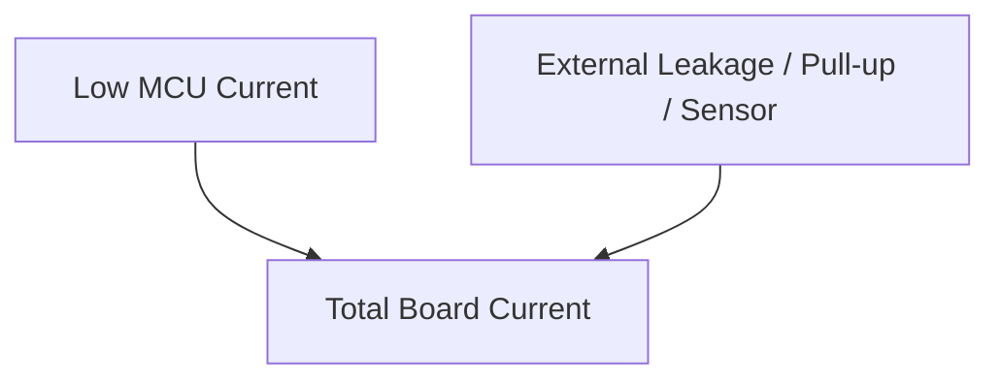

## 13. RAM Retention과 상태 보존

깊은 절전에서는 RAM이나 Peripheral Register의 일부가 사라질 수 있다.

| 상태 | 보존 전략 |
|---|---|
| 재계산 가능한 임시값 | 복귀 후 재생성 |
| 통신 프로토콜 상태 | Sleep 전 안전한 경계로 이동하거나 보존 |
| 장치 설정 | 복귀 시 재초기화 |
| 반드시 유지할 데이터 | Retention RAM, Backup Register, 비휘발성 저장소 등 검토 |

비휘발성 메모리에 상태를 자주 저장하면 쓰기 시간·전력·수명 문제가 생길 수 있다. 데이터의 중요도와 저장 빈도를 구분한다.

## 14. Sleep과 Reset의 경계

일부 저전력 모드의 Wake-up은 일반 함수 복귀처럼 진행되지만, 일부는 **Reset Vector에서 재시작하는 형태**일 수 있다.

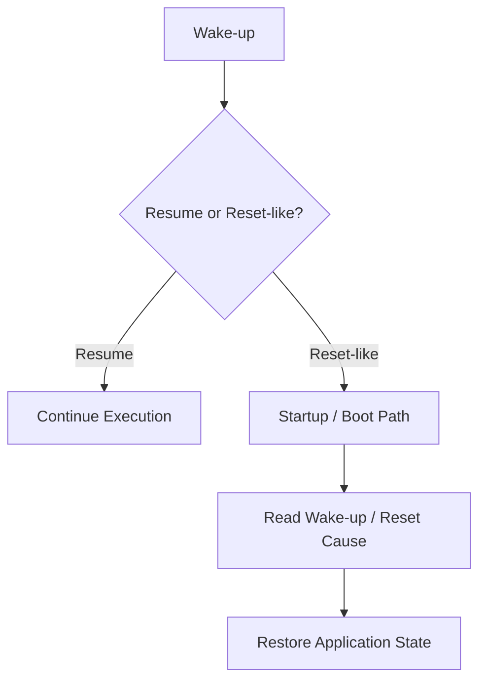

이 경우 `Bootloader.md`의 Boot Path, Reset Cause, Firmware Image 검증 및 Application 시작 과정과 연결된다.

## 15. Watchdog과 저전력

Watchdog은 절전 중에도 계속 동작할 수도, 정지할 수도 있다. 별도 Clock을 사용하는 Independent Watchdog은 저전력 모드에서도 동작하는 경우가 있으나 **대상 MCU별로 확인해야 한다.**

- 최대 Sleep 시간과 Watchdog Timeout의 관계
- 절전 중 Refresh 가능 여부
- Watchdog Reset과 정상 Wake-up의 구분
- RTOS Health Monitor가 Sleep을 정상 상태로 취급하는 방식

Watchdog을 피하려고 불필요하게 자주 깨우면 소비 전력이 늘어난다. 반대로 Watchdog을 무조건 중지하면 고장 복구 요구사항을 충족하지 못할 수 있다.

## 16. Clock 복구와 통신 정확도

Sleep 복귀 후에는 Oscillator와 PLL의 안정화 시간이 필요할 수 있다.

```text
Wake-up
  ↓
Oscillator / PLL Ready
  ↓
Clock Tree Restore
  ↓
Peripheral Timing Restore
  ↓
Communication Resume
```

UART Baud Rate, Timer 주기, SPI/I²C 속도, ADC Clock은 Clock Source에 영향을 받는다. **Clock 복구 전에 통신을 시작하면 타이밍 오류가 발생할 수 있다.**

## 17. Interrupt Storm과 잦은 Wake-up

짧은 간격으로 반복되는 Interrupt는 Sleep 진입의 이득을 줄인다.

대표 원인:

- 처리되지 않은 Pending Flag
- 잘못 설정된 Edge/Level Trigger
- GPIO Chattering
- UART RX Noise
- 너무 짧은 Periodic Timer
- ISR와 Task 사이의 반복적인 재활성화


이벤트를 묶어 처리하는 Batching, 적절한 Debounce, Interrupt Flag 처리, Timer 주기 조정 등이 설계 선택지가 될 수 있다. 다만 응답 시간 요구사항을 침해하지 않아야 한다.

## 18. Low-power FSM

저전력 동작은 별도의 상태 머신으로 표현하면 전이 조건과 오류 처리가 명확해진다.

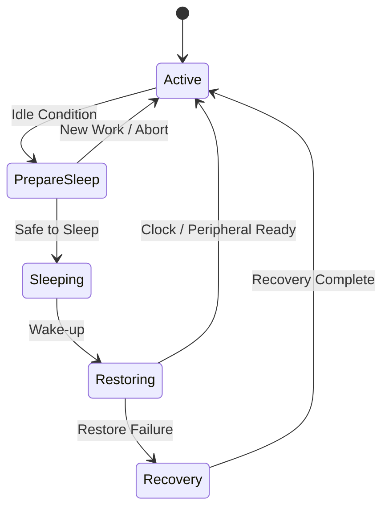

| State | 책임 |
|---|---|
| Active | 정상 처리 |
| PrepareSleep | 진행 중 작업 확인, Wake-up 설정 |
| Sleeping | 저전력 모드 유지 |
| Restoring | Clock·Peripheral·Software 상태 복구 |
| Recovery | 복귀 실패·예상치 못한 Reset 처리 |

`FSM.md`의 Guard, Entry/Exit Action, Timeout 개념을 그대로 적용할 수 있다.

## 19. Low-power 설계에서의 C/C++ 역할

C와 C++의 언어 선택보다 **하드웨어와 실행 모델을 정확히 표현하는지**가 중요하다.

| 영역 | 관련 개념 |
|---|---|
| MMIO | `volatile`, Register Access Semantics |
| 상태 관리 | `enum`, `struct`, FSM, C++ Class |
| Driver 수명 | Initialization / Suspend / Resume |
| 버퍼 | DMA Buffer와 Retention RAM |
| 동시성 | ISR, Atomicity, Critical Section, RTOS Lock |
| 시간 | Monotonic Timer, Wraparound, Deadline |

`volatile`은 Wake-up을 자동 보장하지 않으며, C++ RAII 소멸자가 Deep Sleep 중 자동으로 호출되는 것도 아니다. Sleep 진입과 복귀는 명시적인 시스템 수명 주기다.

## 20. 측정과 검증 관점

저전력 설계는 **실제 전류 파형과 이벤트 타이밍을 측정**해야 평가할 수 있다.

| 관찰값 | 확인하려는 문제 |
|---|---|
| Active Current | CPU·Peripheral·외부 부하 |
| Sleep Current | 누설·Clock·GPIO·전원 Domain |
| Wake-up Spike | 기동 비용·Inrush |
| Active Duration | 처리 시간·불필요한 대기 |
| Wake-up Frequency | Interrupt Storm·Tick·Polling |
| Response Latency | Deadline 만족 여부 |


평균 전류만 보면 짧고 큰 Peak Current를 놓칠 수 있고, Sleep Current만 보면 진입·복귀 에너지를 놓칠 수 있다.

## 21. 흔한 오해

| 오해 | 정확한 이해 |
|---|---|
| Clock을 낮추면 무조건 배터리가 오래간다 | 실행 시간이 늘어 총 에너지가 증가할 수도 있다. |
| 가장 깊은 Sleep이 언제나 유리하다 | 진입·복귀 비용과 Latency를 비교해야 한다. |
| CPU만 자면 시스템이 저전력이다 | 외부 부품·GPIO·Peripheral 전류도 포함된다. |
| 모든 Interrupt가 Sleep을 깨운다 | 모드별 Wake-up Source는 제한될 수 있다. |
| Register 값이 유지되면 Peripheral도 동작한다 | Clock·Power Domain이 중지될 수 있다. |
| `volatile`이면 Sleep Race가 해결된다 | Atomic Sleep Sequence와 Interrupt 규칙이 필요하다. |
| Watchdog은 Sleep 중 항상 멈춘다 | 모델·모드·설정에 따라 다르다. |
| RTOS Tickless면 최적화가 끝난다 | Driver·외부 회로·복귀 비용까지 확인해야 한다. |

## 22. 전체 연결도

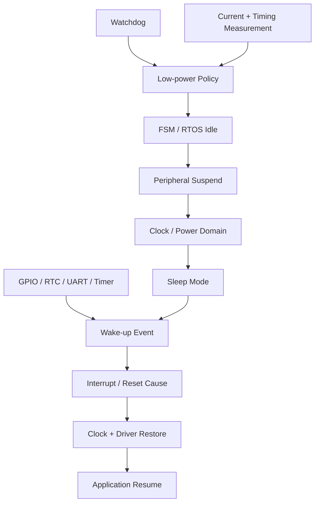

## 23. 핵심 개념 체크리스트

- [ ] 전력과 에너지의 차이를 구분한다.
- [ ] Active Current뿐 아니라 Sleep Current와 Wake-up 비용을 함께 고려한다.
- [ ] 대상 MCU의 모드별 Clock, RAM, Register, Wake-up Source를 확인한다.
- [ ] Sleep 진입 전 작업 완료와 Pending Event를 검토한다.
- [ ] Interrupt와 Sleep 진입 사이의 Race Condition을 인식한다.
- [ ] UART, DMA, Timer, Watchdog의 모드별 동작을 확인한다.
- [ ] 외부 센서·GPIO·전원 회로의 소비 전류를 포함한다.
- [ ] 복귀가 Resume인지 Reset-like Boot인지 구분한다.
- [ ] 실제 전류와 Latency 측정으로 전력 정책을 판단한다.

---

## 다음 학습

**추천 다음 문서:** `05_Embedded/ADC.md` — Analog 입력, Sampling, Resolution, Reference Voltage, Quantization, Trigger, DMA 및 저전력 센서 수집 구조.
