# ADC — 아날로그 신호를 디지털 값으로 변환하기

> 학습 위치: `05_Embedded/ADC.md`  
> 선행 개념: `Register.md`, `Interrupt.md`, `DMA.md`, `Timer.md`, `Low_Power.md`  
> 범위: 임베디드 펌웨어 관점의 개념 정리. 실습·퀴즈는 포함하지 않는다.

## 1. ADC의 역할

**ADC(Analog-to-Digital Converter)**는 연속적인 아날로그 입력 전압을 유한한 비트 수의 디지털 코드로 변환하는 주변장치다. MCU는 온도 센서, 가변저항, 전류 감지 회로, 배터리 전압 등에서 얻은 전압을 ADC로 읽을 수 있다.

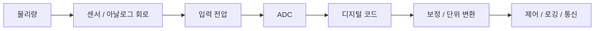

ADC는 전압을 측정한다. 온도·압력·전류와 같은 물리량은 **센서의 전달 특성과 아날로그 회로**를 거쳐 전압으로 표현되며, 펌웨어가 다시 물리 단위로 환산한다.

## 2. 핵심 용어

| 용어 | 의미 |
|---|---|
| Resolution | 출력 코드를 표현하는 비트 수 |
| Reference Voltage (`VREF`) | 변환 코드의 기준이 되는 전압 |
| Input Range | 유효하게 변환할 수 있는 입력 범위 |
| Sampling | 특정 시점의 입력 신호를 취득하는 과정 |
| Conversion | 취득한 입력을 디지털 코드로 결정하는 과정 |
| Sample Rate | 단위 시간당 샘플 수 |
| Conversion Time | 한 번의 변환에 필요한 시간 |
| Quantization | 연속 전압을 이산 코드로 대응시키는 과정 |
| Channel | ADC에 연결되는 입력 경로 |

**샘플링 주파수**, **ADC Clock**, **CPU Clock**은 서로 같은 값이 아니다.

## 3. 해상도와 양자화

N-bit ADC는 일반적으로 `2^N`개의 서로 다른 코드를 표현한다.

| 해상도 | 코드 개수 | 일반적인 코드 범위 |
|---|---:|---:|
| 8-bit | 256 | 0–255 |
| 10-bit | 1,024 | 0–1,023 |
| 12-bit | 4,096 | 0–4,095 |
| 16-bit | 65,536 | 0–65,535 |

단극성 입력 범위가 `0`에서 `VREF`인 이상적인 ADC에서 **1 LSB의 공칭 전압 폭**은 다음과 같이 표현한다.

```text
LSB = VREF / 2^N
```

예를 들어 `VREF = 3.3 V`, `N = 12`라면:

```text
LSB ≈ 3.3 V / 4096 ≈ 0.806 mV
```

다만 실제 코드-전압 변환식과 끝점 처리 방식은 ADC의 **전달 함수(transfer function)** 정의에 따라 달라진다. 일부 문서·예제는 `2^N - 1`을 사용한다. 두 식을 아무 설명 없이 혼용하지 않고, 제조사 Reference Manual의 변환 모델과 보정 방식을 따른다.


## 4. 해상도와 정확도는 다르다

12-bit ADC라는 사실은 12-bit 수준의 실제 측정 정확도를 보장하지 않는다.

| 구분 | 설명 |
|---|---|
| Resolution | 코드의 세분화 정도 |
| Accuracy | 측정값과 실제값의 근접도 |
| Precision / Repeatability | 반복 측정의 일관성 |
| Noise | 코드의 무작위 변동 요인 |
| Offset Error | 영점 부근의 체계적 오차 |
| Gain Error | 기울기·스케일 오차 |
| INL | 이상적인 전달 직선에서의 비선형 편차 |
| DNL | 코드 폭의 이상적인 1 LSB 대비 편차 |
| ENOB | 잡음·왜곡을 고려한 유효 비트 수 |

입력 회로, 기준 전압, 온도, PCB 배치, 전원 노이즈 등이 실제 측정 성능에 영향을 준다.

## 5. 기준 전압 `VREF`

ADC 코드는 일반적으로 입력 전압의 절댓값만이 아니라 **기준 전압에 대한 상대적 크기**를 반영한다.

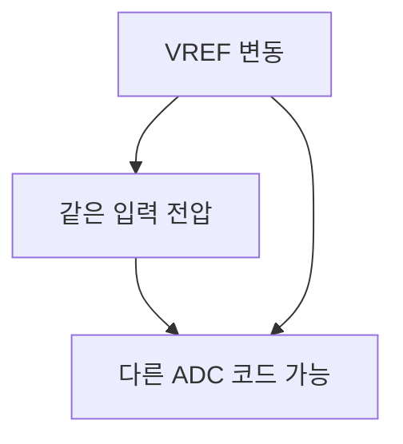

기준 전압은 MCU 전원, 내부 Reference, 외부 Reference 등으로 구성될 수 있다. 선택 가능 여부와 유효 범위는 MCU마다 다르다.

- `VREF`의 정확도와 온도 드리프트를 확인한다.
- 센서가 전원에 비례해 출력하는 **Ratiometric** 구조인지 확인한다.
- 내부 Reference 측정 채널을 이용한 전원 추정 기능은 MCU별 보정 상수와 조건을 확인한다.
- ADC 입력에 허용되는 전압 범위와 Absolute Maximum Rating을 혼동하지 않는다.

## 6. 샘플링과 변환 과정

많은 MCU ADC, 특히 SAR(Successive Approximation Register) ADC는 샘플링 구간에 입력을 취득한 뒤 변환한다.

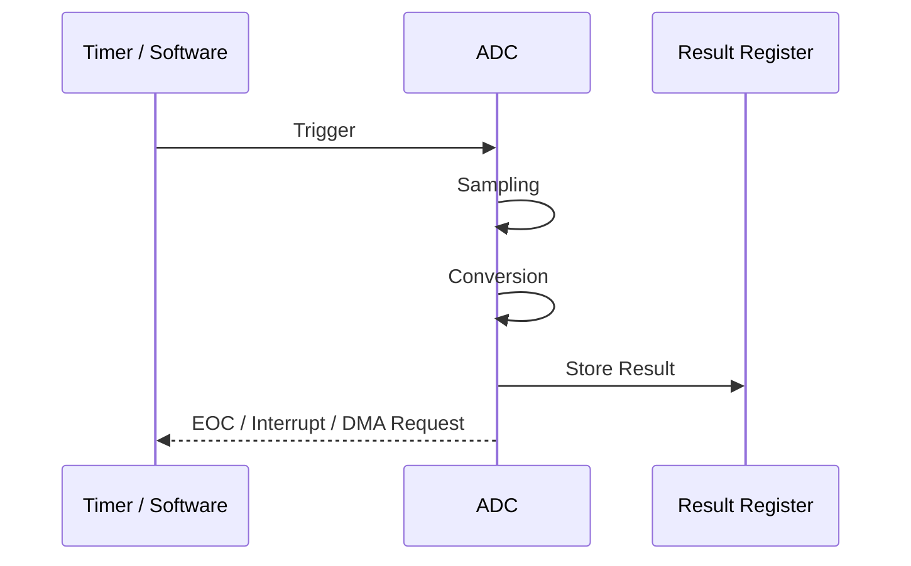

ADC 유형과 MCU 설정에 따라 내부 동작과 이벤트 시점은 달라질 수 있다.

### Sampling Time과 Conversion Time

- **Sampling Time:** 입력을 샘플링 회로에 충분히 전달하는 데 할당된 시간.
- **Conversion Time:** 샘플을 코드로 변환하는 데 필요한 시간.
- **Total Time:** 장치에 따라 두 구간 및 추가 오버헤드를 포함한다.

SAR ADC에서 변환 시간은 ADC Clock의 일정 수 Cycle로 표현되는 경우가 많지만, 구체적인 Cycle 수는 제품 문서를 확인한다.

## 7. 입력 임피던스와 샘플링 커패시터

샘플링 회로가 입력 전압을 충분히 따라가지 못하면 오차가 발생할 수 있다.


영향 요인:

- 센서·분압 회로의 출력 임피던스
- ADC 내부 샘플링 커패시터와 스위치 특성
- Sampling Time
- 이전 Channel과 현재 Channel의 전압 차이
- 입력 필터와 버퍼 증폭기의 구동 능력

고임피던스 입력이나 채널 전환 직후에는 더 긴 Sampling Time이 필요할 수 있다. 구체적인 최대 입력 임피던스는 Datasheet의 조건을 따른다.

## 8. 단일 채널과 다중 채널

| 방식 | 개념 | 고려사항 |
|---|---|---|
| Single Channel | 한 입력을 변환 | 간단한 설정 |
| Scan / Sequence | 여러 Channel을 순서대로 변환 | 채널 순서와 결과 매핑 |
| Repeated Conversion | 반복 변환 | 샘플 간격과 처리 속도 |
| Simultaneous Sampling | 복수 ADC 등이 동시 취득 | 지원 Hardware와 동기화 확인 |

**여러 채널을 빠르게 순회하는 것과 같은 순간에 샘플링하는 것은 다르다.** 순차 Scan에서는 채널마다 취득 시점이 달라질 수 있다.

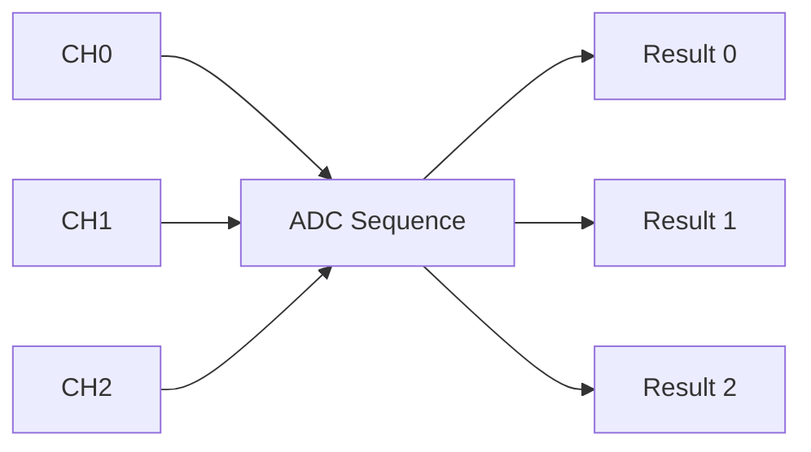

## 9. 변환 시작 방식

| Trigger | 특징 |
|---|---|
| Software Trigger | Firmware가 변환 시작 요청 |
| Timer Trigger | 주기적·동기화된 샘플링에 적합 |
| External Trigger | 외부 이벤트에 맞춰 변환 |
| Continuous Mode | 변환 완료 후 다음 변환을 반복하는 구성 |

지원 Trigger, Edge, Trigger Latency와 재트리거 시 동작은 MCU마다 다르다.

### Timer Trigger의 의미


CPU가 루프에서 변환을 시작하는 것보다 샘플링 간격의 일관성을 확보하는 데 유리할 수 있다. 다만 ADC와 Timer의 실제 동기화·지연 사양은 별도로 확인한다.

## 10. Polling, Interrupt, DMA

| 방식 | 데이터 수신 방식 | 적합한 맥락 | 주의점 |
|---|---|---|---|
| Polling | 완료 Flag 확인 후 읽기 | 낮은 빈도·단순 시스템 | CPU 대기와 Timeout |
| Interrupt | 완료 이벤트마다 ISR 처리 | 비동기·중간 빈도 | ISR 부하와 우선순위 |
| DMA | 결과를 메모리로 전송 | 연속·다채널·고속 수집 | Buffer 소유권·Cache·Overrun |

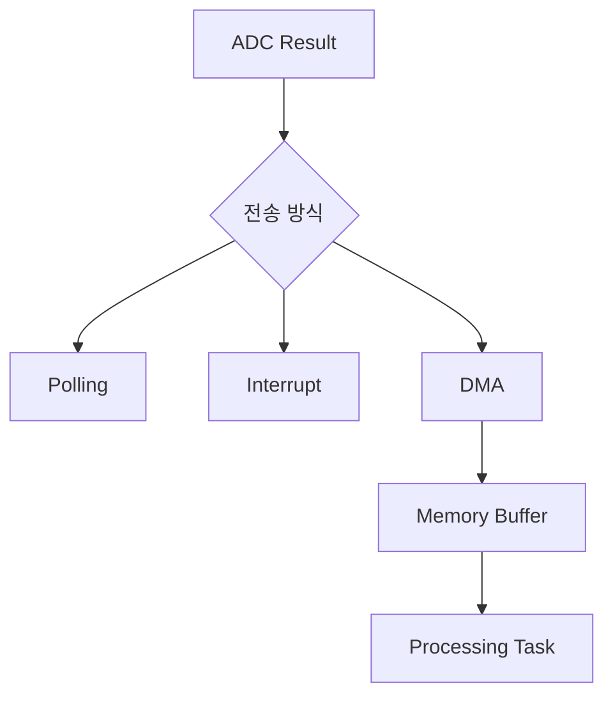

DMA를 사용해도 ADC의 변환 속도, 데이터 생성 속도, 메모리 처리 속도의 균형은 여전히 중요하다.

## 11. EOC, EOS, Overrun

제조사에 따라 이름은 달라도 다음 개념이 자주 등장한다.

| 이벤트 | 의미 |
|---|---|
| EOC (End of Conversion) | 개별 변환 완료 |
| EOS (End of Sequence) | 설정된 변환 순서 완료 |
| Overrun | 이전 결과가 처리되기 전에 새 결과가 발생하는 상황 |
| Analog Watchdog | 입력이 설정한 임계 범위를 벗어나는지 Hardware 감시 |

Overrun 시 결과가 덮어써지는지, 새 결과가 폐기되는지, 변환이 중단되는지는 장치 설정과 문서를 따른다. Flag Clear 방식도 `Register.md`의 W1C/Read-to-Clear 개념과 연결된다.

## 12. DMA Buffer와 데이터 처리

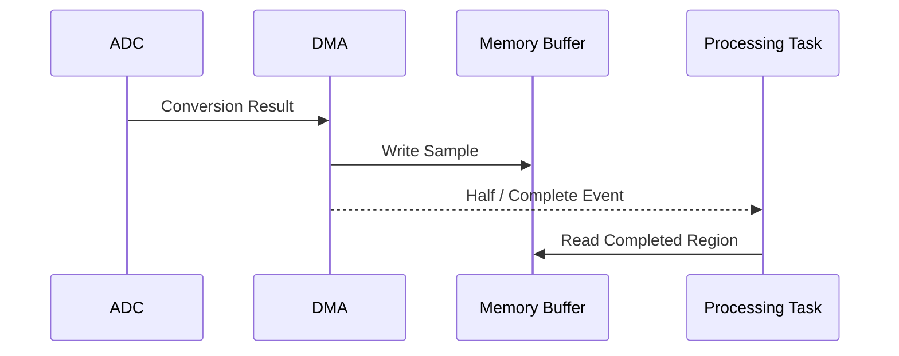

- **Normal Mode:** 정해진 수의 전송 후 완료.
- **Circular Mode:** Buffer 끝에서 처음으로 되돌아가며 반복.
- **Double Buffer / Ping-Pong:** 생산과 소비가 서로 다른 영역을 사용하도록 구성.

DMA가 쓰는 영역을 CPU가 동시에 수정하거나, 아직 채워지지 않은 영역을 완성된 데이터로 취급하지 않는다. Cache가 있는 MCU에서는 DMA와 CPU의 Cache Coherency 규칙을 확인한다. `volatile`은 Cache Maintenance를 대신하지 않는다.

## 13. 샘플링 주파수와 Aliasing

샘플링 주파수 `fs`가 신호의 변화 속도에 비해 낮으면 서로 다른 연속 신호가 동일하거나 유사한 샘플로 보이는 **Aliasing**이 발생할 수 있다.

대역이 `B` Hz 이하로 제한된 이상적인 신호를 복원하려면 이론적으로 `fs > 2B`가 필요하다. 실제 시스템에서는 필터의 전이 대역과 여유를 고려한다.

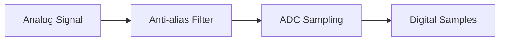

디지털 필터는 **이미 샘플링 과정에서 접혀 들어온 Aliasing을 일반적으로 원상 복구하지 못한다.** 필요하면 ADC 앞단에 아날로그 Anti-alias Filter를 둔다.

## 14. Noise와 Filtering

| 기법 | 개념 | 주의점 |
|---|---|---|
| Moving Average | 여러 샘플 평균 | 응답 지연·급격한 변화 완화 |
| IIR Low-pass | 이전 출력과 새 입력 결합 | 계수·지연·고정소수점 범위 |
| Median Filter | 중앙값 사용 | 충격성 잡음에 유용할 수 있음 |
| Oversampling | 더 높은 빈도로 샘플 수집 | 잡음 특성과 처리량에 의존 |
| Hardware Averaging | ADC 내부 평균 기능 | 지원 여부와 유효 비트 해석 확인 |

**Oversampling만으로 정확도가 자동 향상되는 것은 아니다.** 잡음의 상관성, Reference 품질, 입력 회로와 양자화 특성에 따라 얻을 수 있는 효과가 달라진다.

## 15. Calibration과 물리 단위 변환

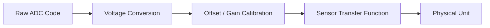

예를 들어 전압 분압으로 배터리 전압을 측정하면 ADC Pin의 전압과 배터리 전압은 다르다.

```text
V_ADC = V_BAT × R_bottom / (R_top + R_bottom)
```

따라서 이상적인 분압 관계에서:

```text
V_BAT = V_ADC × (R_top + R_bottom) / R_bottom
```

실제 회로에서는 저항 오차, ADC 입력 특성, Reference 오차, 보호 회로의 영향 등을 검토한다. 계산 과정의 정수 오버플로와 반올림도 확인한다.

## 16. Signed/Unsigned와 데이터 형식

ADC Result Register는 흔히 Unsigned 정수로 제공되지만, 차동 입력이나 특정 데이터 정렬 모드에서는 Signed 해석이 필요할 수 있다.

- Right/Left Alignment 설정을 확인한다.
- 결과 Register의 유효 비트 폭을 확인한다.
- 여러 채널 결과를 저장할 배열의 요소 크기를 확인한다.
- 전압·물리량 변환 시 정수 연산의 범위와 단위를 확인한다.
- DMA 전송 폭과 메모리 요소 폭이 일치하는지 확인한다.

## 17. ADC와 저전력 모드

ADC는 변환 중 Analog Front-end와 Clock을 사용하므로 전력을 소비한다.

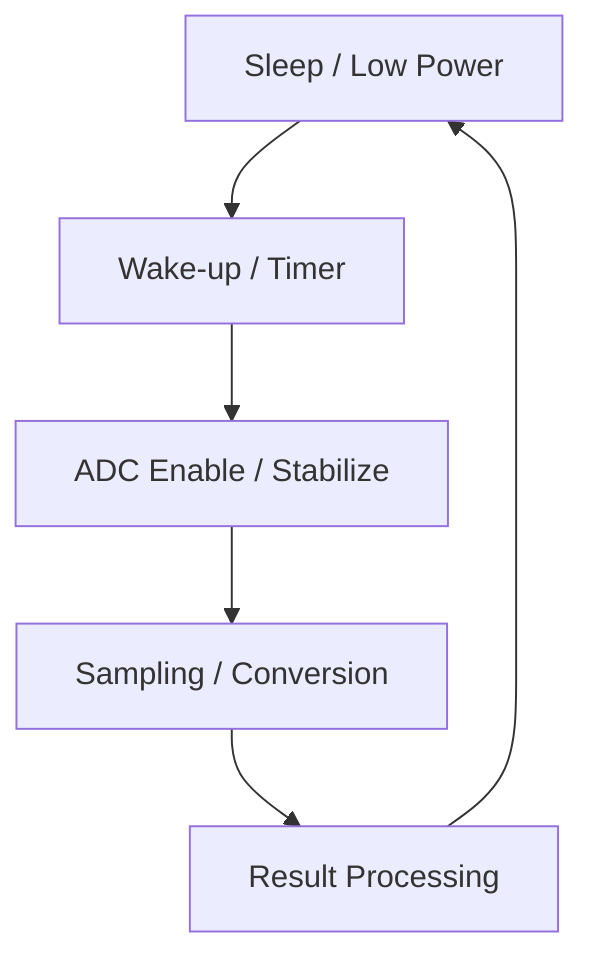

일부 MCU는 특정 저전력 모드에서 ADC가 계속 동작하거나 Wake-up Event를 만들 수 있다. 반대로 Clock이나 Reference가 정지되어 ADC를 사용할 수 없는 모드도 있다. 내부 Reference와 Analog Regulator의 안정화 시간은 제품 문서를 따른다.

## 18. ADC와 Interrupt·RTOS·FSM의 연결

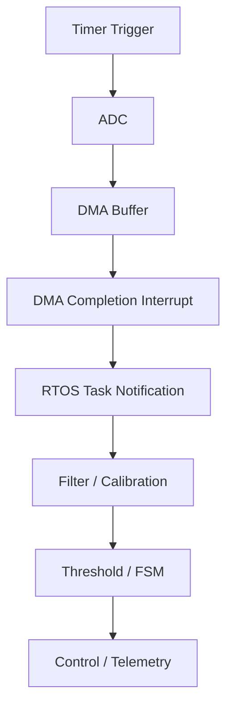

일반적인 역할 분리:

- **Hardware/Timer:** 일정한 샘플링 시점 생성.
- **ADC/DMA:** 데이터 취득과 이동.
- **ISR:** 완료·오류 이벤트 전달 및 필요한 최소 처리.
- **Task/Main Loop:** 필터링·보정·상태 판단.
- **FSM:** 측정값과 시간 조건에 따라 상태 전이.

Task가 늦게 실행되어도 Hardware Sampling 시점이 유지되는지는 ADC·DMA·Buffer 구성과 Overrun 조건에 달려 있다.

## 19. 아날로그 입력 회로에서 확인할 사항

| 항목 | 확인 이유 |
|---|---|
| Pin Multiplexing | 해당 Pin이 Analog Input으로 설정되었는가 |
| Input Voltage Range | 정상 동작 범위를 벗어나지 않는가 |
| Absolute Maximum Rating | 소자 손상 조건을 넘지 않는가 |
| Input Impedance | Sampling Time과 맞는가 |
| Reference Decoupling | 기준 전압이 안정적인가 |
| Ground / PCB Layout | Digital Switching Noise 유입이 큰가 |
| Sensor Settling Time | 센서 출력이 안정화되었는가 |
| Anti-alias Filter | 측정 대역 밖 성분을 제한하는가 |
| Temperature Drift | 온도에 따른 측정 편차가 있는가 |

입력 보호, 분압, 증폭, 필터 회로는 ADC 성능의 일부다. 펌웨어 설정만으로 모든 아날로그 오차를 해결할 수는 없다.

## 20. 흔한 오해

| 오해 | 정확한 관점 |
|---|---|
| 12-bit ADC면 정확도도 12-bit다 | Resolution과 Accuracy는 별개다. |
| ADC Code만 알면 전압을 확정할 수 있다 | VREF와 전달 함수가 필요하다. |
| Sampling Time은 짧을수록 좋다 | 입력 임피던스와 취득 오차를 함께 고려한다. |
| Scan Mode는 모든 채널을 동시에 측정한다 | 일반적인 Scan은 순차 취득이다. |
| DMA를 쓰면 데이터 손실이 없다 | Buffer Overrun과 처리 지연은 여전히 가능하다. |
| `volatile`이면 DMA Cache 문제가 해결된다 | Cache Coherency는 별도 문제다. |
| 디지털 필터로 Aliasing을 제거할 수 있다 | 샘플링 전 대역 제한이 중요하다. |
| Oversampling하면 무조건 유효 비트가 늘어난다 | 잡음·회로·처리 방식에 따라 달라진다. |
| MCU ADC 설정만 맞으면 측정이 정확하다 | 센서·Reference·아날로그 회로·PCB도 중요하다. |

## 21. 개념 연결 요약

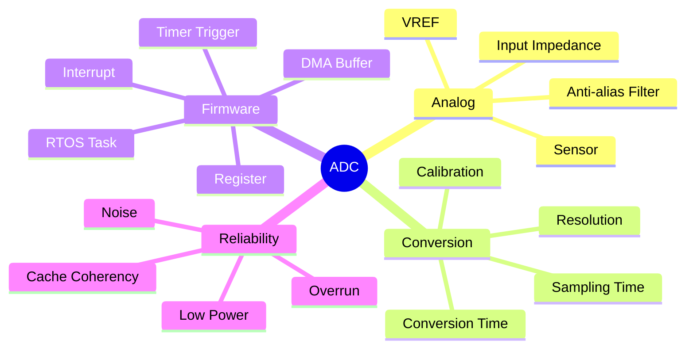

**핵심:** ADC는 단순히 Register에서 정수 하나를 읽는 기능이 아니라, **아날로그 입력 조건 → 샘플링 시점 → 변환 → 데이터 이동 → 보정 → 상태 판단**으로 이어지는 측정 시스템이다.

---

**다음 학습 문서:** `05_Embedded/SPI.md` — Clock과 데이터 프레임, Master/Controller·Slave/Peripheral, Chip Select, Full Duplex, Register·Interrupt·DMA 기반 전송을 정리한다.
