# SPI (Serial Peripheral Interface)

> **학습 위치:** `C_Cpp_Study/05_Embedded/SPI.md`  
> **선행 개념:** `Register.md`, `Interrupt.md`, `DMA.md`, `Timer.md`, `ADC.md`  
> **범위:** SPI의 동작 원리, 타이밍, 데이터 프레임, 드라이버 설계 및 임베디드 시스템 연계. 실습·퀴즈는 포함하지 않는다.

---

## 1. SPI란?

**SPI(Serial Peripheral Interface)**는 클록에 맞춰 데이터를 직렬로 주고받는 동기식 통신 방식이다. 일반적으로 하나의 **Controller(전통적 용어: Master)**가 클록을 만들고 하나 이상의 **Peripheral(전통적 용어: Slave)**과 통신한다.

SPI는 UART와 달리 별도 클록 신호를 사용하므로 송수신 양측이 미리 같은 Baud Rate를 독립적으로 맞출 필요가 없다. 다만 실제 동작 가능 클록 주파수와 타이밍은 연결된 장치의 사양에 제한된다.

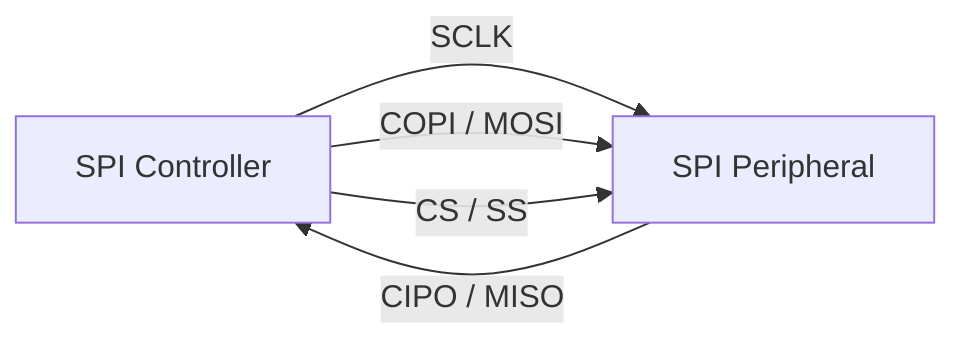

> 명칭: MOSI/MISO는 널리 쓰이는 전통적 표기이며, COPI(Controller Out Peripheral In)/CIPO(Controller In Peripheral Out)로 표기하는 문서도 있다. 둘은 같은 신호 방향을 가리킨다.

## 2. SPI의 네 가지 기본 신호

| 신호 | 다른 표기 | 역할 |
|---|---|---|
| SCLK | SCK, CLK | Controller가 제공하는 직렬 클록 |
| COPI | MOSI, SDI(장치에 따라) | Controller → Peripheral 데이터 |
| CIPO | MISO, SDO(장치에 따라) | Peripheral → Controller 데이터 |
| CS | SS, NSS, nCS | 통신 대상 선택; 일반적으로 Active Low |

**SDI/SDO는 각 장치 입장에서의 입력/출력 이름**이므로 배선 시 데이터시트의 핀 방향을 확인한다. 일부 장치는 3-wire 또는 Half-duplex 구조로 데이터 선 하나를 공유한다.

## 3. 동기식 통신과 Full-duplex

일반적인 4-wire SPI는 클록 하나마다 양방향 Shift Register가 동시에 한 비트씩 이동한다.

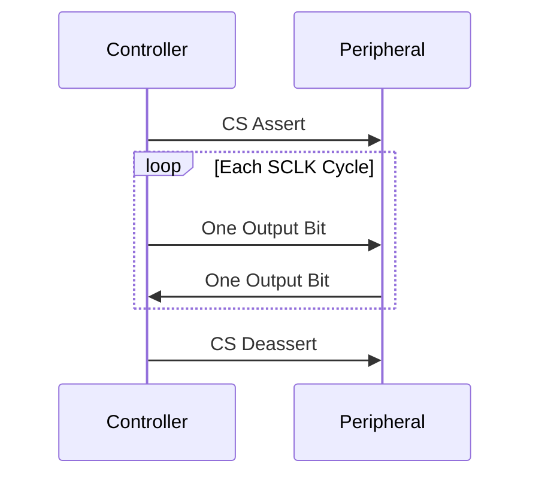

- **Full-duplex:** 송신과 수신이 동시에 진행될 수 있다.
- **Half-duplex:** 데이터 선 또는 프로토콜 단계에 따라 송수신 방향을 번갈아 사용한다.
- **Simplex:** 한 방향 데이터만 유효하게 사용한다.

하드웨어가 Full-duplex여도 상위 장치 프로토콜은 명령 전송 단계와 응답 수신 단계를 구분할 수 있다.

## 4. SPI는 전송 규격이지 완성된 장치 프로토콜이 아니다

SPI 자체는 다음을 통일하지 않는다.

- 명령 Opcode와 Register Address의 형식
- 읽기/쓰기 구분 Bit
- 응답을 받기까지 필요한 Dummy Byte 수
- CS를 언제 내리고 올리는지
- 한 Transaction의 길이와 CRC 사용 여부
- 여러 Byte의 Endianness 및 Bit 순서

따라서 **SPI Controller 설정은 MCU Reference Manual**, **통신 명령과 응답 형식은 Peripheral Datasheet**에서 각각 확인한다.

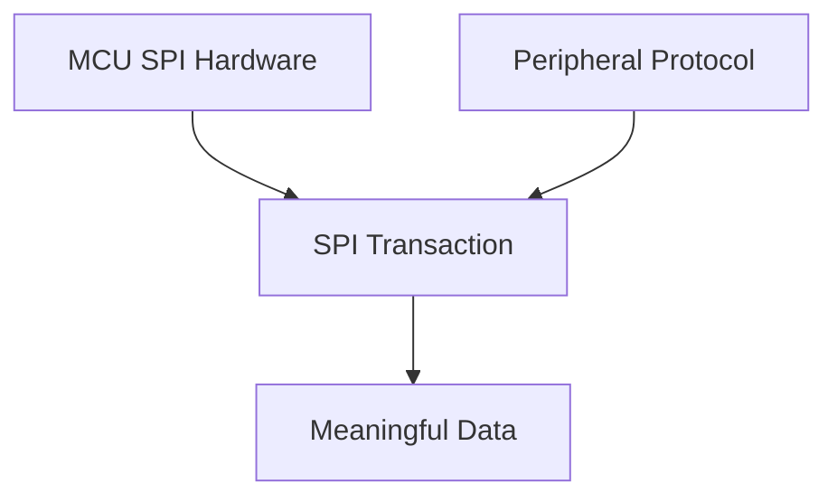

---

## 5. CPOL과 CPHA

SPI 타이밍은 주로 **CPOL(Clock Polarity)**과 **CPHA(Clock Phase)**로 정의한다.

- **CPOL = 0:** 클록의 유휴 상태가 Low.
- **CPOL = 1:** 클록의 유휴 상태가 High.
- **CPHA = 0:** 첫 번째(Leading) Edge에서 Sampling, 두 번째(Trailing) Edge에서 Shift.
- **CPHA = 1:** 첫 번째 Edge에서 Shift, 두 번째 Edge에서 Sampling.

| SPI Mode | CPOL | CPHA | Idle SCLK | Sampling Edge |
|---|---:|---:|---|---|
| Mode 0 | 0 | 0 | Low | Rising |
| Mode 1 | 0 | 1 | Low | Falling |
| Mode 2 | 1 | 0 | High | Falling |
| Mode 3 | 1 | 1 | High | Rising |

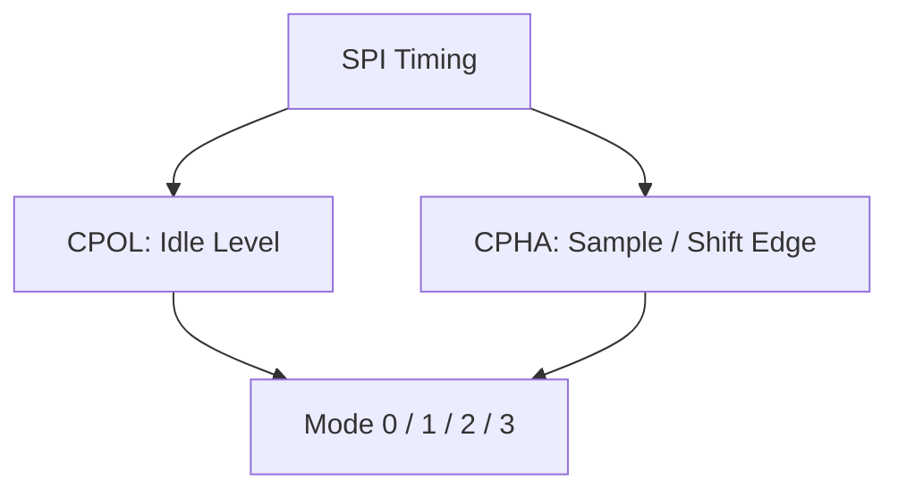

> 장치와 MCU가 서로 다른 Mode로 설정되면 데이터가 한 비트 밀리거나 잘못 샘플링될 수 있다. 일부 제조사는 CPHA 표현이나 첫 비트 준비 시점을 별도 용어로 설명하므로 실제 Timing Diagram을 우선한다.

## 6. 첫 비트와 Setup/Hold Time

CPHA=0에서는 첫 Sampling Edge 전에 첫 데이터 비트가 유효해야 한다. CPHA=1에서는 첫 Edge를 데이터 전환에 사용할 수 있다.

| 타이밍 요소 | 의미 |
|---|---|
| Setup Time | Sampling Edge 전에 데이터가 안정적으로 유지되어야 하는 시간 |
| Hold Time | Sampling Edge 후 데이터가 유지되어야 하는 시간 |
| CS Setup | CS Assert 이후 첫 클록까지의 최소 시간 |
| CS Hold | 마지막 클록 이후 CS Deassert까지의 최소 시간 |
| CS High Time | 연속 Transaction 사이 CS 비활성 최소 시간 |

최대 SCLK만 맞춘다고 항상 정상 통신이 보장되지는 않는다. CS 타이밍과 데이터 유효 구간도 만족해야 한다.

## 7. Bit Order와 Frame Size

SPI 하드웨어는 보통 MSB-first 또는 LSB-first 전송을 지원한다. Data Frame 폭은 MCU에 따라 8-bit, 16-bit 또는 다른 값으로 설정할 수 있다.

```text
MSB-first: bit7 → bit6 → ... → bit0
LSB-first: bit0 → bit1 → ... → bit7
```

**Bit Order와 Byte Order는 다르다.** 16-bit 이상의 값을 여러 8-bit 프레임으로 보낼 때 상위 Byte부터 보낼지, 하위 Byte부터 보낼지는 장치 프로토콜이 결정한다.

---

## 8. SPI 클록과 실제 전송 시간

이상적인 단일 데이터 선 SPI에서 N비트의 Clocking 시간은 다음과 같다.

\[
t_{clock} = \frac{N}{f_{SCLK}}
\]

예를 들어 8 MHz SCLK로 16비트를 이동시키는 순수 클록 시간은 2 μs다. 실제 Transaction에는 CS Setup/Hold, Software Overhead, Dummy Byte, 장치 처리 대기 등이 추가된다.

| 구분 | 주의점 |
|---|---|
| SCLK | 전기적·타이밍 사양이 허용하는 최대값 확인 |
| Payload Throughput | Command, Address, Dummy, CRC를 제외한 실제 유효 데이터율 |
| Transaction Latency | CS와 소프트웨어·장치 대기까지 포함 |
| CPU Load | Polling/Interrupt/DMA 방식에 따라 달라짐 |

## 9. Clock Divider

MCU SPI Controller는 Peripheral Clock을 분주하여 SCLK를 만들 수 있다.


실제 분주 가능 값과 클록 트리의 관계는 MCU마다 다르다. 시스템 Clock 변경이나 저전력 모드 전환 후 SCLK가 달라질 수 있다.

## 10. CS(Chip Select)의 역할

CS는 일반적으로 특정 Peripheral을 선택하고 Transaction 경계를 표시한다.

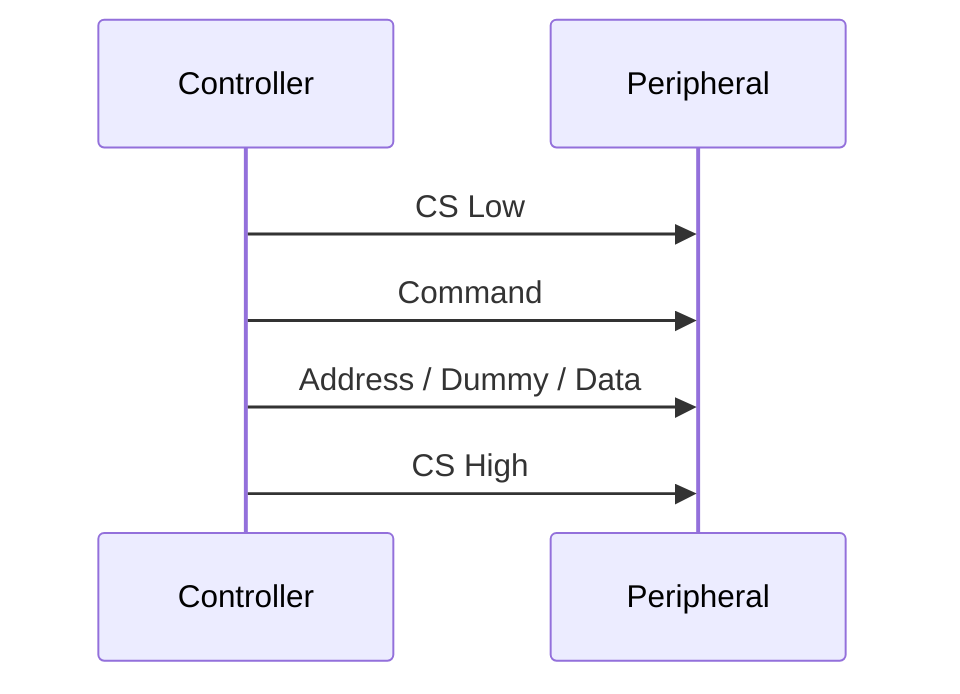

- CS가 High가 되면 일부 장치는 명령 해석 상태를 초기화한다.
- 어떤 장치는 명령부터 데이터 끝까지 **CS를 계속 Low로 유지**해야 한다.
- Hardware NSS 기능이 모든 장치 프로토콜의 CS 타이밍을 충족하는 것은 아니다.
- GPIO로 CS를 제어할 때는 Interrupt/Task 전환으로 Transaction이 끊기지 않도록 설계한다.

---

## 11. 여러 Peripheral을 연결하는 방식

### 독립 CS 방식

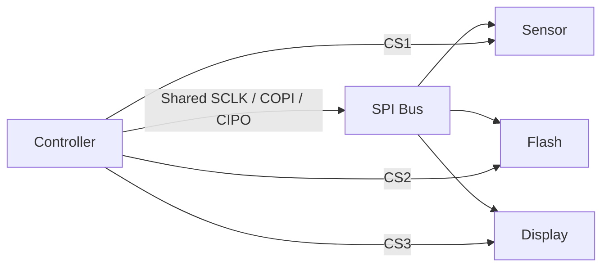

하나의 SPI Bus를 공유하면서 CS를 별도로 둔다. 각 장치는 서로 다른 Mode·속도·프레임 설정이 필요할 수 있으므로 장치 전환 시 Controller 설정을 바꿔야 할 수 있다.

### Daisy Chain 방식

일부 장치는 데이터 출력과 입력을 직렬로 연결하는 Daisy Chain을 지원한다. 이 구조는 **장치 자체가 지원해야 하며** 일반적인 SPI Peripheral을 임의로 연결한다고 동작하지 않는다.

## 12. CIPO 버스 공유와 High-impedance

CS가 비활성인 Peripheral은 일반적으로 CIPO 출력을 High-impedance로 만들어 다른 장치가 Bus를 사용할 수 있게 해야 한다. 모든 장치가 이 조건을 충족하는지 데이터시트를 확인한다. 복수 장치가 동시에 CIPO를 구동하면 Bus Contention이 발생할 수 있다.

---

## 13. Transaction과 Transfer

용어는 SDK마다 다르지만 개념적으로 구분하면 유용하다.

- **Transfer:** 일정한 수의 비트를 Clocking하는 작업.
- **Transaction:** CS Assert부터 Deassert까지 장치가 하나의 명령 또는 데이터 교환으로 해석하는 구간.

하나의 Transaction이 Command Transfer, Address Transfer, Dummy Transfer, Data Transfer로 나뉠 수 있다.

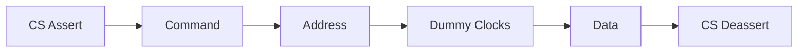

## 14. 읽기에서 Dummy Byte가 필요한 이유

일반적인 Full-duplex SPI는 **수신 클록을 만들기 위해서도 송신이 필요**하다. Controller가 Peripheral 데이터를 읽는 동안 의미 없는 값을 COPI로 보내는 경우가 많다.

```text
Controller TX: [READ CMD] [ADDR] [DUMMY] [DUMMY]
Controller RX: [IGNORE  ] [IGNORE] [DATA0] [DATA1]
```

위 구조는 개념 예시다. 실제 응답이 시작되는 위치와 Dummy Byte 수는 장치별로 다르다.

## 15. 쓰기에서도 RX를 고려해야 한다

Full-duplex SPI에서는 송신하는 동안 수신 측에도 비트가 들어온다. MCU에 따라 수신 FIFO를 읽지 않으면 **Overrun**이 발생할 수 있다. TX-only API가 내부에서 RX를 처리하는지, 사용자가 처리해야 하는지 SDK 문서를 확인한다.

## 16. SPI Register 관점

대표적인 Controller Register 및 Flag는 다음과 같다.

| 기능 | 대표적인 의미 |
|---|---|
| Configuration | Mode, Prescaler, Frame Width, Bit Order |
| Data Register/FIFO | TX 쓰기 및 RX 읽기 |
| TX Ready | 다음 데이터 쓰기 가능 |
| RX Ready | 수신 데이터 읽기 가능 |
| Busy | 현재 전송이 진행 중인지 표시 |
| Error Status | Overrun, Mode Fault, CRC Error 등 |

실제 Flag 이름, Clear 순서, FIFO Depth, Busy의 의미는 MCU마다 다르다.

---

## 17. Polling 기반 SPI

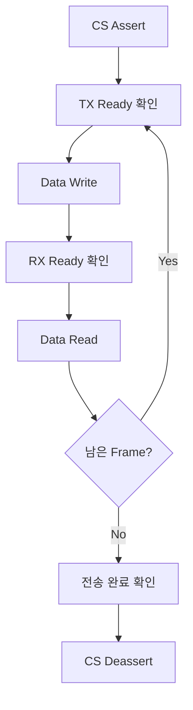

Polling은 구현 흐름이 단순하지만 CPU가 Flag를 기다리는 동안 다른 작업을 처리하기 어렵다. Timeout과 Error Flag 처리가 필요하다.

## 18. Interrupt 기반 SPI

Interrupt는 TX FIFO에 공간이 생기거나 RX 데이터가 도착할 때 CPU에 알릴 수 있다.

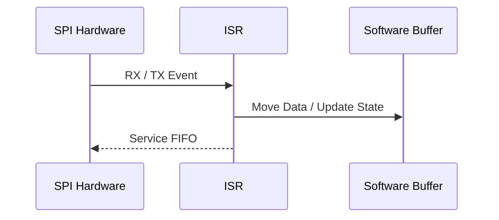

ISR에서 전체 Transaction을 장시간 대기하지 않고, 상태와 Buffer를 갱신한 뒤 필요한 후속 처리를 Main Loop나 RTOS Task로 넘기는 구조를 검토한다.

## 19. DMA 기반 SPI

대용량 데이터 이동에는 DMA를 사용할 수 있다.

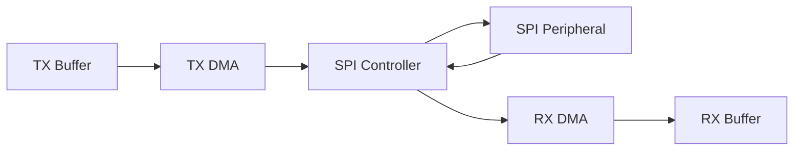

Full-duplex에서는 TX DMA와 RX DMA를 함께 설정해야 할 수 있다. 읽기만 수행하는 경우에도 Dummy 송신을 위한 TX DMA가 필요할 수 있다.

**DMA 완료는 항상 마지막 SPI Bit가 Bus에서 전송 완료되었다는 뜻은 아니다.** DMA Transfer Complete, SPI FIFO Empty, Shift Register/Busy 상태의 의미를 구분하고 CS를 내리는 시점을 정한다.

## 20. Polling·Interrupt·DMA 비교

| 방식 | 장점 | 고려사항 |
|---|---|---|
| Polling | 단순한 흐름, 짧은 명령에 적합 | CPU 대기, Timeout |
| Interrupt | CPU가 다른 작업 가능 | ISR 빈도, 상태 관리, Latency |
| DMA | 큰 데이터 블록에서 CPU 부담 감소 | Buffer 수명, Cache, 완료 시점, 설정 복잡도 |

DMA가 항상 더 빠르거나 유리한 것은 아니다. 매우 짧은 Transaction에서는 설정 오버헤드가 상대적으로 클 수 있다.

---

## 21. DMA Buffer의 수명과 소유권

DMA가 접근 중인 Buffer를 다른 코드가 수정하거나 해제하면 데이터가 손상될 수 있다.

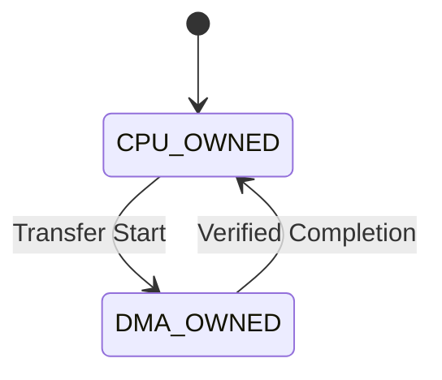

- DMA 완료 전 TX Buffer의 내용을 변경하지 않는다.
- RX Buffer는 완료 전 읽으면 부분 데이터일 수 있다.
- Stack Buffer를 사용한다면 DMA가 끝날 때까지 함수 호출 맥락과 저장 공간이 유지되어야 한다.
- Cache가 있는 MCU에서는 Cache Clean/Invalidate와 Alignment 정책을 확인한다.
- `volatile`은 Cache Coherency를 해결하지 않는다.

## 22. RTOS에서 SPI Bus 공유

복수 Task가 하나의 SPI Controller를 사용한다면 **Transaction 단위의 배타적 접근**이 중요하다.

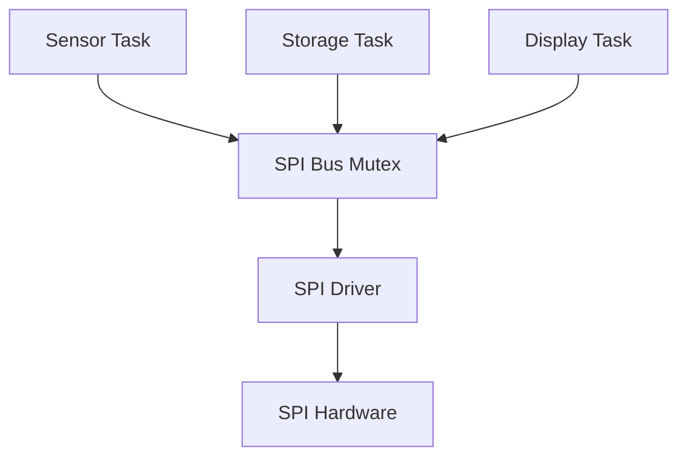

한 Task가 CS를 Assert한 상태에서 다른 Task가 Mode를 바꾸거나 데이터를 송신하면 프로토콜이 깨질 수 있다. Mutex가 필요한 구간은 단일 Register 쓰기가 아니라 **설정 변경 → CS Assert → 전체 Transfer → 완료 확인 → CS Deassert**를 포함할 수 있다.

ISR에서는 일반적인 Blocking Mutex를 사용하지 않는다. RTOS가 제공하는 ISR-safe API와 Driver의 실행 문맥을 확인한다.

## 23. SPI Driver 계층

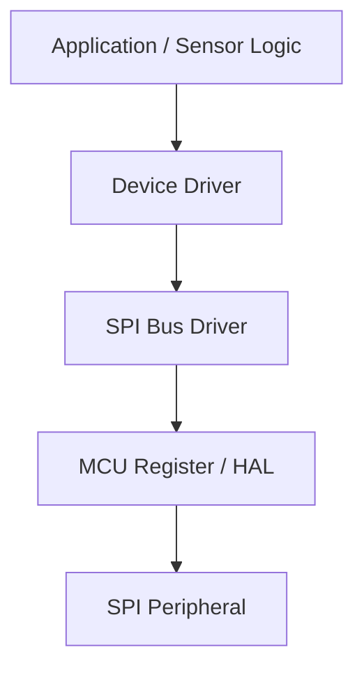

| 계층 | 책임 |
|---|---|
| SPI Bus Driver | Mode, Speed, CS, Transfer, Timeout, DMA/Interrupt |
| Device Driver | Opcode, Register Map, Dummy Byte, CRC, 데이터 변환 |
| Application | 센서 측정 주기, 저장·표시·제어 정책 |

이 구분은 동일한 SPI Bus에 센서, Flash, Display를 연결할 때 특히 중요하다.

---

## 24. 오류와 예외 상황

| 현상 | 가능한 원인 또는 확인 항목 |
|---|---|
| 전부 `0xFF` 수신 | 비활성 CIPO Pull-up, CS/배선/응답 문제 등 |
| 전부 `0x00` 수신 | CIPO Low 고정, 배선/모드/장치 상태 등 |
| 비트가 밀린 값 | CPOL/CPHA, Setup/Hold, Bit Order |
| 일부 Byte 누락 | RX Overrun, FIFO/DMA 처리 지연 |
| 마지막 Byte 손상 | Busy 확인 전 CS Deassert, CS Hold 부족 |
| 고속에서만 오류 | SCLK 과속, 배선, 신호 무결성, 전압·타이밍 |
| 간헐적 오류 | RTOS 동시 접근, CS 경합, Cache, 전원 문제 |

`0xFF`나 `0x00`만으로 특정 원인을 확정할 수 없다. 실제 통신 신호와 장치 상태를 함께 확인해야 한다.

## 25. Mode Fault·Overrun·CRC

- **Mode Fault:** 일부 Controller에서 CS/NSS 상태나 다중 Controller 충돌과 관련된 오류.
- **Overrun:** 이전 RX 데이터를 처리하기 전에 다음 데이터가 들어와 유실되는 상황.
- **CRC Error:** MCU/Peripheral이 지원하고 활성화한 CRC 검사 결과 불일치.

오류 Flag의 Clear 방식은 MCU마다 다르며, 일부는 Status/Data Register를 특정 순서로 읽어야 한다. `Register.md`의 **W1C·Read-to-Clear** 개념을 연결해 이해한다.

## 26. 전기적·물리적 고려사항

SPI는 일반적으로 PCB 또는 비교적 짧은 연결에서 많이 사용된다. 프로토콜 자체가 케이블 길이, 종단, 전압 호환성, 커넥터 배치를 규정하지는 않는다.

- 양쪽 장치의 Logic Voltage가 호환되는지 확인한다.
- SCLK의 Edge Rate, 배선 길이, Return Path, Ground를 고려한다.
- 고속에서는 신호 반사와 Crosstalk가 문제가 될 수 있다.
- 장치가 꺼진 상태에서 신호가 입력될 때의 Back-powering 가능성을 확인한다.
- CS의 기본 비활성 상태와 Reset 중 Pin 상태를 검토한다.

## 27. SPI와 UART·I²C 비교

| 관점 | SPI | UART | I²C |
|---|---|---|---|
| 클록 | 별도 SCLK | 별도 클록선 없음 | SCL 공유 |
| 기본 데이터선 | COPI/CIPO | TX/RX | SDA |
| 대상 선택 | 보통 CS | 상위 프로토콜 설계 | 주소 기반 |
| Full-duplex | 일반적인 4-wire에서 가능 | 일반적인 TX/RX에서 가능 | 공유 SDA로 방향 전환 |
| 표준화 범위 | 물리·시프트 동작 중심, 장치 명령은 개별 | 프레임 중심, 상위 프로토콜 별도 | 주소·ACK 등 Bus 규칙 포함 |
| 대표 활용 | 센서, Flash, Display, ADC | Console, 모듈, 디버그 | 센서, EEPROM, 설정 장치 |

이는 일반적인 구현의 비교다. 실제 성능과 배선 수는 장치의 변형 규격에 따라 달라진다.

## 28. SPI와 ADC·Flash·Display

### 외부 ADC


외부 ADC는 변환 완료를 DRDY Pin으로 알리거나, SPI 명령을 통해 변환을 시작할 수 있다. Sampling Time과 SPI 읽기 시간이 전체 측정 주기에 영향을 준다.

### SPI Flash

Read, Page Program, Sector Erase, Write Enable, Busy Polling 등의 명령을 사용한다. **SPI Transfer 완료와 Flash 내부 Program/Erase 완료는 다르다.** Flash의 Busy 상태와 전원 차단 정책을 확인한다.

### Display

픽셀 데이터를 연속 전송할 때 DMA가 유용할 수 있다. 화면 갱신량, SPI 대역폭, Frame Buffer 크기, CS/DC Pin 제어를 함께 고려한다.

## 29. Quad SPI·Octal SPI와의 관계

QSPI/OSPI는 여러 데이터 선을 이용해 더 많은 비트를 한 클록에 전송할 수 있는 확장 인터페이스다. 일반적인 4-wire SPI와 Pin 구성, 명령 모드, 메모리 매핑 지원 여부가 다르다.

**QSPI/OSPI를 일반 SPI의 클록만 높인 것과 동일하게 보지 않는다.** 지원 장치와 MCU의 Controller 기능을 확인한다.

---

## 30. 설계 시 확인할 핵심 항목

| 분류 | 확인 항목 |
|---|---|
| Protocol | Opcode, Address, Dummy, CRC, 응답 지연 |
| Timing | Mode, SCLK 최대값, CS Setup/Hold, Frame Width |
| Electrical | 전압, Pin 방향, CIPO 공유, 신호 무결성 |
| Firmware | Polling/Interrupt/DMA, Timeout, 오류 복구 |
| Concurrency | Bus Mutex, CS Transaction 경계, ISR Context |
| Memory | DMA Buffer 수명, Cache, Alignment |
| Power | Peripheral Sleep/Wake, CS 기본 상태, Clock 복구 |

## 31. 자주 혼동하는 개념

| 혼동 | 정확한 이해 |
|---|---|
| SPI는 읽기 명령만 보내면 자동으로 응답이 온다 | 응답을 Shift하기 위한 SCLK가 필요하며 Dummy 송신이 필요할 수 있다 |
| SPI Mode는 속도 설정이다 | Mode는 CPOL·CPHA로 정의되는 클록 타이밍이다 |
| SPI의 Full-duplex는 장치 프로토콜도 항상 양방향 동시 데이터다 | 물리 전송과 상위 명령·응답 의미는 구분한다 |
| DMA 완료면 즉시 CS를 올려도 된다 | SPI Shift Register 및 Busy 완료 조건을 확인한다 |
| `volatile`을 사용하면 DMA Buffer가 안전하다 | Buffer 소유권, Cache, 동기화는 별도 문제다 |
| 같은 Bus의 모든 장치는 동일한 Mode를 사용한다 | 장치별 설정이 다를 수 있다 |
| SPI는 표준 명령 집합이 있다 | Opcode와 Register Protocol은 장치별로 정의된다 |

## 32. 전체 개념 연결

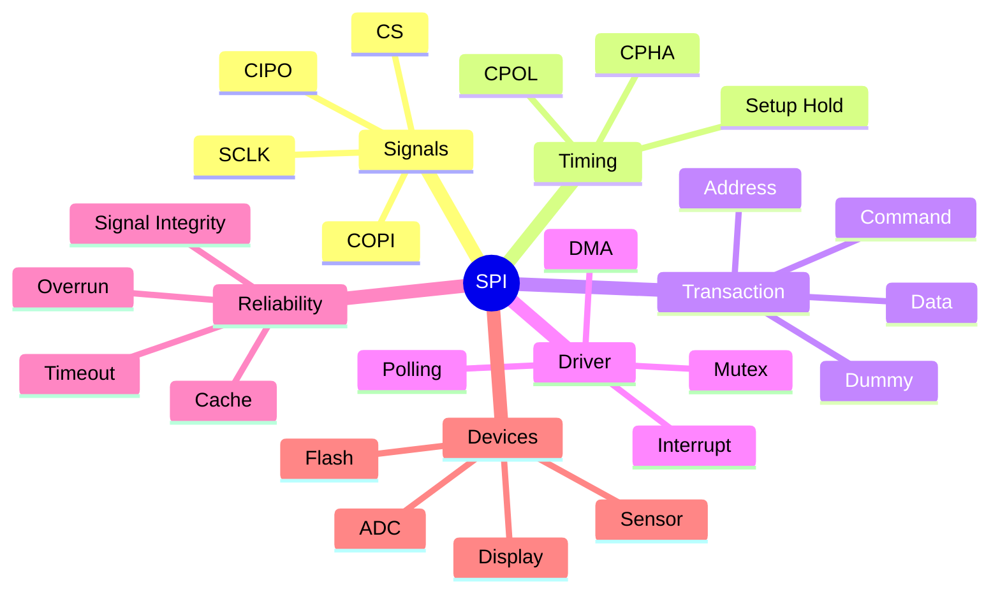

> **핵심:** SPI는 클록에 맞춰 비트를 이동시키는 Bus이며, 실제 데이터의 의미와 Transaction 경계는 장치별 프로토콜이 결정한다. 올바른 구현에는 **Mode·CS·Dummy Clock·전송 완료 시점·Buffer 소유권**을 함께 고려해야 한다.

---

## 다음 학습

**다음 문서:** `05_Embedded/I2C.md`  
SPI와 달리 주소, ACK/NACK, Open-drain, Clock Stretching, Arbitration 등의 Bus 규칙을 포함하는 I²C를 정리한다.
