# I²C (Inter-Integrated Circuit)

> **학습 위치:** `05_Embedded/I2C.md`  
> **학습 범위:** I²C의 전기적 특성, 버스 프로토콜, 트랜잭션, 오류·복구, 임베디드 드라이버 설계  
> **연결 문서:** `Register.md` · `Interrupt.md` · `DMA.md` · `Timer.md` · `SPI.md` · `RTOS.md`  
> **방식:** 실습·퀴즈 없이 개념 정리

---

## 1. I²C란?

**I²C**는 두 개의 신호선으로 여러 장치가 통신하는 동기식 직렬 버스다. 센서, EEPROM, RTC, 전원 관리 IC 등 보드 내부의 비교적 짧은 거리 통신에 널리 쓰인다.

- **SCL (Serial Clock):** 클록 신호
- **SDA (Serial Data):** 양방향 데이터 신호
- **Controller / Target:** 통신을 시작하고 클록을 제공하는 쪽 / 주소를 통해 선택되는 쪽
- **Address:** 같은 버스의 Target을 구분하는 논리적 식별자

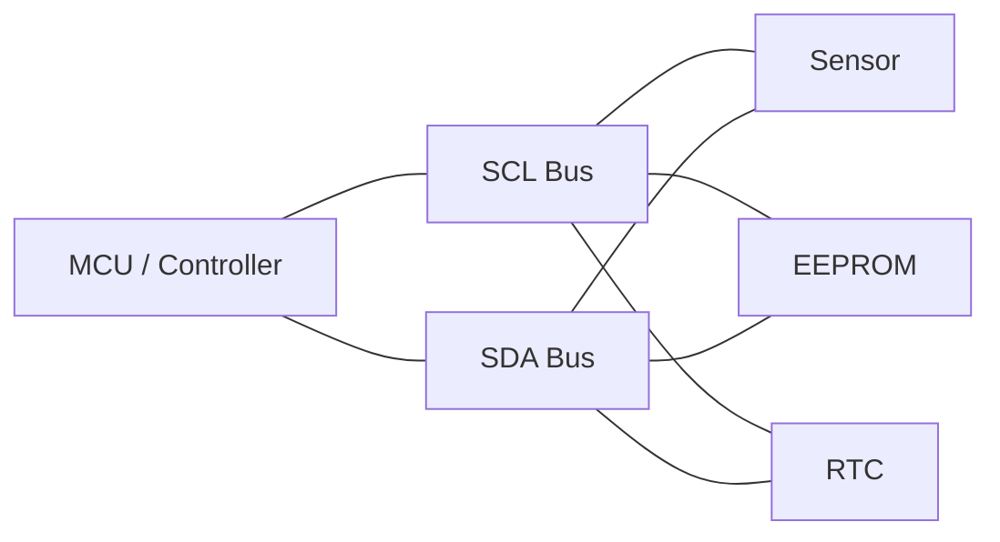

I²C는 장치의 **내부 레지스터 주소 체계**까지 표준화하지 않는다. 주소로 장치를 선택한 뒤 어떤 바이트를 보내야 하는지는 각 IC의 데이터시트가 정한다.

## 2. UART·SPI·I²C 비교

| 구분 | UART | SPI | I²C |
|---|---|---|---|
| 동기화 | 비동기 | 클록 기반 | 클록 기반 |
| 기본 신호 | TX, RX | SCLK, 데이터선, CS | SCL, SDA |
| 장치 선택 | 별도 프로토콜 필요 | 보통 CS | 버스 주소 |
| 데이터 방향 | TX/RX 분리 | 구성에 따라 동시 송수신 | SDA 공유, 방향 전환 |
| 확인 응답 | 상위 프로토콜에서 구현 | 상위 프로토콜에서 구현 | 바이트 단위 ACK/NACK |
| 대표 용도 | 콘솔, 모듈 통신 | Flash, Display, 고속 센서 | 설정 IC, 센서, RTC |

실제 처리량은 클록뿐 아니라 주소 전송, ACK, 버스 상태, 장치 응답 시간, 드라이버 구현의 영향을 받는다.

---

## 3. Open-Drain과 Pull-up

I²C의 일반적인 SDA·SCL 신호는 **Open-Drain/Open-Collector** 방식으로 구동된다. 장치는 신호선을 Low로 당기거나 놓을 수 있으며, High는 Pull-up 저항에 의해 형성된다.

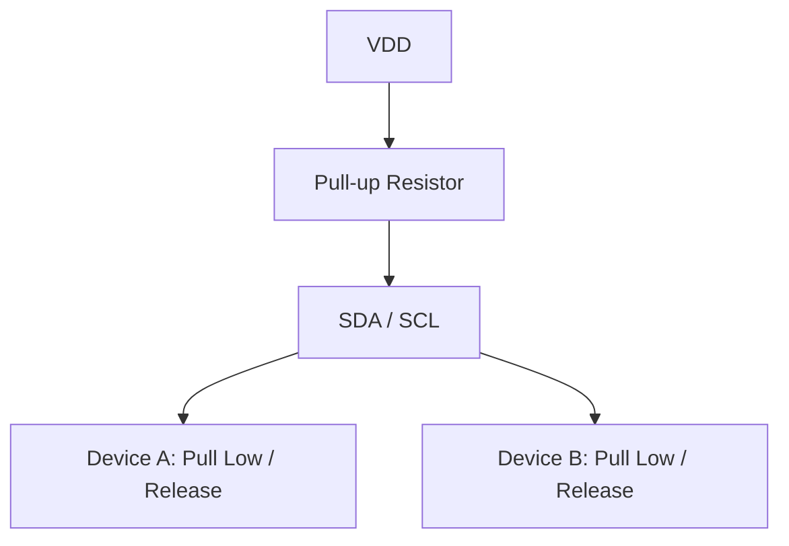

| 상태 | 버스에서 일어나는 일 |
|---|---|
| 어느 장치도 Low로 당기지 않음 | Pull-up에 의해 High |
| 한 장치 이상이 Low로 당김 | Low |
| 여러 장치가 동시에 Low로 당김 | 여전히 Low |

이 구조는 여러 장치가 같은 신호선을 공유할 수 있게 한다. 단, **일반 Push-Pull 출력으로 임의 구성하면 버스 충돌과 전기적 문제가 생길 수 있다.** MCU의 I²C Alternate Function과 보드 회로를 확인한다.

### Pull-up 저항과 버스 속도

Pull-up이 너무 약하면 버스 정전용량 때문에 상승 시간이 길어진다. 너무 강하면 장치가 Low를 구동할 때 전류 부담이 커진다.

```text
Pull-up Resistance + Bus Capacitance
                ↓
           Rise Time
                ↓
       Reliable Bus Speed
```

적정 저항값은 전압, 총 버스 정전용량, 장치의 Low 구동 능력, 목표 속도 및 I²C 규격의 타이밍 요구사항을 함께 고려한다. **모든 보드에 적용되는 단일 저항값은 없다.**

## 4. 버스의 Idle 상태

버스가 유휴 상태일 때 일반적으로 SDA와 SCL은 모두 High다.

```text
SCL: ───────── HIGH ─────────
SDA: ───────── HIGH ─────────
```

SDA 또는 SCL이 지속적으로 Low라면 정상 통신 중일 수도 있지만, 장치가 신호선을 놓지 못한 **Stuck Bus** 상황일 수도 있다.

---

## 5. START와 STOP

I²C에서는 SCL이 High인 동안 SDA의 변화가 특별한 의미를 갖는다.

- **START (S):** SCL High에서 SDA가 High → Low
- **STOP (P):** SCL High에서 SDA가 Low → High

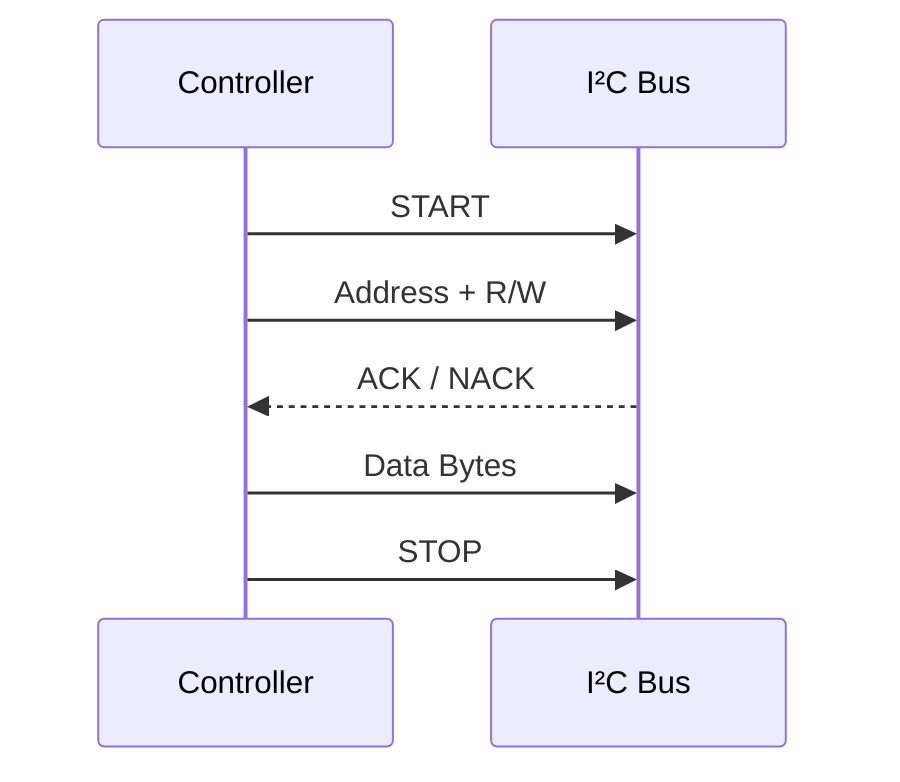

일반적인 데이터 비트는 **SCL이 High일 때 안정적**이어야 하며, SDA는 보통 SCL Low 구간에 변경된다. START·STOP은 이 규칙의 의도적인 예외다.

## 6. 비트와 바이트 전송

일반적인 I²C 바이트 전송은 **8개 데이터 비트 + 1개 ACK/NACK 클록**으로 구성된다. 바이트의 비트는 보통 **MSB First**로 전송된다.

```text
SCL Pulse:  1 2 3 4 5 6 7 8 | 9
SDA:        D7 ........ D0 | ACK/NACK
```

9번째 클록에서는 수신 측이 응답한다. 데이터 비트 8개만 보고 전송 시간을 계산하면 ACK/NACK에 필요한 클록을 놓치게 된다.

## 7. ACK와 NACK

| 응답 | 버스 수준 의미 | 흔한 상황 |
|---|---|---|
| ACK | 응답자가 SDA를 Low로 구동 | 주소 인식, 바이트 수신 |
| NACK | 응답자가 SDA를 Low로 구동하지 않음 | 주소 미응답, 수신 거부, 읽기 종료 |

**NACK = 반드시 하드웨어 고장**은 아니다. Controller가 읽기 마지막 바이트에서 NACK을 보내 수신 종료를 알리는 것은 정상적인 프로토콜 동작이다.

NACK의 원인을 판단할 때는 어느 단계에서 발생했는지 구분한다.

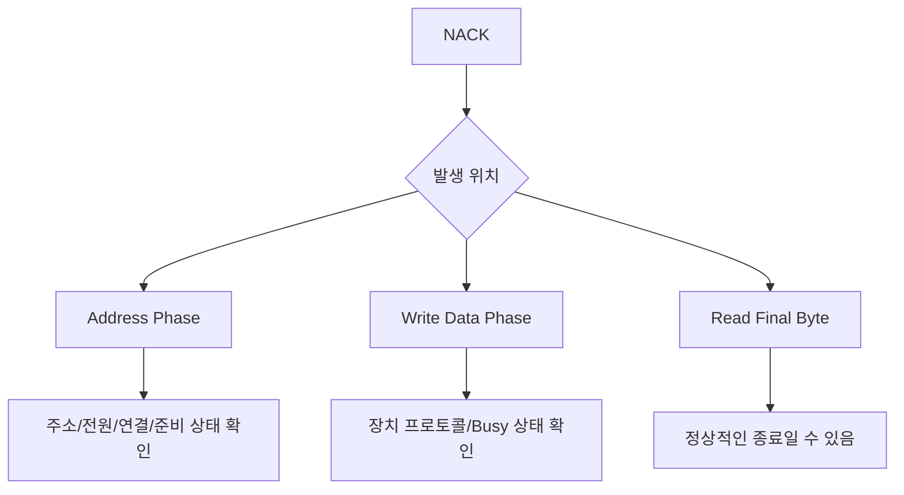

---

## 8. 7-bit 주소와 R/W 비트

일반적인 7-bit 주소 모드에서는 첫 전송 바이트가 다음처럼 구성된다.

```text
Bit:    7 6 5 4 3 2 1 | 0
        [7-bit Address] | R/W
```

- `R/W = 0`: Controller가 Target으로 쓰기
- `R/W = 1`: Controller가 Target에서 읽기

**7-bit 장치 주소와 버스에 전송되는 8-bit 주소+방향 바이트는 다르다.**

예를 들어 7-bit 주소가 `0x48`이면 버스의 주소 단계에서 방향에 따라 다음 값이 나타날 수 있다.

| 동작 | 주소+방향 바이트 |
|---|---|
| Write | `0x90` |
| Read | `0x91` |

하지만 **HAL/SDK 함수가 7-bit 주소를 받는지, Shift된 주소를 받는지는 API마다 다르다.** `0x48`과 `0x90`을 무조건 교환해 사용하면 안 된다.

### 10-bit 주소

I²C에는 10-bit 주소 방식도 존재한다. 주소 전송 순서와 지원 여부는 7-bit와 다르므로 MCU Controller 및 Target 양쪽의 지원 여부를 확인한다.

## 9. Address와 Internal Register Address는 다르다

센서의 데이터 레지스터를 읽을 때 두 종류의 주소가 등장할 수 있다.

```text
I²C Device Address  → 어떤 IC인가?
Internal Register   → 그 IC의 어떤 데이터인가?
```

예시:

```text
Device Address: 0x48
Register Index: 0x02
```

`0x02`는 I²C 표준이 정의한 주소가 아니라 **해당 장치의 데이터시트에서 정의한 내부 프로토콜 값**이다. 어떤 장치는 내부 주소가 8-bit이고, 어떤 장치는 16-bit이며, 어떤 장치는 별도 명령 체계를 사용한다.

---

## 10. Write Transaction

일반적인 단일 Target 쓰기 흐름:

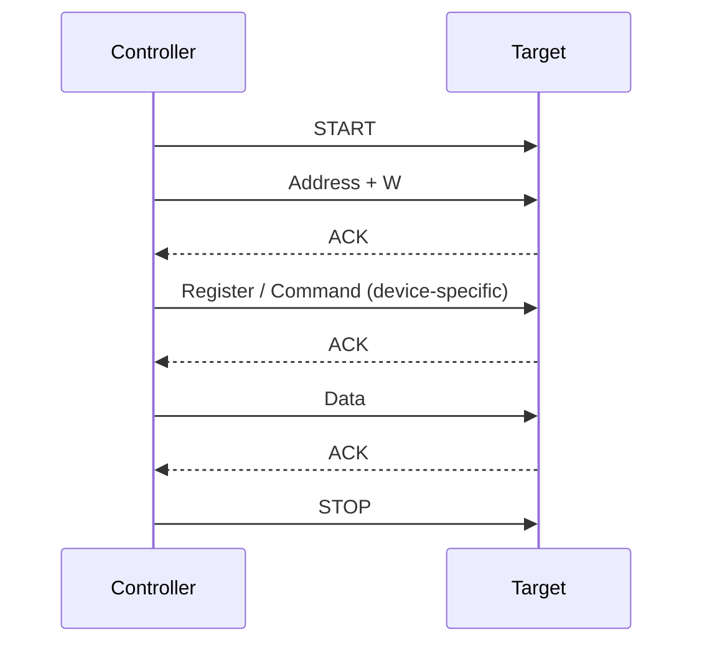

모든 Target이 `Register → Data` 형식을 따르는 것은 아니다. EEPROM, 센서, 디스플레이 컨트롤러 등은 각자 명령 및 데이터 형식을 가진다.

## 11. Read Transaction과 Repeated START

많은 Register 기반 장치는 먼저 읽을 Register를 지정하고, 그다음 읽기 방향으로 전환한다.

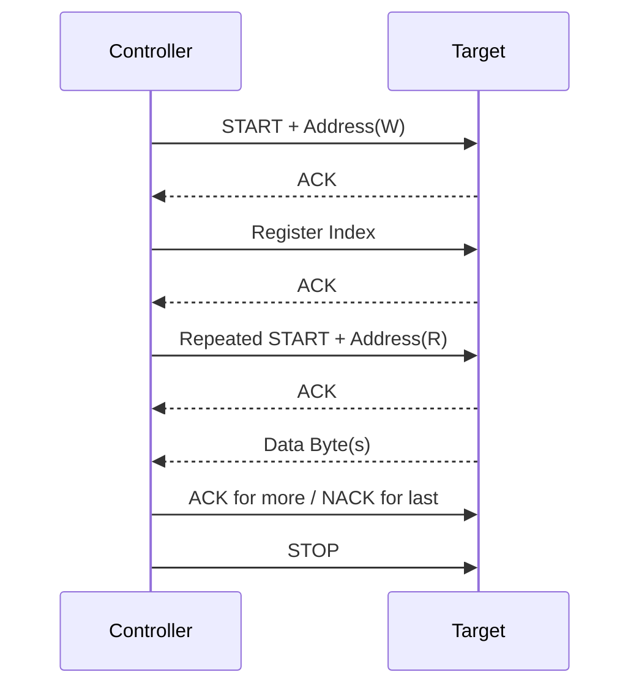

**Repeated START (Sr)**는 STOP으로 버스를 해제하지 않고 새로운 START를 생성하는 방식이다. Register 지정 후 읽기 전환처럼 **하나의 논리적 트랜잭션을 이어갈 때** 사용한다.

장치에 따라 STOP 후 재시작을 허용하기도 하지만, 어떤 장치는 Repeated START를 요구한다. **둘을 임의로 대체하지 않는다.**

## 12. 여러 바이트 읽기와 마지막 NACK

Controller가 Target에서 연속된 바이트를 읽는 경우 일반적으로:

1. 중간 바이트 수신 후 Controller가 ACK을 보내 다음 바이트를 요청한다.
2. 마지막 바이트 수신 후 Controller가 NACK을 보낸다.
3. STOP 또는 Repeated START로 트랜잭션을 마무리한다.

```text
Target → Byte 0 → Controller ACK
Target → Byte 1 → Controller ACK
Target → Byte 2 → Controller NACK → STOP
```

이는 **읽기 데이터의 수신자가 Controller**이기 때문에 ACK/NACK의 주체가 쓰기 트랜잭션과 달라지는 사례다.

---

## 13. Clock Stretching

일부 Target은 데이터를 준비할 시간이 필요할 때 SCL을 Low로 유지해 Controller의 진행을 늦출 수 있다. 이를 **Clock Stretching**이라 한다.

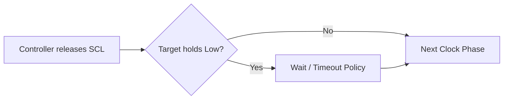

- 모든 Controller/Target이 동일한 범위의 Clock Stretching을 지원하는 것은 아니다.
- Target이 SCL을 계속 Low로 유지하면 통신이 정지할 수 있다.
- Driver는 하드웨어 지원 여부와 Timeout 정책을 확인해야 한다.

## 14. Arbitration과 Multi-Controller

I²C는 둘 이상의 Controller가 같은 버스를 사용할 수 있는 규칙을 제공한다. 버스에 내보내려는 값과 실제 SDA를 비교하여, **High를 내보내려 했는데 Low를 관찰한 Controller**가 Arbitration에서 패배할 수 있다.

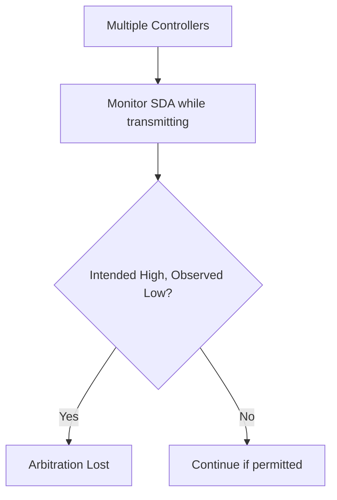

실제 보드가 Single-Controller 구조라면 Arbitration이 거의 나타나지 않을 수 있지만, Driver가 관련 Error Flag를 처리할 수 있어야 한다. Arbitration Lost 이후의 재시도는 무조건 즉시 반복하기보다 시스템 정책에 따른다.

## 15. 속도 모드

| 모드 | 대표적인 최대 비트율 | 비고 |
|---|---:|---|
| Standard-mode | 100 kbit/s | 일반적인 저속 장치 |
| Fast-mode | 400 kbit/s | 많은 센서에서 사용 |
| Fast-mode Plus | 1 Mbit/s | 장치·배선 지원 필요 |
| High-speed mode | 3.4 Mbit/s | 별도 프로토콜·지원 요건 |

이는 **모드의 규격상 대표 최대 비트율**이지 모든 장치·배선에서 달성되는 유효 데이터 처리량을 뜻하지 않는다. 그 밖의 모드와 확장은 장치 및 MCU의 지원 문서를 확인한다.

### 실제 전송 시간

전송에는 데이터뿐 아니라 주소, ACK/NACK, START/STOP, Stretching 등이 포함된다.

```text
Effective Throughput < Raw SCL Bit Rate
```

센서 샘플링 주기와 I²C 처리량을 설계할 때는 전체 트랜잭션 비용을 고려한다.

---

## 16. I²C Peripheral Register

MCU I²C Controller에는 보통 다음과 같은 기능의 Register/Field가 있다.

| 기능 | 의미 |
|---|---|
| Timing | SCL High/Low, Setup/Hold 관련 설정 |
| Address | Target 주소, 방향, 주소 매칭 |
| TX/RX Data | 전송·수신 데이터 |
| Status | Busy, TX Ready, RX Ready, 완료 상태 |
| Control | START, STOP, Enable, ACK/NACK 제어 |
| Interrupt | 이벤트·오류 Interrupt 허용 |
| Error | NACK, Bus Error, Arbitration Lost 등 |

실제 Register 이름과 상태 전이 순서는 MCU마다 다르다. 제조사 HAL 또는 Reference Manual의 시퀀스를 따른다.

## 17. Polling·Interrupt·DMA

| 방식 | 특징 | 고려사항 |
|---|---|---|
| Polling | 코드 흐름이 단순함 | CPU 대기, Timeout 필요 |
| Interrupt | 이벤트 시 CPU 처리 | 상태 머신, ISR 짧게 유지 |
| DMA | 바이트 이동 부담 감소 | 시작·완료·오류와 버스 제어는 별도 관리 |

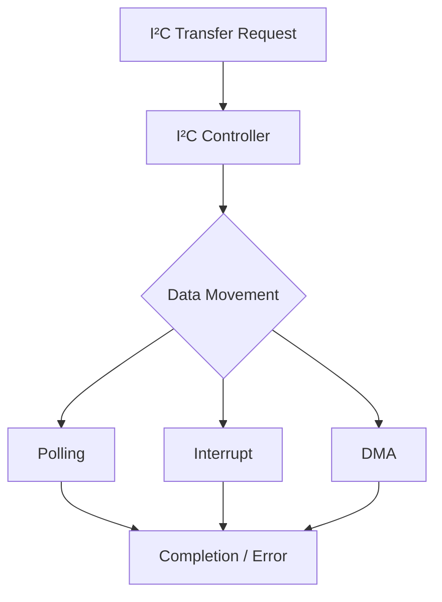

DMA는 I²C 프로토콜을 대신 구현하는 것이 아니다. START, 주소, ACK/NACK, STOP, 오류 처리 등은 MCU I²C Peripheral과 Driver의 역할로 남는다.

---

## 18. 흔한 오류와 의미

| 현상 | 가능한 원인 | 확인할 관점 |
|---|---|---|
| Address NACK | 주소 오류, 미연결, 전원 미인가, 준비 전 | 7-bit/8-bit API 규약, 전원, 데이터시트 |
| Data NACK | 명령 오류, 수신 불가, 내부 Busy | 프로토콜, 쓰기 주기 |
| Bus Busy 고착 | SDA/SCL Low 유지, 이전 트랜잭션 미종료 | Pin 상태, Bus Recovery |
| Timeout | Stretching 지속, 배선 문제, 장치 정지 | Timeout 구간과 Hardware Flag |
| Arbitration Lost | 다른 Controller와 충돌 | Multi-Controller 구성 |
| Bus Error | 비정상 START/STOP 등 | 파형·전기적 품질 |
| 잘못된 데이터 | Register Index/Byte Order/Timing 오류 | Target 데이터시트 |

Error Flag의 의미와 Clear 방식은 MCU별로 다르다. `Register.md`에서 정리한 W1C, Read-to-Clear 등 **특수 접근 규칙**을 확인한다.

## 19. Timeout은 여러 단계에 필요하다

하나의 전체 Timeout만 두면 원인 구분이 어려울 수 있다.

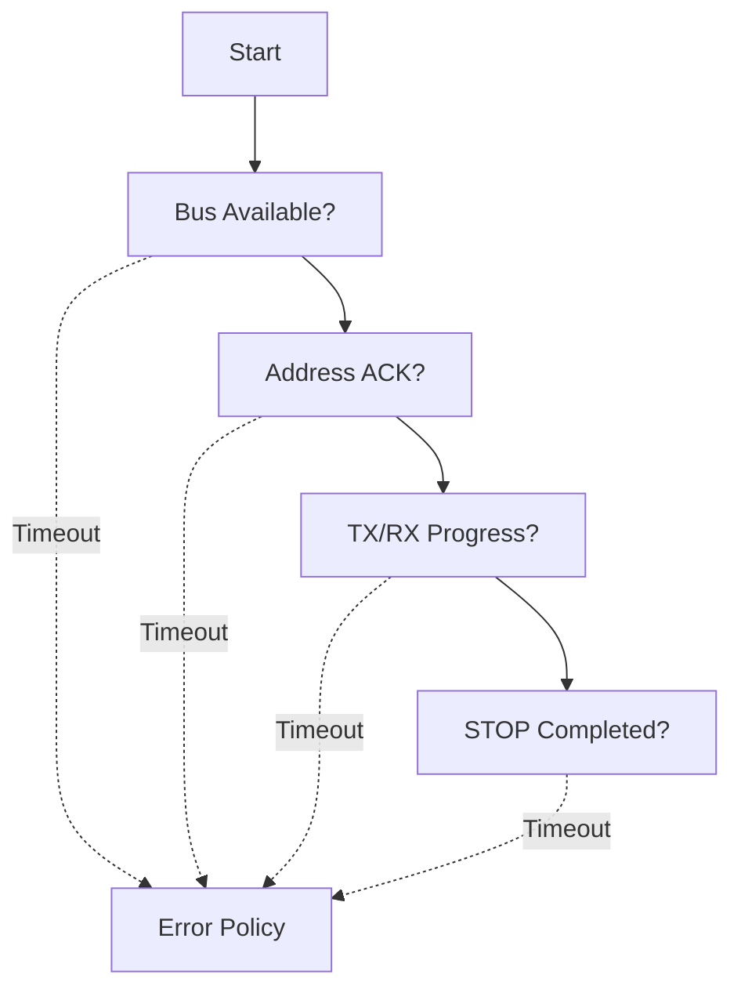

설계 시 구분할 수 있는 단계:

- 버스가 유휴 상태가 될 때까지 대기
- 주소 단계 응답 대기
- 데이터 바이트 진행 대기
- Clock Stretching 허용 시간
- STOP 또는 전송 완료 대기

Timeout 수치는 대상 장치의 정상 동작 시간, 버스 속도, RTOS 스케줄링 및 시스템 응답 요구사항에 따라 정한다.

## 20. Bus Recovery

Target이 SDA를 Low로 붙잡거나 Controller 상태가 꼬이면 정상 STOP이 생성되지 못할 수 있다. 일부 설계에서는 MCU I²C Peripheral을 비활성화하고 GPIO로 SCL을 구동해 Target이 남은 비트를 진행하도록 한 뒤 STOP을 재구성하는 방법을 검토한다.

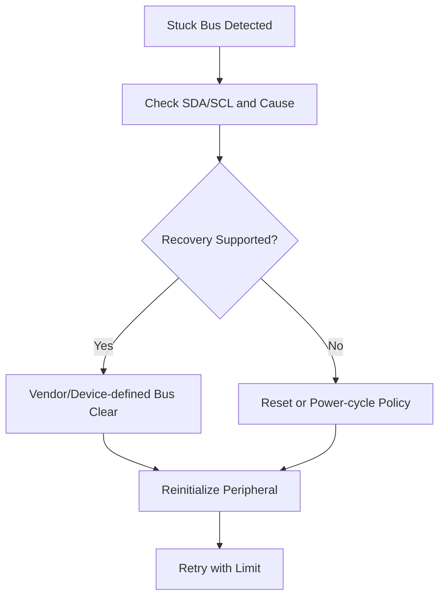

**임의의 SCL 토글 횟수나 복구 절차를 모든 I²C 장치에 적용해서는 안 된다.** Target 상태, 전원 도메인, 멀티컨트롤러 여부, 제조사 권고와 버스 규격을 확인한다. 복구가 불가능하면 상위 계층에 오류를 전달해야 한다.

---

## 21. RTOS 환경에서의 버스 공유

여러 Task가 하나의 I²C Peripheral을 공유하면 다음처럼 트랜잭션이 섞이지 않도록 해야 한다.

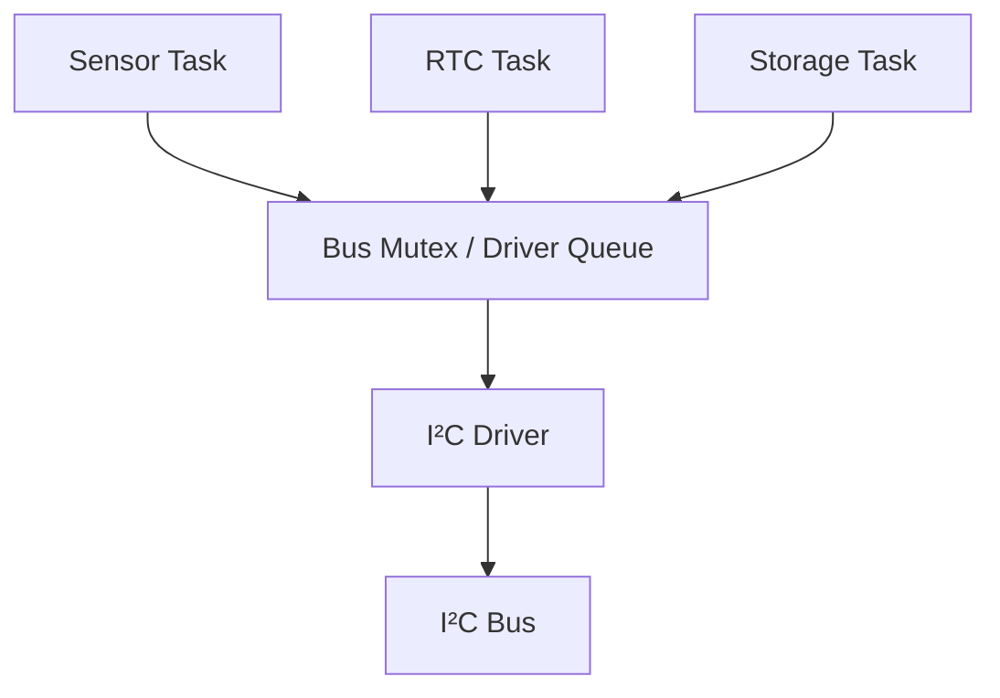

- **Mutex:** 하나의 논리적 트랜잭션을 원자적인 Driver 작업 단위로 보호한다.
- **Queue:** 단일 Driver Task가 요청을 순서대로 처리하도록 설계할 수 있다.
- **Completion Signal:** Interrupt/DMA 완료를 요청 Task에 전달할 수 있다.

Register Index 쓰기와 Repeated START 읽기를 **별도 Lock 구간으로 쪼개면 다른 Task가 중간에 끼어들 수 있다.** 논리적 트랜잭션의 경계를 먼저 정의한다.

ISR에서 일반적인 Blocking I²C API를 직접 호출하는 것은 대기·Lock·스케줄링 문제를 일으킬 수 있다. ISR에서는 이벤트만 전달하고 Task에서 통신을 수행하는 구조를 검토한다.

## 22. 데이터 Buffer와 DMA 수명

비동기 I²C 전송은 API 호출이 반환된 후에도 Buffer를 참조할 수 있다.

```text
Start Async Transfer
        ↓
Buffer Must Remain Valid
        ↓
Transfer Completion / Abort
        ↓
Buffer May Be Reused
```

확인할 사항:

- TX Buffer가 완료 전까지 수정되지 않는가?
- RX Buffer를 완료 전에 읽지 않는가?
- Stack 지역 변수의 수명이 전송보다 짧지 않은가?
- DMA가 접근 가능한 메모리인가?
- Cache가 있는 시스템이라면 Cache Coherency 절차가 필요한가?

`volatile`은 Buffer 소유권이나 Cache 동기화 문제를 해결하지 않는다.

## 23. 저전력 모드와 I²C

Sleep 진입 전 다음을 확인한다.

| 항목 | 질문 |
|---|---|
| 진행 중 트랜잭션 | 완료를 기다릴 것인가, 중단할 것인가? |
| Clock | 해당 저전력 모드에서 I²C Clock이 유지되는가? |
| Wake-up | Address Match 또는 Bus Event로 깨어날 수 있는가? |
| Pin State | Pull-up과 Pin 설정이 유지되는가? |
| 전원 도메인 | Target 전원이 유지되는가? |

Controller와 Target의 전원 상태가 다르면 **역전원(Back-powering)**이나 비정상 버스 레벨 같은 보드 수준 문제가 생길 수 있다. 저전력 설계는 MCU Register 설정뿐 아니라 외부 IC의 전기적 특성까지 함께 본다.

---

## 24. Driver 계층의 역할

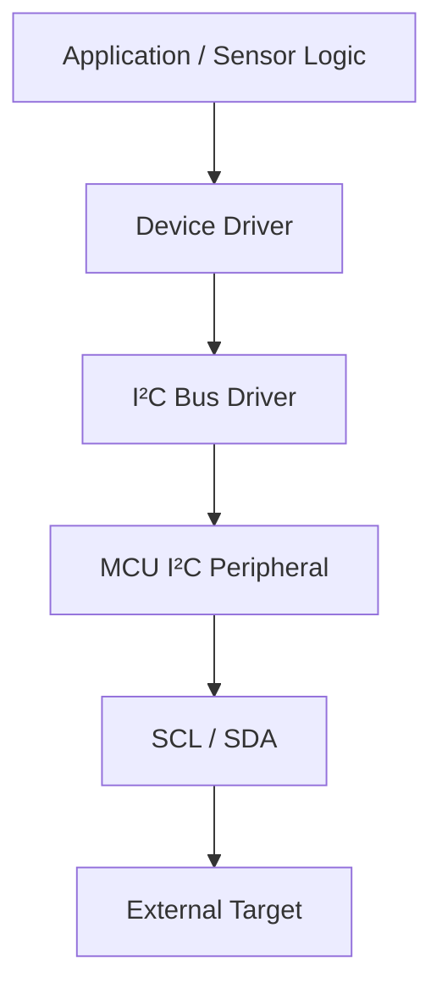

| 계층 | 책임 |
|---|---|
| Application | 센서값 사용, 시스템 동작 결정 |
| Device Driver | 장치 주소, 내부 Register, 데이터 변환, 장치별 Timing |
| I²C Bus Driver | START/STOP, 방향 전환, Buffer, Timeout, Bus Lock |
| MCU Peripheral | 비트 타이밍, 상태 Flag, Interrupt/DMA 연계 |
| Board | Pull-up, 배선, 전원, 전압 레벨 |

**I²C Bus Driver가 특정 센서의 내부 Register 의미까지 알아야 하는 구조**는 재사용성을 떨어뜨릴 수 있다. 공통 버스 처리와 장치별 프로토콜을 분리한다.

## 25. 설계 시 핵심 확인 항목

| 영역 | 확인할 내용 |
|---|---|
| 전기적 연결 | Pull-up, 전압 레벨, 배선 길이, 버스 정전용량 |
| 주소 | 7-bit/10-bit, 주소 충돌, API의 Shift 규약 |
| 프로토콜 | Register Index, Byte Order, Repeated START 요구 |
| 타이밍 | 속도 모드, Stretching, 장치 준비 시간 |
| 오류 | NACK 위치, Timeout, 재시도 한계, Bus Recovery |
| 동시성 | Mutex/Queue, 트랜잭션 단위 보호 |
| 비동기 전송 | Buffer 수명, DMA 접근 가능 영역 |
| 전력 | Sleep, Wake-up, 외부 장치 전원 상태 |

## 26. 자주 혼동하는 개념

| 혼동 | 정확한 구분 |
|---|---|
| I²C 주소 = 내부 Register 주소 | 버스 장치 선택과 장치 내부 명령은 별개 |
| `0x48`과 `0x90`은 같은 API 입력 | API가 7-bit 또는 Shift된 주소 중 무엇을 받는지 확인 |
| NACK은 무조건 오류 | 읽기 마지막 바이트의 Controller NACK은 정상일 수 있음 |
| Repeated START = STOP 후 START | 버스 해제 여부가 다르며 Target 요구사항이 중요 |
| SDA/SCL은 Push-Pull High/Low | 일반적인 I²C는 Open-Drain과 Pull-up |
| DMA가 프로토콜까지 처리 | DMA는 데이터 이동을 보조하며 버스 상태 제어는 별도 |
| Mutex는 바이트마다 잡으면 충분 | Register 지정부터 읽기 완료까지 트랜잭션 경계 보호 필요 |
| `volatile`이면 DMA Buffer가 안전 | 수명·소유권·Cache 문제는 별도 |
| Bus Recovery는 항상 SCL 토글 | 대상 하드웨어·장치별 지원과 복구 정책 확인 |

---

## 27. 전체 흐름 요약

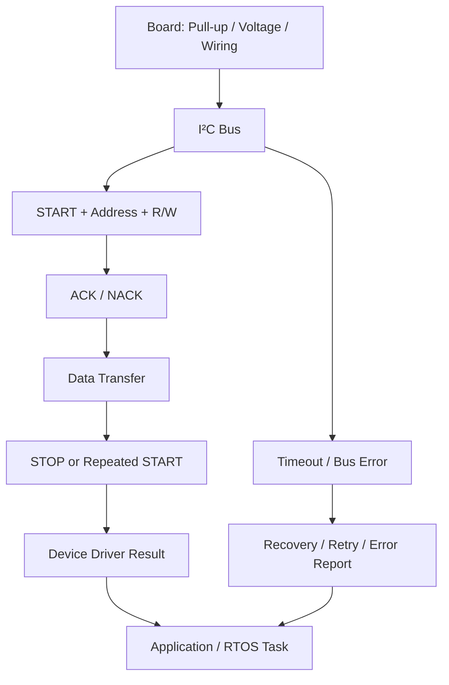

> **I²C의 핵심은 두 선의 전기적 공유 방식, 주소 기반 장치 선택, ACK/NACK, START/STOP, 그리고 장치별 프로토콜을 구분하는 것이다.** 실제 펌웨어에서는 여기에 Timeout·Bus Recovery·Task 간 트랜잭션 보호·비동기 Buffer 수명 관리가 더해진다.

## 다음 학습

**`05_Embedded/GPIO.md`** — 입력·출력 모드, Pull-up/Pull-down, Alternate Function, External Interrupt, Debounce, 전기적 제약과 저전력 Pin 상태.
