# GPIO

> **학습 위치:** `C_Cpp_Study/05_Embedded/GPIO.md`  
> **학습 범위:** GPIO의 전기적 의미, 레지스터, 입력·출력, 외부 인터럽트, 저전력 및 드라이버 설계  
> **연결 문서:** `Register.md`, `Interrupt.md`, `Timer.md`, `Low_Power.md`, `I2C.md`, `SPI.md`  
> **방식:** 개념 정리 전용 — 실습·퀴즈 제외

---

## 1. GPIO란?

**GPIO(General-Purpose Input/Output)**는 MCU의 핀을 소프트웨어가 일반적인 디지털 입력 또는 출력으로 활용하는 기능이다. 핀은 설정에 따라 스위치 상태를 읽거나 LED를 구동할 수 있고, 일부 핀은 UART·SPI·I²C·Timer 등의 **대체 기능(Alternate Function)**을 수행한다.


GPIO의 핵심은 **레지스터에 쓰는 논리값과 실제 핀의 전압·전류가 서로 다른 층위**라는 점이다.

## 2. GPIO를 이해하는 네 가지 층위

| 층위 | 핵심 질문 |
|---|---|
| 논리 | 0과 1을 어떻게 읽고 쓰는가? |
| 레지스터 | 모드·출력값·입력값·Pull-up을 어디에 설정하는가? |
| 전기 | 전압 임계값, 구동 전류, 누설 전류는 얼마인가? |
| 시스템 | Interrupt, 저전력, 공유 핀, 외부 회로와 어떻게 연결되는가? |

GPIO는 C 코드만으로 안전성을 판단할 수 없다. **MCU Datasheet, Reference Manual, Board Schematic**을 함께 확인해야 한다.

---

## 3. Pin, Port, GPIO Controller

여러 GPIO 핀은 일반적으로 Port로 묶인다. `PA0`, `PA1`, `PB3`처럼 표기되기도 하지만 이름과 구성은 MCU마다 다르다.

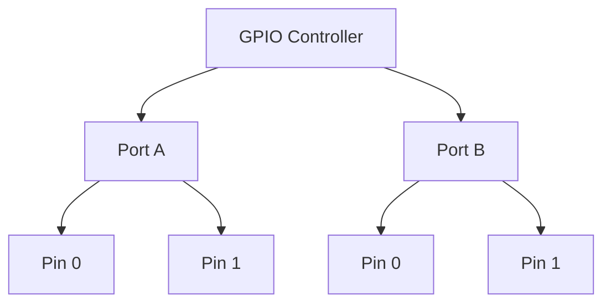

Port 단위 Register를 사용하는 MCU에서는 **하나의 Register에 여러 Pin의 Bit 또는 Field가 배치**될 수 있다. 한 핀을 변경할 때 같은 Port의 다른 핀 설정을 보존해야 하는 이유다.

## 4. GPIO의 대표 동작 모드

| 모드 | 의미 | 대표 용도 |
|---|---|---|
| Input | 외부 논리 상태를 읽음 | 버튼, 상태 신호 |
| Output | MCU가 핀의 논리 상태를 구동 | LED, Enable 신호 |
| Alternate Function | 주변장치가 핀을 제어 | UART TX, SPI SCLK, Timer PWM |
| Analog | 아날로그 입력·출력 경로에 연결 | ADC 입력, DAC 출력 |

지원 모드와 설정 이름은 MCU마다 다르다. **Analog 모드가 항상 모든 디지털 회로를 동일한 방식으로 끈다는 보장은 없다.**

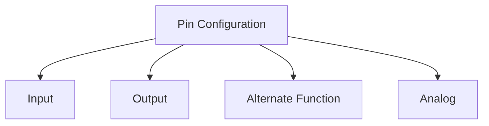

---

## 5. Input Mode: 외부 신호 읽기

Input에서는 MCU의 입력 회로가 핀 전압을 디지털 값으로 해석한다.

```text
External Voltage → Input Buffer → Input Data Register → Firmware
```

입력값은 **핀 전압에 대한 디지털 해석**이지 외부 장치가 보낸 의미 자체는 아니다. 버튼이 눌렸는지 여부는 회로가 Active-High인지 Active-Low인지에 따라 달라진다.

### 5.1 논리 임계값

- `VIL`: Low로 인식되는 입력 전압 범위와 관련된 규격
- `VIH`: High로 인식되는 입력 전압 범위와 관련된 규격
- 두 규격 사이의 전압은 논리값을 확정해서 가정하면 안 된다.

정확한 수치는 MCU의 전원 전압, 핀 유형, 온도 등 조건에 따라 Datasheet에서 확인한다.

### 5.2 Floating Input

핀에 확실한 High/Low 경로가 없으면 **Floating** 상태가 될 수 있다. 이 경우 입력값이 불안정하거나 소비 전류가 증가할 수 있다.


Floating을 피하려면 외부 회로 또는 내부 Pull-up/Pull-down을 검토한다.

## 6. Pull-up과 Pull-down

Pull-up은 입력을 High 쪽으로, Pull-down은 Low 쪽으로 유도하는 저항성 경로다.

```text
Pull-up 예시

VDD
 |
[R]
 |
 +------ GPIO Input
 |
[Switch]
 |
GND
```

| 상태 | Pull-up + GND 연결 버튼 예시 |
|---|---|
| 버튼 열림 | High |
| 버튼 닫힘 | Low |

이 회로는 **Active-Low** 버튼이다. 내부 Pull 저항의 값과 정확도는 MCU마다 다르며, 노이즈·배선 길이·속도에 따라 외부 저항이 필요할 수 있다.

---

## 7. Output Mode: 핀 구동

Output에서는 MCU가 출력 회로를 통해 핀 전압을 구동한다.


출력값이 `1`이라는 사실만으로 핀이 반드시 이상적인 `VDD`에 도달하거나 무제한 전류를 공급할 수 있다는 뜻은 아니다. **출력 전압·최대 전류·전체 Port/Chip 전류 한계**를 확인해야 한다.

## 8. Push-Pull과 Open-Drain

### 8.1 Push-Pull

High와 Low를 능동적으로 구동하는 출력 방식이다.

```text
VDD
 |
[High-side driver]
 |
 +---- GPIO Pin
 |
[Low-side driver]
 |
GND
```

일반적인 LED 제어, 디지털 제어 신호 등에 쓰인다. 실제 회로 구성은 MCU마다 다르다.

### 8.2 Open-Drain

일반적으로 Low는 능동적으로 당길 수 있지만, High는 출력 드라이버가 해제된 상태이므로 **Pull-up 경로**가 필요하다.

```text
VDD
 |
[R Pull-up]
 |
 +---- GPIO Pin
 |
[Low-side driver]
 |
GND
```

| 항목 | Push-Pull | Open-Drain |
|---|---|---|
| High 구동 | 능동 구동 | Pull-up 등에 의존 |
| Low 구동 | 능동 구동 | 능동 구동 |
| 대표 활용 | 일반 디지털 출력 | I²C, 일부 공유 신호 |
| 주의점 | 출력끼리 충돌 가능 | 상승 시간·Pull-up 전류 |

**I²C의 SDA/SCL은 일반적으로 Open-Drain 성격과 Pull-up을 이용한다.** 다만 실제 핀 설정은 MCU의 I²C Alternate Function 규칙을 따른다.

## 9. Output Speed와 Slew Rate

일부 MCU는 GPIO의 출력 속도 또는 Slew Rate를 설정한다. 이는 보통 **전압 전환의 빠르기**와 관련되며, CPU 클록이나 소프트웨어가 GPIO를 토글하는 주파수를 직접 설정하는 기능과는 다르다.

| 빠른 에지 | 느린 에지 |
|---|---|
| 고속 신호에 유리할 수 있음 | EMI와 Ringing 완화에 유리할 수 있음 |
| EMI·Overshoot 증가 가능 | 고속 신호 타이밍에 불리할 수 있음 |

필요한 통신 속도와 PCB·배선 조건을 기준으로 설정한다.

---

## 10. GPIO 관련 Register

제조사마다 이름은 다르지만 다음 역할이 반복된다.

| Register 역할 | 의미 |
|---|---|
| Mode | Input / Output / Alternate / Analog 선택 |
|---|---|
| Output Type | Push-Pull / Open-Drain 선택 |
| Pull Configuration | Pull-up / Pull-down 설정 |
| Output Speed | 출력 전환 특성 설정 |
| Input Data | 핀 입력 상태 읽기 |
| Output Data | 출력 상태 설정·확인 |
| Set / Reset | 선택한 핀만 Set 또는 Reset |
| Alternate Function | 주변장치 기능 선택 |

Register 이름, 비트 배치, Reset Value는 **Reference Manual 기준**이다.

## 11. Input Data와 Output Data의 차이

`Input Data Register`는 보통 핀에서 관찰된 입력 상태와 관련되고, `Output Data Register`는 출력 제어를 위해 기록한 값과 관련된다.

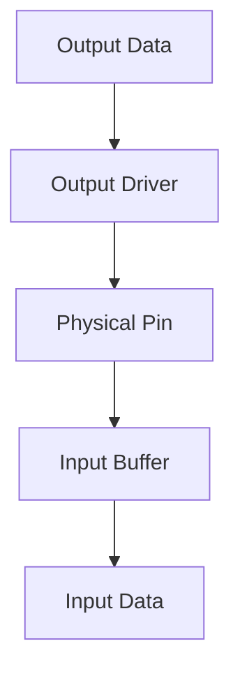

따라서 **출력 Register에 기록한 값과 실제 핀에서 읽은 값이 항상 같다고 가정하지 않는다.** 출력 모드, 부하, 외부 회로, MCU 내부 경로에 따라 달라질 수 있다.

## 12. GPIO Bit Mask

일반적인 비트 조작 개념:

```c
#include <stdint.h>

#define PIN_3_MASK (UINT32_C(1) << 3)

uint32_t output = UINT32_C(0);
output |= PIN_3_MASK;   /* Bit 3 set */
output &= ~PIN_3_MASK;  /* Bit 3 clear */
```

위 코드는 **일반 정수값의 비트 연산 예시**다. 실제 MMIO Register에 그대로 적용하기 전에 접근 규칙을 확인해야 한다.

## 13. Read-Modify-Write와 Set/Reset Register

```c
GPIO_OUTPUT |= PIN_3_MASK;
```

이런 형태는 개념적으로 **읽기 → 수정 → 쓰기**를 수행한다. 같은 Port를 ISR·다른 Core·다른 코드 경로가 변경하면 경쟁 조건이 생길 수 있다.

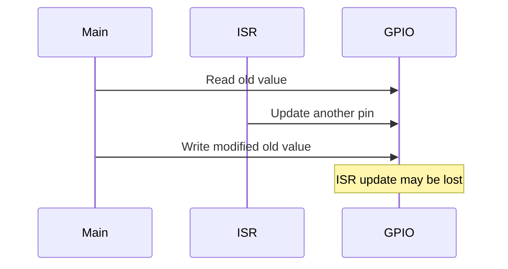

일부 MCU는 별도의 Set/Reset Register를 제공한다. 해당 Register가 보장하는 범위 안에서 **다른 핀을 건드리지 않고 선택한 핀을 변경**하는 데 유리하다.

> Set/Reset Register가 있다고 해서 모든 다중 코어·ISR 동기화 문제가 자동 해결되는 것은 아니다.

---

## 14. Alternate Function과 Pin Multiplexing

한 물리 핀이 GPIO와 여러 주변장치 기능을 공유할 수 있다.

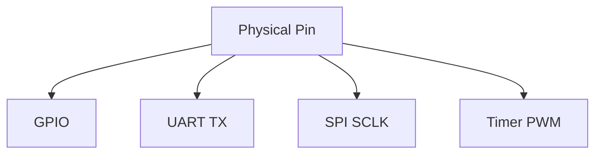

특정 핀에서 지원하는 기능 조합은 고정되어 있다. **모든 핀이 모든 주변장치 기능을 지원하는 것은 아니다.**

확인할 사항:

- 해당 MCU Package에서 핀이 실제로 노출되는가?
- 원하는 Peripheral Signal을 해당 핀으로 Routing할 수 있는가?
- 다른 기능 또는 디버그 핀과 충돌하지 않는가?
- 출력 유형·Pull 설정·속도 요구사항이 맞는가?

## 15. GPIO와 UART·SPI·I²C·Timer

| 주변장치 | GPIO 관점의 연결 |
|---|---|
| UART | TX/RX 핀의 Alternate Function |
| SPI | SCLK/MOSI/MISO 및 경우에 따라 GPIO CS |
| I²C | SDA/SCL Alternate Function과 Pull-up |
| Timer | PWM 출력·Input Capture 핀 |
| ADC | Analog Input 경로 |

Peripheral Register 설정과 Pin Multiplexing 설정이 모두 맞아야 원하는 신호가 실제 핀에 나타날 수 있다.

---

## 16. GPIO External Interrupt

입력 핀의 변화로 Interrupt를 발생시킬 수 있다. MCU에 따라 GPIO 자체 또는 EXTI 같은 별도 컨트롤러가 이벤트를 처리한다.

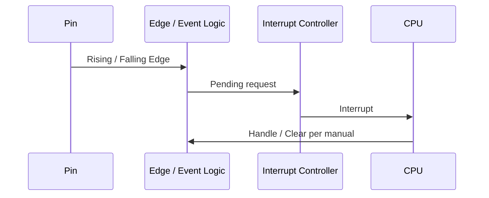

대표 Trigger:

| Trigger | 의미 |
|---|---|
| Rising Edge | Low → High |
| Falling Edge | High → Low |
| Both Edges | 양방향 변화 |
| Level | 특정 High/Low 상태; 지원 여부는 MCU별 확인 |

**Pending Flag를 지우는 방법은 장치별로 다르다.** W1C Register에 일반 RMW를 적용하면 다른 Flag까지 지워질 수 있다.

## 17. 버튼과 Debouncing

기계식 버튼 접점은 한 번 눌러도 짧은 시간 동안 여러 번 연결·해제될 수 있다.

```text
이상적 입력:  ______████████████
실제 접점:    ____█_██_█_████████
```

이 현상을 **Bounce**라고 한다. 단순한 Rising/Falling Edge Interrupt만 사용하면 한 번의 조작이 여러 이벤트로 관찰될 수 있다.

대표적인 Debouncing 방식:

| 방식 | 개념 | 고려사항 |
|---|---|---|
| RC·Schmitt Trigger | 전기적 신호 안정화 | 부품·전압 임계값 |
| 주기적 Sampling | 일정 기간 안정된 상태 확인 | Sampling 주기·응답 지연 |
| Interrupt + Timer | Edge 감지 후 일정 시간 뒤 재확인 | ISR와 Timer의 역할 분리 |

**Debouncing 시간은 모든 버튼에 통용되는 고정값이 아니다.** 부품 특성·사용자 경험·시스템 응답 요구사항에 따라 결정한다.

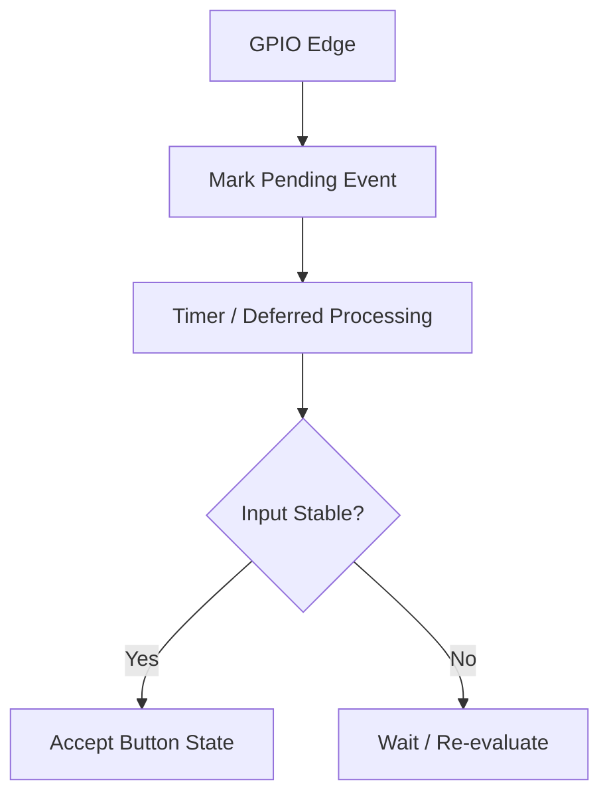

## 18. ISR에서 처리할 일

GPIO ISR에서는 보통 다음을 간결하게 처리한다.

- 어떤 핀·이벤트가 발생했는지 식별
- Hardware 문서에 따른 Pending Flag 처리
- 필요한 최소 정보 기록 또는 RTOS Task 알림

Debouncing, 긴 연산, Blocking I/O, 복잡한 상태 처리는 Main Loop 또는 Task로 넘기는 구조를 검토한다.

---

## 19. Active-High와 Active-Low

같은 논리 동작도 회로 연결에 따라 핀 값이 반대일 수 있다.

| 의미 | Active-High 예시 | Active-Low 예시 |
|---|---|---|
| 기능 활성 | `1` | `0` |
| 기능 비활성 | `0` | `1` |

LED가 `0`일 때 켜지는 회로도 흔하다. 따라서 Application에서 `LED_ON`이라는 의미를 사용하더라도 Driver가 실제 핀 극성을 처리하도록 분리하는 편이 유지보수에 유리하다.

## 20. GPIO 초기화 순서와 Glitch

Output 핀의 모드를 변경할 때 의도하지 않은 짧은 펄스가 발생하면 외부 회로가 잘못 동작할 수 있다.

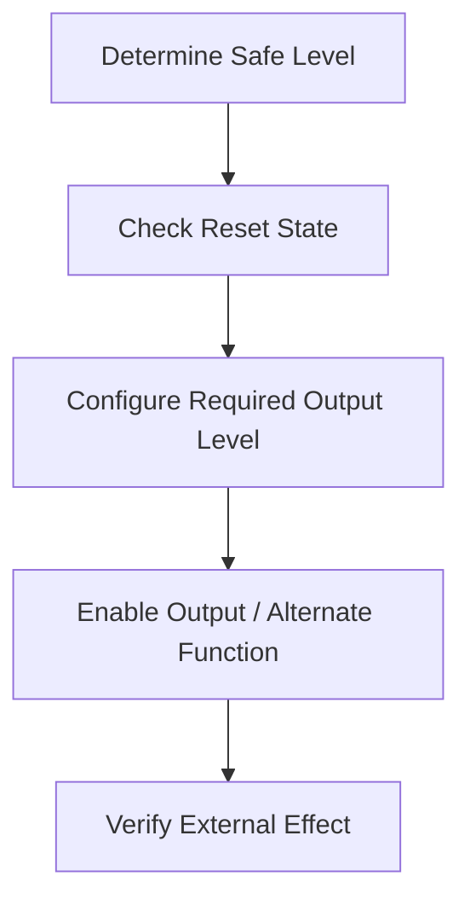

이 그림은 **설계 검토 관점의 일반적인 흐름**이다. 실제로 출력값 설정과 모드 변경 중 무엇을 먼저 해야 Glitch가 없는지는 MCU와 외부 회로에 따라 달라진다.

특히 다음 핀은 초기 상태가 중요하다.

- Motor Enable
- Power Switch Enable
- Chip Select
- Reset Line
- Safety Interlock

---

## 21. GPIO와 저전력

GPIO의 전기적 상태는 Sleep/Deep Sleep 전류에 영향을 줄 수 있다.

| 원인 | 영향 |
|---|---|
| Floating Input | 불안정한 전압·추가 소비 전류 가능 |
| 외부 Pull과 내부 Pull 충돌 | 지속적인 전류 경로 발생 가능 |
| 외부 장치와 출력 충돌 | 과전류·발열 위험 |
| 미사용 Peripheral 활성 | 불필요한 소비 전력 |
| Wake-up Pin 설정 오류 | 복귀 실패 또는 반복 Wake-up |

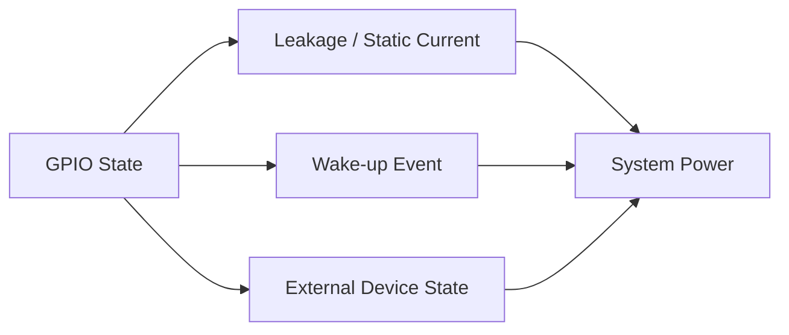

미사용 핀의 권장 설정은 MCU별로 다르다. **모든 미사용 핀을 무조건 Input Floating 또는 Analog로 설정한다는 식의 규칙은 피한다.**

## 22. GPIO Wake-up Source

일부 MCU는 특정 GPIO 핀을 저전력 모드의 Wake-up Source로 사용할 수 있다.

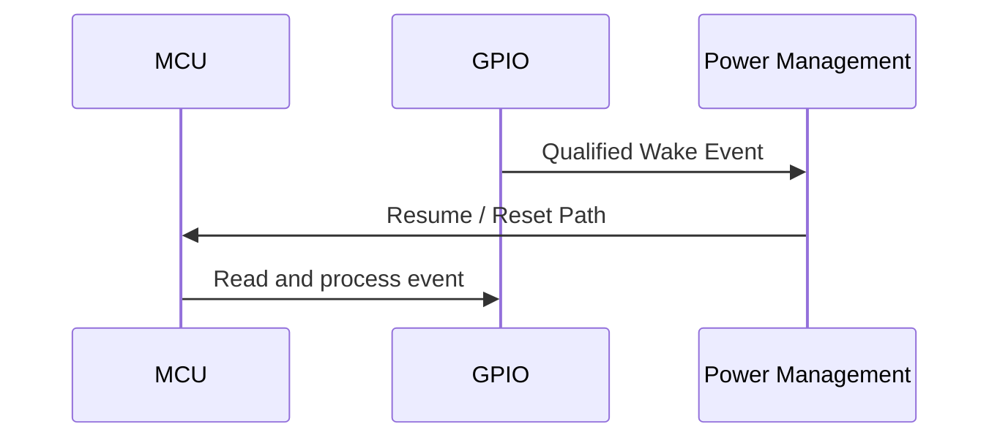

Sleep에서 복귀하는지 Reset부터 재시작하는지는 저전력 모드와 MCU에 따라 다르다. Wake-up Pin의 극성·Edge/Level·Pending Flag 처리도 확인한다.

---

## 23. 전압 도메인과 5V Tolerance

GPIO가 어느 전압을 안전하게 받아들일 수 있는지는 핀별 규격에 달려 있다.

- MCU 전원이 3.3V라고 해서 모든 핀이 5V 입력을 견디는 것은 아니다.
- 일부 핀의 5V Tolerance는 특정 모드나 전원 조건에서 제한될 수 있다.
- 전원이 꺼진 MCU 핀에 외부 전압이 들어오면 역전원(Back-powering) 문제가 발생할 수 있다.
- Absolute Maximum Rating은 정상 동작 권장 조건과 다르다.

**전압 호환성은 Datasheet의 해당 핀 규격과 외부 회로를 기준으로 판단한다.**

## 24. GPIO의 전류 구동 능력

GPIO 핀은 전원 공급 장치가 아니다. LED·Relay·Motor·Buzzer 등 부하를 직접 연결할 때는 다음을 확인한다.

| 항목 | 의미 |
|---|---|
| Source Current | 핀에서 부하로 공급하는 전류 |
| Sink Current | 부하에서 핀으로 흘러 들어오는 전류 |
| Pin Limit | 핀별 허용 전류 |
| Port/Chip Limit | 전체 Port 또는 Chip의 전류 제약 |
| Output Voltage | 부하 전류 조건에서 실제 High/Low 전압 |

전류가 큰 부하는 Transistor/MOSFET/Driver IC를 통해 제어할 수 있다. 유도성 부하에는 적절한 보호 회로가 필요하다.

## 25. 보호·노이즈·외부 회로

GPIO의 신뢰성은 Firmware뿐 아니라 PCB와 회로 설계에도 의존한다.

- ESD 및 과전압 보호
- 입력 노이즈와 임계값
- 긴 배선의 Ringing·EMI
- 접지 기준 차이
- Pull-up/Pull-down 값
- 신호의 Rise/Fall Time

Schmitt Trigger 입력이 지원되는지, 어떤 핀에 적용되는지도 Datasheet를 확인한다.

---

## 26. GPIO Driver 설계 관점

Application에서 직접 `PORT`, `PIN`, `MASK`, `ACTIVE_LOW`를 관리하기보다 **의미 기반 API**로 감싸면 회로 변경의 영향을 줄일 수 있다.

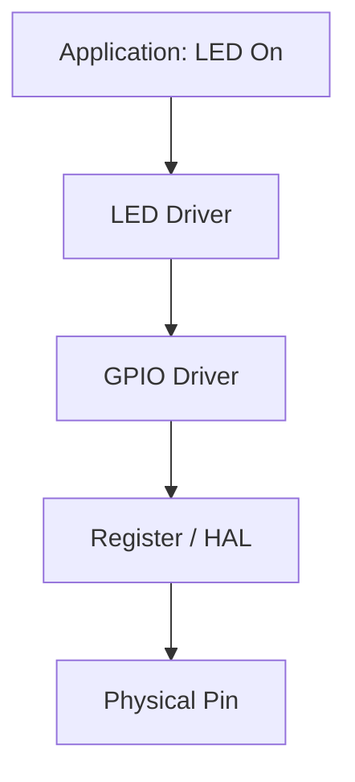

| 계층 | 책임 |
|---|---|
| Application | LED 켜기, 버튼 이벤트 처리 등 의미 |
| Device Driver | Active-Low, Debouncing, 장치 상태 |
| GPIO Driver/HAL | Pin Mode, Read/Write, Alternate Function |
| Register | MCU별 주소·Bit·접근 규칙 |

GPIO 드라이버가 모든 핀을 자유롭게 설정할 수 있게 만들더라도 **핀의 소유권과 사용 목적**은 시스템 차원에서 관리해야 한다.

## 27. RTOS에서의 GPIO 공유

여러 Task가 동일 핀을 변경하면 최종 상태가 실행 순서에 따라 달라질 수 있다. 같은 Port Register의 RMW도 주의해야 한다.

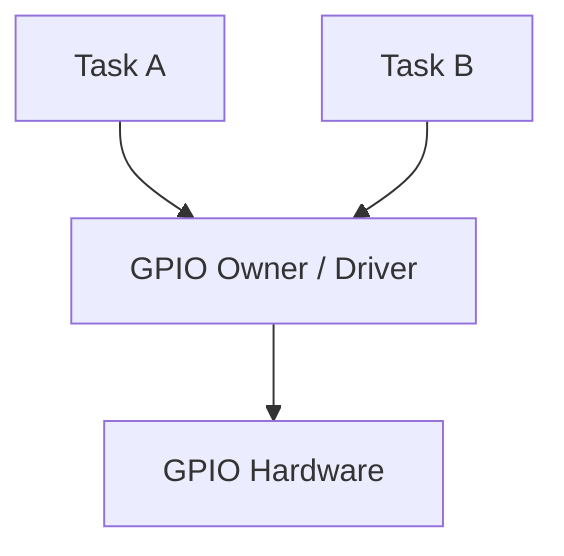

대응 방법은 사용 패턴에 따라 다르다.

- 특정 Task가 핀 상태를 전담
- Driver 내부에서 공유 접근 정책 관리
- 필요한 범위에 Mutex/Critical Section 적용
- MCU의 전용 Set/Reset Register 활용

**`volatile`은 Task 간 동기화 수단이 아니다.** ISR에서 접근하는 GPIO 관련 공유 변수에도 Atomicity와 순서 문제가 별도로 존재한다.

---

## 28. GPIO와 FSM

버튼·센서 입력은 FSM의 Event가 될 수 있고, LED·Enable 출력은 상태의 Action이 될 수 있다.

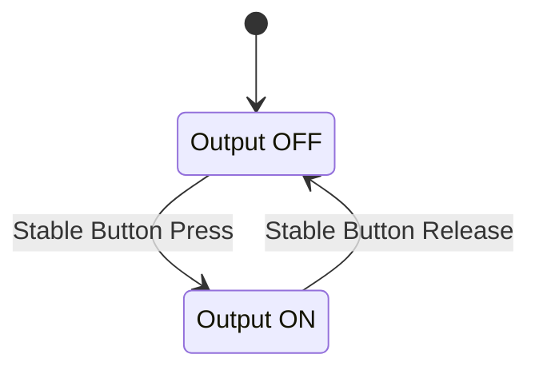

핵심 분리:

```text
Raw GPIO Level
    ↓
Debouncing / Input Interpretation
    ↓
Semantic Event
    ↓
FSM Transition
    ↓
Output Action
    ↓
GPIO Driver
```

FSM이 Register Bit의 의미까지 알아야 하는 구조는 피하는 편이 좋다.

## 29. GPIO와 Timer

GPIO 토글을 소프트웨어 지연 루프로 구현하면 CPU 부하, Interrupt, 최적화에 따라 타이밍이 달라질 수 있다.

| 목적 | 검토할 방식 |
|---|---|
| 느린 상태 표시 | Task/Timer 기반 GPIO 변경 |
| 정밀한 주기 신호 | Timer Output Compare |
| PWM | Timer PWM Alternate Function |
| 입력 펄스 폭 측정 | Timer Input Capture |
| 버튼 Debouncing | Timer 기반 안정화 |

정밀한 타이밍은 일반 GPIO 반복 쓰기보다 **전용 Timer Peripheral**이 적합한 경우가 많다.

---

## 30. 자주 혼동하는 개념

| 혼동 | 구분 |
|---|---|
| Output Register = 실제 핀 전압 | 출력 설정값과 실제 핀 상태는 다를 수 있음 |
| `1` = 장치 ON | Active-Low 회로에서는 반대일 수 있음 |
| Open-Drain의 High = 능동 구동 | 일반적으로 Pull-up 등에 의해 High 형성 |
| 내부 Pull-up = 강한 출력 | Pull-up은 저항성 바이어스 경로 |
| GPIO Interrupt = 버튼 한 번 | Bounce로 여러 Interrupt 발생 가능 |
| `volatile` = 원자적 GPIO 수정 | Atomicity와 동기화는 별도 문제 |
| 모든 핀 = 모든 Alternate Function | Pin Multiplexing 제약 존재 |
| Output Speed = 토글 주파수 | 주로 출력 에지 특성과 관련 |
| 3.3V MCU = 5V 입력 가능 | 핀별 Datasheet 확인 필요 |
| GPIO Reset Value = 안전한 외부 상태 | Boot/Reset 구간의 회로 동작까지 확인 필요 |

---

## 31. 핵심 개념 체크리스트

- GPIO는 논리값뿐 아니라 전압·전류·외부 회로를 함께 다룬다.
- Input/Output/Alternate/Analog Mode의 역할을 구분한다.
- Pull-up/Pull-down과 Floating Input의 관계를 이해한다.
- Push-Pull과 Open-Drain의 High 구동 방식 차이를 이해한다.
- Input Data와 Output Data의 의미를 구분한다.
- RMW와 Set/Reset Register의 차이를 이해한다.
- GPIO Edge Interrupt와 Debouncing을 별개로 본다.
- Active-High/Active-Low를 회로 기준으로 판단한다.
- Sleep/Wake-up 시 핀 상태와 외부 회로 전류를 검토한다.
- Pin Multiplexing과 전압·전류 규격을 Datasheet로 확인한다.
- Application 의미와 MCU별 Register 제어를 Driver로 분리한다.

## 32. 전체 구조 요약

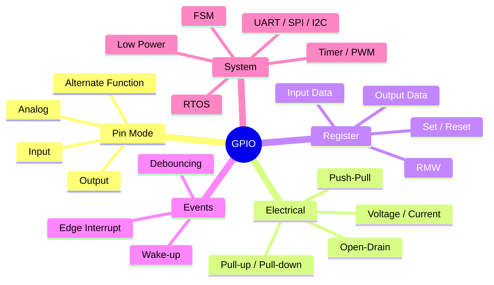

> **GPIO는 MCU 내부의 Register 설정을 외부 세계의 실제 전기 신호와 연결하는 경계다.** GPIO 코드를 이해할 때는 반드시 핀의 물리적 동작과 보드 회로까지 함께 고려한다.

---

## 다음 학습

**다음 문서:** `05_Embedded/Clock_System.md`

GPIO·UART·SPI·Timer·ADC의 동작 속도와 전력 소모를 결정하는 **Clock Source, PLL, Clock Tree, Prescaler, Clock Gating**을 개념 중심으로 정리한다.
