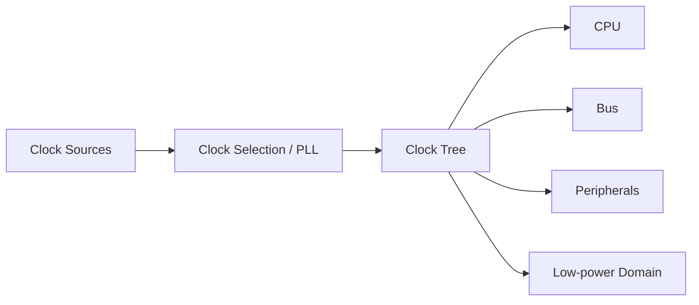
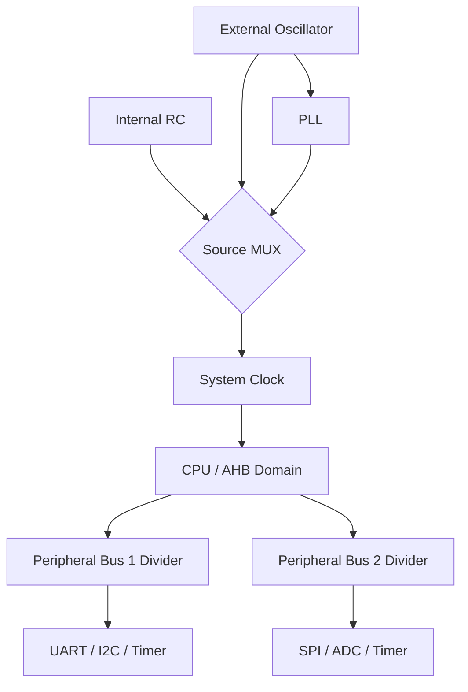
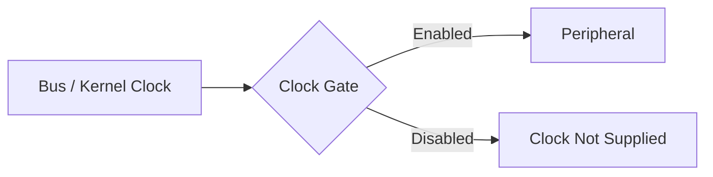
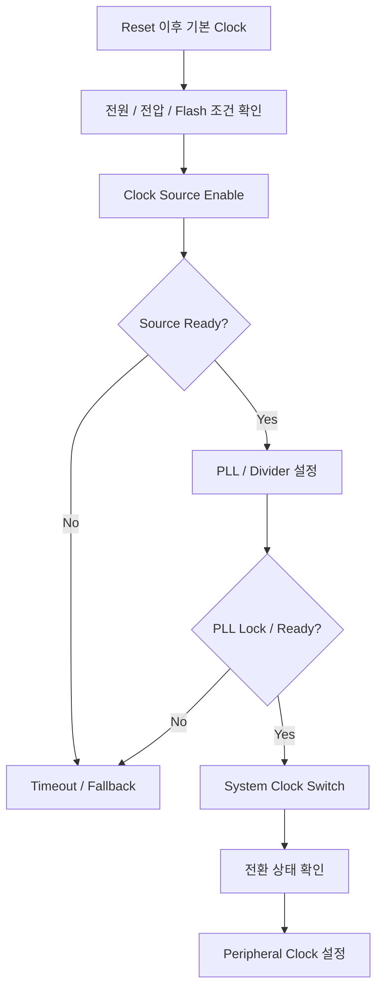
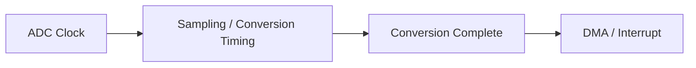
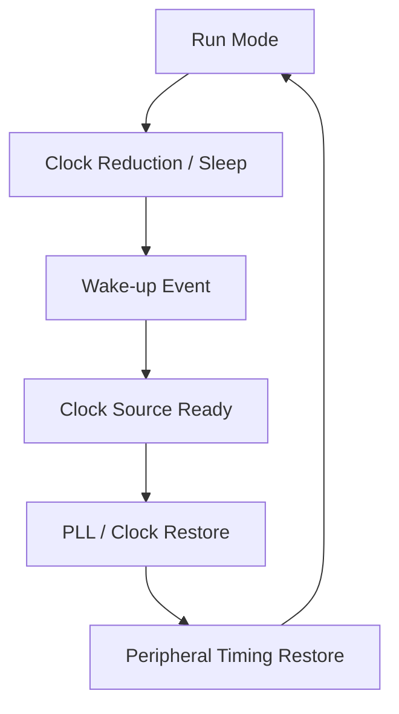
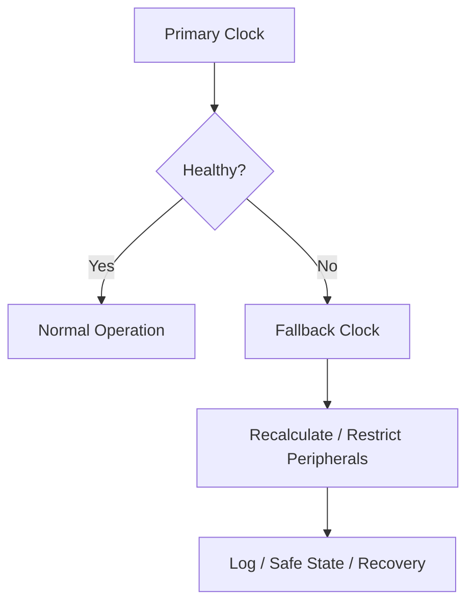
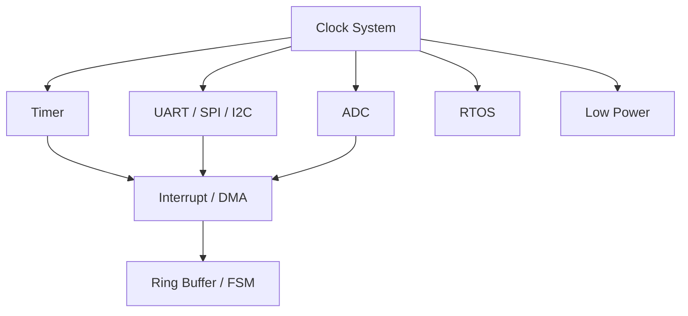

# Clock System

> **학습 위치:** `C_Cpp_Study/05_Embedded/Clock_System.md`  
> **핵심 연결:** `Oscillator → PLL → Clock Tree → CPU / Bus / Peripheral → Timer / UART / ADC / Low Power`  
> **범위:** 임베디드 MCU의 클록 시스템 개념. 특정 MCU의 레지스터 값이나 설정 절차는 해당 Reference Manual을 따른다. 실습·퀴즈는 포함하지 않는다.

---

## 1. Clock System이란?

**Clock System은 MCU 내부의 CPU, 버스, 주변장치가 동작할 시간 기준을 생성·선택·분배하는 구조**다. Clock은 일반적으로 주기적인 신호이며, Frequency는 1초 동안의 주기 수를 뜻한다.



클록을 높이면 항상 전체 Firmware가 같은 비율로 빨라지는 것은 아니다. Flash 대기 시간, Bus 분주, 주변장치 제한, 메모리 접근, 전력·발열이 함께 영향을 준다.

## 2. Frequency와 Period

| 항목 | 의미 | 관계 |
|---|---|---|
| Frequency `f` | 초당 주기 수 | 단위 Hz |
| Period `T` | 한 주기의 시간 | `T = 1 / f` |
| MHz | 초당 백만 주기 | `1 MHz = 10^6 Hz` |

예를 들어 1 MHz의 주기는 1 µs다. 다만 **CPU 명령 하나가 항상 한 Clock Cycle에 실행되는 것은 아니다.** 명령, Pipeline, Memory Wait State 등에 따라 다르다.

## 3. 주요 Clock Source

| Source | 특징 | 주로 고려할 점 |
|---|---|---|
| 내부 RC Oscillator | 외부 부품 없이 사용 가능 | 주파수 오차·온도·전압 의존성 |
| 외부 Crystal Oscillator | 안정적인 기준 주파수에 활용 | 기동 시간·회로·비용 |
| 외부 Clock Input | 외부 회로가 클록 공급 | 입력 규격·외부 의존성 |
| 저속 내부 RC | 저전력 시간 기준 등에 활용 | 정확도·보정 필요성 |
| 저속 Crystal | RTC 시간 기준 등에 활용 | 기동 시간·부품·전력 |

`HSI`, `HSE`, `LSI`, `LSE` 같은 이름은 일부 MCU 계열의 명명법이다. 모든 MCU가 동일한 이름이나 구성을 제공하지 않는다.

## 4. 내부 RC와 외부 Crystal의 차이

내부 RC는 부품 수와 초기 구성을 줄이는 데 유리하지만, 주파수 정확도가 환경과 보정 상태에 영향을 받을 수 있다. Crystal은 정밀한 시간 기준이 필요한 시스템에서 고려하지만 기동 대기와 외부 회로 조건이 중요하다.

**UART Baud Rate, USB, 정밀 Timer, RTC** 등은 각 기능이 요구하는 클록 정확도를 별도로 확인해야 한다. 외부 Crystal을 쓴다는 사실만으로 모든 Peripheral의 정확도가 보장되지는 않는다.

## 5. PLL(Phase-Locked Loop)

PLL은 기준 Clock을 바탕으로 다른 주파수의 Clock을 생성하는 회로다. MCU에 따라 입력 분주, 배수, 출력 분주가 조합된다.


개념적으로 다음과 같이 나타낼 수 있다.

```text
PLL output ≈ Reference × Multiplier / Divider(s)
```

실제 허용 입력 범위, VCO 범위, 출력 범위, 설정 순서는 MCU마다 다르다. **PLL Enable 직후에는 Lock 상태 확인이 필요할 수 있다.**

## 6. Clock Tree

Clock Tree는 Clock Source와 PLL 출력이 CPU·Bus·Peripheral로 전달되는 분기 구조다.



이 그림은 **일반적인 개념도**이며 특정 MCU의 실제 Bus 구조를 뜻하지 않는다. 일부 Peripheral은 별도의 Kernel Clock을 선택할 수 있다.

## 7. System Clock, CPU Clock, Bus Clock

| 구분 | 의미 |
|---|---|
| System Clock | 주요 시스템 도메인의 기준 Clock |
| CPU/Core Clock | CPU가 사용하는 Clock |
| Bus Clock | 메모리·주변장치 접근 경로의 Clock |
| Peripheral/Kernel Clock | 특정 주변장치의 동작 기준 Clock |

이 네 주파수는 **같을 수도, 다를 수도 있다.** Peripheral Register에 접근할 수 있는 Bus Clock과 Peripheral의 실제 기능을 구동하는 Clock이 분리된 MCU도 있다.

## 8. Clock Divider와 Prescaler

Divider/Prescaler는 상위 Clock을 나누어 하위 Clock을 만든다.

```text
Output Frequency = Input Frequency / Divider
```

예를 들어 입력 80 MHz를 4로 분주하면 출력은 20 MHz다. 실제 분주 선택지는 하드웨어가 허용하는 값으로 제한된다.

## 9. Peripheral Clock Enable과 Clock Gating

많은 MCU는 Peripheral별 Clock 공급을 켜거나 끌 수 있다. 이를 Clock Gating이라고 한다.



Clock이 비활성화된 Peripheral의 Register 접근 결과, 상태 보존 여부, Reset과의 관계는 MCU 문서를 확인한다. **Clock Enable은 Peripheral 초기화 순서의 핵심 조건**이지만, Clock을 켰다는 것만으로 Peripheral의 모든 기능이 준비되었다는 뜻은 아니다.

## 10. Reset과 Clock은 별개

| 동작 | 일반적 의미 |
|---|---|
| Clock Disable | Clock 공급 차단 또는 제한 |
| Peripheral Reset | 해당 Peripheral을 초기 상태로 복귀 |
| System Reset | 지정된 시스템 영역 초기화 |

Clock Disable이 Register를 초기화한다고 가정하면 안 된다. Reset Domain과 Clock Domain은 별도로 정의될 수 있다.

## 11. Clock 초기화의 개념적 순서



위 순서는 개념적인 예다. 실제로는 Flash Wait State와 전압 스케일 변경의 **선후 관계가 주파수를 높일 때와 낮출 때 다를 수 있으므로** 제조사 권장 순서를 따라야 한다.

## 12. Flash Wait State

CPU Clock이 빨라져도 Flash Memory의 접근 시간이 무조건 같은 비율로 짧아지지는 않는다. 고주파 동작에서 Flash Read에 추가 대기 주기(Wait State)가 필요할 수 있다.

```text
CPU Frequency ↑
→ Flash Access Timing 검토
→ 필요 시 Wait State 조정
```

허용 Frequency는 전압·온도·Flash 설정 등과 연결된다. 잘못된 조합은 불안정한 실행으로 이어질 수 있다.

## 13. Voltage Scaling과 전력

MCU에 따라 고주파 동작에는 특정 전압 또는 내부 Regulator 설정이 필요하다. 동적 전력은 개념적으로 다음 요인에 영향을 받는다.

```text
Dynamic Power ∝ Switching Activity × Capacitance × Voltage² × Frequency
```

이 식은 정성적 관계를 보여 주는 단순 모델이다. 실제 소비 전력에는 누설 전류, Peripheral, Sleep Mode, 외부 회로 등이 추가된다.

## 14. Clock 정확도와 오차

Clock 정확도는 명목 Frequency와 실제 Frequency의 차이로 표현할 수 있다.

```text
Relative Error = (Actual − Nominal) / Nominal
```

오차 원인에는 Oscillator 허용 오차, 온도, 전압, 노화, 보정 상태 등이 있다. **주파수 오차와 Jitter는 다른 개념**이다. 오차는 평균적인 주파수 차이, Jitter는 시간상 변동을 가리킨다.

## 15. UART와 Clock

UART Baud Rate는 Peripheral Clock과 Divider 설정에 의존한다.


Clock Source를 변경하면 기존 Baud Rate 설정이 더 이상 의도한 통신 속도를 만들지 못할 수 있다. 송수신 중 Clock 변경은 Frame 오류로 이어질 수 있으므로 전환 시점을 관리한다.

## 16. Timer와 Clock

Timer Counter의 증가 속도는 Timer 입력 Clock과 Prescaler에 의해 결정된다.

```text
Timer Tick Frequency = Timer Input Clock / Timer Prescaler Factor
```

일부 MCU는 Peripheral Bus Divider에 따라 Timer Clock에 별도 배수 규칙을 적용한다. 따라서 **Bus Clock = Timer Clock**이라고 일괄 가정하지 않는다.

Clock 변경 시 PWM 주파수, Timeout, Input Capture의 시간 해상도도 함께 바뀔 수 있다.

## 17. ADC와 Clock

ADC는 변환 회로에 필요한 Clock을 사용한다. Clock이 빨라지면 변환 시간에 영향을 줄 수 있지만, ADC가 허용하는 주파수 범위와 Sampling Time을 지켜야 한다.



Sampling Time과 전체 변환 시간은 같은 개념이 아니다. 입력 임피던스, 정밀도, 다중 채널 구성도 함께 고려한다.

## 18. SPI와 I²C의 Clock

- **SPI:** Controller의 Peripheral Clock을 분주해 SCLK를 생성하는 구성이 흔하다. 상대 Device의 최대 속도와 Signal Integrity를 확인한다.
- **I²C:** SCL 타이밍은 Peripheral Clock뿐 아니라 Rise/Fall Time, Pull-up, Bus Capacitance, Clock Stretching과 연결된다.

Clock 설정은 단순한 수치 선택이 아니라 **통신 상대와 전기적 조건을 만족시키는 작업**이다.

## 19. SysTick과 RTOS Tick

RTOS가 주기적 Tick을 사용하는 경우 Tick Timer의 입력 Clock이 변경되면 Tick 주기에도 영향이 있을 수 있다.


RTOS 구현에 따라 Tickless Idle, 별도 저속 Timer, Clock 변경 대응 방식이 다르다. `delay(1)`이 언제나 정확히 1 ms의 물리적 지연을 의미한다고 가정하지 않는다.

## 20. Clock과 Low Power

저전력 모드에서는 일부 Clock Domain을 중지하거나 저속 Clock으로 전환할 수 있다.

| 고려 요소 | 확인 질문 |
|---|---|
| Wake-up Source | 어떤 Clock Domain에서 동작하는가? |
| RTC | Sleep 중에도 시간 기준이 유지되는가? |
| UART | Sleep 중 수신·Wake-up이 가능한가? |
| Timer | 저전력 모드에서 Counter가 진행되는가? |
| DMA | 관련 Bus·Peripheral Clock이 유지되는가? |
| Wake-up Latency | Oscillator/PLL 재기동이 필요한가? |



## 21. Clock Failure와 Fallback

외부 Oscillator 또는 PLL이 정상적으로 동작하지 않으면 일부 MCU는 Clock Failure 감지와 대체 Clock 전환 기능을 제공한다.



Fallback 후에는 CPU뿐 아니라 UART, Timer, USB 등 **정확한 Frequency에 의존하는 기능**을 다시 평가해야 한다. 자동 Fallback 지원 여부는 MCU별로 다르다.

## 22. Clock 전환과 동시성

Runtime Clock 변경은 여러 모듈에 동시에 영향을 준다.

```text
Clock Manager
├── CPU / Flash / Voltage
├── UART / SPI / I²C
├── Timer / PWM
├── ADC / DMA
└── RTOS Time Base
```

통신·DMA·Timer가 동작 중일 때 변경하면 각 Driver가 가정한 타이밍이 달라질 수 있다. Clock 변경을 하나의 중앙 정책으로 관리하고, 영향을 받는 Driver와의 전환 순서를 정의하는 설계를 고려한다.

## 23. `SystemCoreClock`의 의미와 한계

일부 CMSIS 기반 프로젝트에는 Core Clock Frequency를 나타내는 `SystemCoreClock` 변수가 있다. 이 값은 소프트웨어가 유지하는 **주파수 정보**이지 Clock Hardware 자체가 아니다.

Clock 설정을 바꾼 뒤 관련 갱신 절차를 누락하면 지연 함수나 주변 계산이 잘못될 수 있다. 또한 `SystemCoreClock` 값만으로 모든 Peripheral Clock을 알 수 있는 것은 아니다.

## 24. 흔한 오해

| 오해 | 실제로 확인할 점 |
|---|---|
| CPU Clock을 높이면 모든 Peripheral이 빨라진다 | 각 Clock Domain과 Divider가 다를 수 있음 |
| Clock Enable은 Peripheral Reset이다 | Clock Gate와 Reset은 별도 기능 |
| PLL을 켜면 바로 사용 가능하다 | Ready/Lock 및 전환 상태 확인 |
| `volatile`이 Clock 변경 순서를 보장한다 | Hardware/Compiler/Bus 요구사항 별도 확인 |
| Timer Clock은 항상 Bus Clock이다 | MCU별 Timer Clock 규칙 확인 |
| Crystal을 쓰면 모든 통신이 정확하다 | 분주 오차와 Peripheral 요구조건 확인 |
| Sleep 중 Timer는 모두 멈춘다 | Low-power Clock Domain별로 다름 |
| Clock 변경 후 기존 Delay 설정은 그대로 유효하다 | Tick과 Divider 재계산 필요 가능 |

## 25. 문서에서 확인할 항목

| 자료 | 핵심 정보 |
|---|---|
| Datasheet | Frequency/Voltage/Temperature 허용 범위 |
| Reference Manual | Clock Tree, MUX, PLL, Divider, Clock Gate |
| Electrical Characteristics | Oscillator 및 Clock 정확도 조건 |
| Errata | Clock/PLL/Low-power 관련 알려진 제한 |
| Device Header / SDK | Register 정의와 Clock 설정 API |
| Board Schematic | Crystal, Load Capacitor, 외부 Clock 회로 |

## 26. 앞선 문서와의 연결



| 선행 문서 | Clock System과의 연결 |
|---|---|
| `Register.md` | Clock Source·Divider·Gate 설정과 Ready Flag |
| `Interrupt.md` | Clock Failure 및 Timer Interrupt |
| `UART.md` | Baud Rate 생성과 Clock 오차 |
| `Timer.md` | Tick, PWM, Capture, Timeout |
| `ADC.md` | Sampling/Conversion Timing |
| `DMA.md` | Peripheral·Bus Clock과 데이터 전송 |
| `RTOS.md` | Tick, Delay, Timeout과 동적 Clock 변경 |
| `Low_Power.md` | Clock Gating, Wake-up, 재기동 지연 |

## 27. 핵심 개념 체크리스트

- Clock Source, PLL, MUX, Divider, Clock Gate를 구분한다.
- System/Core/Bus/Peripheral Clock이 반드시 같지 않음을 이해한다.
- Clock Enable과 Peripheral Reset을 구분한다.
- PLL Lock, Flash Wait State, Voltage Scaling의 관련성을 이해한다.
- UART/Timer/ADC의 시간 기준이 Clock Tree에 의존함을 이해한다.
- Runtime Clock 변경 시 Driver와 RTOS Time Base의 재검토가 필요함을 이해한다.
- 저전력 모드에서 유지되는 Clock Domain과 Wake-up Latency를 확인한다.
- 실제 설정값은 대상 MCU의 Reference Manual·Datasheet·Errata에서 확인한다.

---

## 다음 학습

**다음 문서:** `05_Embedded/Memory_Map.md`  
Flash·SRAM·Peripheral 주소 공간, Linker Script, Section, Stack/Heap, Bootloader와의 연결을 정리한다.
