# Memory Map

> **학습 위치:** `C_Cpp_Study/05_Embedded/Memory_Map.md`  
> **핵심 연결:** `Data Type → Pointer → Linker → Memory Map → Startup → MMIO → Bootloader`  
> **범위:** 임베디드 메모리 주소 공간과 펌웨어 배치에 대한 개념 정리. 실습·퀴즈는 포함하지 않는다.

---

## 1. Memory Map이란?

**Memory Map(메모리 맵)**은 CPU가 사용하는 주소 공간에서 각 주소 범위가 어떤 메모리나 하드웨어 기능에 대응하는지를 나타낸다.

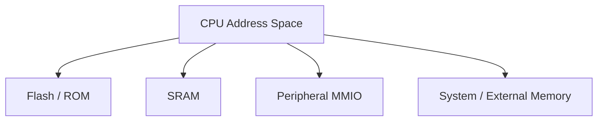

MCU의 실제 주소 범위는 제품마다 다르다. 이 문서의 모든 주소·크기 예시는 **가상 예시**이며 특정 MCU의 실제 Memory Map이 아니다.

메모리 맵은 두 층위로 이해하면 편하다.

| 층위 | 핵심 질문 | 대표 자료 |
|---|---|---|
| 하드웨어 Memory Map | 이 주소는 어떤 메모리·주변장치에 연결되는가? | Datasheet, Reference Manual |
| 펌웨어 Memory Layout | 코드와 변수는 어느 영역에 배치되는가? | Linker Script, Map File, ELF |

---

## 2. Address Space와 물리 메모리

CPU가 표현할 수 있는 주소 공간의 크기와 실제로 장착된 메모리 크기는 다르다. 예를 들어 32-bit 주소를 사용하는 CPU라도 전체 주소 공간에 RAM이나 Flash가 채워져 있는 것은 아니다.

```text
CPU address
   │
   ├── valid Flash range
   ├── unmapped / reserved range
   ├── valid SRAM range
   └── peripheral register range
```

존재하지 않거나 접근이 금지된 주소를 읽고 쓰면 아키텍처에 따라 Fault, Bus Error 또는 다른 정의된 하드웨어 반응이 발생할 수 있다. **임의의 정수 주소를 포인터로 바꿀 수 있다는 사실은 해당 주소에 접근해도 안전하다는 뜻이 아니다.**

---

## 3. 대표적인 MCU Memory Map

```text
낮은 주소
┌──────────────────────────────┐
│ Boot / Flash / ROM           │
├──────────────────────────────┤
│ Reserved or Other Regions    │
├──────────────────────────────┤
│ SRAM                         │
├──────────────────────────────┤
│ Peripheral Registers (MMIO)  │
├──────────────────────────────┤
│ System Control / Other       │
└──────────────────────────────┘
높은 주소
```

이는 개념도다. 실제 배치는 Cortex-M 제품군 내부에서도 MCU별로 다르며, 일부 MCU는 복수 SRAM Bank, TCM, 외부 메모리, 별도 비휘발성 메모리를 제공한다.

---

## 4. Flash, SRAM, ROM, EEPROM

| 메모리 | 전원 차단 후 데이터 | 일반적인 용도 | 고려사항 |
|---|---|---|---|
| Flash | 유지 | 펌웨어 이미지, 상수, 설정 | Erase 단위, Program 단위, 수명 |
| SRAM | 소실 | Stack, Heap, 런타임 변수 | 용량, Bank, DMA 접근성 |
| ROM | 유지 | 제조사 부트 코드 등 | 사용자가 수정할 수 없는 경우가 많음 |
| EEPROM | 유지 | 소량 설정 데이터 | 장치에 따라 별도 제공 또는 Flash로 에뮬레이션 |

**비휘발성 메모리라고 해서 일반 RAM처럼 자유롭게 바이트 단위로 덮어쓸 수 있는 것은 아니다.** Flash는 보통 Erase와 Program에 별도 제약이 있다.

---

## 5. Code와 Data의 논리적 구분

펌웨어를 구성하는 대표 영역은 다음과 같다.

| 영역 | 주된 내용 | 전형적인 실행 중 위치 |
|---|---|---|
| `.text` | 실행 코드 | Flash 또는 RAM |
| `.rodata` | 읽기 전용 상수 데이터 | Flash 등 |
| `.data` | 초기값이 있는 변경 가능한 전역·정적 객체 | SRAM |
| `.bss` | 0으로 초기화되는 전역·정적 객체 | SRAM |
| Stack | 함수 호출과 자동 저장 기간 객체 등 | SRAM |
| Heap | 동적 할당 영역 | SRAM 또는 별도 할당 메모리 |

> 섹션 이름과 배치는 툴체인·Linker Script·프로젝트에 따라 달라진다. C/C++ 언어 표준이 `.text`, `.data`, `.bss`라는 섹션 이름을 요구하는 것은 아니다.

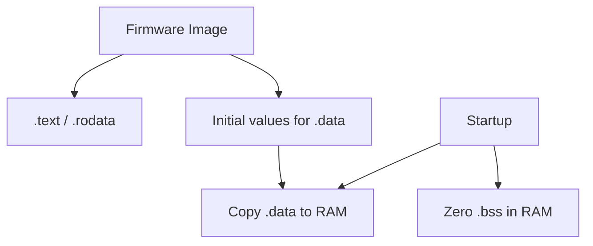

---

## 6. `.text`와 `.rodata`

`.text`는 일반적으로 기계어 명령을 포함한다. `.rodata`는 문자열 리터럴이나 읽기 전용 상수 등을 포함할 수 있다.

```c
static const unsigned int table[] = { 1u, 2u, 3u };
```

이 객체가 정확히 어디에 배치되는지는 컴파일러 최적화, 접근 방식, Linker Script 및 대상 아키텍처에 따라 달라진다. `const`라는 C/C++ 타입 속성만으로 **반드시 Flash에 놓인다**고 단정할 수 없다.

---

## 7. `.data`: 초기값과 실행 위치가 다를 수 있다

```c
int system_mode = 3;
```

일반적인 Flash 실행형 MCU에서 변경 가능한 초기화 전역 객체는 SRAM에 위치하지만, 초기값은 펌웨어 이미지의 Flash에 저장될 수 있다.

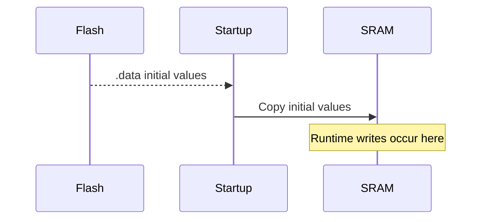

이때 **Load Memory Address(LMA)**와 **Virtual/Execution Memory Address(VMA)**를 구분한다.

- LMA: 이미지가 로드되거나 초기값이 저장되는 주소.
- VMA: 실행 중 코드·데이터가 참조하는 주소.

정확한 용어와 출력 방식은 링커에 따라 다르지만, 핵심은 **저장 위치와 실행 위치가 다를 수 있다**는 점이다.

---

## 8. `.bss`: 실행 전에 0으로 초기화

```c
static unsigned int event_count;
```

일반적인 MCU 시작 코드에서는 `.bss`에 해당하는 SRAM 영역을 0으로 초기화한다. 이를 위해 초기값 0을 이미지에 객체 크기만큼 전부 저장할 필요는 없다.


**`.bss`가 0이 되는 이유는 C/C++ 초기화 요구사항을 런타임이 구현하기 때문**이지, SRAM이 전원 인가 시 항상 0이라는 뜻은 아니다.

---

## 9. Stack

Stack은 일반적으로 함수 호출 상태, 지역 객체, 저장된 Register 등에 사용된다. 정확한 사용 방식은 ABI와 컴파일러 최적화에 따라 다르다.

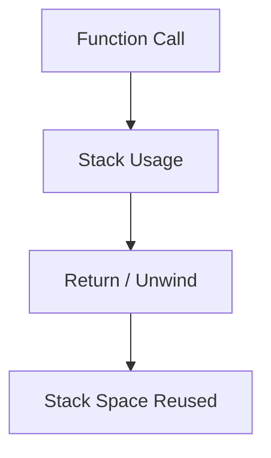

- Stack의 성장 방향은 아키텍처·ABI에 따른다.
- 지역 변수라고 해서 반드시 물리적 Stack에 배치되는 것은 아니다. Register에 유지되거나 최적화될 수 있다.
- 큰 지역 배열, 깊은 호출, 재귀, Interrupt 중첩은 Stack 사용량에 영향을 줄 수 있다.
- Stack Overflow는 인접 메모리 훼손이나 Fault로 이어질 수 있다.

RTOS에서는 Task마다 별도 Stack을 두는 구성이 흔하며, ISR용 Stack과 Task Stack의 관계는 RTOS·아키텍처 설정에 따라 다르다.

---

## 10. Heap

Heap은 `malloc/free`, C++ `new/delete`, 기본 할당자를 사용하는 동적 컨테이너 등이 이용할 수 있는 동적 할당 영역이다.

| 항목 | Stack | Heap |
|---|---|---|
| 관리 | 호출 규약·런타임 중심 | Allocator 중심 |
| 객체 수명 | 자동 저장 기간 등 | 할당·해제 정책에 따름 |
| 크기 예측 | 호출 깊이 분석 필요 | 최대 동시 할당량 분석 필요 |
| 위험 | Overflow | Fragmentation, Allocation Failure |

**Stack과 Heap이 반드시 하나의 연속 SRAM 공간에서 서로를 향해 성장하는 것은 아니다.** 프로젝트에 따라 영역이 고정되거나 복수 메모리 Bank에 배치된다.

---

## 11. 정적 저장 기간과 물리 메모리 위치

C/C++의 *Storage Duration*은 객체 수명에 관한 언어 개념이고, `.data`·`.bss`·Flash·SRAM은 구현상의 배치 개념이다.

```c
static unsigned int a;      /* static storage duration */
static unsigned int b = 7u; /* static storage duration */
```

두 객체의 수명 분류는 같지만, 일반적인 배치에서는 `a`와 `b`가 서로 다른 입력·출력 섹션을 통해 처리될 수 있다.

**`static`은 무조건 `.bss`, `const`는 무조건 Flash라는 식의 일대일 대응은 부정확하다.**

---

## 12. Linker Script의 역할

Compiler는 소스 코드를 Object File로 만들고, Linker는 섹션과 Symbol을 결합해 최종 이미지를 만든다. Linker Script는 그 배치 규칙을 정의한다.

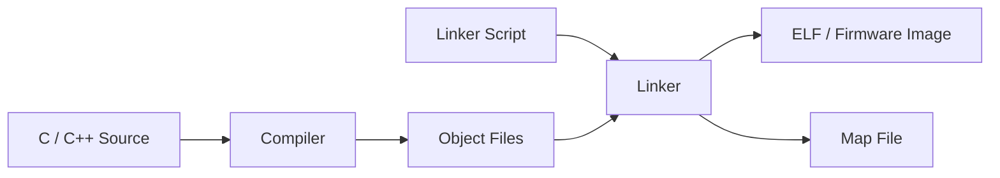

Linker Script가 주로 결정하는 내용:

- Flash와 RAM의 시작 주소·길이.
- `.text`, `.rodata`, `.data`, `.bss` 등의 배치.
- Stack·Heap 또는 전용 Buffer 영역의 경계.
- Interrupt Vector Table 위치.
- Bootloader와 Application 이미지의 분리.
- Startup에서 사용할 섹션 경계 Symbol.

---

## 13. Linker Script의 개념적 형태

다음은 **GNU ld 계열의 설명용 의사 예시**다. 실제 프로젝트에 그대로 사용할 완성된 스크립트가 아니다.

```ld
MEMORY
{
    FLASH (rx)  : ORIGIN = 0x08000000, LENGTH = 256K
    RAM   (rwx) : ORIGIN = 0x20000000, LENGTH = 64K
}

SECTIONS
{
    .text : { *(.text*) *(.rodata*) } > FLASH
    .data : { *(.data*) } > RAM AT > FLASH
    .bss  : { *(.bss*) *(COMMON) } > RAM
}
```

```text
.text  → Flash에서 실행
.data → 초기값은 Flash, 실행 중 객체는 RAM
.bss  → RAM에서 0으로 초기화
```

실제 스크립트에는 정렬, Vector Table, 생성자 초기화 정보, Exception 관련 섹션, 라이브러리 섹션, 폐기 정책 등 추가 규칙이 필요할 수 있다.

---

## 14. Startup Code와 Memory Map

Reset 직후에는 C/C++ 프로그램의 모든 런타임 전제가 자동으로 준비된 상태라고 가정하면 안 된다. 일반적인 Startup 과정은 다음과 같다.

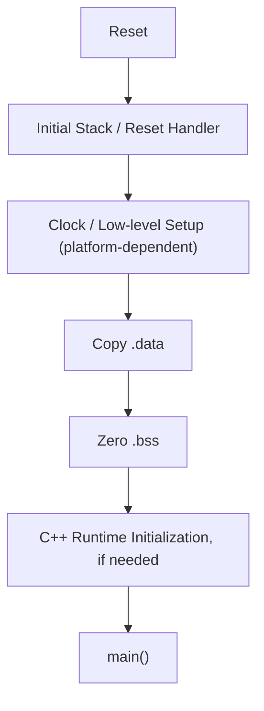

초기화의 정확한 순서는 MCU, 툴체인, 런타임 및 프로젝트에 따라 다르다. C++ 전역 객체의 동적 초기화를 사용하는 경우 관련 초기화 절차가 필요하다.

---

## 15. Interrupt Vector Table의 배치

Vector Table은 Interrupt/Exception 진입과 관련된 주소 정보를 담는다. Cortex-M 계열에서는 일반적으로 초기 Stack Pointer와 Handler 주소들이 포함된다.

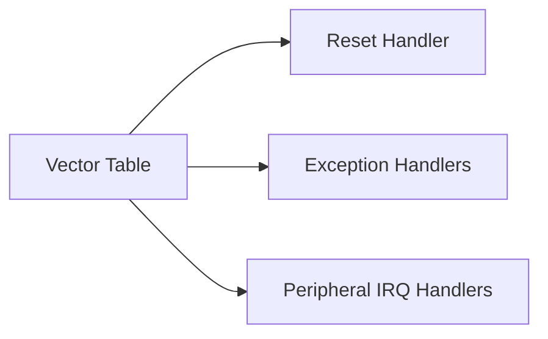

Vector Table의 기본 주소와 재배치 가능 여부는 아키텍처·MCU에 따라 다르다. Bootloader에서 Application으로 넘어갈 때는 **Application의 Vector Table과 실행 환경**을 올바르게 설정해야 할 수 있다.

---

## 16. MMIO도 Memory Map의 일부

`Register.md`에서 다룬 MMIO는 Peripheral Register를 CPU 주소 공간에 배치하는 방식이다.

```c
#include <stdint.h>

#define DEVICE_STATUS (*(volatile uint32_t *)0x40000004u)
```

위 주소는 가상 예시다.

| 영역 | 같은 주소 연산으로 접근하더라도 의미가 다른 이유 |
|---|---|
| SRAM | 일반 데이터 읽기·쓰기 |
| Flash | 메모리 기술과 Controller의 Program/Erase 규칙 적용 |
| MMIO | 읽기·쓰기 자체가 하드웨어 동작일 수 있음 |

**주소 공간에 함께 존재한다는 사실은 접근 규칙이 같다는 뜻이 아니다.**

---

## 17. Memory Attribute와 Cache

일부 MCU/SoC는 메모리 영역별로 Cacheability, Executability, 접근 권한, Ordering 등을 설정할 수 있다.

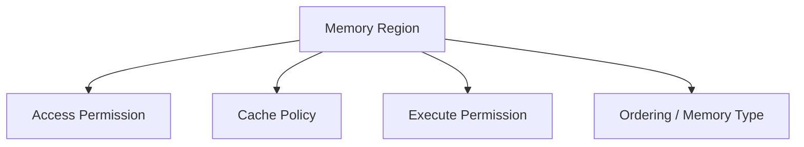

일반 SRAM과 Device MMIO의 메모리 속성을 구분해야 할 수 있다. MPU/MMU의 지원 여부와 설정 방법은 제품에 따라 다르다.

`volatile`은 C/C++ 접근 의미와 관련되며, Cache 정책·MPU 속성·CPU Memory Barrier를 대신하지 않는다.

---

## 18. DMA가 접근 가능한 메모리

DMA가 CPU가 볼 수 있는 모든 주소에 접근할 수 있는 것은 아니다. DMA Controller의 Bus 연결과 Memory Bank 접근 권한을 확인해야 한다.

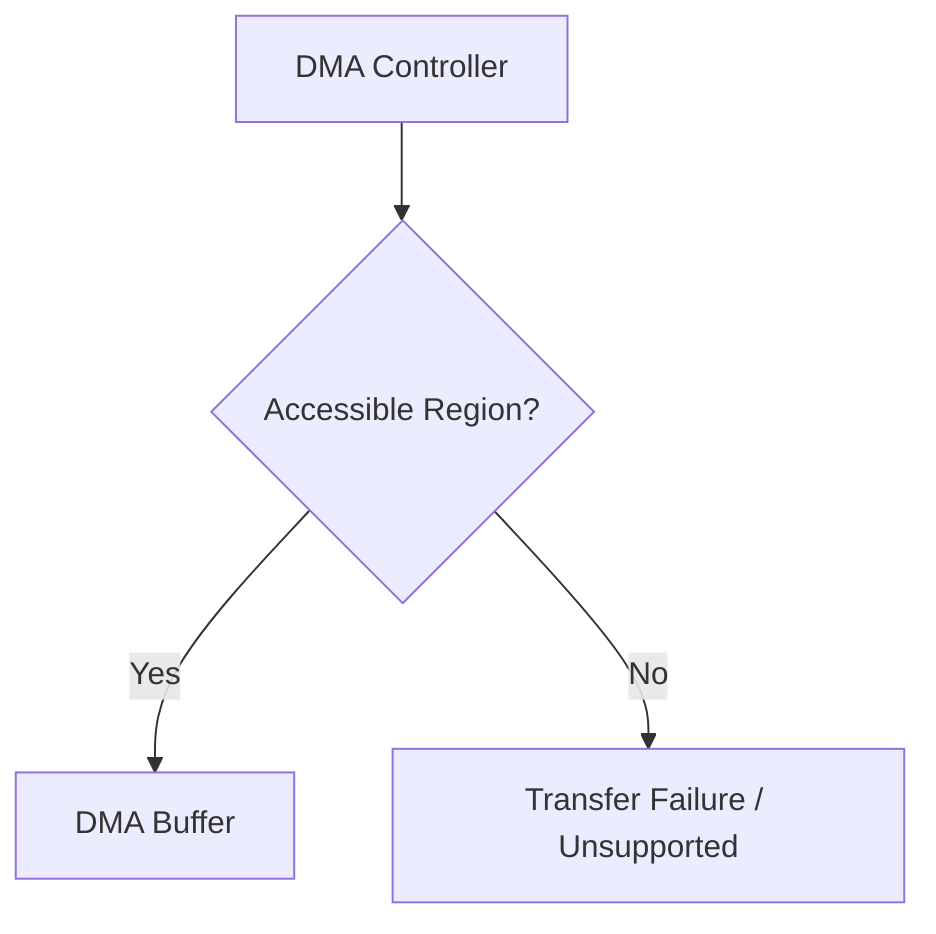

DMA Buffer 배치 시 확인할 항목:

| 항목 | 이유 |
|---|---|
| DMA 접근 가능한 SRAM | Bus 연결·메모리 종류 제약 |
| Alignment | Controller/Bus 전송 요구사항 |
| Buffer Lifetime | 전송 완료 전 객체 소멸 방지 |
| Cache Coherency | CPU와 DMA의 데이터 관찰 일치 |
| Memory Barrier | 소유권 전환 전후의 순서 보장 |

일부 프로젝트는 Linker Script에 `.dma_buffer` 같은 별도 섹션을 정의한다. 이 이름은 관례적 예시이며 표준 섹션 이름이 아니다.

---

## 19. 복수 SRAM Bank와 전용 메모리

MCU에는 일반 SRAM 외에 TCM, Backup SRAM, Retention RAM, 외부 SDRAM 등 여러 메모리 영역이 있을 수 있다.

| 메모리 유형 | 검토할 특성 |
|---|---|
| 일반 SRAM | CPU/DMA 접근성, 용량 |
| TCM | 낮은 지연 특성, DMA 접근 제한 가능성 |
| Retention RAM | 특정 저전력 모드에서 데이터 유지 여부 |
| Backup SRAM | Backup Domain 전원·Reset 영향 |
| 외부 RAM | 초기화, Latency, Bus/Cache 특성 |

**RAM이라는 이름이 같아도 전원·Reset·DMA·속도 특성은 다를 수 있다.**

---

## 20. Flash Memory Layout과 Bootloader

Bootloader가 있는 제품에서는 Flash를 논리적으로 나눌 수 있다.

```text
Flash
┌─────────────────────────────┐
│ Bootloader                  │
├─────────────────────────────┤
│ Application Slot A          │
├─────────────────────────────┤
│ Application Slot B          │
├─────────────────────────────┤
│ Metadata / Configuration    │
└─────────────────────────────┘
```

이는 A/B Update 구조의 **개념적 예시**이며 모든 제품이 이 구성을 쓰는 것은 아니다.

분할 시에는 다음을 함께 고려한다.

- Flash Erase Sector/Page 경계.
- Image Header와 Vector Table 위치.
- Application Link Address.
- Update 중 전원 차단과 Rollback 정책.
- Metadata의 원자적 갱신 또는 복구 전략.
- Bootloader와 Application의 공유 RAM·Interrupt 설정.

---

## 21. Memory Map과 Firmware Image Format

| 산출물 | 주된 용도 |
|---|---|
| ELF | 섹션, Symbol, 주소, 디버그 정보 등을 담을 수 있음 |
| HEX | 주소가 포함된 레코드 형식의 이미지 |
| BIN | 일반적으로 원시 바이트 이미지; 주소 정보는 별도 맥락 필요 |
| MAP | Linker가 결정한 Symbol·Section 배치 분석 |

BIN 파일만 보고 그 바이트를 Flash의 **어느 주소에 기록할지** 자동으로 알 수 있다고 가정하면 안 된다. Flash Tool의 시작 주소와 이미지 생성 방식이 맞아야 한다.

---

## 22. Map File을 보는 이유

Map File은 실제 펌웨어가 메모리를 어떻게 사용하는지 파악하는 데 도움이 된다.

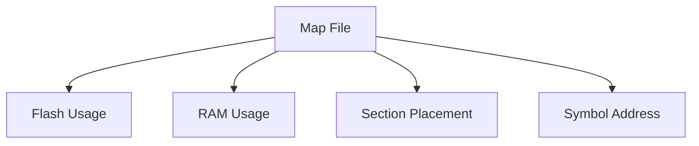

확인할 대표 항목:

- `.text`·`.rodata` 크기.
- `.data`·`.bss` 크기.
- 의도하지 않은 대형 정적 Buffer.
- Flash 또는 RAM 경계 초과.
- Bootloader와 Application 영역 충돌.
- DMA Buffer와 전용 메모리 섹션의 배치.

Map File의 정적 사용량만으로 런타임 최대 Stack·Heap 사용량까지 모두 알 수 있는 것은 아니다.

---

## 23. Memory Overflow와 Fault

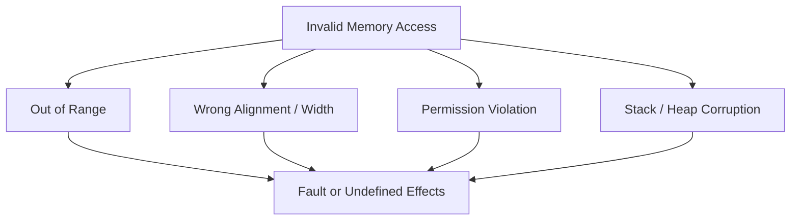

원인을 추적할 때는 주소가 어느 영역에 속하는지, 접근 크기·방향이 무엇인지, 해당 영역이 초기화되었는지, Stack과 DMA가 메모리를 훼손했는지 등을 확인한다.

---

## 24. C/C++ Pointer와 Memory Map의 관계

```c
#include <stdint.h>

uint32_t value = 0u;
uint32_t *ram_ptr = &value;
```

일반 객체를 가리키는 Pointer와 MMIO Register를 가리키는 Pointer는 문법이 비슷하지만, 접근 대상의 성격은 다르다.

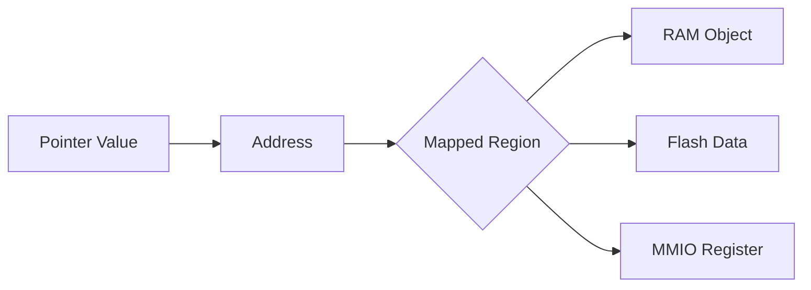

`uintptr_t`는 제공되는 구현에서 포인터 값을 담는 데 사용하는 정수 타입이지만, **정수↔포인터 변환이 임의의 하드웨어 주소 접근을 이식 가능하게 만들어 주지는 않는다.** 실제 MMIO 코드는 MCU와 컴파일러에 종속적이다.

---

## 25. C++ 객체와 메모리 배치

C++에서는 객체 수명·소유권과 물리적 배치를 분리해서 생각한다.

| C++ 개념 | Memory Map 관점 |
|---|---|
| `std::array<T, N>` | 객체 자체가 놓인 메모리 영역에 데이터 포함 |
| `std::vector<T>` | 기본 Allocator 사용 시 요소 저장소에 동적 할당 가능 |
| `std::unique_ptr<T>` | 포인터의 소유권 관리; 대상 위치는 할당 방식에 따름 |
| `constexpr` | 컴파일 타임 계산 가능성; 모든 객체의 Flash 배치 보장은 아님 |
| `static` 객체 | 정적 저장 기간; 실제 섹션은 구현과 초기화 형태에 따름 |

RAII는 자원 수명을 관리하지만, **어느 SRAM Bank에 할당할지**는 별도의 Allocator·Linker·플랫폼 설계 문제다.

---

## 26. 저전력과 Reset Domain

저전력 모드에서는 메모리 영역별로 전원이 유지되거나 차단될 수 있다.

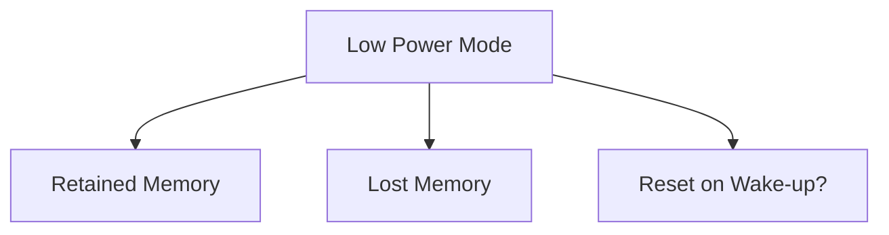

- Sleep 복귀 시 SRAM이 유지되는지.
- Deep Sleep에서 일부 Bank만 유지되는지.
- Backup Domain은 별도 전원에 연결되는지.
- Wake-up이 복귀인지 Reset인지.
- Startup이 `.data`와 `.bss`를 다시 초기화하는지.

**Retention Memory에 값이 남는 것과 C/C++ 프로그램이 그 값을 정상적으로 사용할 수 있는 것은 별개다.** Reset 및 Startup 정책과 함께 검토한다.

---

## 27. Memory Map 설계의 핵심 관점

| 질문 | 연결되는 설계 결정 |
|---|---|
| 코드가 어디에서 실행되는가? | Flash 실행, RAM 실행, XIP |
| 초기값은 어디에 저장되는가? | `.data` LMA/VMA |
| 변경 가능한 데이터는 어디에 있는가? | SRAM Bank 선택 |
| DMA가 Buffer에 접근 가능한가? | Bus 연결, Alignment, Cache |
| Bootloader와 Application이 충돌하는가? | Flash Partition, Link Address |
| Stack과 Heap은 충분한가? | 메모리 예산, 런타임 분석 |
| 저전력 후 데이터가 유지되는가? | Retention, Reset Domain |
| Peripheral 주소를 올바르게 다루는가? | MMIO, Register Semantics |

---

## 28. 흔한 오해

| 오해 | 정확한 이해 |
|---|---|
| 32-bit CPU면 4 GiB RAM이 있다 | 주소 표현 범위와 실제 메모리 용량은 다르다 |
| `const`는 무조건 Flash에 놓인다 | 실제 배치는 컴파일러·링커·대상에 따른다 |
| 전역 변수는 모두 `.bss`다 | 초기값·구현에 따라 `.data` 등으로 나뉠 수 있다 |
| `.bss`는 SRAM이 원래 0이어서 비어 있다 | Startup이 초기화 요구사항을 구현한다 |
| Stack과 Heap은 반드시 맞닿아 성장한다 | Linker와 런타임 구성에 따른다 |
| DMA는 모든 RAM에 접근할 수 있다 | DMA의 Bus/Memory 접근 제한이 있을 수 있다 |
| `volatile`이면 Cache 문제가 해결된다 | Cache Coherency는 별도 문제다 |
| BIN에는 Flash 시작 주소가 항상 포함된다 | 일반적인 Raw BIN에는 주소 맥락이 없다 |
| Memory Map과 Linker Script는 같은 것이다 | 전자는 하드웨어 주소 배치, 후자는 이미지 배치 규칙을 주로 설명한다 |

---

## 29. 전체 연결 다이어그램

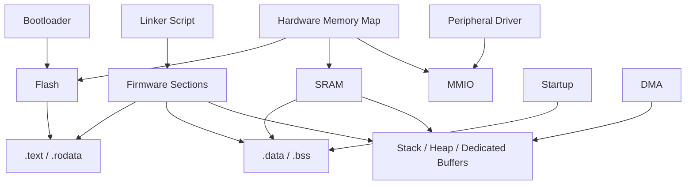

---

## 30. 핵심 정리

> **Memory Map은 CPU 주소가 어떤 하드웨어 자원에 대응하는지 설명한다.**
>
> **Linker Script는 펌웨어의 코드와 데이터가 해당 주소 공간에 어떻게 배치되는지 결정한다.**
>
> **`.data`는 Flash에 초기값을 보관하고 RAM에서 실행 중 변경될 수 있으며, `.bss`는 Startup에서 0으로 초기화되는 구성이 일반적이다.**
>
> **Stack·Heap·DMA Buffer의 실제 위치와 크기는 프로젝트의 메모리 설계에 달려 있다.**
>
> **MMIO, DMA, Bootloader, Cache, 저전력 동작은 모두 Memory Map과 연결된다.**
>
> **최종 판단은 MCU Reference Manual, Linker Script, Startup Code, Map File을 함께 확인해야 한다.**

---

## 다음 학습

**다음 문서:** `05_Embedded/Linker_Startup.md`

Memory Map에서 구분한 Flash·RAM·섹션을 바탕으로 Linker Script, Reset Handler, `.data` 복사, `.bss` 초기화, Vector Table, C++ 초기화 및 `main()` 진입 과정을 하나의 부팅 흐름으로 연결한다.
