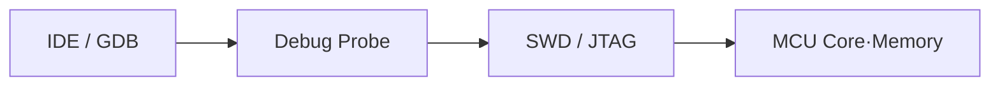
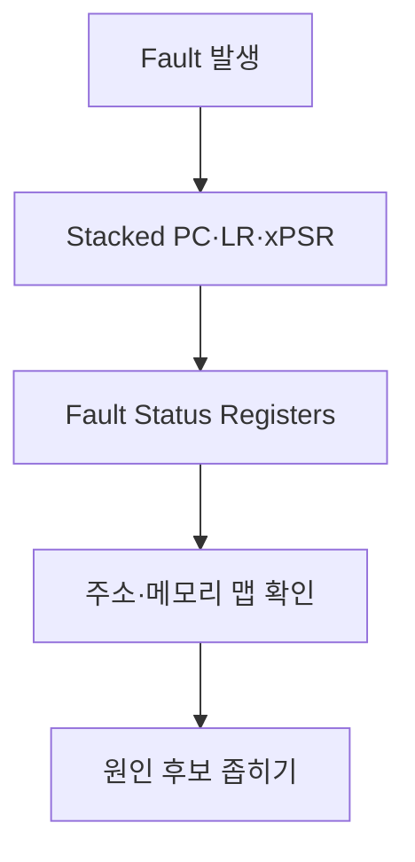
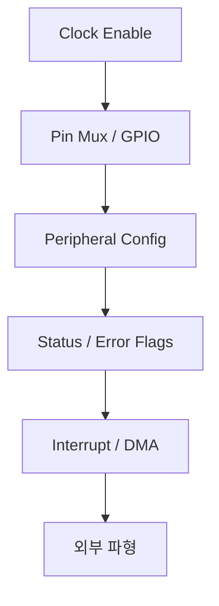
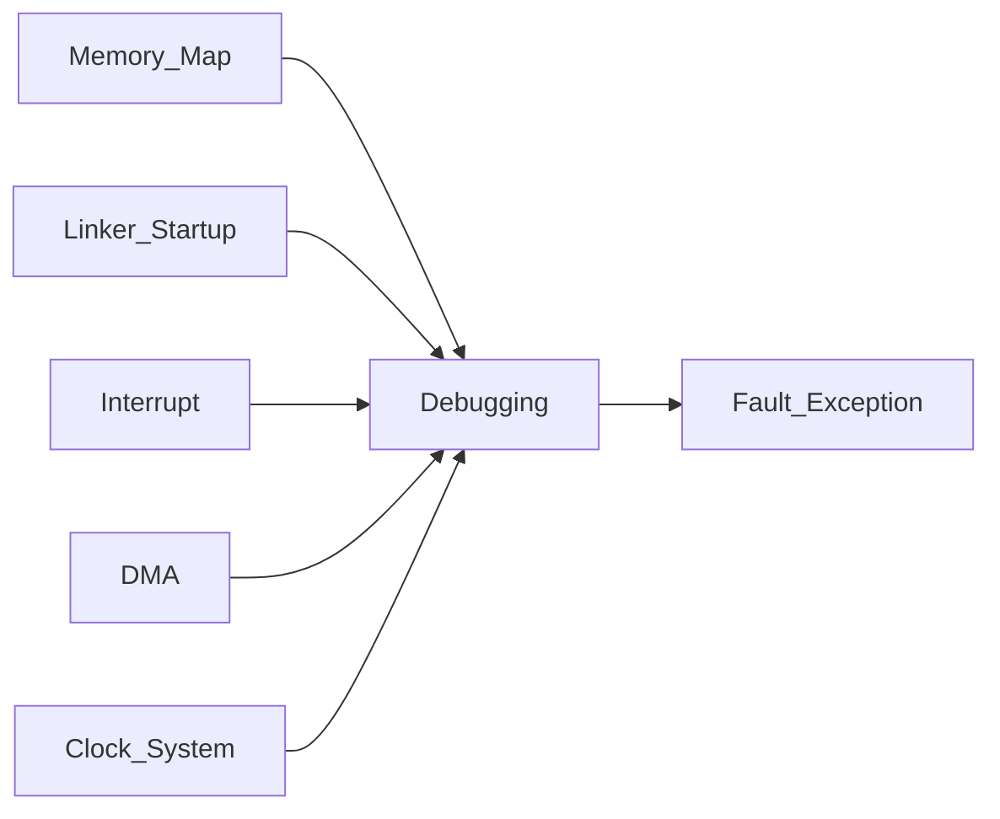

# Debugging — 임베디드 디버깅

> 위치: `05_Embedded/Debugging.md` · 기준: 일반적인 MCU/ARM Cortex-M 관점. 실제 기능과 레지스터는 MCU·디버그 프로브·툴체인 문서를 우선한다.  
> **개념 정리 전용:** 실습·퀴즈 없음.

## 1. 디버깅의 대상

임베디드 디버깅은 소스 코드뿐 아니라 **CPU 상태, 메모리, 주변장치, 시간, 전원, 외부 신호**를 함께 관찰하는 작업이다. 일반 PC와 달리 디버거 연결 자체가 타이밍과 전력 상태를 바꿀 수 있다.

| 관찰 층위 | 대표 수단 | 확인 대상 |
|---|---|---|
| 소스 | Debug Symbol, Call Stack | 실행 경로, 변수 |
| CPU | PC, SP, LR, xPSR 등 | 예외 진입, 반환, 스택 |
| 메모리 | Memory View, Watchpoint | 버퍼 손상, 주소, 정렬 |
| 주변장치 | Register View | Flag, Enable, Clock, DMA |
| 시간 | GPIO 토글, Trace, Logic Analyzer | Latency, Jitter, 순서 |
| 전기 신호 | Oscilloscope, Logic Analyzer | 레벨, 타이밍, 노이즈 |

## 2. 디버그 연결: SWD와 JTAG

SWD는 주로 ARM 기반 MCU에서 쓰이는 2선식 디버그 인터페이스이고, JTAG은 더 일반적인 디버그·테스트 인터페이스다. 둘은 UART 로그나 Application Protocol과 목적이 다르다.

Debug Probe는 코어 정지·재개, 메모리·레지스터 읽기, Flash 다운로드 등을 중계한다. 보안 잠금, 핀 재설정, 저전력 모드에 따라 접근이 제한될 수 있다.

## 3. Debug Build와 Symbol

`-g` 같은 디버그 정보는 소스 줄·심볼·타입을 실행 파일에 연결한다. 최적화 수준이 높으면 변수는 레지스터로 이동하거나 제거되고 소스 줄과 명령어의 대응도 달라질 수 있다. **Debug Build에서만 재현되지 않는 버그**는 타이밍, 초기화, Undefined Behavior, 스택 사용량의 차이를 의심한다.

| 요소 | 영향 |
|---|---|
| Debug Symbol | 소스·변수·함수 표시 |
| Optimization | 인라이닝, 코드 재배치, 변수 생존 범위 |
| Linker Map | 심볼 주소, 섹션 크기, 메모리 배치 |
| Disassembly | 실제 실행 명령어와 접근 폭 확인 |

## 4. Breakpoint와 Watchpoint

**Breakpoint**는 특정 명령어 주소에서 실행을 멈추고, **Watchpoint**는 지정된 메모리 주소에 대한 읽기·쓰기 접근을 감시한다. 하드웨어 지원 수는 코어마다 제한적이다.

| 종류 | 관찰 | 한계 |
|---|---|---|
| Software Breakpoint | 코드 패치 기반 정지 | Flash 제약, 코드 변경 가능성 |
| Hardware Breakpoint | 비교기 기반 정지 | 개수 제한 |
| Data Watchpoint | 메모리 접근 추적 | 크기·정렬·개수 제한 |
| Conditional Breakpoint | 조건 충족 시 정지 | 도구 구현에 따라 느려질 수 있음 |

**정지 시점이 시스템 전체 정지를 뜻하지는 않는다.** Debug Freeze 설정에 따라 Timer, Watchdog, DMA, 다른 Core, 외부 장치는 계속 동작할 수 있다.

## 5. Step Into·Over·Out와 Call Stack

Step Into는 호출 함수 내부로, Step Over는 호출 결과 이후로, Step Out은 현재 함수 반환 지점으로 진행한다. 최적화·인라이닝·ISR·예외 처리에서는 직관적인 순서와 다를 수 있다.

Call Stack은 함수 호출의 흔적이지만 스택 오염, Tail Call, 잘못된 Unwind 정보가 있으면 불완전할 수 있다. PC·LR·SP와 Stack Memory를 함께 본다.

## 6. Cortex-M의 Fault 관찰

Cortex-M 계열에서 HardFault가 발생하면 **Fault 시점의 스택 프레임과 Fault Status Register**를 분석한다. 모델별로 MemManage/BusFault/UsageFault 제공 범위가 다르다.

| 항목 | 해석 방향 |
|---|---|
| Stacked PC | 예외 발생 근처 명령어 |
| LR / EXC_RETURN | 예외 진입 전 스택·모드 정보 |
| CFSR / HFSR | 지원되는 Fault 원인 비트 |
| BFAR / MMFAR | 유효 비트가 설정된 경우 Fault 주소 |
| MSP / PSP | 사용 중이던 Stack Pointer |

Stacked PC가 항상 근본 원인 위치는 아니다. 버퍼 오버런이 먼저 발생하고 나중에 반환 주소를 사용하다 Fault가 날 수 있다.

## 7. 주변장치 디버깅의 순서

UART가 전송되지 않을 때는 소스 함수 호출 여부뿐 아니라 Peripheral Clock, Pin Alternate Function, Baud Rate, TX Enable, Flag, 실제 TX Pin 파형을 확인한다. **Register View의 읽기 자체가 Read-to-Clear 상태를 바꿀 수 있음**에 주의한다.

## 8. 로그와 Trace

UART/RTT/SWO/ITM/ETM 등은 지원 장치와 도구에 따라 사용할 수 있다. `printf`는 포맷팅 비용·락·버퍼·전송 지연으로 ISR과 실시간 경로를 교란할 수 있다.

| 방식 | 장점 | 유의점 |
|---|---|---|
| UART Log | 범용성 | 대역폭, 송신 블로킹 |
| GPIO Pulse | 짧은 구간 시간 측정 | 핀 필요, 외부 장비 필요 |
| Logic Analyzer | 디지털 프로토콜·순서 | 아날로그 품질은 제한적 |
| Oscilloscope | 전압·노이즈·에지 | 채널 수와 샘플링 제약 |
| Hardware Trace | 낮은 교란의 실행 관찰 가능 | MCU·Probe 지원 필요 |

## 9. Heisenbug와 관찰 교란

Breakpoint는 Race Condition을 숨기거나 Timeout을 만들 수 있다. 로그는 버퍼 Overflow를 줄이거나 늘릴 수 있다. DMA/Timer/Watchdog가 코어 정지 중 계속 실행되는지도 확인한다.

**원칙:** 증상이 시간에 민감하면 정지형 디버깅과 비정지형 관찰을 구분한다.

## 10. Debugging과 다른 문서의 연결

- `Memory_Map.md`: 주소와 섹션의 의미.
- `Linker_Startup.md`: Reset Handler, Stack, Linker Map.
- `Register.md`: Status Flag의 읽기·쓰기 부작용.
- `RTOS.md`: Task별 Stack, 우선순위, 정지 범위.

## 핵심 체크리스트

- 디버거 정지 중에도 계속 움직이는 하드웨어가 무엇인지 구분한다.
- Fault 분석 시 PC 하나만 보지 않고 Stack·Status·주소를 함께 확인한다.
- 최적화, 로그, Breakpoint가 증상을 바꿀 수 있음을 고려한다.
- 소프트웨어 상태와 실제 Pin·Bus 파형을 구분한다.

**다음:** `Fault_Exception.md`.
