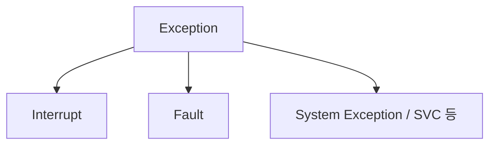
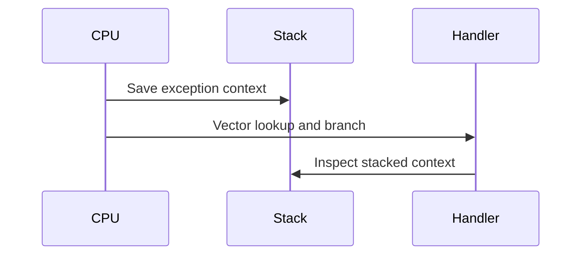
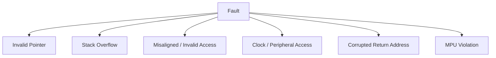
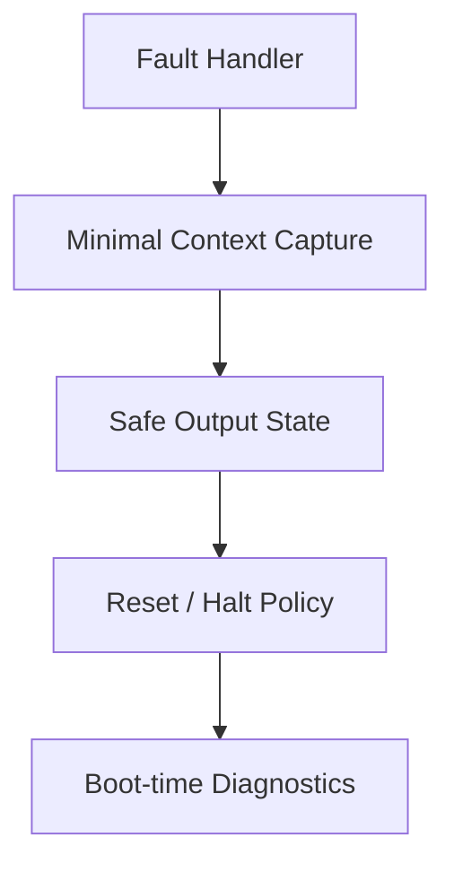
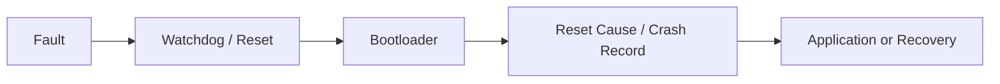

# Fault_Exception — 예외와 고장 분석

> 위치: `05_Embedded/Fault_Exception.md` · ARM Cortex-M은 대표 예시이며 예외 종류와 레지스터는 코어별로 다르다.  
> **개념 정리 전용:** 실습·퀴즈 없음.

## 1. Interrupt, Exception, Fault

**Exception**은 일반 실행 흐름을 벗어나 별도 Handler로 제어가 이동하는 CPU 사건의 넓은 개념이다. **Interrupt**는 주로 비동기 외부·주변장치 이벤트, **Fault**는 명령 실행·메모리 접근 등에서 발견된 오류를 가리킨다. ARM 문맥에서 Interrupt도 Exception의 한 종류다.



| 종류 | 일반적인 원인 | 대표 대응 |
|---|---|---|
| MemManage Fault | 메모리 보호 위반 | MPU·주소·권한 확인 |
| BusFault | Bus 접근 오류 | 주소·전원·접근 폭 확인 |
| UsageFault | 잘못된 명령/상태 등 | 코드·정렬·스택 확인 |
| HardFault | 심각한 Fault 또는 Escalation | 스택 프레임과 상태 분석 |
| NMI | 마스킹되지 않는 고우선 이벤트 | 시스템별 안전 대응 |

위 분류와 레지스터는 Cortex-M의 세부 모델에 따라 달라진다.

## 2. Exception Entry와 Stack Frame

예외 진입 시 CPU는 복귀에 필요한 상태를 스택에 저장한다. Cortex-M의 기본 스택 프레임에는 R0–R3, R12, LR, PC, xPSR 등이 포함된다. FPU 사용, Lazy Stacking, 보안 확장, Stack Alignment에 따라 추가 정보가 생길 수 있다.



**현재 Handler의 PC와 Fault 당시 저장된 PC는 다르다.** 원인 분석에는 예외 진입 전 문맥이 중요하다.

## 3. MSP와 PSP

Cortex-M은 일반적으로 Main Stack Pointer(MSP)와 Process Stack Pointer(PSP)를 제공한다. RTOS는 Task 실행에 PSP를, Handler 실행에 MSP를 사용하는 구성을 흔히 채택하지만 실제 설정을 확인해야 한다.

| 관찰 | 의미 |
|---|---|
| MSP | Handler/시스템 측 스택으로 사용 가능 |
| PSP | Task/Thread 측 스택으로 사용 가능 |
| EXC_RETURN | 복귀 모드와 사용할 스택에 대한 인코딩 |

**Stack Overflow**는 Fault를 직접 발생시키거나 나중에 다른 메모리를 손상시킬 수 있다. Task Stack과 ISR Stack을 구분해 본다.

## 4. Fault Status Register

Cortex-M에서 지원되는 경우 다음 정보를 결합한다.

| Register | 목적 |
|---|---|
| CFSR | MemManage·BusFault·UsageFault 상태 |
| HFSR | HardFault 상태 및 Escalation 관련 정보 |
| BFAR | 유효한 경우 BusFault 주소 |
| MMFAR | 유효한 경우 MemManage Fault 주소 |
| SHCSR | System Handler 활성·Pending·Enable 관련 상태 |

**주소 레지스터의 유효 비트 확인 없이 값을 원인 주소로 단정하지 않는다.** 정밀/비정밀 BusFault에 따라 저장된 PC가 정확한 실패 명령을 가리키지 않을 수 있다.

## 5. 흔한 Fault 원인



- Null·Dangling Pointer, 잘못된 함수 포인터.
- 버퍼 범위 초과로 인한 Stack/Heap 오염.
- 유효하지 않은 MMIO 주소나 Peripheral 접근.
- 부적절한 접근 폭 또는 메모리 보호 설정.
- RTOS Task Stack 부족 및 ISR 중첩.
- Flash 프로그래밍 중 실행·접근 제약 위반.

C/C++의 Undefined Behavior는 Fault가 발생하지 않고 조용히 오작동할 수도 있다.

## 6. Fault Handler의 책임

Fault Handler는 정상 경로로 복귀할 수 없는 상황을 포함한다. 모든 Fault를 `while(1)`로 처리하면 원인 정보가 사라지거나 Watchdog에 의존한 무한 재부팅이 발생할 수 있다.



대표적으로 고려하는 정보는 Reset Cause, Fault Status, Stacked PC/LR, Stack Pointer, Firmware Version, 제한된 이벤트 기록이다. 기록 수단이 Flash라면 **Fault 문맥에서 Flash Erase/Program을 안전하게 수행할 수 있는지** 별도 검토해야 한다.

## 7. 복구 가능성과 불가능성

| 상황 | 일반적 설계 방향 |
|---|---|
| 일시적 통신 오류 | Driver/Protocol 수준 Retry |
| 주변장치 상태 이상 | Peripheral Reset 또는 재초기화 |
| Task 오류 | RTOS 정책에 따른 Task/시스템 복구 |
| 메모리 손상·Stack Overflow | 전체 시스템 신뢰성 재평가 및 Reset 고려 |
| 전원·클록 이상 | 안전 상태, Reset, 진단 기록 |

**모든 Fault에서 실행을 재개하는 것이 안전한 것은 아니다.** 특히 메모리 오염이 의심되면 전체 프로그램 상태를 신뢰할 수 없다.

## 8. Fault와 Watchdog·Bootloader



반복 Fault는 Reset Loop를 만들 수 있다. Bootloader의 Trial Boot·Rollback 정책과 연동할 때는 **정상 부팅 확인 기준**과 실패 횟수의 저장 위치를 명확히 한다.

## 9. 원인 분석의 시간 축

Fault는 **최초의 오류**가 아니라 **오류가 관측된 시점**일 수 있다.

```text
Buffer Overflow → Stack Corruption → Function Return → HardFault
```

따라서 최종 Fault Register뿐 아니라 버퍼 경계, DMA Length, Task Stack High-water Mark, 최근 이벤트를 함께 해석한다.

## 10. 개념 연결

- `Debugging.md`: Fault 문맥 읽기와 실제 명령어 확인.
- `Memory_Map.md`: 유효 주소·메모리 속성.
- `Linker_Startup.md`: Vector Table·Stack 초기값.
- `Watchdog.md`: 실패 후 재시작 정책.
- `Concurrency.md`: 경쟁 상태로 인한 데이터 손상.

## 핵심 체크리스트

- Interrupt와 Fault를 모두 Exception이라는 상위 개념 안에서 이해한다.
- Stacked PC와 Handler PC를 구분한다.
- Fault Status의 유효 비트와 예외의 정밀도를 확인한다.
- Fault 발생 지점과 최초 데이터 손상 지점이 다를 수 있음을 고려한다.
- Crash 기록·안전 상태·재부팅 정책을 하나의 설계로 본다.

**다음:** `Concurrency.md`.
