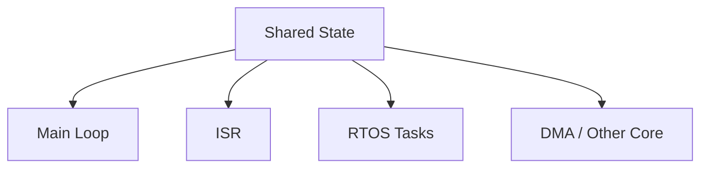
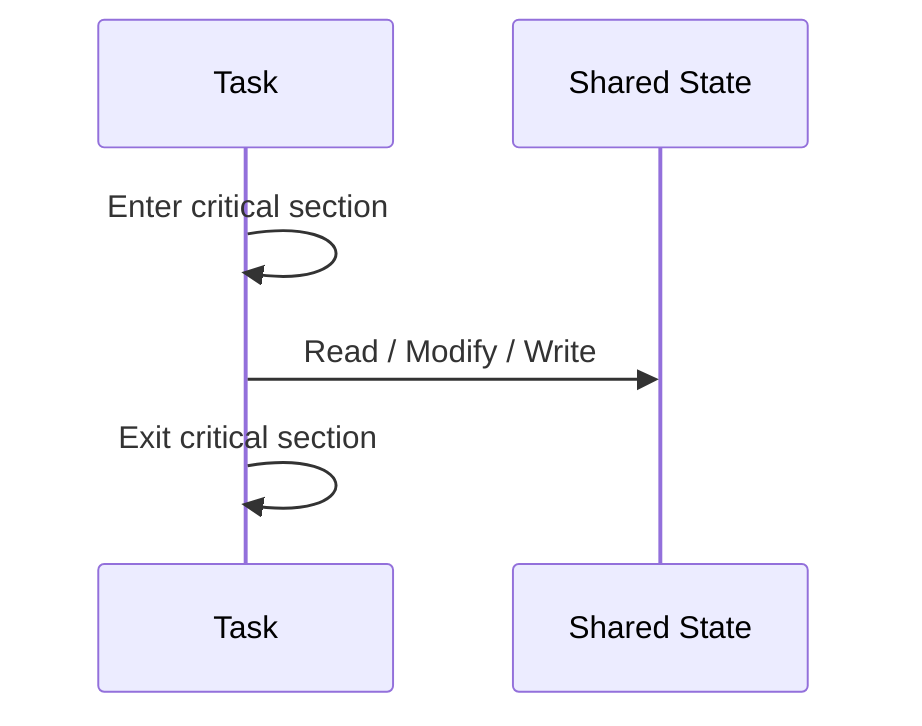
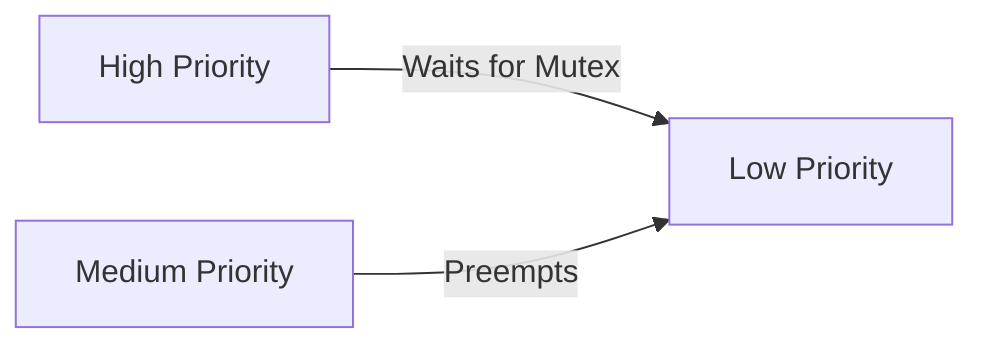
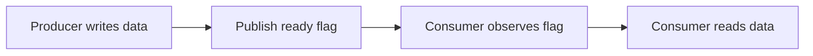
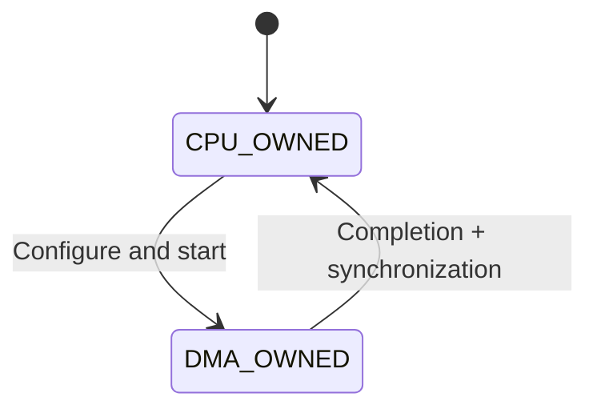

# Concurrency — 임베디드 동시성

> 위치: `05_Embedded/Concurrency.md` · C17/C++20, ISR·RTOS·DMA·Multi-core 관점.  
> **개념 정리 전용:** 실습·퀴즈 없음.

## 1. Concurrency와 Parallelism

**Concurrency(동시성)**는 여러 작업의 실행 구간이 겹치거나 번갈아 진행되는 구조이며, **Parallelism(병렬성)**은 실제로 같은 시간에 여러 실행 주체가 동작하는 경우다. 단일 코어에서도 ISR과 Task 사이에 동시성 문제가 발생한다.



DMA는 CPU 명령어를 실행하지 않지만 메모리를 독립적으로 변경할 수 있으므로 공유 버퍼의 소유권과 순서가 중요하다.

## 2. Race Condition과 Data Race

**Race Condition**은 실행 순서에 따라 결과가 달라지는 문제를 넓게 뜻한다. C++의 **Data Race**는 동기화되지 않은 상충하는 메모리 접근이 동시에 존재하고 적어도 하나가 쓰기인 상황을 뜻하며 Undefined Behavior가 된다. ISR·DMA와 C++ 메모리 모델의 관계는 구현·플랫폼 계약도 함께 고려해야 한다.

```text
Task A: read count → +1 → write count
Task B: read count → +1 → write count
```

두 작업이 같은 초기값을 읽으면 두 번 증가했어도 한 번만 반영될 수 있다.

## 3. Atomicity

**Atomic Operation**은 관찰 가능한 관점에서 중간 상태가 보이지 않는 단위로 수행되는 연산이다. CPU의 자연 정렬된 단일 Load/Store가 Atomic인지 여부는 아키텍처·폭·메모리 영역에 따라 달라진다.

| 표현 | 보장하지 않는 것 |
|---|---|
| `volatile` | Atomicity, 상호 배제, 스레드 간 동기화 |
| 단일 C 표현식 `x++` | 단일 기계 명령·원자적 증가 |
| Interrupt Disable | 다른 Core·DMA의 접근 차단 |
| Mutex | ISR에서 안전한 호출 가능성 |

## 4. `volatile`과 `std::atomic`

`volatile`은 MMIO나 구현이 정의한 비동기 접근의 최적화 의미에 관여한다. C++ `std::atomic<T>`는 지원되는 타입의 원자적 접근과 Memory Ordering을 표현한다. **둘은 대체재가 아니다.**

```cpp
#include <atomic>

std::atomic<unsigned> produced{0};
```

`std::atomic`이 모든 타입·플랫폼에서 Lock-free라는 보장은 없다. ISR에서 사용할 경우 `is_lock_free()`와 Toolchain/RTOS 지원, 실제 생성 코드를 확인한다. C의 `<stdatomic.h>` 지원 여부도 대상 C 표준·툴체인에 달려 있다.

## 5. Critical Section

Critical Section은 공유 상태의 일관성이 깨지지 않도록 보호하는 구간이다.



단일 코어에서 적절한 Interrupt Masking은 특정 ISR과의 경쟁을 막을 수 있다. 그러나 전체 Interrupt 지연을 증가시키며 DMA·다른 Core는 막지 못한다. 이전 Interrupt Mask 상태를 복구해야 중첩된 보호 구간이 안전하다.

## 6. Mutex, Semaphore, Queue

| 수단 | 주된 목적 | ISR 관점 |
|---|---|---|
| Mutex | 소유권 있는 상호 배제 | 일반적으로 ISR에서 획득 금지 |
| Binary Semaphore | 이벤트 통지·자원 카운트 표현 | RTOS별 FromISR API 확인 |
| Counting Semaphore | 자원 개수·이벤트 수 | Overflow·손실 정책 필요 |
| Queue | 데이터·메시지 전달 | ISR용 비블로킹 API 확인 |
| Event Flags | 상태/이벤트 비트 통지 | Clear·Wait 의미 확인 |

Mutex는 Priority Inheritance를 제공할 수 있으나 구현별로 다르다. Binary Semaphore는 Mutex의 소유권 의미를 자동으로 대신하지 않는다.

## 7. Priority Inversion과 Deadlock



Priority Inversion은 낮은 우선순위 작업이 가진 자원 때문에 높은 우선순위 작업이 지연되는 현상이다. Priority Inheritance·Priority Ceiling 등은 상황에 따라 완화책이 된다.

Deadlock은 여러 작업이 서로의 자원을 기다려 진행하지 못하는 상태다. 락 획득 순서 고정, 짧은 보호 구간, Timeout, 자원 소유권 설계가 중요하다.

## 8. Memory Ordering과 Visibility

Atomic 접근에는 Relaxed, Acquire, Release, Sequentially Consistent 같은 Ordering 개념이 있다. 단순 Flag 하나를 Atomic으로 만들었다고 주변의 일반 데이터까지 자동으로 안전해지는 것은 아니다.



Producer의 데이터 쓰기가 Consumer의 읽기보다 먼저 보이도록 하려면 **동기화 관계**가 필요하다. C++에서는 적절한 Release/Acquire가 한 방법이지만 ISR·DMA·MMIO에는 플랫폼별 Memory Barrier와 Cache 규칙이 추가된다.

## 9. SPSC Ring Buffer

Single Producer–Single Consumer 구조에서는 Producer만 `head`, Consumer만 `tail`을 갱신하는 설계가 흔하다.


그러나 이것만으로 자동으로 모든 플랫폼에서 안전한 것은 아니다. Index 접근의 Atomicity, 데이터 쓰기와 Index 공개의 순서, Overflow 처리, Cache Coherency를 검토한다. MPSC/MPMC 구조는 추가 동기화가 필요하다.

## 10. DMA Buffer Ownership



DMA가 쓰는 동안 CPU가 같은 Buffer를 수정하거나 소비하면 부분 데이터가 관찰될 수 있다. 완료 Flag, Cache Invalidate/Clean, Memory Barrier, 버퍼 교대(Double Buffering)는 하드웨어 규칙에 따라 조합한다.

## 11. ISR에서의 제약

ISR에서는 일반적으로 다음을 제한한다.

- 무한 대기·블로킹·긴 계산.
- ISR-safe가 아닌 RTOS API.
- 동적 할당이나 잠금이 포함된 로그.
- 과도한 Interrupt Masking.

ISR은 원인을 확인·처리하고 필요한 이벤트를 Task에 전달하는 **짧은 경로**로 설계하는 경우가 많다.

## 12. 실시간성과 Worst Case

평균 처리 시간보다 최악 지연이 중요할 수 있다. Critical Section, 우선순위, Interrupt Nesting, Bus Contention, Cache Miss, DMA 경쟁은 Worst-case Response Time에 영향을 준다.

## 핵심 체크리스트

- 공유 데이터의 **생산자·소비자·소유권**을 식별한다.
- `volatile`, Atomic, Mutex, Interrupt Masking의 역할을 구분한다.
- ISR, DMA, 다른 Core를 하나의 동기화 수단으로 모두 막을 수 있다고 가정하지 않는다.
- 데이터 내용과 Ready Flag 사이의 순서를 검토한다.
- 평균 성능뿐 아니라 최악 지연을 확인한다.

**다음:** `CAN.md`.
