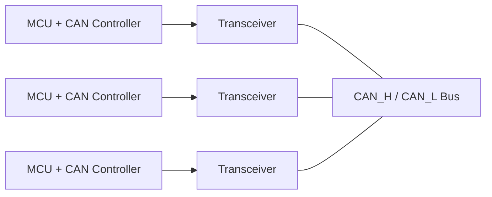
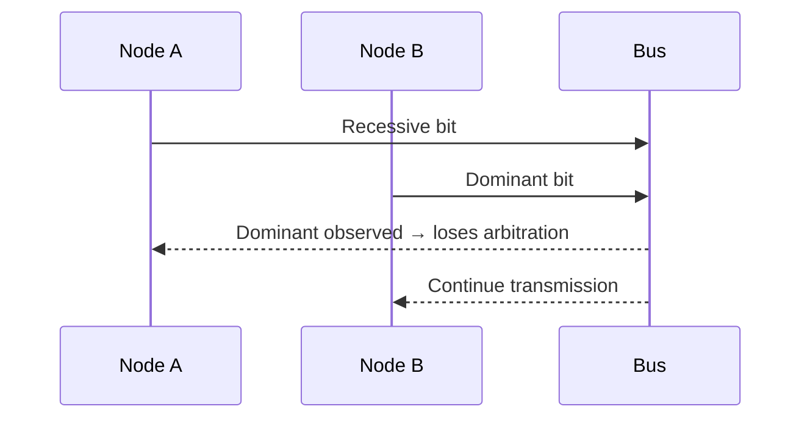
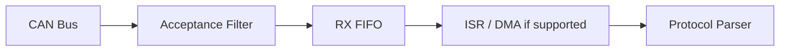
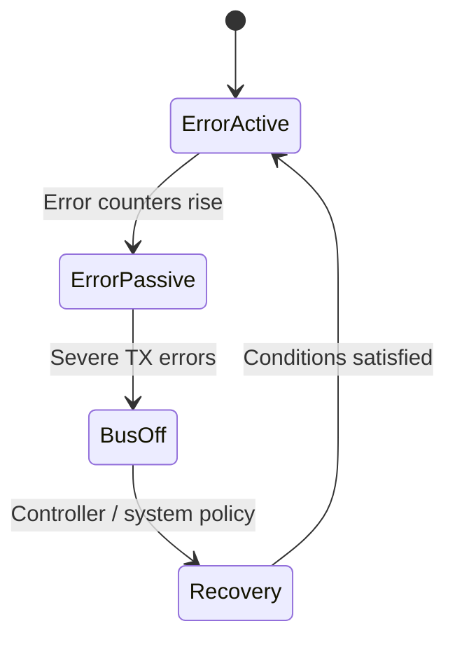
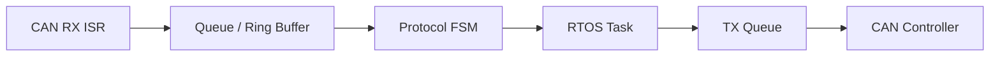

# CAN — Controller Area Network

> 위치: `05_Embedded/CAN.md` · Classical CAN과 CAN FD의 기본 개념. 차량·산업용 네트워크의 실제 요구사항은 적용 규격과 Controller 문서를 확인한다.  
> **개념 정리 전용:** 실습·퀴즈 없음.

## 1. CAN의 위치

CAN은 여러 노드가 공유 Bus에서 메시지를 교환하는 **다중 마스터 메시지 기반 통신**이다. UART의 점대점 연결이나 SPI의 선택 신호 기반 구조와 다르다.



CAN Controller는 Frame·Arbitration·Error 처리, Transceiver는 전기 신호 변환을 담당한다. MCU에 Controller가 있어도 외부 Transceiver가 필요한 구성이 일반적이다.

## 2. 차동 신호와 종단

CAN_H/CAN_L은 차동 신호를 사용해 노이즈에 대한 내성을 높인다. Bus 양 끝의 종단 저항은 신호 반사를 줄이는 데 중요하다. 흔히 양 끝에 120 Ω을 사용하지만 실제 물리 계층 규격과 배선 토폴로지를 따른다.

| 항목 | 의미 |
|---|---|
| Dominant | Recessive보다 Bus에서 우선하는 논리 상태 |
| Recessive | 다른 노드가 Dominant를 내면 덮이는 상태 |
| Termination | 전송선 반사 완화 |
| Stub Length | 고속·긴 분기에서 신호 품질에 영향 |
| Common Ground | 허용 Common-mode 범위 유지에 중요 |

## 3. Message ID와 Arbitration

CAN의 Identifier는 기본적으로 **메시지 의미와 우선순위**를 나타내며, UART의 장치 주소처럼 수신 장치 하나만을 지정하는 개념은 아니다.



비파괴 Arbitration에서는 낮은 수치의 Identifier가 일반적으로 높은 우선순위를 가진다. 표준/확장 Frame 및 Arbitration Field의 세부 규칙은 표준을 따른다. **높은 우선순위 메시지가 많으면 낮은 우선순위 메시지의 지연이 커질 수 있다.**

## 4. Classical CAN과 CAN FD

| 항목 | Classical CAN | CAN FD |
|---|---|---|
| 데이터 필드 | 최대 8 Byte | 최대 64 Byte |
| Bit Rate | Frame의 설정 속도 | Arbitration/Data Phase의 서로 다른 속도 가능 |
| Error Detection | CRC 등 | 확장된 CRC·프로토콜 규칙 |
| 호환성 | Classical 노드용 | 혼합 Bus 구성 제약 검토 필요 |

CAN FD의 데이터 구간 속도 전환(BRS)은 옵션이며 모든 Frame에서 필수는 아니다. DLC는 CAN FD에서 항상 데이터 길이의 단순 숫자 표현이 아니다.

## 5. Frame의 개념 구조

```text
Start → Arbitration → Control → Data → CRC → ACK → End
```

Bit Stuffing, CRC, ACK, Error Frame, Intermission 등은 Controller가 처리하는 프로토콜 요소다. ACK는 **적어도 하나의 수신 노드가 Frame을 정상 수신했다는 Bus 수준 신호**이며, Application이 데이터를 처리했다는 보장은 아니다.

## 6. Acceptance Filter

Controller의 Hardware Filter는 수신할 Identifier를 선별해 CPU 부하를 줄인다. 필터에 통과했다고 Payload가 신뢰할 수 있는 데이터라는 뜻은 아니다.



## 7. Error Detection과 Error Confinement

CAN에는 Bit, Stuff, CRC, Form, ACK Error 등 오류 감지 체계가 있다. 오류 카운터에 따라 Error Active, Error Passive, Bus-off 등의 상태로 전이될 수 있다.



전이 임계값과 Bus-off 복구 절차는 CAN 규격 및 Controller 설정에 따른다. Bus-off를 무조건 즉시 재시작하면 배선 고장 시 반복 오류가 발생할 수 있다.

## 8. CAN Driver의 구조

| 계층 | 역할 |
|---|---|
| Application | 센서·제어 의미 정의 |
| Higher-layer Protocol | Message ID, Signal Encoding, 진단 등 |
| CAN Driver | Mailbox/FIFO, Filter, Interrupt, Timeout |
| CAN Controller | Frame·Arbitration·Error Counter |
| Transceiver | 전기적 Bus 송수신 |

CANopen, J1939, UDS 등은 CAN 위에서 쓰일 수 있는 별도 상위 계층 규격이다. **CAN 자체는 Application Payload의 의미·보안·진단 절차를 정의하지 않는다.**

## 9. 실시간성과 버스 부하

전송 시간은 Bit Rate만이 아니라 Frame 길이, Bit Stuffing, Arbitration 대기, 재전송에 영향을 받는다. 주기 메시지와 이벤트 메시지의 우선순위, 최악 지연, Bus Load를 함께 설계한다.

## 10. 임베디드 연결



- `Interrupt.md`: RX/TX/Error Interrupt.
- `Ring_Buffer.md`: 메시지 수신 버퍼와 Overflow.
- `FSM.md`: 프로토콜 상태·Timeout.
- `RTOS.md`: 송신 큐와 우선순위.
- `Debugging.md`: Logic Analyzer·CAN Analyzer·Bus-off 원인.

## 핵심 체크리스트

- Controller와 Transceiver를 구분한다.
- Identifier가 곧 수신 장치 주소는 아님을 이해한다.
- Arbitration, ACK, Application 처리 확인을 구분한다.
- Error Counter와 Bus-off를 정상 동작 설계에 포함한다.
- 물리 계층과 프로토콜 계층의 문제를 나누어 분석한다.

**다음:** `Flash_NVM.md`.
