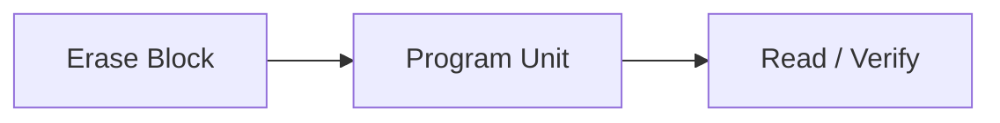
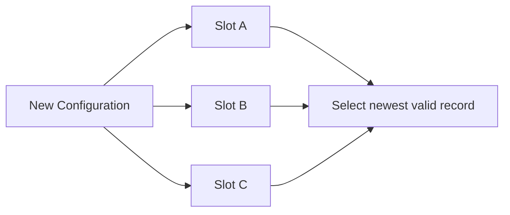
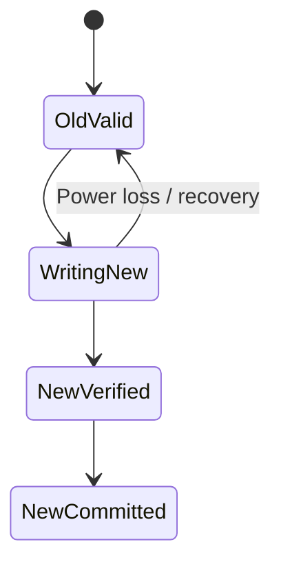
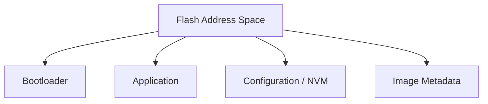

# Flash_NVM — 비휘발성 메모리와 데이터 보존

> 위치: `05_Embedded/Flash_NVM.md` · 내부 Flash/EEPROM/외부 NVM의 일반 원리. Erase 단위·Program 폭·수명·전원 조건은 부품 문서를 따른다.  
> **개념 정리 전용:** 실습·퀴즈 없음.

## 1. NVM의 종류

Non-Volatile Memory(NVM)는 전원 제거 후에도 데이터를 유지하는 저장 장치다.

| 종류 | 특징 | 대표 용도 |
|---|---|---|
| MCU Internal Flash | 코드 실행·설정 저장 | Firmware Image |
| EEPROM | 상대적으로 작은 단위 갱신 가능 | 설정·카운터 |
| External NOR Flash | 임의 읽기, Block Erase | 펌웨어·로그 |
| External NAND Flash | 큰 용량, Bad Block 관리 필요 | 대용량 데이터 |
| FRAM | 높은 쓰기 내구성, 부품별 제약 | 빈번한 상태 저장 |

실제 제품에서 EEPROM Emulation은 Flash를 사용해 EEPROM과 비슷한 인터페이스를 제공하는 소프트웨어 기법이다.

## 2. Flash의 Read·Program·Erase

Flash는 일반 RAM과 달리 쓰기 전에 **Erase**가 필요할 수 있다. 많은 Flash 기술에서 Erase는 Bit를 `1` 상태로 만들고 Program은 `1 → 0` 방향으로 변경한다. 세부 규칙은 제품별로 다르다.



| 단위 | 의미 |
|---|---|
| Page/Row/Word | 제품별 Program 단위 |
| Sector/Block | Erase 단위 |
| Bank | 실행·갱신 병렬성 등과 관련된 구분 |

**1 Byte만 바꾼다고 1 Byte만 지우는 것은 아니다.** Erase 단위가 크면 다른 데이터의 보존·재배치가 필요하다.

## 3. Endurance와 Retention

**Endurance**는 Erase/Program 반복 수명, **Retention**은 저장된 데이터를 유지하는 기간과 관련된다. 온도, 누적 사용량, 부품 등급에 따라 달라진다.

```text
쓰기 빈도 ↑ → 특정 Sector의 Wear ↑
온도·수명 조건 → Retention 검토 필요
```

무한 수명으로 가정하지 않고 Datasheet의 최소 보장 조건과 실제 기록 주기를 비교한다.

## 4. Wear Leveling

같은 주소에 설정값을 반복 저장하면 특정 Sector가 먼저 마모될 수 있다. Wear Leveling은 쓰기를 여러 물리 영역에 분산한다.



단순 순환 기록도 가능하지만 Sequence Number Wraparound, 공간 회수, Erase 중 전원 차단을 함께 설계해야 한다.

## 5. Power-loss Safety

NVM 갱신 도중 전원이 꺼지면 일부만 기록될 수 있다. **쓰기 완료 신호**와 **유효한 데이터로 확정(Commit)**하는 시점을 구분한다.



기본 전략:

- 기존 유효 데이터를 지우기 전에 새 레코드를 다른 공간에 기록한다.
- Version/Length/Sequence/CRC 등의 Metadata로 무결성을 검사한다.
- 마지막에 Commit Marker를 기록하는 방식 등을 고려한다.
- 재부팅 시 가장 최근의 **검증된** 레코드를 선택한다.

CRC는 우발적 데이터 손상을 검출하지만 **위변조에 대한 인증**은 제공하지 않는다. 보안이 필요하면 서명/MAC 등의 별도 기법이 필요하다.

## 6. Flash 동작 중 코드 실행 제약

일부 MCU는 Flash Erase/Program 중 같은 Bank의 명령어 Fetch를 제한한다. Interrupt Handler, Vector Table, 필요한 상수 데이터까지 영향받을 수 있다.

| 검토 대상 | 이유 |
|---|---|
| Flash Bank 구조 | Read-while-write 지원 여부 |
| RAM-resident Routine | 갱신 중 실행 필요성 |
| Interrupt | 실행 코드가 Flash에 있을 수 있음 |
| Watchdog | 긴 Erase 시간과 Refresh 정책 |
| Supply Voltage | Program/Erase 보장 전압 |

## 7. 메모리 맵과 Linker



링커가 코드 영역과 설정 영역을 겹치지 않게 배치해야 한다. 업데이트가 설정 데이터를 덮어쓰지 않는지 확인한다. 듀얼 뱅크와 A/B Slot은 같은 개념이 아니며 MCU 배치에 따라 다르다.

## 8. Bootloader와 Firmware Update

Image Header에는 Size, Version, Hash/CRC, 서명, 호환성 정보 등이 들어갈 수 있다. 업데이트 시 **수신 → 저장 → 검증 → 활성화 → 부팅 확인 → 확정**을 구분한다. Rollback 가능 여부는 Slot 구조와 Metadata의 원자적 갱신 정책에 달려 있다.

## 9. RTOS·동시성과 NVM

Flash Driver는 장시간 실행되거나 CPU·Bus를 점유할 수 있다. 여러 Task의 동시 접근, DMA와의 경합, ISR 접근, Cache/Instruction Fetch를 검토한다. NVM 기록 요청은 Queue로 직렬화하는 설계가 흔하다.

## 10. 로그와 Crash Record

반복 로그를 Flash에 무제한 저장하면 Wear와 Erase 지연이 발생한다. Ring Log, Rate Limit, 배치 기록, FRAM 같은 대체 저장소를 고려한다. Fault Handler에서 즉시 Flash를 쓰는 것이 안전하다고 가정하지 않는다.

## 핵심 체크리스트

- Program 단위와 Erase 단위를 구분한다.
- Endurance와 Retention을 제품 조건으로 계산한다.
- 전원 차단 후에도 이전 유효 데이터 또는 새 유효 데이터를 선택할 수 있어야 한다.
- CRC와 보안 인증의 역할을 구분한다.
- Flash 갱신 중 코드 실행·Interrupt·Watchdog 영향을 확인한다.

**다음:** `Firmware_Architecture.md`.
