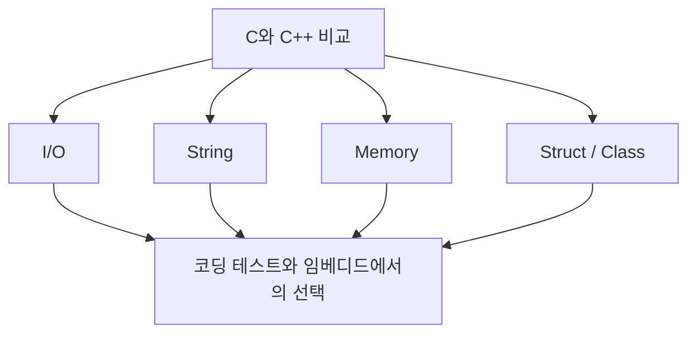
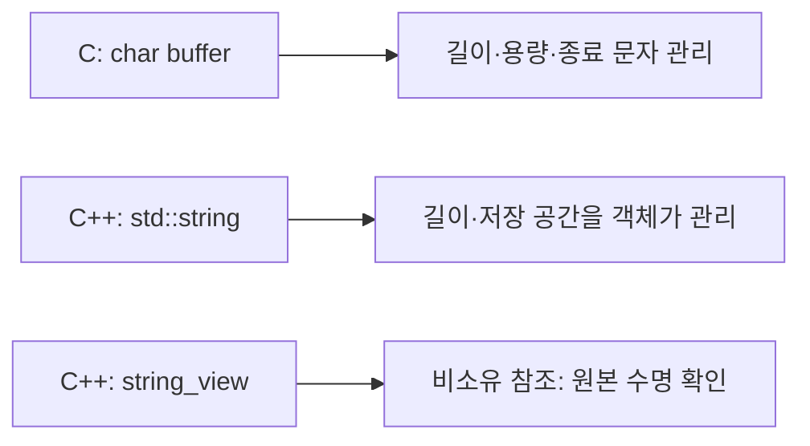
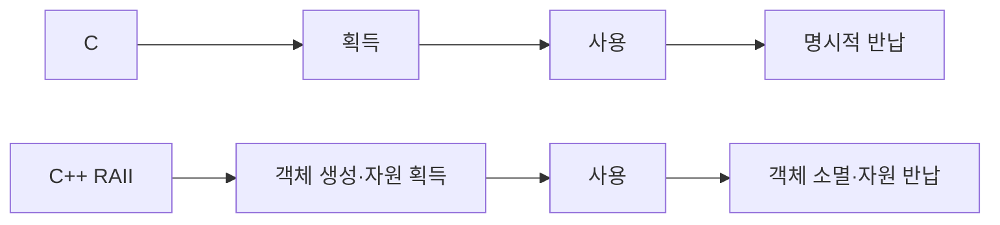
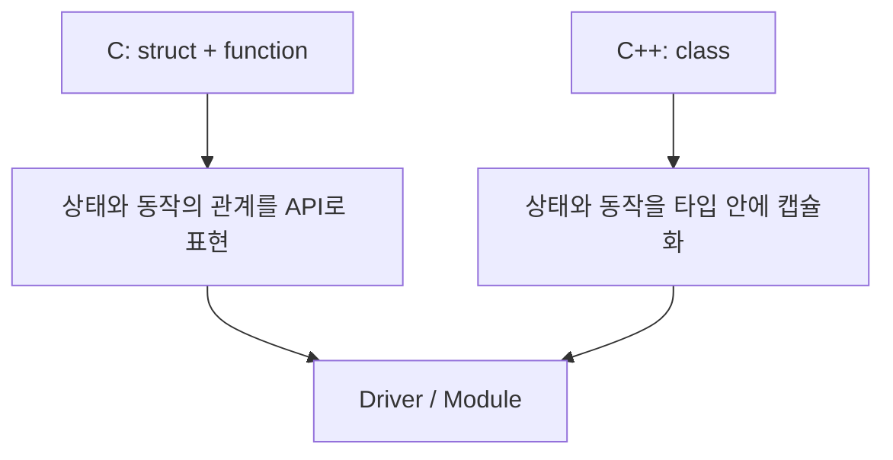

# C와 C++ 핵심 비교

> 위치: `C_Cpp_Study/03_Comparison/C_vs_CPP_Comparison.md`  
> 기존의 네 주제 **입출력·문자열·메모리·구조체/클래스**를 한 파일로 압축한 비교 노트.  
> 기준: **C17 / C++20**. 실습·퀴즈 없이 개념만 정리한다.



## 1. 입출력 — `stdio`와 Stream

| 비교 | C | C++ |
|---|---|---|
| 대표 헤더 | `<stdio.h>` | `<iostream>` |
| 표준 입력 | `scanf`, `fgets` | `std::cin`, `std::getline` |
| 표준 출력 | `printf`, `puts` | `std::cout` |
| 표현 방식 | 서식 문자열 `%d`, `%s` 등 | `<<`, `>>` 연산자와 타입 기반 처리 |
| 입력 오류 확인 | 반환값 확인 | Stream 상태 확인 |

```c
/* C */
int n;
if (scanf("%d", &n) == 1) {
    printf("%d\n", n);
}
```

```cpp
// C++
int n;
if (std::cin >> n) {
    std::cout << n << '\n';
}
```

**주의할 차이:** C의 `scanf("%d", &n)`에는 값을 기록할 주소가 필요하지만 C++의 `std::cin >> n`에는 보통 변수 자체를 전달한다. `scanf`와 `cin` 모두 실패를 확인해야 한다. C++에서 `std::cin >> n` 뒤에 `std::getline`을 사용할 때는 남아 있는 개행 문자를 고려한다.

코딩 테스트에서는 C++ Stream을 흔히 사용하며, 임베디드에서는 표준 입출력 대신 UART·RTT·전용 Logging API를 쓰는 경우가 많다.

---

## 2. 문자열 — Null-terminated Array와 `std::string`

| 비교 | C | C++ |
|---|---|---|
| 기본 표현 | `char[]`, `char *`와 종료 문자 `\0` | `std::string`; C 문자열도 사용 가능 |
| 길이 | `strlen` | `std::string::size()` |
| 비교 | `strcmp` | `==`, `<` 등 |
| 연결 | 버퍼 크기와 종료 문자 직접 관리 | `+`, `+=`, `append` |
| 비소유 View | `const char *` + 별도 길이 등 | `std::string_view` |

```c
/* C */
char name[16] = "MCU";
size_t len = strlen(name);
```

```cpp
// C++
std::string name = "MCU";
std::size_t len = name.size();
```

**핵심:** C 문자열은 `\0`을 포함할 공간과 버퍼 경계를 직접 관리한다. `std::string`은 문자열 저장 공간과 길이를 객체가 관리한다. 단, `std::string`의 확장에는 동적 할당이 발생할 수 있다. `std::string_view`는 문자를 소유하지 않으므로 원본의 수명이 먼저 끝나면 dangling view가 된다.



임베디드에서는 고정 크기 버퍼, 통신 패킷, C API 연동 때문에 C 문자열을 C++에서도 계속 사용한다.

---

## 3. 메모리 — 직접 관리와 RAII

| 비교 | C | C++ |
|---|---|---|
| 동적 할당 | `malloc`, `calloc`, `realloc` | `new` 및 표준 라이브러리 컨테이너 등 |
| 해제 | `free` | `delete`; RAII 객체의 소멸자 |
| 객체 초기화 | 할당과 초기화가 별도일 수 있음 | 생성자와 초기화 문법 |
| 자원 관리 방식 | 명시적인 획득·반납 흐름 | RAII로 객체 수명에 결합 가능 |
| 소유권 표현 | 코드 규약·API 계약 | `unique_ptr`, `shared_ptr` 등 활용 가능 |

```c
/* C */
int *p = malloc(4 * sizeof *p);
if (p != NULL) {
    /* 사용 */
    free(p);
}
```

```cpp
// C++
std::vector<int> values(4);  // 저장 공간을 컨테이너가 관리
```

**핵심:** C++도 포인터·주소·객체 수명이라는 저수준 원리를 공유한다. 차이는 자원 반납을 소멸자와 연결하는 **RAII** 및 소유권을 표현하는 표준 라이브러리 도구가 있다는 점이다. `malloc`은 C++ 객체의 생성자를 호출하지 않으며, `new`와 `free`, `malloc`과 `delete`를 섞어 사용하면 안 된다.



임베디드에서는 **C와 C++ 모두** Heap 사용 여부, 최대 메모리 사용량, 단편화, 할당 실패, 실행 시간 예측 가능성을 검토해야 한다. C++의 RAII가 곧 동적 할당을 뜻하지는 않는다.

---

## 4. 구조체와 클래스 — 데이터 묶음과 캡슐화

| 비교 | C `struct` | C++ `struct` / `class` |
|---|---|---|
| 데이터 멤버 | 가능 | 가능 |
| 멤버 함수·생성자·소멸자 | 언어 차원에서 없음 | 가능 |
| 접근 제어 | `public`/`private` 없음 | `public`, `private`, `protected` |
| 기본 접근 | 해당 없음 | `struct`: `public`, `class`: `private` |
| 사용 방식 | 데이터 + 별도 함수 | 데이터와 동작을 타입 내부에 묶을 수 있음 |

```c
/* C */
typedef struct {
    int value;
} Counter;

void counter_increment(Counter *counter);
```

```cpp
// C++
class Counter {
public:
    void increment();
private:
    int value_ = 0;
};
```

**핵심:** C++의 `struct`와 `class`는 별개 객체 모델이 아니라 기본 접근 지정자 등이 다른 클래스 타입이다. 단순 데이터 묶음에는 `struct`, 내부 상태와 불변식을 보호하는 인터페이스에는 `class`를 사용할 수 있다. C에서도 데이터와 조작 함수를 모듈 단위로 묶는 설계가 가능하다.



임베디드에서 두 방식 모두 드라이버 설계에 사용된다. 선택할 때는 팀의 언어 표준, 코드 크기, 초기화·소멸 시점, ABI, 하드웨어 접근 정책을 함께 고려한다.

---

## 한눈에 보는 선택 기준

| 상황 | 관련 도구와 고려사항 |
|---|---|
| C 기반 펌웨어 | `stdio` 사용 가능 환경 확인, 고정 버퍼, `struct` + 함수, 명시적 자원 관리 |
| C++ 코딩 테스트 | Stream, `std::string`, `std::vector`, 알고리즘과 RAII |
| C++ 임베디드 | RAII·`class` 활용 가능; 동적 할당·예외·실행 시간은 프로젝트 정책 확인 |
| C/C++ 경계 | C ABI, 객체 수명, 소유권, 문자열 길이, 예외 경계 확인 |

> **정리:** C와 C++는 주소·메모리·데이터 표현의 기초를 공유한다. C++는 그 위에 `std::string`, 컨테이너, 참조, 클래스, RAII 등 **추상화와 자원 관리 수단**을 추가한다. 어느 쪽이든 임베디드에서는 실제 비용과 하드웨어 제약을 확인해야 한다.

**다음 단계:** `04_Algorithm/Sorting.md`
