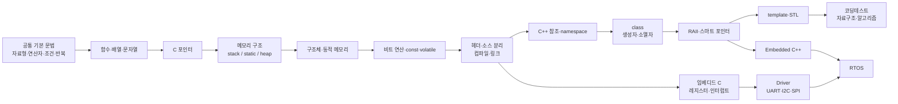
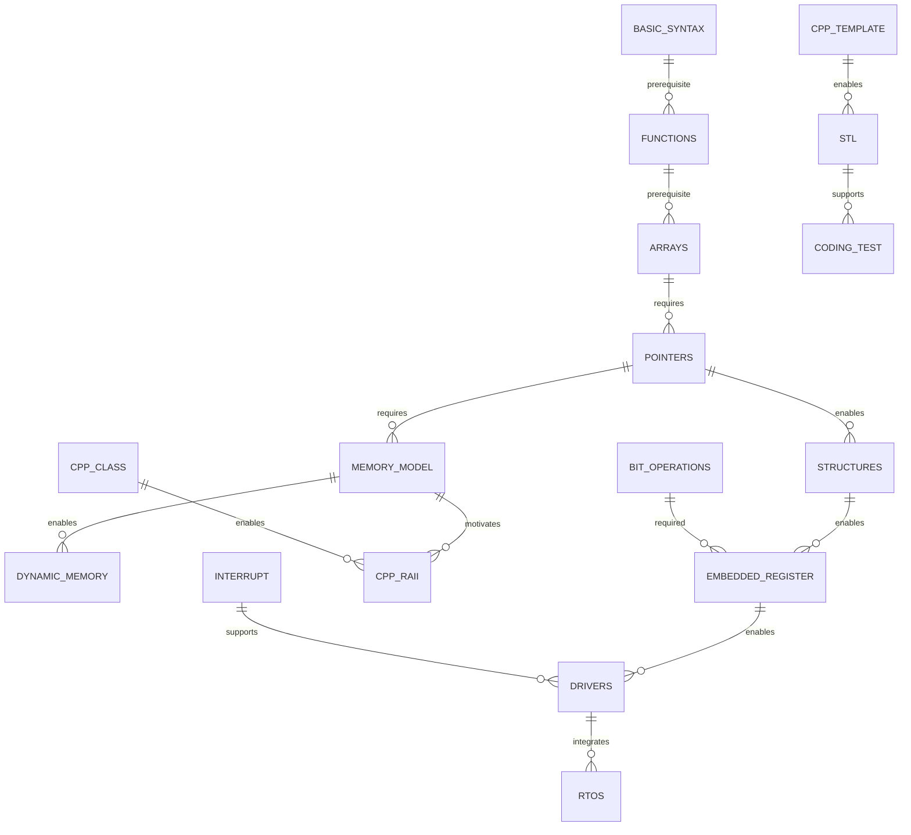

# C와 C++ 동시 학습을 위한 노트 구조와 학습 로드맵: 코딩테스트 + 임베디드/펌웨어

## 실행 요약

C와 C++를 모두 익혀야 하고 목표가 **코딩테스트와 임베디드/펌웨어 개발**이라면, 두 언어를 별개의 과목처럼 처음부터 끝까지 두 번 공부하는 방식은 비효율적이다. 가장 좋은 구조는 **공통 문법 → C로 메모리와 하드웨어에 가까운 개념 이해 → C++로 추상화·자원관리·STL 확장 → 코딩테스트와 임베디드 트랙 병행**이다. C++ Core Guidelines도 현대 C++에서 자원 관리, 인터페이스, 타입 안전성, 표준 라이브러리 사용을 핵심 원칙으로 두고 있으며, 동시에 동적 할당을 사용하는 일부 표준 라이브러리 구성요소는 하드 실시간·일부 임베디드 환경에 적합하지 않을 수 있음을 명시한다. citeturn1search8turn1search4

이 보고서는 **기본적인 프로그래밍 경험은 있지만 C/C++ 숙련도는 특정되지 않은 학습자**를 가정한다. 또한 목표 MCU, 회사의 코딩 규칙, IDE, RTOS, 컴파일러가 특정되지 않았으므로 임베디드 실습은 대표적인 **Arm Cortex-M + CMSIS + FreeRTOS** 계열을 기준 모델로 삼는다. CMSIS는 디바이스 헤더를 통해 코어와 주변장치 레지스터 접근을 표준화하고, FreeRTOS 공식 자료는 태스크·큐 등 RTOS 기본 개념과 실제 프로젝트 시작 경로를 제공한다. citeturn7search0turn7search2turn3search3turn3search5

12주 계획은 **주당 약 10~12시간, 총 120~145시간**을 가정한다. 이것은 “C/C++ 완전 마스터” 기간이 아니라, 다음 결과를 만드는 **첫 번째 집중 사이클**이다.

| 목표 영역 | 12주 종료 시 기대 수준 |
|---|---|
| C | 포인터, 배열, 문자열, 구조체, 동적 메모리, 비트 연산, `const`/`volatile`, 헤더 분리, 컴파일·링크 과정을 설명하고 직접 코드 작성 |
| C++ | 참조, 클래스, 생성자/소멸자, RAII, 템플릿 기초, `string`, `vector`, STL 컨테이너와 알고리즘을 문제 해결에 활용 |
| 코딩테스트 | C++로 배열·문자열·정렬·스택·큐·힙·해시·DFS/BFS·이분 탐색·기초 DP 문제를 독립적으로 풀이 |
| 임베디드 | 레지스터/비트 연산, MMIO 개념, 인터럽트/상태기계, UART류 드라이버 구조, 링버퍼, RTOS 태스크·큐의 기본 사용 이해 |
| 도구 | GCC/Clang 경고, GDB breakpoint/watchpoint, AddressSanitizer/UBSan, CMake의 기본 프로젝트 빌드 사용 |

학습 노트는 언어별로 완전히 분리하기보다 다음 네 층으로 만드는 것을 권한다.

```text
C_Cpp_Study/
│
├── 00_Common/
│   ├── Data_Type.md
│   ├── Operator.md
│   ├── Control_Flow.md
│   ├── Function.md
│   └── Memory_Model.md
│
├── 01_C/
│   ├── Pointer.md
│   ├── Array_String.md
│   ├── Struct.md
│   ├── malloc_free.md
│   ├── Bit_Operation.md
│   ├── volatile.md
│   └── Embedded_C.md
│
├── 02_CPP/
│   ├── Reference.md
│   ├── Class.md
│   ├── RAII.md
│   ├── Template.md
│   ├── STL.md
│   └── Smart_Pointer.md
│
├── 03_Comparison/
│   ├── C_vs_CPP_IO.md
│   ├── C_vs_CPP_String.md
│   ├── C_vs_CPP_Memory.md
│   └── C_vs_CPP_Struct_Class.md
│
├── 04_Algorithm/
│   ├── Sorting.md
│   ├── Stack_Queue.md
│   ├── Graph.md
│   └── DP.md
│
├── 05_Embedded/
│   ├── Register.md
│   ├── Interrupt.md
│   ├── UART.md
│   ├── Ring_Buffer.md
│   ├── FSM.md
│   └── RTOS.md
│
└── 99_Bug_Log/
    ├── Pointer_Bugs.md
    ├── Memory_Bugs.md
    ├── Compile_Link_Errors.md
    └── Algorithm_Mistakes.md
```

특히 `99_Bug_Log`가 중요하다. 노트를 단순한 “문법 사전”으로 만들기보다 **내가 실제로 틀린 코드 → 원인 → 수정 코드 → 재발 방지 규칙**을 기록하는 것이 좋다. 학습 연구에서도 단순 재독보다 연습 테스트와 분산 학습이 장기 기억에 효과적이라는 결과가 반복적으로 보고됐으며, Roediger와 Karpicke의 연구에서는 반복 재학습보다 회상 테스트가 지연된 기억 검사에서 더 높은 유지 효과를 보였다. Dunlosky 등의 종합 검토도 practice testing과 distributed practice를 높은 효용의 학습 전략으로 평가했다. citeturn8search8turn8search19turn8search1

## 학습 목표와 노트 설계

가장 먼저 목표를 **“C 문법을 안다”, “C++ 문법을 안다”**가 아니라 결과 중심으로 정의하는 것이 좋다.

코딩테스트에서는 C++를 주력 언어로 삼는 것을 권한다. `std::vector`, `std::string`, `std::sort`, `stack`, `queue`, `priority_queue` 같은 표준 라이브러리를 통해 직접 자료구조 구현에 쓰는 시간을 줄이고 문제의 알고리즘에 집중할 수 있기 때문이다. C++ Core Guidelines 역시 이미 잘 설계된 표준 라이브러리가 있을 때 직접 유사 기능을 구현하기보다 그것을 활용하도록 권한다. citeturn1search8 SW Expert Academy의 역량 테스트도 C/C++, Java, Python 등의 언어를 이용한 문제 해결을 지원하므로 현재 사용 중인 SWEA와 C++ 학습을 직접 연결할 수 있다. citeturn6search0

반대로 펌웨어에서는 C를 통해 **메모리가 실제로 어떻게 배치되고, 주소가 무엇이며, 포인터가 무엇을 가리키고, 비트를 어떻게 변경하며, 메모리 매핑된 레지스터를 어떻게 표현하는지**를 확실히 이해해야 한다. CMSIS의 주변장치 접근 방식도 장치 헤더에서 레지스터 레이아웃을 구조체 타입으로 정의하고, 베이스 주소와 비트 위치·마스크를 제공하는 방식이다. citeturn7search2turn7search8

그 뒤 C++를 임베디드에 적용할 때에는 “C++ 기능을 최대한 많이 사용한다”가 아니라 **비용과 효과를 알고 필요한 추상화만 사용한다**는 방향이 좋다. 특히 `RAII`, 강한 타입, 클래스에 의한 인터페이스 캡슐화, `constexpr`, 템플릿 같은 기능은 배울 가치가 크지만, 동적 메모리를 사용하는 컨테이너나 기능의 사용 여부는 메모리·실시간 제약과 프로젝트 정책을 고려해야 한다. C++ Core Guidelines는 일부 hard-real-time/embedded 환경에서 동적 할당에 의존하는 표준 라이브러리 부분이 부적절할 수 있다고 명시한다. citeturn1search8

노트 한 페이지는 다음 형식을 고정하는 것을 추천한다.

```text
# Pointer

## 한 문장 정의
주소를 저장하는 변수.

## 핵심 문법
int a = 10;
int *p = &a;

## 메모리 그림
a : 0x1000 [10]
p : 0x2000 [0x1000]

## 반드시 설명할 수 있어야 하는 것
&p 는 무엇인가?
*p 는 무엇인가?
p + 1 은 무엇인가?
배열과 포인터는 정확히 같은가?

## C
...

## C++
...

## Embedded 연결
volatile uint32_t *reg = ...

## 자주 한 실수
NULL dereference
dangling pointer
array out-of-bounds

## 직접 풀 문제
...

## 복습 질문
1. 포인터 자체의 주소는?
2. int**는 무엇인가?
3. const int*와 int* const의 차이는?
```

노트의 핵심은 마지막의 **복습 질문**이다. 읽기만 하지 말고 노트를 닫은 뒤 코드와 개념을 재생산해야 한다. 회상 연습의 장기 기억 효과는 앞서 언급한 testing-effect 연구와 부합한다. citeturn8search8turn8search1

복습 주기는 예를 들어 다음과 같이 운영할 수 있다.

```text
학습 당일
   ↓
다음 날 10분 회상
   ↓
3~4일 뒤 코드 재작성
   ↓
1주 뒤 관련 문제 풀이
   ↓
2~3주 뒤 C/C++ 혼합 문제
```

그리고 C와 C++를 완전히 블록으로 나누기보다 일정 시점 이후에는 섞어 연습하는 것이 좋다. 다른 유형을 교차하는 interleaved practice는 연습 순간에는 더 어렵게 느껴질 수 있지만, 관련 연구에서는 지연된 테스트 성과를 높이는 사례가 보고됐다. citeturn8search20turn8search24

## 로드맵과 주제 의존관계

전체 학습 순서는 다음이 가장 안정적이다.



개념 의존성을 관계 형태로 보면 더 명확하다.



세부 순서는 다음처럼 가져가는 것이 좋다.

| 단계 | 핵심 주제 | 반드시 포함할 하위 주제 | 권장 산출물 |
|---|---|---|---|
| 공통 기초 | 자료형·제어문·함수 | 정수/실수, 범위, 형변환, scope, 재귀 | 작은 프로그램 10~15개 |
| C 메모리 | 배열·포인터 | `&`, `*`, pointer arithmetic, 배열 decay, 이중 포인터 | 메모리 그림 노트 |
| C 문자열 | `char[]` | null terminator, `strlen`, `strcmp`, `memcpy` | 문자열 함수 직접 구현 |
| 구조체 | `struct` | 구조체 포인터, `->`, padding 개념 | 데이터 모델 2~3개 |
| 동적 메모리 | heap | `malloc/calloc/realloc/free` | 동적 배열·linked list |
| 시스템 기초 | build | 전처리→컴파일→어셈블→링크, `.h/.c` | 다중 파일 프로젝트 |
| 임베디드 C | 하드웨어 | fixed-width type, bit mask, `volatile`, MMIO | 레지스터 mock |
| C++ 기초 | C++ 차이 | reference, namespace, overload, `const` | C 코드를 C++로 리팩터링 |
| C++ 객체 | class | encapsulation, ctor/dtor, copy/move 개념 | 작은 클래스 설계 |
| 자원관리 | RAII | ownership, `unique_ptr` | 자원 wrapper |
| Generic | template | 함수/클래스 템플릿, type deduction 기초 | generic 함수 |
| STL | 컨테이너/알고리즘 | vector/string/map/set/queue/algorithm | 코딩테스트 템플릿 |
| 알고리즘 | 문제해결 | 정렬, 탐색, 그래프, DP | 문제 풀이 노트 |
| 펌웨어 | 주변장치 | GPIO/UART/I2C/SPI, interrupt, FSM | 미니 드라이버 |
| RTOS | 동시성 | task, queue, semaphore, priority | 통합 미니 프로젝트 |

임베디드의 레지스터 학습에서는 `volatile`을 반드시 배우되 **“volatile = 멀티스레드 동기화”라고 이해하면 안 된다.** C++ Core Guidelines는 `volatile`을 동기화 수단으로 사용하지 말라고 명시한다. 반면 CMSIS는 하드웨어 주변장치 레지스터 접근 권한을 표현하기 위해 전용 I/O qualifier를 제공한다. 즉 `volatile`의 임베디드 사용 맥락과 스레드 동기화의 원자성·메모리 모델은 구분해야 한다. citeturn1search8turn7search4

## C와 C++ 핵심 비교

2026년 9월 기준 ISO C++ 사이트는 현재 발행된 표준을 C++23, 즉 ISO/IEC 14882:2024로 안내하고 있으며 C++26 관련 자료는 진행 중인 작업 자료로 분류한다. C 쪽에서는 ISO/IEC 9899:2024 계열의 C23 문서와 후속 WG14 작업이 존재한다. 다만 초보 학습에서는 최신 기능을 전부 따라가기보다 **C17/C23 차이를 인지하면서 C 핵심을 익히고, C++는 C++17/20 문법과 표준 라이브러리를 기본으로 익힌 뒤 C++23 이후 기능을 델타 방식으로 추가**하는 것이 현실적이다. ISO C++ 사이트도 표준 문서 자체는 교육용 교재가 아니라 정확한 언어 정의를 위한 기술 문서라고 설명한다. citeturn13search12turn11search0

| 주제 | C | C++ | 학습 포인트 |
|---|---|---|---|
| 입출력 | `printf`, `scanf`, `fgets` | `cin`, `cout`, stream | 둘 다 직접 사용 |
| 메모리 | 객체 수명과 주소를 직접 의식 | 동일한 기초 + RAII 추상화 | C로 이해 후 C++로 안전화 |
| 포인터 | 핵심 인터페이스 도구 | 포인터 + reference + smart pointer | 포인터 자체는 동일하게 중요 |
| 문자열 | `char[]`, `char*`, `<string.h>` | `std::string`, `string_view` + C string | 임베디드는 양쪽 모두 필요 |
| 동적 메모리 | `malloc/free` | `new/delete`; 현대 C++에서는 RAII container/smart pointer 선호 | 직접 관리와 ownership 구분 |
| 구조체/클래스 | `struct`는 데이터 묶음 | `struct`와 `class` 모두 멤버 함수 가능 | C++의 기본 접근 지정 차이 이해 |
| 객체지향 | 언어 차원의 class/상속 없음 | encapsulation, inheritance, virtual | 임베디드에서는 필요한 만큼 |
| 템플릿 | 없음 | 함수·클래스 template | STL 이해의 기반 |
| STL | 없음 | containers, algorithms, iterators | 코딩테스트에서 핵심 |
| 헤더/빌드 | `.c` + `.h` | `.cpp` + `.h/.hpp` | translation unit·link 이해 |
| 툴체인 | `gcc`, `clang` 등 | `g++`, `clang++` 등 | 컴파일러 옵션과 표준 모드 |
| 디버깅 | GDB, sanitizer | 동일 + C++ 타입/예외 관련 기능 | 처음부터 병행 |
| 임베디드 | 매우 널리 적용 가능한 저수준 표현 | 추상화 가능하지만 프로젝트 제약 고려 | “C 대 C++”보다 비용 모델 이해 |

C++에서 `struct`와 `class`는 완전히 별개의 객체 모델이 아니다. 둘 다 클래스 타입을 정의할 수 있고 핵심 차이 중 하나는 기본 접근 권한으로, `struct`는 기본 `public`, `class`는 기본 `private`이다. C++ Core Guidelines도 독립적으로 변할 수 있는 데이터의 단순 집합에는 `struct`, 불변식과 캡슐화가 필요한 경우 `class` 사용을 권한다. citeturn10search0turn1search8

**입출력 비교**

```c
/* C */
#include <stdio.h>

int main(void)
{
    int n;

    scanf("%d", &n);
    printf("n = %d\n", n);

    return 0;
}
```

```cpp
// C++
#include <iostream>

int main()
{
    int n;

    std::cin >> n;
    std::cout << "n = " << n << '\n';

    return 0;
}
```

C에서는 `scanf`가 값을 저장할 주소를 필요로 하므로 `&n`을 넘기는 것이 중요한 포인터 학습 포인트다. C++ 스트림 입력에서는 `std::cin >> n`처럼 사용한다. 한국어 자료가 필요하면 모두의 코드가 C의 `stdio.h`와 C++의 `iostream`을 모두 레퍼런스로 제공한다. citeturn14view1

**포인터 비교**

기본 포인터 자체는 두 언어에서 매우 비슷하다.

```c
/* C */
#include <stdio.h>

int main(void)
{
    int value = 10;
    int *p = &value;

    *p = 20;

    printf("%d\n", value);   /* 20 */
    return 0;
}
```

```cpp
// C++
#include <iostream>

int main()
{
    int value = 10;

    int* p = &value;   // pointer
    int& r = value;    // C++ reference

    *p = 20;
    r = 30;

    std::cout << value << '\n';   // 30
}
```

따라서 C++ 포인터를 따로 처음부터 배우기보다 **C에서 주소·역참조·수명 개념을 잡고, 그 위에 C++ reference와 ownership 개념을 추가**하는 방식이 좋다.

**동적 메모리 비교**

```c
/* C */
#include <stdio.h>
#include <stdlib.h>

int main(void)
{
    int n = 5;

    int *arr = malloc(sizeof(*arr) * n);

    if (arr == NULL) {
        return 1;
    }

    arr[0] = 10;

    free(arr);
    arr = NULL;

    return 0;
}
```

`malloc`은 초기화되지 않은 저장 공간을 할당하며 실패 가능성을 고려해야 하고, 사용 후 `free`가 필요하다. citeturn10search6turn10search12

C++에는 `new/delete`가 존재하지만, 현대적인 일반 애플리케이션 C++ 학습에서는 raw `new/delete`를 최종 스타일로 삼기보다 **원리를 이해한 뒤 RAII 및 표준 컨테이너로 넘어가는 것**이 좋다. C++ Core Guidelines는 자원 누수를 피하고 소유권을 raw pointer로 표현하지 않는 방향을 강조한다. citeturn1search8

```cpp
// C++ - low-level 개념 확인용
int* arr = new int[5];

arr[0] = 10;

delete[] arr;
```

실제 일반 C++에서는 보통 다음 쪽이 더 중요한 형태다.

```cpp
#include <vector>

int main()
{
    std::vector<int> arr(5);

    arr[0] = 10;
}
```

단, 이것을 그대로 모든 펌웨어에 적용한다는 의미는 아니다. 동적 할당의 예측 가능성이 중요한 hard real-time 환경에서는 컨테이너와 allocator 정책을 별도로 검토해야 한다. citeturn1search8

**C 구조체와 C++ 클래스**

```c
/* C */
#include <stdio.h>

typedef struct {
    int x;
    int y;
} Point;

void move(Point *p, int dx, int dy)
{
    p->x += dx;
    p->y += dy;
}

int main(void)
{
    Point p = {10, 20};

    move(&p, 3, 4);

    printf("%d %d\n", p.x, p.y);
    return 0;
}
```

```cpp
// C++
#include <iostream>

class Point {
private:
    int x_;
    int y_;

public:
    Point(int x, int y)
        : x_(x), y_(y)
    {
    }

    void move(int dx, int dy)
    {
        x_ += dx;
        y_ += dy;
    }

    int x() const { return x_; }
    int y() const { return y_; }
};

int main()
{
    Point p(10, 20);

    p.move(3, 4);

    std::cout << p.x() << ' ' << p.y() << '\n';
}
```

이 비교에서 중요한 것은 “C는 나쁘고 C++ 클래스가 좋다”가 아니다. C에서는 데이터와 조작 함수를 명시적으로 연결하는 방식을 익히고, C++에서는 **타입 내부에 불변식과 동작을 캡슐화하는 방법**을 배우는 것이다. C++ Core Guidelines는 관련 데이터를 구조체나 클래스에 조직하고, 내부 표현을 최소한으로 노출하도록 권한다. citeturn1search8

## 실습 난이도와 시간 배분

12주 동안의 권장 총량은 약 **140시간**이다. 아래 시간은 연구 결과가 아니라 이 목표 범위에 맞춘 학습 설계 추정치이며, 이미 아는 부분은 줄이고 포인터·알고리즘·임베디드에 재배분하면 된다.

| 영역 | 권장 시간 | 핵심 결과 |
|---|---:|---|
| C/C++ 공통 문법 | 8시간 | 문법 때문에 문제 풀이가 막히지 않음 |
| 배열·문자열·함수 | 10시간 | C 배열과 문자열 수명 이해 |
| 포인터·메모리 모델 | 18시간 | 가장 중요 |
| 구조체·모듈·헤더 | 10시간 | 다중 파일 프로그램 |
| C++ class·RAII | 14시간 | 객체 수명·ownership |
| template·STL | 16시간 | 코딩테스트 도구 확보 |
| 자료구조·알고리즘 | 24시간 | 실전 문제 풀이 |
| 빌드·GDB·sanitizer | 10시간 | 디버깅 자립 |
| Embedded C/C++ | 20시간 | 레지스터·interrupt·driver |
| RTOS | 10시간 | task·queue·동기화 |
| **합계** | **140시간** | 1차 실무 기반 |

연습은 다음 다섯 단계로 높이는 것을 권한다.

| 난이도 | 예제 |
|---|---|
| 기초 | 최대/최솟값, 배열 합, 문자열 길이, 소수 판별 |
| 메모리 | swap by pointer, 배열을 함수로 전달, 동적 배열, 문자열 함수 직접 구현 |
| 자료구조 | linked list, stack, queue, ring buffer를 C로 구현 |
| C++ 전환 | 동일 기능을 class/vector/string/STL로 다시 작성 |
| 응용 | 코딩테스트 문제 + UART parser/FSM/RTOS mini project |

특히 같은 자료구조를 **한 번은 C로 직접 구현하고, 한 번은 C++ STL로 사용**해보면 두 목표를 동시에 만족시킬 수 있다.

예를 들어 큐는 다음처럼 진행한다.

```text
Step A
C 배열로 queue 구현

Step B
원형 queue 구현

Step C
ring buffer 구현

Step D
C++ std::queue 사용

Step E
BFS 문제 풀이

Step F
UART RX ring buffer에 응용
```

이런 연결이 중요하다. `queue`를 코딩테스트 자료구조 하나로 끝내지 않고 임베디드에서 데이터 스트림 버퍼링까지 연결하는 식이다.

추천 실습 묶음은 다음과 같다.

| 주제 | 실습 |
|---|---|
| 배열 | 최솟값/최댓값, 회전, prefix sum |
| 포인터 | swap, 배열 탐색, 이중 포인터 |
| 문자열 | `strlen`, `strcmp`, tokenizer 간단 구현 |
| 구조체 | 학생 데이터, 좌표, packet 구조 |
| 동적 메모리 | 동적 배열, linked list |
| 비트 | 특정 bit set/clear/toggle/read |
| C++ 클래스 | `Point`, `Timer`, `RingBuffer` |
| STL | vector/string/map/set/heap |
| 알고리즘 | sort, binary search, BFS/DFS, DP |
| 임베디드 | GPIO register mock |
| 통신 | UART packet parser |
| 상태기계 | button debounce 또는 protocol FSM |
| RTOS | producer-consumer를 queue로 연결 |

코딩테스트 문제는 한국 환경에서는 SWEA와 BOJ를 함께 쓰기 좋다. SWEA는 공식적으로 C/C++ 등의 언어를 이용한 SW 문제 해결 훈련을 제공하고 있으며, solved.ac는 BOJ 문제에 난이도 정보를 연결해 단계적인 문제 선정에 활용할 수 있다. citeturn6search0turn6search9

단순히 정답을 맞힌 문제 수를 세기보다 문제마다 다음 정도만 기록하는 것이 좋다.

```text
문제:
난이도:
알고리즘:
내 최초 아이디어:
틀린 이유:
시간복잡도:
핵심 코드:
다시 풀 날짜:
```

예를 들어 현재 작성했던 최솟값/최댓값 이동 문제라면:

```text
핵심 관찰
모든 좌표의 정렬 순서가 필요한 것이 아니다.

필요 정보
minimum
maximum

잘못된 초기 풀이
sort -> O(N log N)

개선
입력하면서 min/max -> O(N)

C 구현:
...

C++ 구현:
...

복습 질문
정렬이 실제로 필요한 문제와
극값만 필요한 문제를 어떻게 구분할까?
```

이런 노트가 단순 정답 코드 보관보다 훨씬 가치가 있다.

## 추천 자료와 개발 도구

공식 표준 문서는 언어를 처음 배우는 교재보다는 **“정확한 정의가 필요할 때 확인하는 최종 레퍼런스”**로 사용하는 것이 좋다. ISO C++ 공식 사이트도 표준이 교육용 튜토리얼이 아니라 컴파일러·라이브러리 구현자 등을 위한 상세 기술 문서라고 직접 설명한다. citeturn13search12

| 자료 | 용도 | 언어 | 우선도 |
|---|---|---|---|
| [모두의 코드](https://modoocode.com/) | C/C++ 입문, 한국어 설명 | 한국어 | 매우 높음 |
| [Microsoft Learn C/C++](https://learn.microsoft.com/ko-kr/cpp/) | 포인터·언어·빌드 참고 | 한국어 | 높음 |
| [cppreference](https://en.cppreference.com/w/) | C/C++ 문법·표준 라이브러리 레퍼런스 | 영어 | 매우 높음 |
| [C++ Core Guidelines](https://isocpp.github.io/CppCoreGuidelines/CppCoreGuidelines) | 현대 C++ 설계·자원관리 관점 | 영어 | 매우 높음 |
| [Standard C++ — The Standard](https://isocpp.org/std/the-standard) | 표준 상태와 공식 안내 | 영어 | 참고 |
| [WG14 자료](https://www.open-std.org/jtc1/sc22/wg14/) | C 표준 원문·draft | 영어 | 참고 |
| [GCC Manual](https://gcc.gnu.org/onlinedocs/gcc/) | 컴파일러 옵션·경고·표준 모드 | 영어 | 높음 |
| [GDB Manual](https://sourceware.org/gdb/current/onlinedocs/gdb.html/) | breakpoint/watchpoint/debug | 영어 | 높음 |
| [CMake Tutorial](https://cmake.org/cmake/help/latest/guide/tutorial/) | 프로젝트 빌드 | 영어 | 높음 |
| [Clang AddressSanitizer](https://clang.llvm.org/docs/AddressSanitizer.html) | 메모리 오류 탐지 | 영어 | 매우 높음 |
| [Clang UBSan](https://clang.llvm.org/docs/UndefinedBehaviorSanitizer.html) | undefined behavior 탐지 | 영어 | 높음 |
| [Arm CMSIS](https://arm-software.github.io/CMSIS_6/latest/Core/) | Cortex-M, 레지스터·코어 접근 | 영어 | 임베디드 필수 |
| [FreeRTOS Documentation](https://www.freertos.org/Documentation/) | RTOS 학습 | 영어 | 임베디드 필수 |
| [SW Expert Academy](https://swexpertacademy.com/) | 코딩테스트 실습 | 한국어 | 높음 |
| [Baekjoon Online Judge](https://www.acmicpc.net/) | 알고리즘 문제 | 한국어 | 매우 높음 |
| [solved.ac](https://solved.ac/) | BOJ 난이도 기반 문제 선택 | 한국어 | 높음 |

모두의 코드는 현재 C 강좌 42개와 C++ 강좌 50개를 제공하고 있으며 C++ 강좌는 C를 이미 어느 정도 아는 독자를 전제로 C++17까지 다룬다고 설명한다. 따라서 이 보고서에서 권하는 **C 기초 → C++ 확장** 구조와 잘 맞는다. 다만 일부 강좌의 최초 작성 시기가 오래되었으므로 정확한 표준 세부사항은 cppreference나 표준 문서와 교차 확인하는 것이 좋다. citeturn14view1

cppreference는 실무적으로 매우 훌륭한 레퍼런스이지만 ISO 공식 표준 문서 그 자체는 아니다. Standard C++ Foundation 역시 cppreference를 일반적인 비공식 참고 자료로 활용할 수 있다고 안내한다. citeturn13search12

빌드 공부는 GCC 옵션 몇 개부터 실제로 사용해야 한다. GCC는 `-std=`로 C/C++ 방언을 선택할 수 있고, 표준 준수와 진단 관련 옵션을 제공한다. citeturn2search6turn2search14 예를 들어 PC 실습에서는 다음 정도를 기본 템플릿으로 둘 수 있다.

```bash
# C
gcc -std=c17 -Wall -Wextra -Wpedantic -g main.c -o main

# C++
g++ -std=c++20 -Wall -Wextra -Wpedantic -g main.cpp -o main
```

메모리 실습 중에는 sanitizer도 적극적으로 쓰는 것을 권한다. Clang의 AddressSanitizer는 heap/stack/global 범위 오류, use-after-free, double-free 등 다양한 메모리 오류를 탐지할 수 있고, UBSan은 잘못된 shift, null/misaligned pointer dereference, signed integer overflow 등 여러 undefined behavior를 실행 중 검사할 수 있다. citeturn4search15turn4search20

```bash
clang -g -fsanitize=address,undefined main.c -o main

clang++ -g -fsanitize=address,undefined main.cpp -o main
```

GDB에서는 처음부터 최소한 다음을 사용할 수 있어야 한다.

```text
break
run
next
step
print
display
watch
backtrace
x
```

GDB 공식 문서에서 breakpoint는 특정 코드 위치에서 실행을 멈추고, watchpoint는 특정 표현식 값이 변경될 때 실행을 멈추는 기능으로 정의된다. 포인터와 레지스터 관련 문제를 공부할 때 특히 watchpoint와 메모리 조회가 유용하다. citeturn4search9turn4search1

CMake는 언어 문법 다음 단계가 아니라 **두세 개의 `.c/.cpp` 파일을 분리하기 시작하는 순간** 도입하는 것이 좋다. 공식 CMake 튜토리얼은 기본 실행 파일부터 라이브러리와 일반적인 빌드 시스템 문제까지 단계적으로 다룬다. citeturn4search0

책은 다음 조합이 효율적이다.

| 책 | 추천 시점 | 평가 |
|---|---|---|
| 윤성우의 **열혈 C 프로그래밍** | C 처음~포인터 | 한국어로 C 전체 구조를 익히기 좋음. 다만 2010년 개정판이므로 최신 표준 확인은 별도 필요 citeturn5search13 |
| **C++ Primer 5th** | C 기초 후 | 매우 체계적이지만 C++11 시대 책이므로 현대 변경사항 보완 필요. 한국어판 존재 citeturn5search1 |
| Bjarne Stroustrup, **A Tour of C++, 3rd** | C++ 기초 후 | 경험 있는 프로그래머를 위한 비교적 짧은 C++20 중심 개관서 citeturn11search1 |
| Scott Meyers, **Effective Modern C++** | 클래스/STL 이후 | C++11/14의 타입 추론, 이동 의미론, smart pointer 등 심화. 한국어판 존재 citeturn5search5turn5search8 |
| **Mastering the FreeRTOS Real Time Kernel** | RTOS 진입 시 | FreeRTOS 공식 학습서 citeturn11search2turn3search5 |

`A Tour of C++` 3판은 저자인 Bjarne Stroustrup의 공식 사이트가 경험 있는 프로그래머를 대상으로 한 약 254페이지 규모의 C++ 언어 및 표준 라이브러리 개관서라고 소개한다. 따라서 완전 초보 교재보다는 C 기초와 C++ 입문을 끝낸 뒤 전체 그림을 정리하기에 적합하다. citeturn11search1

임베디드 실습에 들어가면 CMSIS 문서를 읽는 습관도 만들어야 한다. CMSIS 디바이스 헤더는 프로세서 코어와 주변장치에 대한 접근을 제공하며, 주변장치 레지스터의 bit position과 mask 정의 방식을 표준적으로 제시한다. citeturn7search0turn7search2

## 주차별 계획과 흔한 함정

아래 일정은 **주당 10~12시간**을 기준으로 한다. 매주 학습 시간은 대략 `이론 30% + 직접 코딩 40% + 문제/프로젝트 20% + 복습 10%` 정도로 시작하되, 5주차 이후에는 코딩 비중을 더 높이는 것이 좋다.

| 주차 | 핵심 학습 | 실습 | 주간 결과물 |
|---|---|---|---|
| 1주 | C/C++ 공통 문법, 자료형, 연산자, 조건·반복, 함수 | 작은 문제 C/C++ 각각 작성 | 비교 노트 5개 |
| 2주 | 배열, 문자열, 함수 인자, scope | 문자열 함수·배열 문제 | `Array_String.md` |
| 3주 | 포인터, `&`, `*`, 배열-포인터 관계, 이중 포인터 | swap, 배열 탐색, pointer tracing | 메모리 그림 10개 |
| 4주 | `struct`, `malloc/free`, stack/heap, 헤더 분리 | linked list 또는 동적 배열 | **C 기초 마일스톤** |
| 5주 | C++ reference, function overload, class, ctor/dtor | C 구조체 코드를 class로 변환 | 클래스 3개 |
| 6주 | RAII, copy/move 개념, template, vector/string | 동적 배열 → vector 리팩터링 | C/C++ 메모리 비교 노트 |
| 7주 | STL, sort, binary search, stack/queue/heap | BOJ/SWEA 문제 | 알고리즘 템플릿 |
| 8주 | DFS/BFS, graph, greedy, DP 기초 | 중급 문제 집중 | **코테 마일스톤** |
| 9주 | compiler, linker, CMake, GDB, sanitizer | 의도적으로 bug 삽입·추적 | Debug Log |
| 10주 | fixed-width integer, bit operation, `volatile`, MMIO, interrupt 개념 | 가상 GPIO register | embedded 기초 노트 |
| 11주 | UART, ring buffer, packet parser, FSM | host에서 UART RX simulation | 미니 드라이버 |
| 12주 | FreeRTOS task/queue, 전체 복습 | producer-consumer 또는 센서 모사 프로젝트 | **통합 마일스톤** |

첫 마일스톤에서는 다음 코드를 보지 않고 설명할 수 있어야 한다.

```c
int value = 10;
int *p = &value;
int **pp = &p;
```

다음 질문에 답할 수 있어야 한다.

```text
value의 값?
&value의 의미?
p의 값?
&p의 의미?
*p의 값?
pp의 값?
*pp의 값?
**pp의 값?
```

두 번째 마일스톤에서는 C++로 다음 자료구조와 알고리즘을 코드 검색 없이 사용할 수 있는 수준을 목표로 한다.

```text
vector
string
pair

stack
queue
priority_queue

set / unordered_set
map / unordered_map

sort
lower_bound
upper_bound

DFS
BFS
binary search
prefix sum
two pointer
기초 DP
```

세 번째 마일스톤은 작은 통합 프로젝트가 좋다. 실제 보드가 아직 없다면 PC에서 다음 구조를 모사할 수 있다.

```text
가상 Sensor
    ↓
Sensor Task
    ↓
Queue
    ↓
Processing Task
    ↓
Ring Buffer
    ↓
가상 UART
```

그 뒤 MCU가 정해지면 실제 HAL/CMSIS 코드로 바꾸면 된다. FreeRTOS 공식 Beginner/Quick Start 자료는 실제 target에서 kernel을 시작하고 이후 학습으로 이어지는 경로를 제공한다. citeturn3search3turn3search7

마지막으로 다음 함정들은 별도의 `Bug_Log`에 계속 누적해야 한다.

| 흔한 실수 | 왜 위험한가 | 기억할 규칙 |
|---|---|---|
| `=`와 `==` 혼동 | 조건 자체가 달라짐 | compiler warning 켜기 |
| 배열 범위 초과 | undefined behavior | index 조건 확인 + sanitizer |
| 초기화되지 않은 포인터 | 임의 주소 접근 | 선언 즉시 초기화 |
| 지역 변수 주소 반환 | lifetime 종료 | 객체 수명 먼저 확인 |
| `malloc` 후 `free` 누락 | memory leak | ownership 기록 |
| `free` 후 접근 | use-after-free | free 후 사용 금지 |
| C++에서 `new/delete` 남발 | ownership 복잡화 | RAII 먼저 검토 |
| `new[]`에 `delete` | deallocation mismatch | `new[] ↔ delete[]` |
| `vector` 변경 뒤 iterator 사용 | iterator invalidation 가능 | container invalidation 규칙 확인 |
| signed/unsigned 혼용 | 비교 결과가 예상과 달라질 수 있음 | 타입 의식 |
| `volatile`을 thread lock처럼 사용 | synchronization을 보장하지 않음 | atomic/RTOS primitive와 구분 citeturn1search8 |
| 헤더에 정의 중복 | link error/ODR 문제 | declaration과 definition 구분 |
| `printf`만으로 디버깅 | 복잡한 메모리 버그 추적 어려움 | GDB/watchpoint/sanitizer 병행 |
| 컴파일만 이해하고 링크를 모름 | 다중 파일 오류 대응 어려움 | preprocess→compile→link 흐름 이해 |

특히 메모리 버그는 “눈으로 코드를 더 오래 본다”보다 도구로 재현하고 원인을 추적하는 습관을 들이는 것이 좋다. AddressSanitizer는 out-of-bounds, use-after-free, double-free 같은 오류를, UBSan은 여러 undefined behavior를 런타임에 검출하도록 설계되어 있다. citeturn4search15turn4search20

결론적으로 이 학습의 중심 구조는 다음과 같다.

```text
              [ C / C++ 공통 ]
                    |
          자료형 / 함수 / 배열
                    |
                 Pointer
                    |
               Memory Model
              /             \
             /               \
      Embedded C            Modern C++
       Bit/MMIO              RAII/Class
        Driver              STL/Template
          |                    |
     UART / IRQ          Coding Test
          |                    |
        RTOS  <----- Embedded C++ 
```

핵심 우선순위는 **`포인터 → 메모리 → 구조체 → 비트 연산 → 빌드/디버깅`을 C로 단단히 잡고, 그 위에 `reference → class → RAII → template → STL`을 C++로 얹는 것**이다. 이후 코딩테스트에서는 C++ STL을 적극 활용하고, 펌웨어에서는 C 수준의 메모리·하드웨어 이해를 유지하면서 C++ 추상화의 비용과 이점을 선택적으로 적용하는 것이 두 목표를 가장 자연스럽게 연결한다. C++ Core Guidelines가 강조하는 타입 안전성·자원 관리·표준 라이브러리 활용과, CMSIS가 보여주는 레지스터·주변장치 중심의 저수준 인터페이스를 함께 이해하는 것이 이 두 트랙을 연결하는 핵심이다. citeturn1search8turn7search0turn7search2