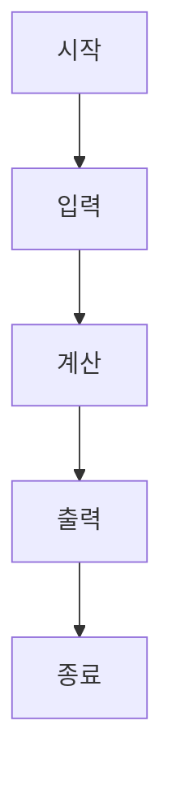
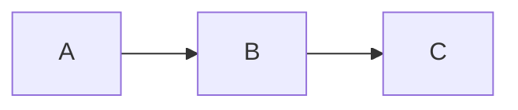
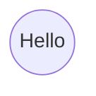
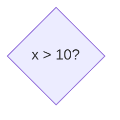
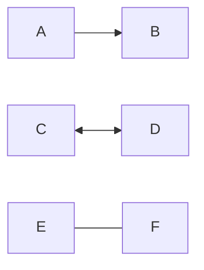
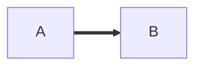
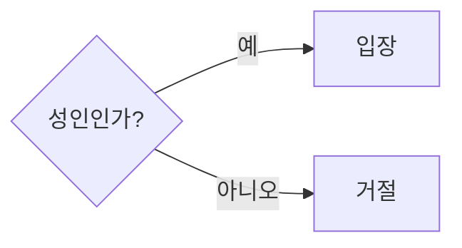
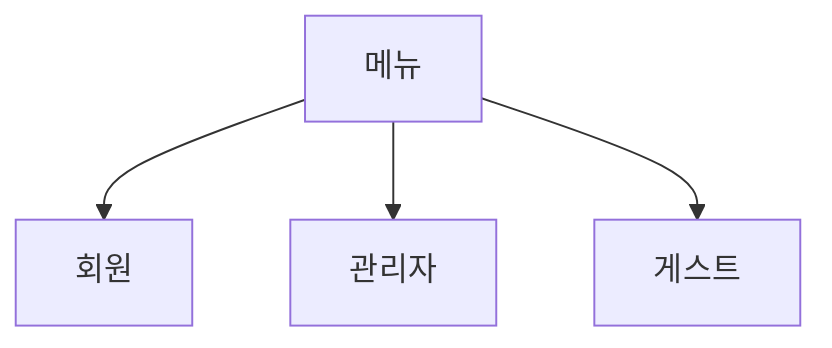
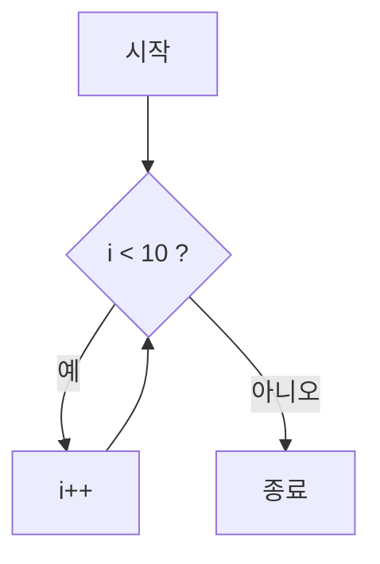
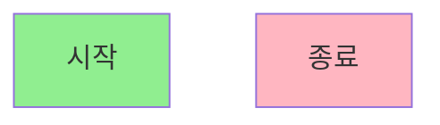

## Mermaid 문법
### FlowChart
```markdown
  flowchart TD
  A[시작]
  B[입력]
  C[계산]
  D[출력]
  E[종료]

  A --> B
  B --> C
  C --> D
  D --> E
```

---
flowchart를 사용할 때는 `flowchart TD`로 시작합니다
TD는 방향입니다.
TD: 위 → 아래
TB: 위 → 아래(TD와 동일)
LR: 왼쪽 → 오른쪽
RL: 오른쪽 → 왼쪽
BT: 아래 → 위

##### LR 예시

#### 노드
##### 사각형
```markdown
  A[Hello]
```

##### 둥근 사각형
```markdown
  A(Hello)
```

##### 원
```markdown
  A((Hello))
```


##### 마름모(조건)
마름모 문양은 조건문을 사용할 때 주로 사용합니다.
```markdown
  A{x > 10?}
```

##### 입력
```markdown
  A[/사용자 입력/]
```

##### 출력
```markdown
  A[\사용자 입력\]
```


##### 화살표 종류
```markdown
  A --> B
  A <-- B
  A <--> B
  A --- B
```

##### 점선
```markdown
  A -.-> B
```

##### 굵은 선
```markdown
  A ==> B
```

##### 화살표에 글작성
```markdown
  A{성인인가?}
  A -->|예| B[입장]
  A -->|아니오| C[거절]
```

##### 여러갈래
```markdown
A[메뉴]
A --> B[회원]
A --> C[관리자]
A --> D[게스트]
```

##### 다시 돌아가기(반복)
```markdown
A[시작]
B{i < 10 ?}
C[i++]
D[종료]
A --> B
B -->|예| C
C --> B
B -->|아니오| D
```

##### 색상 스타일 지정
```markdown
A[시작]
B[종료]
style A fill:#90EE90
style B fill:#FFB6C1
```
