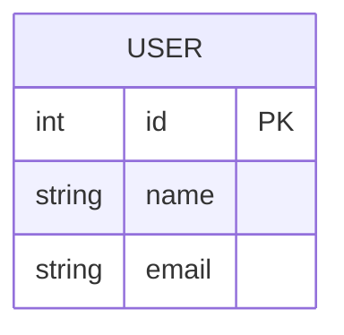

## ER Diagram
DB 테이블 및 관계 표현 다이어그램
### 시작
```markdown
erDiagram
```

### Entity 엔티티
```markdown
USER {
    int id PK
    string name
    string email
}
```


#### 자료형
int
string
float
boolean
date
datetime

### 관계 (relationship)
```markdown
USER ||--o{ POST : writes
```

#### 관계기호
| Value (left)	 | Value (left)	 | Meaning |
|:---:|:---:|:---|
| \|o | o\| | Zero or one |
| \|\| | \|\| | Exactly one |
| }o | o{ | Zero or more (no upper limit)|
| }\| | \|{ | One or more (no upper limit) |

---

---


`ER 다이어그램은 추후 더 필요하게 되면 추가로 정리`