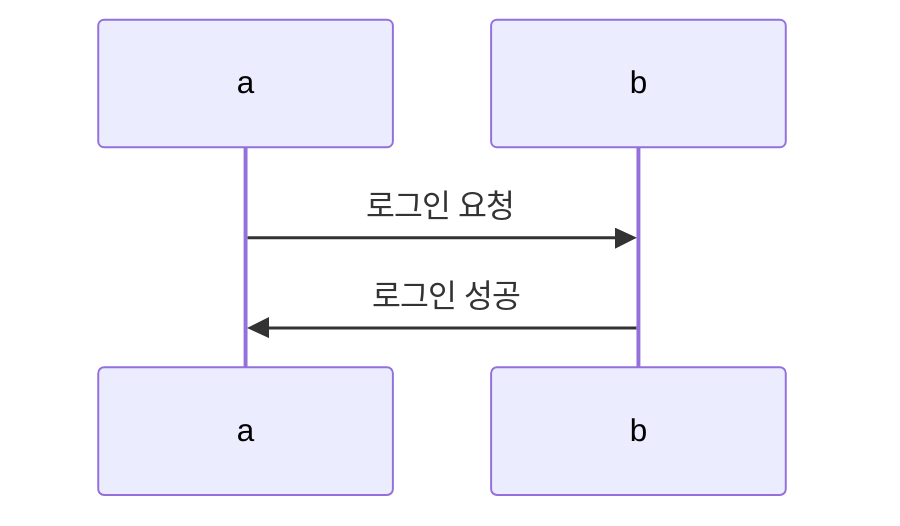
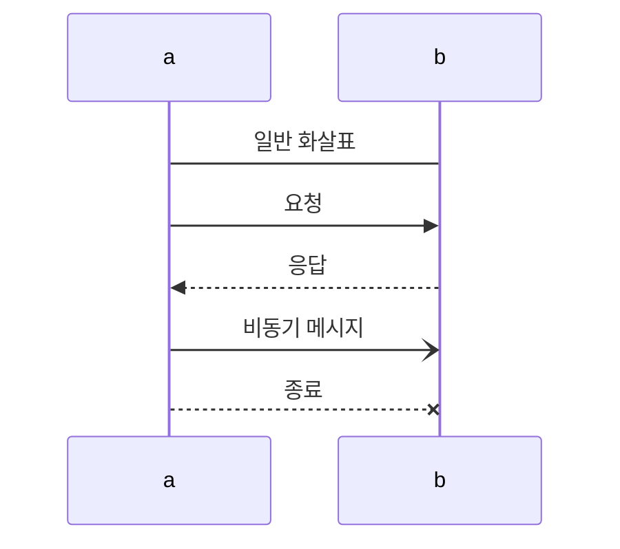
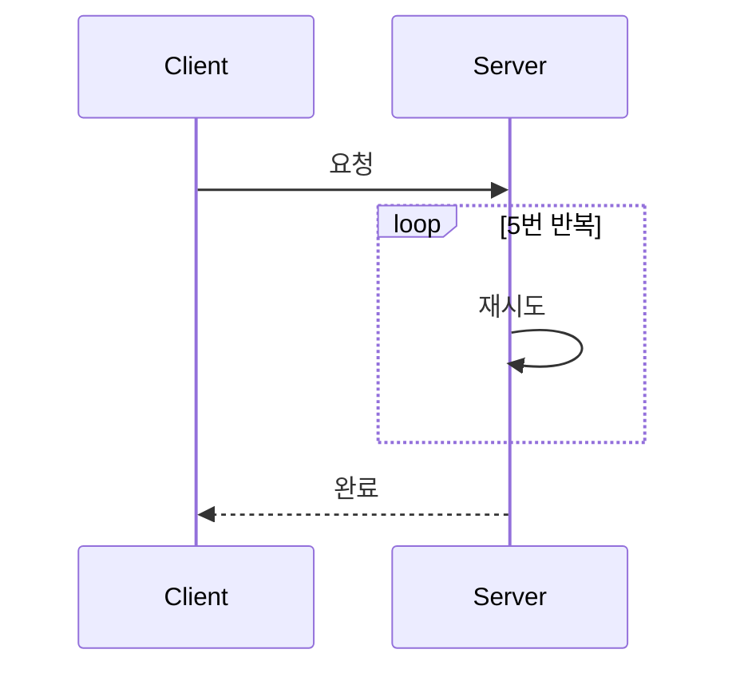

### sequence diagram
#### 기본 문법
```markdown
sequenceDiagram
a ->> b :로그인 요청
b ->> a :로그인 성공
```

#### 화살표 종류
```markdown
a ->> b :요청
a -->> b :응답
a -) b :비동기 메시지
a --x b :종료
a -> b :일반 화살표
```

#### 반복문 표현
```markdown
Client->>Server: 요청
loop 5번 반복
Server->>Server: 재시도
end
Server-->>Client: 완료
```
