### sequence diagram
#### 기본 문법
```markdown
sequenceDiagram
a ->> b :로그인 요청
b ->> a :로그인 성공
```
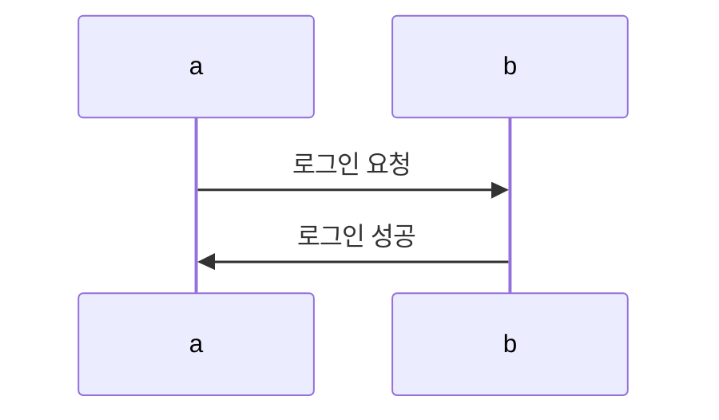
#### 화살표 종류
```markdown
a ->> b :요청
a -->> b :응답
a -) b :비동기 메시지
a --x b :종료
a -> b :일반 화살표
```
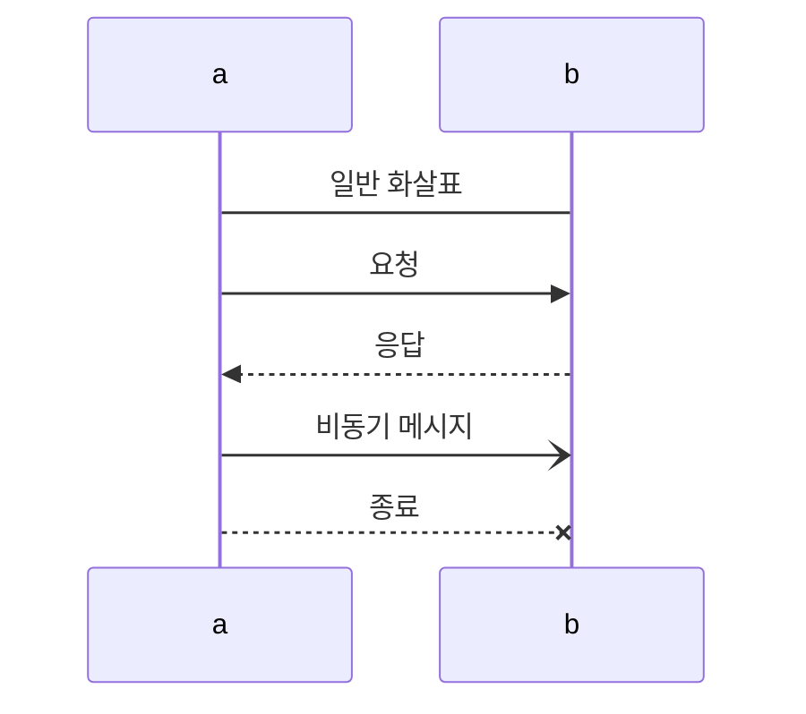
#### 반복문 표현
```markdown
Client->>Server: 요청
loop 5번 반복
Server->>Server: 재시도
end
Server-->>Client: 완료
```
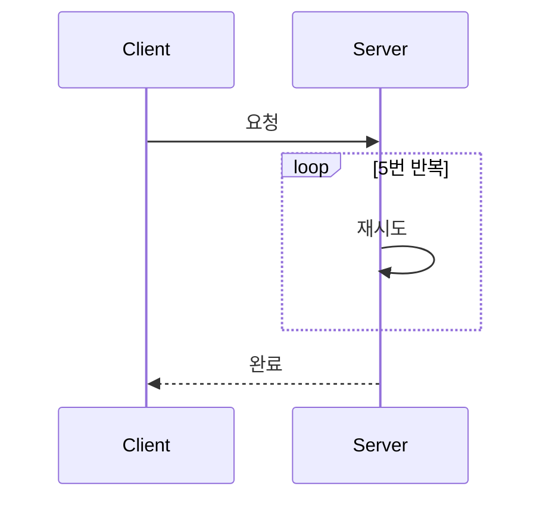

#### 참여자
```markdown
participant Client
participant Server
Participant Database
```
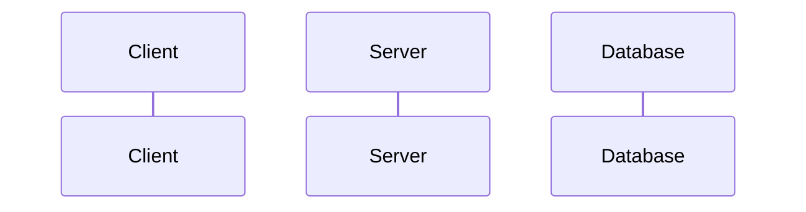

#### 메시지
```markdown
participant Client
participant Server
Client -->> Server :응답
```
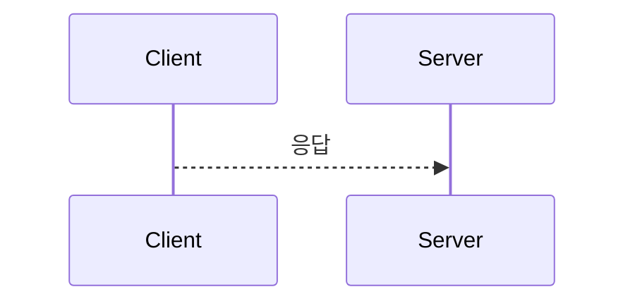

#### 활성화
```markdown
participant Client
participant Server
Client --> Server :호출
Server -->> Client :응답
activate Client
deactivate Client
```
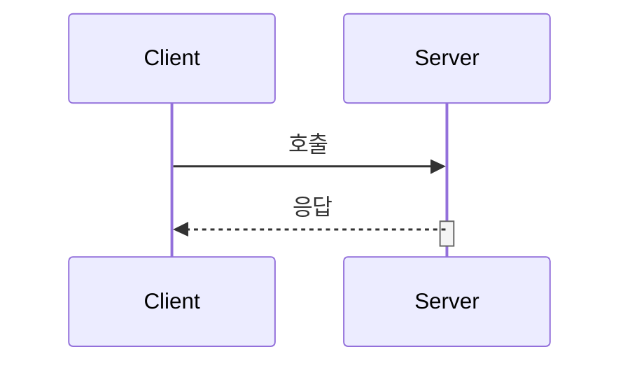

#### 노트 Note
```markdown
A->>B: 요청
Note left of A: 왼쪽설명
Note right of B: 오른쪽설명
Note over A,B: 중간설명
```
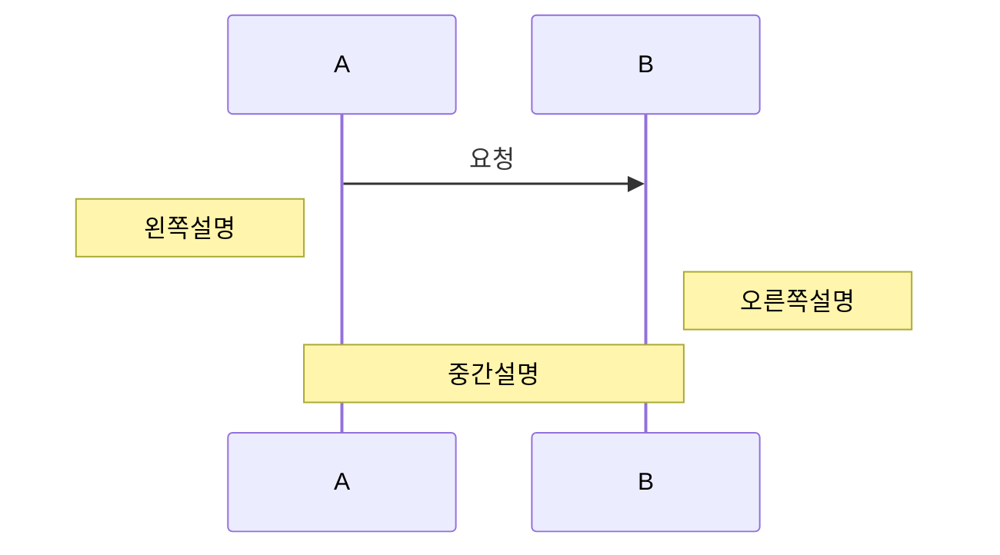

#### 루프 Loop
```markdown
loop 반복
A->>B: 요청
end
```
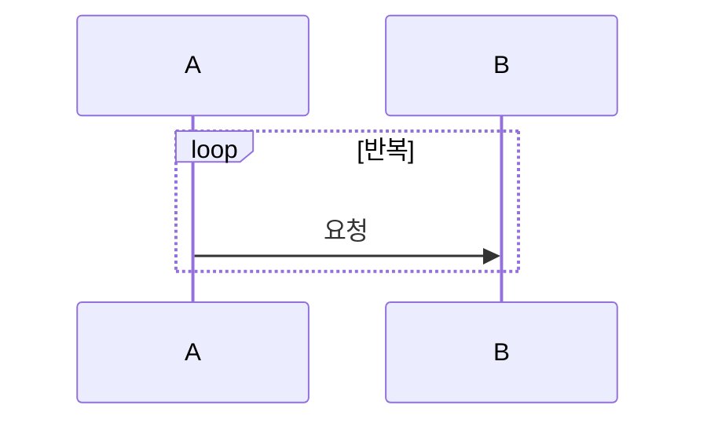

#### 조건 Alt
```markdown
alt 조건1
A->>B: 실행
else 조건2
A->>B: 실행
end
```
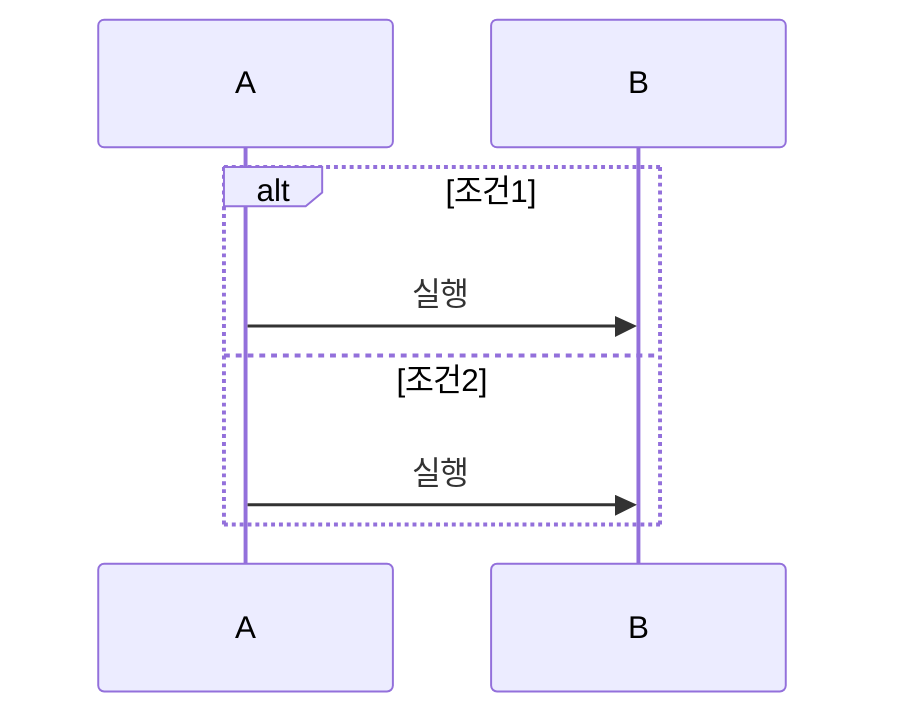

#### 병렬실행 Par
```markdown
par 작업1
A->>B: 실행
and 작업2
A->>C: 실행
end
```

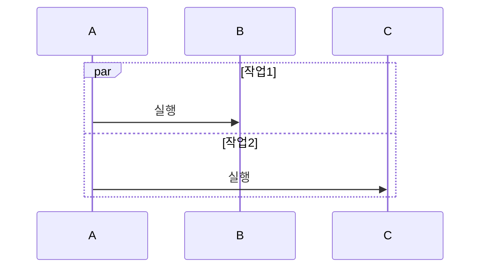

#### 영역강조 Rect
```markdown
rect rgb(230,230,250)
A->>B: 요청
B-->>A: 응답
end
```
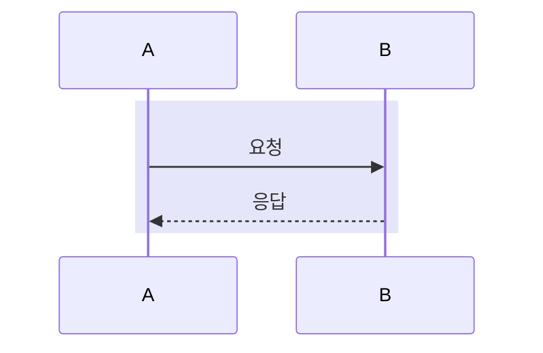
#### 그룹 Box
```markdown
box Client
participant A
participant B
end

box Server
participant C
end
```
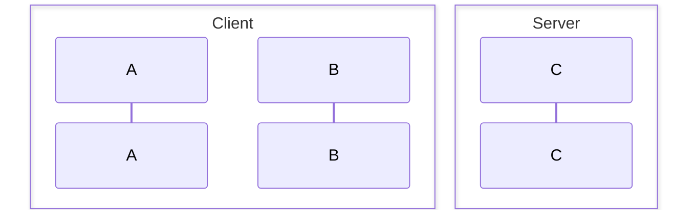

#### 생성 Create
```markdown
create participant B
A->>B: 생성
```
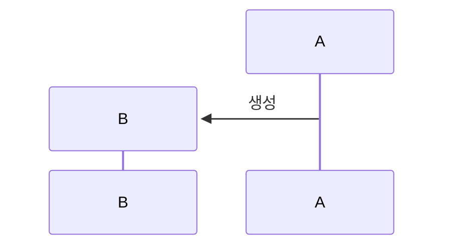

#### Self Message 내부처리
```markdown

A->>A: 내부 처리
```
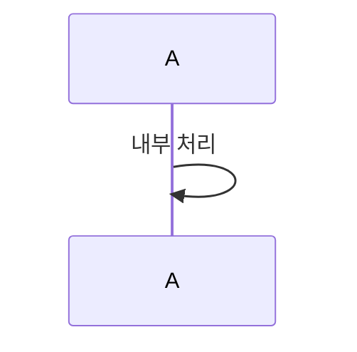