## State Diagram
### 상태
```markdown
stateDiagram-v2
Idle
Running
Stop
```
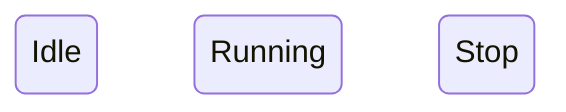
### 상태전이
```markdown
Idle --> Running
Running --> Stop
```
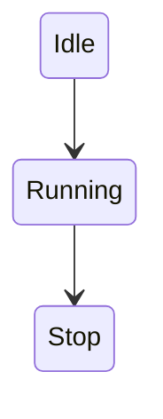

### 시작 상태
```markdown
[*] --> Idle
```
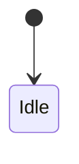
### 종료 상태
```markdown
Idle --> [*]
```
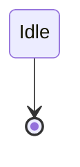

### 전이 이름(Event)
```markdown
Idle --> Running : Start 버튼

Running --> Stop : Stop 버튼
```
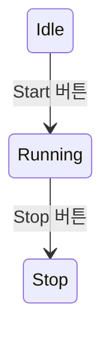
### 자기자신을 이동
```markdown
Running --> Running : Timer
```
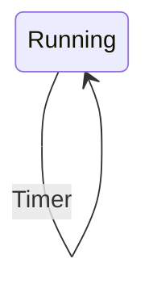
### 상태 설명
```markdown
state Running {
    Execute
    Save
    Display
}
```
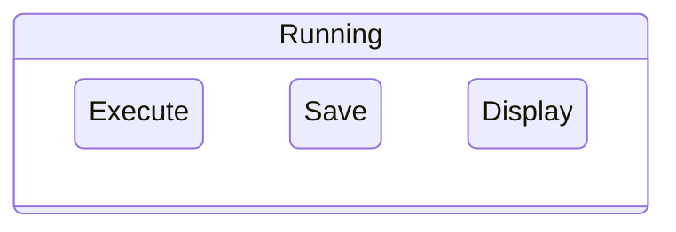
### Composite State (중첩 상태)
```markdown
state Login {

    [*] --> Input

    Input --> Check

    Check --> Success

}
```
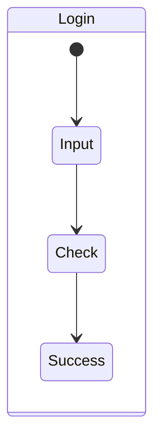

### Choice (분기)
```markdown
[*] --> Check

Check --> Success : OK

Check --> Fail : Error
```
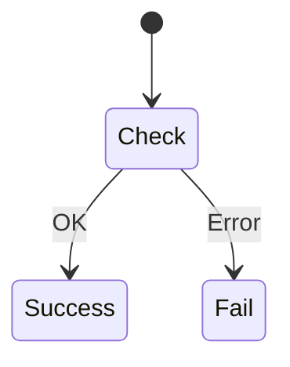
### 방향 변경
```markdown
direction LR , TB

[*] --> Idle

Idle --> Running

Running --> Stop
```
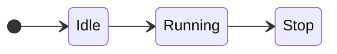

### Note
```markdown
[*] --> Idle

note right of Idle
대기 상태
end note
```
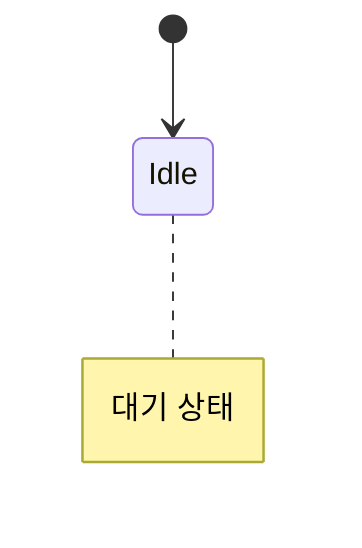
---
### Fork / Join
병렬 상태를 표현
```markdown
state fork_state <<fork>>

state join_state <<join>>
```

---
## 예시안
### 버튼 제어
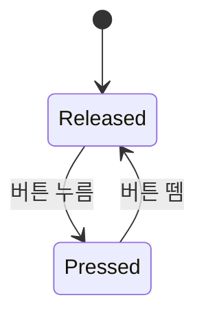
---
### LED 제어
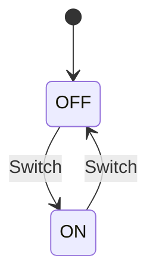
---
#### UART 통신
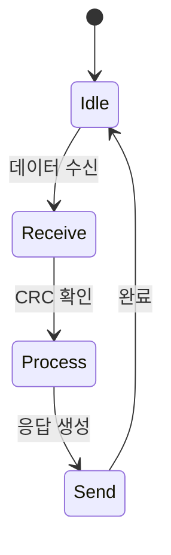
---
#### 로그인 상태
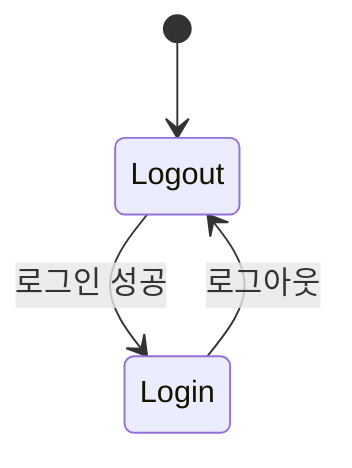