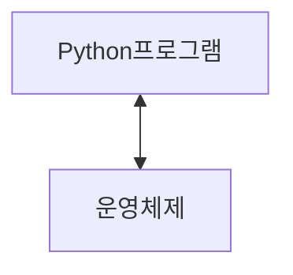
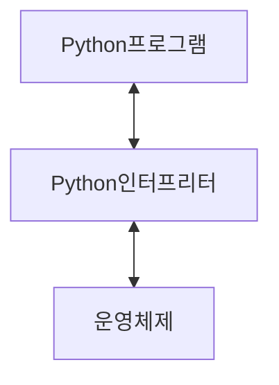

#### 프로그램

문제를 해결하기 위한 명령어들의 집합

#### 프로그램의 핵심
새 연산을 정의하고 조합해 유용한 작업을 수행하는 것

- 프로그램
  - 컴퓨터에게 내리는 명령어 묶음
- 프로그래밍
  - 그 명령어 묶음을 만드는 과정

#### 프로그래밍 언어
컴퓨터에게 작업을 지시하고 문제를 해결하는 도구
**컴퓨터는 사람의 말을 바로 알아듣지 못합니다.**
**컴퓨터와 사람 모두가 이해할 수 있도록 약속된 언어인 프로그래밍 언어로 대화하는 것**

#### Python
##### python을 배우는 이유
- 쉽고 간결한 문법
  - 읽기 쉽고 쓰기 쉬운 문법을 가지고 있어 쉽게 배우고 활용 할 수 있음
- python 커뮤니티의 지원
  - 세계적인 규모의 풍부한 온라인 포럼 및 커뮤니티 생태계를 형성함
- 광범위한 응용 분야
  - 웹 개발, 데이터 분석, 인공지능, 자동화 스크립트 등 다양한 분야에서 사용함
- 전세계적으로 많이 사용되는 프로그래밍 언어
- 프로그래밍과 인공지능에서 기본 언어로 가장 많이 사용되는 언어
  - 인공지능(AI)와 머신러닝(ML)에서 일반적으로 사용됨
  - 두 번쨰로인기가 많은 프로그래밍 언어라는 위치를 감안할 때 광범위한 라이브러리 지원과 강력한 커뮤니티 지원을 보유

##### 인공지능과 머신러닝 개발 시 Python을 사용하는 이유
- 압도적인 전문 라이브러리
  - TensorFlow, Pytorch 등 AI 개발의 핵심 도구들이 파이썬으로 제공되어, 복잡한 기능을 쉽게 구현할 수 있음
  - **TensorFlow** 구글이 만든 딥러닝 도구
  - **Pytorch** 페이스북이 만든 딥러닝 도구
- 쉬운 문법과 높은 생산성
  - 문법이 간결하여 배우기 쉽고, 아이디어를 빠르게 프로토타입으로 만들 수 있어 연구와 개발에 가장 효율적
- 강력한 커뮤니티와 생태계
  - 사용자가 많은 프로그래밍 언어로 관련 자료와 문제 해결 방안이 방대함

##### Python 프로그래밍이 실행되는 과정
컴퓨터는 기계어로 소통하기 때문에 사람이 기계어를 직접 작성하기 어려움


Python 프로그램 <-> 운영 체제

- 인터프린터가 사용자의 명령어를 운영체제가 이해하는 언어로 바꿈



- 인터프리터가 사용자의 명령어를 운영체제가 이해하는 언어로 바꿈

##### 표현식
- 하나의 '값'으로 평가될 수 있는 모든 코드
  - 평가: 표현식을 계산하여 그 결과인 '값'을 만들어내는 과정
  - 불리언 (Boolean)
    - 컴퓨터에서 참과 거짓을 나타내는 숫자 1과 0만을 이용하는 방식

##### 표현식 예시
- 3 + 5
- x > 10
- 5 x 4
  
##### 값 (Value)
- 표현식이 평가된 결과
- 더 이상 계산되거나 평가될 수 없는, 프로그램의 가장 기본적인 데이터 조각

##### 값 예시
- 숫자값 : 013.14
- 문자열 값: "안녕하세요"
- 불리언 값: True, False

##### 표현식, 평가 그리고 값
- 표현식을 평가하면 하나의 값이 됨

##### 변수 Variable
- 값을 나중에 다시 사용하기 위해, 그 값에 붙여주는 고유한 이름

##### 변수할당

##### 할당문 (Assignment Statement)
- 값 36.5을 변수 degrees에 할당했다.

| 요소 | 설명 |
| --- | --- |
|degrees | 변수 이름 |
| = | 할당 연산자 (오른쪽 표현식의 평가 결과 값을 왼쪽 변수에 저장) |
|36.4 | 표현식 |

##### 변수명 규칙
- 영문 알파벳, 언더스코어(_), 숫자로 구성
- 숫자로 시작할 수 없음
- 대소문자를 구분
- 아래 키워드는 파이썬의 내부 예약어로 사용할 수 없음

##### 변수, 값 그리고 메모리
- 고유한 ID (메모리 주소)
  - 제품의 바코드
- 타입 (Type)
  - 제품의 종류
- 값 (Value)
  - 제품의 실제 내용물
- 값 + 타입 + 주소 정보를 묶은 것을 객체(Object)라고 부름

* 객체 (Object)
  * 값, 타입, 행동까지 하나로 묶인 개념

- 변수는 특정 객체를 가리키는(refer/point to) 이름표
  - 변수는 메모리 주소를 가지지(contain) 않습니다

##### 변수 Variable
- 값을 나중에 다시 사용하기 위해, 그 값에 붙여주는 고유한 이름
- "객체를 가리키는 이름"

##### 할당문 동작 순서
```
Variable = expression
```
1. 오른쪽 표현식 평가
2. 왼쪽 변수명 확인
3. 변수명과 결과값 연결

##### 재할당
- 변수는 특정 값을 '기억'하거나 '가리키는' 이름
- 재할당은 이 변수가 가리키는 대상을 새로운 값으로 변경하는 행위
- * 재할당이 이루어지면 변수는 이전 값을 완전히 잊고 새로운 값만 기억하게 됨

##### 변수와 메모리 정리


##### Data type
###### Type 타입
- 변수나 값이 가질 수 있는 데이터의 종류를 의미

어떤 종류의 데이터인지, 어떻게 해석되고 처리되어야 하는지를 정의

##### 데이터 타입 5가지
- Numeric Types
  - int (정수), float(실수), complex(복소수)
- Text Sequence Type
  - str(문자열)
- Sequence Types
  - list, type, range
- Non-sequence Types
  - set, dict
- 기타
  - Boolean, None, Functions

##### 숫자형 데이터 Numeric Types
1. 정수형(int): 소수점이 없는 숫자
2. 실수형(float): 소수점이 있는 숫자

##### 정수 자료형
Int: 소수점이 없는 숫자를 표현 

```python
student_count = 30
temperature = -5
balance = 0
```

##### 실수형 자료형

##### 연산자 

##### 시퀀스 타입

##### 시퀀스 타입 5가지 공통 특징

##### 문자열

- 이스케이프 시퀀스

##### 이스케이프 시퀀스 예약 문자 정리
| 예악문자 | 기능 |
| --- | --- |
| \n | 줄 바꿈 |
| \t | 탭 |
| \\\ | 백슬래시 |
| \\' | 작은 따옴포 |
| \\" | 큰 따옴표|


##### f-string 사용법
- 문자열 시작 전 'f' 접두어를 붙이고, 삽입할 부분(표현식)을 중괄호 {}로 감싸줌

@@@@@@@@@@@@@@ f-string advanced 검색하여 여러가지 표현식 찾아서 정리하기~~~~~~~~~

##### 인덱스 (Index)
시퀀스 자료형에서 각 값의 위치를 식별하기 위해 부여된 고유한 번호

```
인덱스는 왜 0부터 시작할까요?
프로그래밍에서 인덱스 1이 아닌 0부터 시작하는 것은 거리의 개념을 이해하면 쉽다.
- 인덱스는 시작점으로부터 얼마나 떨어져 있는가를 의미
따라서 index 0은 첫번째 항목을 의미하며 이는 대부분의 프로그래밍 언어에서 통용되는 매우 중요한 사항
```

- 문자열 hello의 인덱스

파이썬은 음수 인덱스를 지원한다.
음수 인덱스는 마지막 글자부터 시작함 -1이 첫번쨰

##### 슬라이싱
- 대괄호 []안에 시작 위치, 끝 위치, 간격(step)을 콜론(:)으로 지원

```python
hello = 'hello'
hello[2:4]
# h, e, l, l, 0
# l, l
```
```python
# start 생략
hello[:3]
# h, e, l

# stop 생략
hello[3:]
# l, l, o

# 점프
hello[::2] # 처음부터 2칸씩 점프
# h, l, o

# 음수 인덱스를 이용한 반대로 출력 => 이거 유용한 듯?
hello[::-1]
# o, l, l, e, h
```

##### 문자열 str
- 문자들의 순서가 있는 변경 불가능한 시퀀스 자료형

##### 문자열의 불변함
문자열 객체를 인덱스를 이용하여 특정 단어를 변경을 시도하면 오류가 발생합니다.

```python
Traceback (most recent call last):
  File "C:\Users\SSAFY\Documents\hyunbin\Python\python\01_fundamentals_of_python\01_basic.py", line 8, in <module>
    a[1] = 'a'
    ~^^^
TypeError: 'str' object does not support item assignment
```

### 참고

##### 정수형의 진법 표현

- 코드에서 진법 표현하기
  - 파이썬은 코드 내에서 다양한 진법의 숫자를 직접 표현할 수 있도록 특별한 접두사(prefix)를 제공

| 진법 | 접두사 | 사용하는 숫자/문자 | 
| --- | ---  | ---  |
|2진수| 0b| 0 과 1|
| 8진수 | 0o| 0부터 7까지 |
|16진수 | 0x | 0부터 9, a부터 f 까지 |


##### 실수의 함정, 부동소수점 오차
- 부동소수점 (반올림) 오차
1. 컴퓨터는 2진법 사용
   - 컴퓨터는 모든 숫자를 0과 1로 이루어진 2진수로 변환하여 저장
2. 무한 소수의 발생과 근사값 저장
   - 우리가 쓰는 10진수 소수 중 일부는 2진수로 바꾸면 무한히 반복되는 무한 소수가 됨
   - 0.1 (10진수) -> 0.001100110011 (2진수)
   - 메모리는 유한하기 때문에, 컴퓨터는 이 무한 소수를 어쩔 수 없이 가장 가까운 근사값을 잘라서 사용함
  
이를 해결하기 위한 방법
- decimal 모듈을 사용하여 부동소수점 연산의 정확성을 보장하기
- decimal은 실수를 2진수로 변환하지 않고 10진수 자체로 정확하게 연산할 수 있게 해줌

```python
from decimal import Decimal
a = Decimal('3.2') - Decimal('3.1')
b = Decimal('1.2') - Decimal('1.1')

print(a) # 0.1
print(b) # 0.1
print(a == b) # true
```

##### 표현식과 문장
문장(Statement)
- 특정 '동작(action)'을 지시하는, 실행 가능한 코드의 최소 단위
 
할당문, 조건문, 반복문 여기에서의 문이 바로 문장(Statement)라는 의미를 가짐

표현식 vs 문장
- 이 코드를 실행하면 하나의 값이 남는지?
- 표현식 -> 네
- 문장 -> 아니오

##### Style Guide
- `언어 맞춤법`
- `띄어쓰기`

PEP 8
- 파이썬 코드를 일관성 있고 읽고 쉽게 작성하기 위한 공식 스타일 가이드

쓰는 이유?
- 코드의 일관성과 가독성을 향상시키기 위한 규칙과 권장 사항들의 모음

- 변수명은 무엇을 위한 변수인지 직관적인 이름을 가져야함
- 공백(spaces) 4칸을 사용하여 코드 블록을 들여쓰기
- 한 줄의 길이는 79자로 제한하며, 길어질 경우 줄 바꿈을 사용
- 문자와 밑줄(_)을 사용하여 함수, 변수, 속성의 이름을 작성
- 함수 정의나 클래스 정의 등의 블록 사이에는 빈 줄을 추가

위의 내용은 반드시 지키며 이외에도 많은 규칙이 존재

##### 주석
프로그램 코드 내에서 작성되는 설명이나 메모

- 주석 처리된 부분은 프로그램 실행에 아무런 영향을 주지 않음 ('#' 기호를 사용)
- 코드의 복잡한 로직을 설명하거나 특정 부분을 잠시 비활성화할 때 유용하게 사용

##### Python tutor
파이썬 코드가 한 줄씩 어떻게 실해되는지 눈으로 보여주는 시각화 도구
