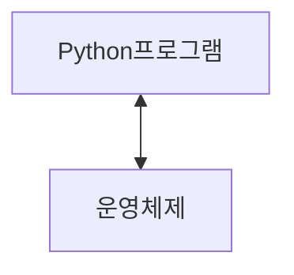
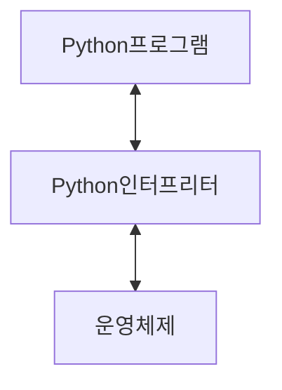

# 프로그램

문제를 해결하기 위한 명령어들의 집합

## 프로그램의 핵심

새 연산을 정의하고 조합해 유용한 작업을 수행하는 것

- 프로그램
  - 컴퓨터에게 내리는 명령어 묶음
- 프로그래밍
  - 그 명령어 묶음을 만드는 과정

### 프로그래밍 언어

컴퓨터에게 작업을 지시하고 문제를 해결하는 도구
**컴퓨터는 사람의 말을 바로 알아듣지 못합니다.**
**컴퓨터와 사람 모두가 이해할 수 있도록 약속된 언어인 프로그래밍 언어로 대화하는 것**

#### Python

##### python을 배우는 이유

- 쉽고 간결한 문법
  - 읽기 쉽고 쓰기 쉬운 문법을 가지고 있어 쉽게 배우고 활용 할 수 있음
- python 커뮤니티의 지원
  - 세계적인 규모의 풍부한 온라인 포럼 및 커뮤니티 생태계를 형성함
- 광범위한 응용 분야
  - 웹 개발, 데이터 분석, 인공지능, 자동화 스크립트 등 다양한 분야에서 사용함
- 전세계적으로 많이 사용되는 프로그래밍 언어
- 프로그래밍과 인공지능에서 기본 언어로 가장 많이 사용되는 언어
  - 인공지능(AI)와 머신러닝(ML)에서 일반적으로 사용됨
  - 두 번쨰로인기가 많은 프로그래밍 언어라는 위치를 감안할 때 광범위한 라이브러리 지원과 강력한 커뮤니티 지원을 보유

##### 인공지능과 머신러닝 개발 시 Python을 사용하는 이유

- 압도적인 전문 라이브러리
  - TensorFlow, Pytorch 등 AI 개발의 핵심 도구들이 파이썬으로 제공되어, 복잡한 기능을 쉽게 구현할 수 있음
  - **TensorFlow** 구글이 만든 딥러닝 도구
  - **Pytorch** 페이스북이 만든 딥러닝 도구
- 쉬운 문법과 높은 생산성
  - 문법이 간결하여 배우기 쉽고, 아이디어를 빠르게 프로토타입으로 만들 수 있어 연구와 개발에 가장 효율적
- 강력한 커뮤니티와 생태계
  - 사용자가 많은 프로그래밍 언어로 관련 자료와 문제 해결 방안이 방대함

##### Python 프로그래밍이 실행되는 과정

컴퓨터는 기계어로 소통하기 때문에 사람이 기계어를 직접 작성하기 어려움



Python 프로그램 <-> 운영 체제

- 인터프린터가 사용자의 명령어를 운영체제가 이해하는 언어로 바꿈



- 인터프리터가 사용자의 명령어를 운영체제가 이해하는 언어로 바꿈

> **shell**
> 파이썬 코드를 한 줄씩 입력하고 즉시 실행 결과를 확인할 수 있는 대화형 실행 환경
> 컴퓨터와 대화하는 창


##### 표현식 Expression

- 하나의 '값'으로 평가될 수 있는 모든 코드
  - 평가: 표현식을 계산하여 그 결과인 '값'을 만들어내는 과정
  - 불리언 (Boolean)
    - 컴퓨터에서 참과 거짓을 나타내는 숫자 1과 0만을 이용하는 방식

##### 표현식 예시

- 3 + 5
- x > 10
- 5 x 4
  
##### 값 (Value)

- 표현식이 평가된 결과
- 더 이상 계산되거나 평가될 수 없는, 프로그램의 가장 기본적인 데이터 조각

##### 값 예시

- 숫자값 : `013.14`
- 문자열 값: "안녕하세요"
- 불리언 값: True, False

##### 표현식, 평가 그리고 값

- 표현식을 평가하면 하나의 값이 됨

##### 변수 Variable

- 값을 나중에 다시 사용하기 위해, 그 값에 붙여주는 고유한 이름

##### 변수할당 Variable assignment

- 표현식이 만들어 낸 값에 이름을 붙이는 과정(연결)

##### 할당문 (Assignment Statement)

- 값 36.5을 변수 degrees에 할당했다.

| 요소 | 설명 |
| --- | --- |
| degrees | 변수 이름 |
| = | **할당 연산자** (오른쪽 표현식의 평가 결과 값을 왼쪽 변수에 저장) |
| 36.4 | 표현식 |

##### 변수명 규칙

- 영문 알파벳, 언더스코어(_), 숫자로 구성
- 숫자로 시작할 수 없음
- 대소문자를 구분
- 아래 키워드는 파이썬의 내부 예약어로 사용할 수 없음

##### 변수, 값 그리고 메모리

> **메모리 주소**
> 각 사물함은 구별하기 위해 붙어있는 절대 겹치지 않는 고유한 사물함 번호
>
> 컴퓨터가 특정 데이터 값을 정확히 찾아가기 위해 사용하는 기계적인 숫자 주소

- 고유한 ID (메모리 주소)
  - 제품의 바코드
- 타입 (Type)
  - 제품의 종류
- 값 (Value)
  - 제품의 실제 내용물
- 값 + 타입 + 주소 정보를 묶은 것을 객체(Object)라고 부름

> **객체 (Object)**
> 값, 타입, 행동까지 하나로 묶인 개념
> 객체는 파이썬에서 다루는 모든 데이터의 실체

- 변수는 특정 객체를 가리키는(refer/point to)이름표
- 변수는 메모리 주소를 가지지(contain) 않습니다

##### 변수(Variable)

- 값을 나중에 다시 사용하기 위해, 그 값에 붙여주는 고유한 이름
- "객체를 가리키는 이름"

##### 할당문 동작 순서

```markdown
Variable = expression
```

1. 오른쪽 표현식 평가
   1. 가장 먼저, 할당 연산자(=)의 오른쪽에 있는 표현식 전체를 계산하여 하나의 결과값(객체)를 만듦
2. 왼쪽 변수명 확인
   1. 이름이 처음 사용되었다면: 새로운 이름표를 준비
   2. 이미 존재하는 이름이라면: 기존 이름표를 그대로 사용
3. 변수명과 결과값 연결
   1. 마지막으로, 왼쪽의 변수명이 오른쪽에서 만들어진 결과값을 가리키도록 연결
   2. 만약 변수명이 이전에 다른 객체를 가리키고 있었다면, 그 연결은 끊어지고 새로운 객체와의 연결만 남음(재할당)

##### 재할당

- 변수는 특정 값을 '기억'하거나 '가리키는' 이름
- 재할당은 이 변수가 가리키는 대상을 새로운 값으로 변경하는 행위
- 재할당이 이루어지면 변수는 이전 값을 완전히 잊고 새로운 값만 기억하게 됨

##### 변수와 메모리 정리

##### Data type

###### Type 타입

- 변수나 값이 가질 수 있는 데이터의 종류를 의미

어떤 종류의 데이터인지, 어떻게 해석되고 처리되어야 하는지를 정의

##### 데이터 타입 5가지

- Numeric Types
  - int (정수), float(실수), complex(복소수)
- Text Sequence Type
  - str(문자열)
- Sequence Types
  - list, type, range
- Non-sequence Types
  - set, dict
- 기타
  - Boolean, None, Functions

##### 숫자형 데이터 Numeric Types

1. 정수형(int): 소수점이 없는 숫자
2. 실수형(float): 소수점이 있는 숫자

##### 정수 자료형

Int: 소수점이 없는 숫자를 표현

```python
student_count = 30
temperature = -5
balance = 0
```

##### 실수형 자료형

##### 연산자

##### 시퀀스 타입

##### 시퀀스 타입 5가지 공통 특징

##### 문자열

- 이스케이프 시퀀스

##### 이스케이프 시퀀스 예약 문자 정리

| 예악문자 | 기능 |
| --- | --- |
| \n | 줄 바꿈 |
| \t | 탭 |
| \\\ | 백슬래시 |
| \\' | 작은 따옴포 |
| \\" | 큰 따옴표 |

##### f-string 사용법

- 문자열 시작 전 'f' 접두어를 붙이고, 삽입할 부분(표현식)을 중괄호 {}로 감싸줌

@@@@@@@@@@@@@@ f-string advanced 검색하여 여러가지 표현식 찾아서 정리하기~~~~~~~~~

##### 인덱스 (Index)

시퀀스 자료형에서 각 값의 위치를 식별하기 위해 부여된 고유한 번호

```markdown
인덱스는 왜 0부터 시작할까요?
프로그래밍에서 인덱스 1이 아닌 0부터 시작하는 것은 거리의 개념을 이해하면 쉽다.
- 인덱스는 시작점으로부터 얼마나 떨어져 있는가를 의미
따라서 index 0은 첫번째 항목을 의미하며 이는 대부분의 프로그래밍 언어에서 통용되는 매우 중요한 사항
```

- 문자열 hello의 인덱스

파이썬은 음수 인덱스를 지원한다.
음수 인덱스는 마지막 글자부터 시작함 -1이 첫번쨰

##### 슬라이싱

- 대괄호 []안에 시작 위치, 끝 위치, 간격(step)을 콜론(:)으로 지원

```python
hello = 'hello'
hello[2:4]
# h, e, l, l, 0
# l, l
```

```python
# start 생략
hello[:3]
# h, e, l

# stop 생략
hello[3:]
# l, l, o

# 점프
hello[::2] # 처음부터 2칸씩 점프
# h, l, o

# 음수 인덱스를 이용한 반대로 출력 => 이거 유용한 듯?
hello[::-1]
# o, l, l, e, h
```

##### 문자열 str

- 문자들의 순서가 있는 변경 불가능한 시퀀스 자료형

##### 문자열의 불변함

문자열 객체를 인덱스를 이용하여 특정 단어를 변경을 시도하면 오류가 발생합니다.

```python
Traceback (most recent call last):
  File "C:\Users\SSAFY\Documents\hyunbin\Python\python\01_fundamentals_of_python\01_basic.py", line 8, in <module>
    a[1] = 'a'
    ~^^^
TypeError: 'str' object does not support item assignment
```

#### 참고

##### 정수형의 진법 표현

- 코드에서 진법 표현하기
  - 파이썬은 코드 내에서 다양한 진법의 숫자를 직접 표현할 수 있도록 특별한 접두사(prefix)를 제공

| 진법 | 접두사 | 사용하는 숫자/문자 |
| --- | --- | --- |
| 2진수 | 0b | 0 과 1 |
| 8진수 | 0o | 0부터 7까지 |
| 16진수 | 0x | 0부터 9, a부터 f 까지 |

##### 실수의 함정, 부동소수점 오차

- 부동소수점 (반올림) 오차
  
1. 컴퓨터는 2진법 사용
   - 컴퓨터는 모든 숫자를 0과 1로 이루어진 2진수로 변환하여 저장
2. 무한 소수의 발생과 근사값 저장
   - 우리가 쓰는 10진수 소수 중 일부는 2진수로 바꾸면 무한히 반복되는 무한 소수가 됨
   - 0.1 (10진수) -> 0.001100110011 (2진수)
   - 메모리는 유한하기 때문에, 컴퓨터는 이 무한 소수를 어쩔 수 없이 가장 가까운 근사값을 잘라서 사용함
  
이를 해결하기 위한 방법

- decimal 모듈을 사용하여 부동소수점 연산의 정확성을 보장하기
- decimal은 실수를 2진수로 변환하지 않고 10진수 자체로 정확하게 연산할 수 있게 해줌

```python
from decimal import Decimal
a = Decimal('3.2') - Decimal('3.1')
b = Decimal('1.2') - Decimal('1.1')

print(a) # 0.1
print(b) # 0.1
print(a == b) # true
```

##### 표현식과 문장

문장(Statement)

- 특정 '동작(action)'을 지시하는, 실행 가능한 코드의 최소 단위
할당문, 조건문, 반복문 여기에서의 문이 바로 문장(Statement)라는 의미를 가짐

표현식 vs 문장

- 이 코드를 실행하면 하나의 값이 남는지?
- 표현식 -> 네
- 문장 -> 아니오

##### Style Guide

- `언어 맞춤법`
- `띄어쓰기`

PEP 8

- 파이썬 코드를 일관성 있고 읽고 쉽게 작성하기 위한 공식 스타일 가이드

쓰는 이유?

- 코드의 일관성과 가독성을 향상시키기 위한 규칙과 권장 사항들의 모음

- 변수명은 무엇을 위한 변수인지 직관적인 이름을 가져야함
- 공백(spaces) 4칸을 사용하여 코드 블록을 들여쓰기
- 한 줄의 길이는 79자로 제한하며, 길어질 경우 줄 바꿈을 사용
- 문자와 밑줄(_)을 사용하여 함수, 변수, 속성의 이름을 작성
- 함수 정의나 클래스 정의 등의 블록 사이에는 빈 줄을 추가

위의 내용은 반드시 지키며 이외에도 많은 규칙이 존재

##### 주석

프로그램 코드 내에서 작성되는 설명이나 메모

- 주석 처리된 부분은 프로그램 실행에 아무런 영향을 주지 않음 ('#' 기호를 사용)
- 코드의 복잡한 로직을 설명하거나 특정 부분을 잠시 비활성화할 때 유용하게 사용

##### Python tutor

파이썬 코드가 한 줄씩 어떻게 실해되는지 눈으로 보여주는 시각화 도구

##### 리스트

여러 개의 값을 순서대로 저장하는, 변경 가능한(mutable) 시퀀스 자료형

##### 리스트 표현

대괄호 []

##### 시퀀스로서의 리스트

##### 중첩리스트

다른 리스트를 값으로 가진 리스트

##### 중첩리스트 접근하기

- 인덱스를 연달아 사용하여 안쪽 리스트의 값에 접근할 수 있음

1. 먼저 바깥 리스트의 인데스로 안쪽 리스틀르 선택
2. 선택된 안쪽 리스트에 다시 한번 인덱스를 사용

##### 튜플

여러개의 값을 순서대로 저장하는 변경 불가능한 시퀀스 자료형

##### 튜플 표현

- 소괄호 () 안에 값들을 쉼표 (,)로 구분하여 만듦
- 모든 종류의 데이터를 담을 수 있음
- 리스트와 거의 모든 면에서 비슷하지만, 한번 만들어지면 절대 수정할 수 없다는 결정적인 차이가 존재

```python
my_tuple_1 = (1)
my_tuple_2 = (1,)

# 위 튜플중 my_tuple_2는 튜플이지만 위의 my_tuple_1은 정수형 데이터 타입임
# 단일 튜플 생성시 반드시 (,)쉼포 사용
```

##### 튜플 변경 시도하기

```python
my_tuple = (1, 'b', 3, 'c', 5)
my_tuple[1] = 'z'
```

- 튜플의 불변 특성을 사용하여 `내부 동작`과 `안전한 데이터 전달`에 사용됨
- 다중 할당, 값 교환, 함수 다중 반환 값 등 에서 사용됨

튜플은 데이터의 안정성과 무결성을 보장

##### range

연속된 정수 시퀀스를 생성하는 변경 불가능한(immutable) 자료형

- 주로 반복문과 함께 사용

기본 구문

range()는 1개, 2개, 또는 3개의 매개변수(인자)를 가질 수 있음

```python
range(start, stop, step)
```

range 매개변수별 특징

- range(stop)
  - 매개변수가 하나면 stop으로 인식
  - start는 0이, step은 1이 기본값으로 자동 설정
  - range(5) => 0, 1, 2, 3, 4
- range(start, stop)
  - 매개변수가 두 개면 start와 stop으로 인식
  - step은 1이 기본값으로 자동 설정
  - range(2,5) => 2, 3, 4
- range(start, stop, step)
  - 모든 매개변수를 직접 지정
  - range(2, 10, 2) => 2, 4, 6, 8

```python
my_range_1 = range(5)
my_range_2 = range(1, 10)
my_range_3 = range(5, 0, -1)

print(my_range_1) # range(0, 5)
print(my_range_2) # range(1, 10)
print(my_range_3) # range(5, 0, -1)

print(list(my_range_1)) # [0, 1, 2, 3, 4]
print(list(my_range_2)) # [1, 2, 3, 4, 5, 6, 7, 8, 9]
print(list(my_range_3)) # [5, 4, 3, 2, 1]
```

게으른 평가?

stop의 규칙

step(증가/감소 값) 규칙

- step이 양수일 때 (기본값 : 1)
- step이 음수일 때

##### dict 딕셔너리

key - value 쌍으로 이루어진 순서와 중복이 없는 변경 가능한 자료형

##### 딕셔너리 표현

- 중괄호 {} 안에 값들이 쉼표(,)로 구분
- 값 1개는 키와 값이 쌍으로 이루어져 있음
- Key(키)
  - 값을 식별하기 위한 고유한 이름표
- Value(값)
  - 키에 해당하는 실제 데이터
- 각 값에는 순서가 없음 => 인덱스가 없음

```python
my_dict_1 = {}
my_dict_2 = {'key': 'value'}
my_dict_3 = {'apple': 12, 'list': [1, 2, 3]}

print(my_dict_1) # {}
print(my_dict_2) # {'key': 'value'}
print(my_dict_3) # {'apple': 12, 'list': [1, 2, 3]}
```

`딕셔너리는 순서가 없는 자료형이지만 파이썬 3.7 버전 이상에서는 입력한 순서는 출력 시 그대로 유지되지만 여전히 딕셔너리의 핵심은 순서가 없는 자료형이라는 점과 Key를 통한 접근이라는 점을 기억`

##### 딕셔너리의 규칙

key의 규칙

- 고유해야함
  - key는 중복될 수 없음
- 변경 불가능한(Immutable) 자료형만 사용 가능
  - O (가능): str, int, float, tuple
  - X (불가능): list, dict

Value의 규칙

- 어떤 자료형이든 자유롭게 사용할 수 있음

딕셔너리 값 접근 방법

- Key를 사용하여 해당 Value를 꺼내 올 수 있음
- Key에 접근 시 대괄호 [] 사용

```python
my_dict = {'name': '홍길동', 'age': 25}

print(my_dict['name']) # '홍길동'
print(my_dict['test']) # KeyError: 'test'
```

존재하지 않는 Key로 접근하면 KeyError가 발생하며 프로그램이 멈춤
사전에서 단어를 찾아 뜻을 확인하는것처럼 딕셔너리는 key를 통해 Value에 빠르게 접근함

##### Set 세트

순서와 중복이 없는 변경 가능한 자료형

세트 표현

- 중괄호 {}안에 값들을 쉼표(,)로 구분하여 만듦
- 수학에서의 집합과 동일한 연산 처리 가능

세트의 두 가지 핵심 특징

1. 중복을 허용하지 않음
   - 똑같은 값은 단 하나만 존재할 수 있음
2. 순서가 없음
   - 인덱싱(set[0])이나 슬라이싱(set[0:2])을 사용할 수 없음

##### 세트의 집합 연산

- 세트는 수학의 '집합' 개념을 그대로 가져와, 두 데이터 그룹 간의 관계를 파악하는 데 매우 효과적

##### None

- 파이썬에서 `'값이 없음'`을 표현하는 특별한 데이터 타입

- 마치 내용물이 없는 '빈 상자'와 같음
- 숫자 0이나 빈 문자열('')과는 다른 '값이 존재 하지 않음' or '아직 정해지지 않음'이라는 상태를 나타내기 위해 사용

##### Boolean

참(True)과 거짓(False) 단 두가지 값만 가지는 데이터 타입

- 비교 / 논리 연산의 평가 결과로 사용됨

##### Collection

여러 개의 값을 하나로 묶어 관리하는 자료형을 통칭하는 말

- 여러 물건을 담는 '보관함'과 같으며 파이썬은 목적에 따라 다양한 종류의 컬렉션을 제공
- str, list, tuple, range, set, dict

##### 컬렉션 정리

| 컬렉션 명 | 변경 가능 여부 | 순서 존재 여부 |
| :--: | :--: | :--: |
| str | X | O |
| list | O | O |
| tuple | X | O |
| dict | O | X |
| set | O | X |

#### 형변환(Type Conversion)

한 데이터 타입을 다른 데이터 타입으로 변환하는 과정

- 형변환의 2가지 방법
  - 암시적 형변환: 파이썬이 자동을 처리
  - 묵시적 형변환: 개발자가 직접 지시

##### 암시적 형변환(Implicit Conversion)

파이썬이 연산 중에 자동으로 데이터 타입을 변환하는 것

- 파이썬이 데이터 손실을 막기 위해 더 정밀한 타입으로 자동 변환해주는 규칙

###### 암시적 형변환 예시

- 정수와 실수의 연산에서 정수가 실수로 변환됨
- Boolean과 Numeric Type에서만 가능

```python
# 정수(int)와 실수(float)의 덧셈
print(3 + 5.0) # 8.0

# 불리언(bool)과 정수(int)의 덧셈
print(True + 3) # 4

# 불리언간의 덧셈
print(True + False) # 1
```

##### 명시적 형변환(Explicit Conversion)

개발자가 변환하고 싶은 타입을 직접 함수로 지정하여 변환하는 것

- 명시적 형변환은 서로 다른 타입의 데이터를 호환되도록 맞추는 과정

###### 명시적 형변환 예시

| 함수 | 설명 | 예시 | 결과 |
| :--: | :--: | :--: | :--: |
| int() | 정수로 변환 | int("123") | 123 |
| float() | 실수로 변환 | float("3.14") | 3.14 |
| str() | 문자열로 변환 | str("100") | "100" |
| list() | 리스트로 변환 | list("abc") | ['a', 'b', 'c'] |
| tuple() | 튜플로 변환 | tuple([1, 2]) | (1, 2) |
| set() | 세트로 변환 | set([1, 2, 2]) | {1, 2} |

###### 컬렉션 간 형변환 정리

| ↓ From \ To → | str | list | tuple | range | set | dict |
| :-----------: | :--: | :--: | :---: | :---: | :--: | :--: |
| **str** | - | O | O | X | O | X |
| **list** | O | - | O | X | O | X |
| **tuple** | O | O | - | X | O | X |
| **range** | O | O | O | - | O | X |
| **set** | O | O | O | X | - | X |
| **dict** | O | O (key만) | O (key만) | X | O (key만) | - |

```text
> **범례**
> - **O** : 변환 가능
> - **X** : 변환 불가
> - **O (key만)** : `dict`의 key만 변환 가능
```

##### 산술연산자

| 기호 | 연산자 |
| :---: | :---: |
| - | 음수 부호 |
| + | 덧셈 |
| - | 뺄셈 |
| * | 곱셉 |
| / | 나눗셈 |
| // | 정수 나눗셈(몫) |
| % | 나머지 |
| ** | 지수 (거듭제곱) |

##### 복합연산자

| 기호 | 예시 | 의미 |
| :---: | :---: | :---: |
| += | a += b | a = a + b |
| -= | a -= b | a = a - b |
| *= | a *= b | a = a * b |
| /= | a /= b | a = a / b |
| //= | a //= b | a = a // b |
| %= | a %= b | a = a % b |
| **= | 지수 (거듭제곱) | a = a ** b |

##### 비교 연산자

| 기호 | 내용 |
| :--: | :--: |
| < | 미만 |
| <= | 이하 |
| > | 초과 |
| >= | 이상 |
| == | 같음 |
| != | 같지 않음 |
| is | 같음 |
| is not | 같지 않음 |

###### == 연산자

- 값(데이터)이 같은지를 비교
- 동등성(equality)
- 1 = True의 경우 파이썬이 내부적으로 True를 1로 간주할 수 있으므로 True 결과가 나옴

###### is 연산자

- 객체 자체가 같은지를 비교
- 식별성(identity)
- 두 변수가 완전히 동일한 객체를 가리키는지, 즉 메모리 주소가 같은지를 확인할 때 사용

```python
print(1 is True) # False
print(2 is 2.0) # False
```

`is는 메모리 주소를 비교하는데, 값 자체를 비교하는 ==를 써야할 곳에 실수로 사용한것같다고 파이썬이 알려주는 경고가 발생`

is 대신 == 를 사용해야 하는 이유

- 결론: is는 정체성을, ==는 가치를 비교
- 두 연산자는 같다를 확인하는 목적이 근본적으로 다르다
- is (Identity Operator):
  - 두 변수가 완전히 동일한 메모리 주소의 객체를 가리키는지, 즉 정체성이 같은지를 확인
- == (Equality Operator):
  - 두 변수가 가리키는 객체의 내용, 즉 '값(Value)'이 같은지를 확인

###### is를 값 비교에 사용하면 안되는 이유

- is는 두 객체가 메모리상에서 같은 존재인가? 를 묻기 때문에 False가 출력됨
- 하지만 우리가 정말 궁금한 것은 "두 객체의 값이 논리적으로 같은가" 이므로 == 를 사용해야 의도에 맞는 True를 얻을 수 있음

###### is 연산자를 사용하는 경우

- 주로 싱글턴 객체를 비교할 때 사용

###### 싱글턴(Singleton) 객체란?

- 특정 값에 대해 파이썬 전체에서 단 하나의 객체만 생성되어 재사용되는 특별한 객체
- 여러 변수가 이 값을 가지더라도 모두 미리 만들어진 하나의 객체를 함께 가리키게 되므로 항상 같은 메모리 주소를 가짐
- 파이썬의 대표적인 싱글턴 객체: None, True, False

###### 싱글턴 객체를 비교할 때

- is 연산자는 두 변수가 완전히 동일한 객체를 가리키는지 즉 메모리 주소가 같은지 확인할 때 사용
- 파이썬 전체에서 단 하나의 객체만 생성되어 재사용되는 싱글턴 객체
  
```python
x = None
# 권장
if x is None:
    print('x는 None입니다.')
# 비권장
if x == None:
    print('x는 None입니다.')
```

```python
x = True
y = True

print(x is y) # True
print(True is True) # True
print(False is False) # True
print(None is None) # True
```

- 리스트 또는 다른 가변 객체(mutable)를 비교할 때, 값 자체가 같은 지 확인하려면 ==를 사용
- 두 변수가 완전히 동일한 객체를 가리키는지를 확인해야 한다면 is를 사용

```python
a = [1, 2, 3]
b = [1, 2, 3]

print(a == b) # True
print(a is b) # False

# b가 a를 그대로 참조하도록 할 경우
b = a
print(a is b) # True

# 이 경우 얕은 복사가 됨
```

== 와 is 정리

- `값 비교에는 ==` 을 사용하고, `객체(레퍼런스) 비교에는 is`를 사용하는것이 원칙
- 숫자나 문자열, 불리언 값 등 동등성(값)을 판단해야 할때 is를 쓰면 의도치 않은 결과(False)가 나올 수 있으며 이는 파이썬 내부적인 최적화나 타입차이로 인해 일관성이 깨질 수 있기 때문
- is 는 주로 `싱글턴 객체`애 대한 비교 시 사용

##### 논리 연산자

| 기호 | 연산자 | 내용 |
| :---: | :---: | :---: |
| and | 논리곱 | 두 피연산자 모두 True인 경우에만 전체 표현식을 True로 평가 |
| or | 논리합 | 두 피연산자 중 하나라도 True인 경우 전체 표현식을 True로 평가 |
| not | 논리 부정 | 단일 피연산자를 부정 |

###### 논리연산자 활용

```python
print(True and False)
print(True or False)
print(not True)
print(not 0)
```

###### 비교 연산자와 함께 사용 가능

```python
num = 15
result = (num > 10) and (num % 2 == 0)
print(result) # False

name = 'Alice'
age = 25
result = (name == 'Alice') or (age == 30)
prihnt(result) # True
```

###### 단축 평가

논리 연산에서 두번째 피연산자를 평가하지 않고 결과를 결정하는 동작

파이썬의 참(True)와 거짓(False)에 대한 새로운 시각

- 단축 평가를 이해하려면 파이썬이 어떤 값을 참으로 보고 어떤값을 거짓으로 보는 지 알아야함
- 거짓으로 취급되는 값
  - False, 숫자 0, 빈 문자열 "", 빈 리스트 [], None 등 '비어있거나 없다'
- 참으로 취급되는 값
  - True 그리고 거짓이 아닌 모든값
  - 1, -19, "hi", [1, 2] 등 내용이 있는 모든 값

###### 단축 평가 동작 정리

- and 연산자
  - 하나라도 거짓이면 바로 거짓
- or 연산자
  - 하나라도 참이면 바로 참

###### 단축 평가를 하는 이유

- 코드 실행을 최적화, 불필요한 연산 피하기 위함
- 코드의 흐름을 제어하고 오류를 방지
- 간결한 코드 작성

###### 멤버십 연산자

- 특정 값이 시퀀스나 다른 컬렉션 안에 포함되어 있는지 확인하는 연산자

in, not in

###### 시퀀스형 연산자

- 시퀀스 자료형에 특별한 의미로 사용되는 연산자
- '+'는 시퀀스를 연결하는 기능을, '*'는 시퀀스를 반복하는 기능을 함

###### 시퀀스 연산자 예시

###### 연산자 우선순위 정리

| 우선순위 | 연산자 | 내용 |
| :--: | :--: | :--: |
| 높음 | () | 소괄호 grouping |
| | [] | 인덱싱, 슬라이싱 |
| | ** | 거듭 제곱 |
| | +, - | 단항 연산자 양수/음수 |
| | *, /, //, % | 산술 연산자 |
| | +, - | 산술 연산자 |
| | <, <=, >, >=, ==, != | 비교 연산자 |
| | is, is nt | 객체 비교 |
| | in, not in | 멤버십 연산자 |
| | not | 논리 부정 |
| | and | 논리 And |
| 낮음 | in, not in | 논리 OR |

###### Trailing Comma(후행 쉼표)

컬렉션의 마지막 요소 뒤에 붙는 쉼표

기본 규칙

- 각 요소를 별도의 줄에 작성
- 마지막 요소에 trailing comma 추가
- 닫는 괄호는 새로운 줄에 배치

```python
items = [
  'item1',
  'item2',
  'item3',
]

my_func(
  'value1',
  'value2',
)
```

한줄로 표시하는 곳에는 필요 없음
