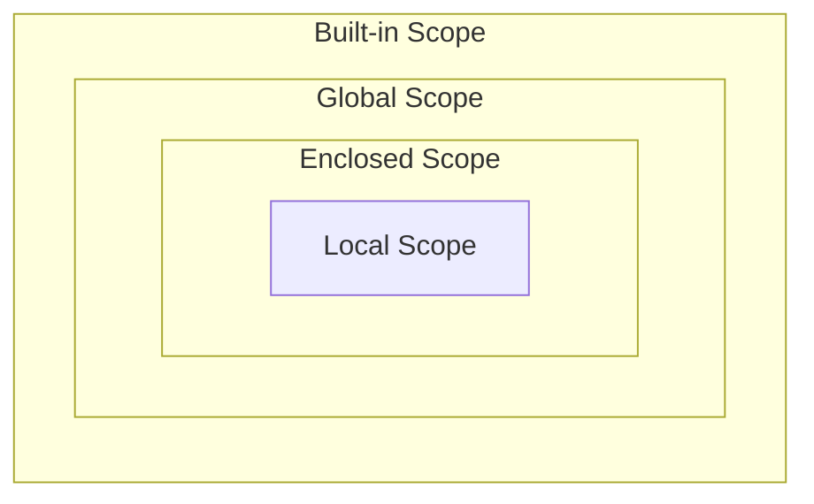

# 함수

특정 작업을 수행하기 위한 재사용 가능한 코드 묶음

## 함수를 사용하는 이유

- 두 수의 합을 구하는 함수를 정의하고 사용함으로써 `코드의 중복`을 방지
- 재사용성이 높아지고, 코드의 가독성과 유지보수성 향상

표기법

## 함수의 구조

```python
def make_sum(pram1, pram2):
    """이것은 두 수를 받아 
    두수의 합을 반환하는 함수입니다.
    >>> make_sum(1, 2)
    3
    """
    return pram1 + pram2
```

- 함수의 정의
  - 함수 정의는 def 키워드로 시작
  - `def` 키워드 이후 함수 이름 작성
  - 괄호 안에 매개변수를 정의할 수 있음
  - `매개변수(parameter)`는 함수에 전달되는 값

- 함수 body
  - `콜론(:)` 다음에 들여쓰기 된 코드 블록
  - 함수가 실행 될 때 수행되는 코드를 정의

- 함수 반환 값
  - 함수는 필요한 경우 결과를 반환할 수 있음
  - `return` 키워드 이후에 반환할 값을 명시
  - `return` 문은 함수의 실행을 종료하고, 결과를 호출 부분으로 반환
  - 함수 내에서 **return 문이 없다면 None**이 반환됨

- 함수 호출
  - 함수를 사용하기 위해서는 호출이 필요
  - 함수의 이름과 소괄호를 활용해 호출
  - 필요한 경우 인자(argument)를 전달해야 함
  - 호출 부부에서 전달된 인자는 함수 정의 시 작성한 매개변수에 대입됨

```python
# 변수 return도 가능하다
def make_sum(pram1, pram2):
    """이것은 두 수를 받아 
    두수의 합을 반환하는 함수입니다.
    >>> make_sum(1, 2)
    3
    """
    result = pram1 + pram2
    return result
```

함수 호출

```python
result = make_sum()
```

### print() 함수는 반환값이 없다

- `print()` 함수는 화면에 값을 출력하기만 할 뿐, `반환(return)`값이 없음
- 파이썬에서 반환 값이 없는 함수는 기본적으로 `None`을 반환한다고 간주되기 때문
- `return`이 없는 함수도 `None`을 반환함

```python
def helloworld():
    print('hello world')

result = helloworld()
print(result) # None
```

## 매개변수와 인자

### 매개변수(parameter)

- 함수를 정의할 때, 함수가 받을 값을 나타내는 변수

### 인자(argument)

- 함수를 호출할 때, 실제로 전달되는 값

```python
def add_numbers(x, y):  # x와 y는 매개변수(parameter)
    result = x + y
    return result

a = 2
b = 3

sum_result = add_numbers(a, b)  # a와 b는 인자(argument)
print(sum_result)  # 5
```

## 다양한 인자 종류

### 인자의 종류

1. 위치 인자
2. 기본 인자 값
3. 키워드 인자
4. 임의의 인자 목록
5. 임의의 키워드 인자 목록

#### 1. Positional Arguments (위치 인자)

- 함수 호출 시 인자의 위치에 따라 전달되는 인자
- 위치 인자는 함수 호출 시 반드시 값을 전달해야함

```python
def greet(name, age):
    print(f'안녕하세요, {name}님! {age}살이시군요.')

greet('Alice', 25)  # 안녕하세요, Alice님! 25살이시군요.
greet(25, 'Alice')  # 안녕하세요, 25님! Alice살이시군요.
greet('Alice')  # TypeError: greet() missing 1 required positional argument: 'age'
```

#### 2. Default Argument Values(기본 인자 값)

- 함수 정의에서 매개변수에 기본 값을 할당되는 것
- 함수 호출 시 인자를 전달하지 않으면, 기본값이 매개변수에 할당됨

```python
def greet(name, age=20):
    print(f'안녕하세요, {name}님! {age}살이시군요.')


greet('Bob')  # 안녕하세요, Bob님! 20살이시군요.
greet('Charlie', 40)  # 안녕하세요, Charlie님! 40살이시군요.
```

#### 3. Keyword Arguments(키워드 인자)

- 함수 호출 시 인자의 이름과 함께 값을 전달하는 인자
- 매개변수와 인자를 일치시키지 않고, 특정 매개변수에 값을 할당할 수 있음
- 인자의 순서는 중요하지 않으며, 인자의 이름을 명시하여 전달
- **단, 호출 시 키워드 인자는 위치 인자 뒤에 위치해야 함**

```python
def greet(name, age):
    print(f'안녕하세요, {name}님! {age}살이시군요.')


greet(name='Dave', age=35)  # 안녕하세요, Dave님! 35살이시군요.
greet(age=35, name='Dave')  # 안녕하세요, Dave님! 35살이시군요.
greet(age=35, 'Dave')  # Positional argument cannot appear after keyword arguments
```

##### 왜 위치 인자가 앞에 와야 할까?

- 위치 인자가 키워드 인자보다 반드시 먼저 와야 하는 이유는 **"순서의 모호성"** 때문
- **순서 의존**: 위치 인자는 첫번쨰, 두번째라는 순서에 따라 값이 전달됨
- **순서 파괴**: 키워드 인자는 순서를 무시하고 이름을 직접 지정함

#### 4. Arbitrary Argument Lists(임의의 인자 목록)

- 정해지지 않은 개수의 인자를 처리하는 인자
- 함수 정의 시 매개변수 앞에 `*`를 붙여 사용
- 여러 개의 인자를 tuple로 처리

```python
def calculate_sum(*args):
    print(args)  # (1, 100, 5000, 30)
    print(type(args))  # <class 'tuple'>

calculate_sum(1, 100, 5000, 30)
```

#### 5. Arbitrary Keyword Argument Lists(임의의 키워드 인자 목록)

- 정해지지 않은 개수의 키워드 인자를 처리하는 인자
- 함수 정의 시 매개변수 앞에 **를 붙여 사용
- 여러 개의 인자를 dictionary로 묶어 처리

```python
def print_info(**kwargs):
    print(kwargs)

# {'name': 'Eve', 'age': 30}
print_info(name='Eve', age=30) 
```

##### 함수 인자 권장 작성 순서

```mermaid
flowchart LR
  A[위치]
  B[기본]
  C[가변]
  D[가변 키워드]
  
  A --> B
  B --> C
  C --> D
  ```

- 호출 시 인자를 전달하는 과정에서 혼란을 줄일 수 있도록 함

##### 인자의 모든 종류를 적용한 예시

```python
def func(pos1, pos2, default_arg='default', *args, **kwargs):
    print('pos1:', pos1)
    print('pos2:', pos2)
    print('default_arg:', default_arg)
    print('args:', args)
    print('kwargs:', kwargs)


func(1, 2, 3, 4, 5, 6, key1='value1', key2='value2')
"""
pos1: 1
pos2: 2
default_arg: 3
args: (4, 5, 6)
kwargs: {'key1': 'value1', 'key2': 'value2'}
"""
```

## 재귀함수 (Recursion)

함수 내부에서 자기 자신을 호출하는 함수

### 재귀함수의 예시 - 팩토리얼 1

$$n!$$
$$n*(n-1)!$$
$$n*(n-1)*(n-2)!$$
$$ ••• $$

### 재귀함수의 예시 - 팩토리얼 2

- factorial 함수는 자기 자신을 재귀적으로 호출하여 입력된 숫자 n의 팩토리얼을 계산
- 재귀 호출은 n이 0이 될 때까지 반복되며, 종료 조건을 설정하여 재귀 호출이 멈추도록 함
- 재귀 호출의 결과를 이용항 문제를 작은 단위로 분할하고, 분할된 문제들의 결과를 조합하여 최종 결과를 도출

```python
def factorial(n):
    # 종료 조건: n이 0이면 1을 반환
    if n == 0:
        return 1
    else:
        # 재귀 호출: n과 n-1의 팩토리얼을 곱한 결과를 반환
        return n * factorial(n - 1)


# 팩토리얼 계산 예시
print(factorial(5))  # 120
```

#### 재귀 함수 특징

- 특정 알고리즘 식을 표현할 때 변수의 사용이 줄어들며, 코드의 가독성이 높아짐
- 1개 이상의 base case(종료되는 상황)가 존재하고, 수렴하도록 작성

#### 재귀 함수 활용 시 기억해야 할 것

- 종료 조건을 명확히 할 것
- 반복되는 호출이 종료 조건을 향하도록 할 것

> 📌 **TIP**
>
> 재귀 함수는 메모리 사용량이 많고 느릴 수 있음
> 종료 조건이 잘못되면 스택 오버플로우 에러가 발생할 수 있음
> 복잡한 재귀 함수는 오히려 코드의 가독성을 저하시킬 수 있음

## 내장 함수 (Built-in function)

파이썬에 기본적으로 내장된 함수 (별도의 import 없이 즉시 사용 가능)

### 여러가지 내장 함수

이 부분 추가 하기

## 함수와 Scope

### Python의 범위(Scope)

- 함수는 코드 내부에 local scope를 생성하며, 그 외의 공간인 global scope로 구분

### 범위와 변수 관계

- scope
  - global scope : 코드 어디에서든 참조할 수 있는 공간
  - local scope : 함수가 만든 scope(함수 내부에서만 참조 가능)
- Variable
  - global variable : global scope에 정의된 변수
  - local variable : local scope에 정의된 변수

### 변수 수명주가 (lifecycle)

- 변수의 수명주기는 변수가 선언되는 위치와 scope에 따라 결정됨
  
1. built-in scope
   1. 파이썬이 실행된 이후부터 영원히 유지
2. global scope
   1. 모듈이 호출된 시점 이후 혹은 인터프리터가 끝날 때까지 유지
3. local scope
   1. 함수가 호출될 떄 생성되고, 함수가 종료될 때까지 유지

### 이름 검색 규칙 (Name Resolution)

- 파이썬에서 사용되는 이름(식별자)들은 특정한 이름공간(namespace)에 저장되어 있음
- LEGB RULE
  1. Local scope
  2. Enclosed scope
  3. Global scope
  4. Built-in scope



## global 키워드

- 변수의 스코프를 전역 범위로 지정하기 위해 사용
- 일반적으로 함수 내에서 전역 변수를 수정하려는 경우에 사용

```python
num = 0  # 전역 변수

def increment():
    global num  # num를 전역 변수로 선언
    num += 1

print(num)  # 0
increment()
print(num)  # 1
```

### global 키워드 주의사항

- global 키워드 선언 전에 참조 불가

```python
num = 0

def increment():
    # SyntaxError: name 'num' is used prior to global declaration
    print(num)
    global num
    num += 1
```

- 매개변수에는 global 키워드 사용 불가

```python
num = 0

def increment(num):
    # SyntaxError: name 'num' is parameter and global
    global num
    num += 1
```

## 함수 스타일 가이드

### 함수 이름 작성 규칙

- 소문자와 언더스코어`(_)` 사용
- 동사로 시작하여 함수의 동작 설명
- 약어 사용 지양

```python
# Good
def calculate_total_price(price, tax):
    return price + (price * tax)

# Bad
def calc_price(p, t):
    return p + (p * t)
```

#### 함수 이름 구성 요소

- 동사 + 명사
- 동사 + 형용사 + 명사
- get/set 접두사

> 📌**TIP**
> 이름만으로 무엇을 하는지 명확하게 표현
> True/False를 반환한다면 is 또는 has로 시작하는 것을 추천
> 프로젝트 전체에서 일관성을 지키는 것이 가독성에 도움을 줌

## 단일 책임 원칙(Single Responsibility Principle)

- 모든 객체는 하나의 명확한 목적과 책임만을 가져야 함

### 함수 설계 원칙

1. 명확한 목적
   1. 함수는 한가지 작업만 수행
   2. 함수 이름으로 목적을 명확히 표현
2. 책임 분리
   1. 데이터 검증, 처리, 저장 등을 별도 함수로 분리
   2. 각 함수는 독립적으로 동작 가능하도록 설계
3. 유지 보수성
   1. 작은 단위의 함수로 나누어 관리
   2. 코드 수정 시 영향 범위를 최소화

## Packing & Unpacking

### 패킹 Packing

- 여러개의 데이터를 하나의 컬렉션으로 모아 담는 과정
- 기본 원리
  - 여러 개의 값을 하나의 튜플로 묶는 파이썬의 기본 동작
  - 한 변수에 콤마(,)로 구분된 값을 넣으면 자동으로 튜플로 처리

#### `*`을 활용한 패킹 (함수 매개변수 작성 시)

- 남는 위치 인자들을 튜플로 묶기
- `*`를 붙인 매개변수가 남는 위치 인자들을 모두 모아 하나의 튜플로 만듦

#### `**`을 활용한 패킹 (함수 배개변수 작성 시)

- 남는 위치 인자들을 딕셔너리로 묶기
- `**`를 붙인 매개변수가 남는 키워드 인자들을 모두 모아 하나의 딕셔너리로 만듦

### 언패킹 Unpacking

- 컬렉션에 담겨있는 데이터들을 개별 요소로 펼쳐 놓는 과정
- 기본 원리
  - 튜플이나 리스트 등의 객체의 요소들을 개별 변수에 할당
  - 시퀀스 언패킹, 다중 할당 이라고 부름

#### `*`을 활용한 언패킹

- 리스트나 튜플 앞에 *를 붙여 각 요소를 함수의 개별 위치 인자로 전달

#### `**`을 활용한 언패킹

- 딕셔너리 앞에 **를 붙여 {키:값} 쌍을 키=값 형태의 키워드 인자로 전달

## 참고

### 함수와 반환

#### 함수의 return, 반환의 원칙

- 파이썬 함수는 언제나 단 하나의 값(객체)만 반환할 수 있음
- 여러 값을 반환하는 경우에도 하나의 튜플만 패킹하여 반환

```python

```

#### 파이썬 함수의 반환 핵심

#### 람다 표현식

- 익명 함수를 만드는 데 사용되는 표현식
- 한 줄로 간단한 함수를 정의

#### 람다 표현식 구조

1. lambda 키워드
2. 매개변수
3. 표현식

```python
# 기존 표현식
def addition(x, y):
    return x + y

# 람다 표현식
lambda x, y: x + y
# 람다 키워드 매개변수: 표현식
```

#### 람다 표현식 활용

- 나이가 어린 순서대로 정렬하기

```python
# 학생 데이터가 (이름, 나이) 형태의 튜플로 묶여있는 리스트
students = [('지민', 25), ('서준', 20), ('민우', 30)]

# 1. lambda 미사용
# 정렬 기준 함수를 굳이 정의해야 함
def get_age(student):
    return student[1]

# sorted 함수의 key 매개변수에 우리가 만든 get_age 함수를 전달
result = sorted(students, key=get_age)
print(result)  # [('서준', 20), ('지민', 25), ('민우', 30)]

# 2. lambda 사용
result = sorted(students, key=lambda student: student[1])
print(result)  # [('서준', 20), ('지민', 25), ('민우', 30)]
```

##### 람다 표현식 장점

- 간결함
- 함수를 매개변수로 전달
